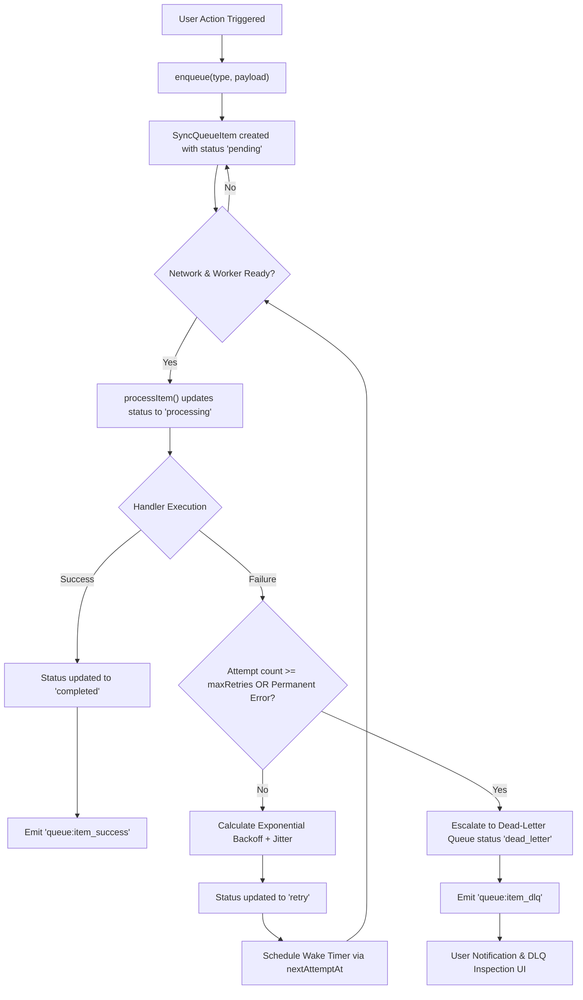
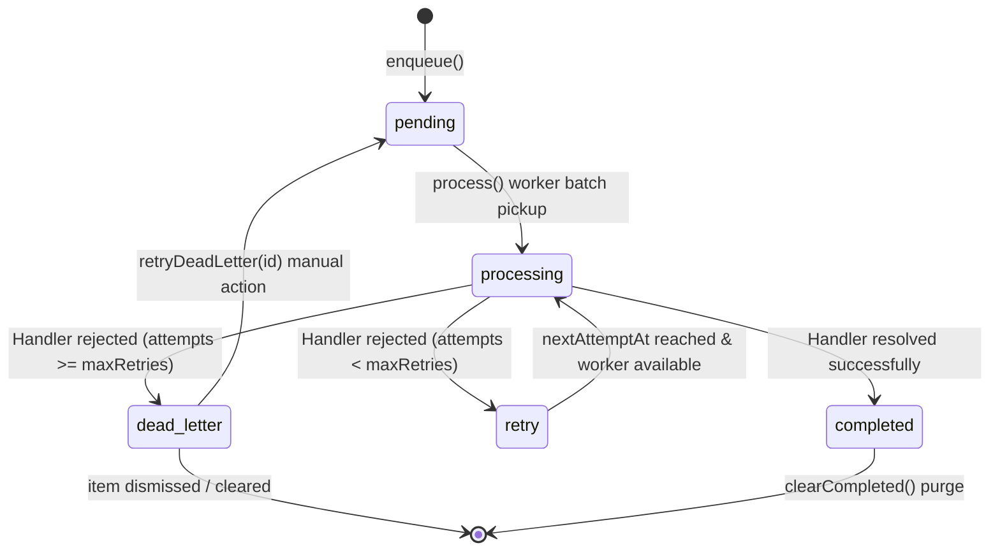

# Offline Sync Queue & Dead-Letter Queue (DLQ) Manual

## Executive Summary

The WorkSphere web application relies on an aggressive offline-first architecture powered by `src/lib/offlineSyncQueue.ts`. When users perform actions such as booking seats, updating profiles, checking in to venues, or creating collaborative room notes without an active internet connection or during degraded service, actions are queued locally and synchronized once connectivity resumes.

While transient network errors are automatically retried using exponential backoff with full jitter, certain operations repeatedly fail or encounter permanent errors. Rather than dropping user actions or blocking the queue indefinitely, failed operations are escalated to a **Dead-Letter Queue (DLQ)**.

This document provides a comprehensive specification of the background sync queue, exponential backoff logic, permanent failure criteria, dead-letter storage operations, user recovery workflows, and unsynced data export options.

---

## 1. System Architecture Overview

The offline sync system is built around the `OfflineSyncQueueManager` class, which orchestrates item queuing, execution concurrency, backoff scheduling, event emissions, and DLQ management.



---

## 2. Data Structures & Type Definitions

The queue manager operates on typed interfaces defined in [src/lib/offlineSyncQueue.ts](file:///c:/Users/admin/Desktop/workfere/src/lib/offlineSyncQueue.ts).

### 2.1 SyncItemStatus

The lifecycle of every queued operation is tracked using a 5-state status union:

```typescript
export type SyncItemStatus =
  | "pending"      // Enqueued, waiting for initial worker pickup
  | "processing"   // Currently executing via assigned handler
  | "retry"        // Failed transiently; waiting for next attempt window
  | "completed"    // Successfully executed on the server
  | "dead_letter"; // Permanently failed or max retries exceeded
```

### 2.2 SyncQueueItem Interface

Every record in the queue encapsulates action metadata, retry status, payload data, and error diagnostic context:

```typescript
export interface SyncQueueItem<T = unknown> {
  id: string;            // Unique identifier (format: `sync_${timestamp}_${rand}`)
  type: string;          // Action category (e.g., "SEAT_BOOKING", "VENUE_REVIEW")
  payload: T;            // Arbitrary serializable JSON action payload
  status: SyncItemStatus; // Current item lifecycle state
  createdAt: number;     // Epoch millisecond timestamp of item creation
  updatedAt: number;     // Epoch millisecond timestamp of last status change
  attempts: number;      // Total number of execution attempts made
  maxRetries: number;    // Maximum allowed retries before DLQ escalation
  nextAttemptAt: number; // Earliest epoch millisecond timestamp for next retry
  lastError?: string;    // String representation or message of last encountered error
}
```

### 2.3 QueueConfig Interface

Queue operational limits are configured during manager instantiation:

```typescript
export interface QueueConfig {
  baseDelayMs: number;   // Initial retry delay in milliseconds (default: 1000ms)
  maxDelayMs: number;    // Maximum retry delay ceiling (default: 30000ms)
  maxRetries: number;    // Maximum retry attempts before DLQ escalation (default: 5)
  concurrency: number;   // Maximum concurrent handler executions (default: 3)
  jitterFactor: number;  // Multiplier for random jitter addition (default: 0.5)
}
```

#### Default Configuration Values

| Property | Default Value | Description |
| :--- | :--- | :--- |
| `baseDelayMs` | `1000` (1 second) | Starting backoff duration for the first retry |
| `maxDelayMs` | `30000` (30 seconds) | Maximum upper bound cap for backoff delay |
| `maxRetries` | `5` attempts | Retry attempt limit before moving item to DLQ |
| `concurrency` | `3` workers | Parallel processing capacity for queued tasks |
| `jitterFactor` | `0.5` (50%) | Jitter randomization window relative to raw delay |

### 2.4 QueueStats Interface

Summary stats used for monitoring queue health and reporting to UI widgets:

```typescript
export interface QueueStats {
  pending: number;    // Items awaiting initial execution
  processing: number; // Items currently being executed by workers
  retry: number;      // Items awaiting scheduled retry backoff
  completed: number;  // Successfully synchronized items
  deadLetter: number; // Items escalated to the Dead-Letter Queue
  total: number;      // Total count of items currently in memory/storage
}
```

---

## 3. Queue Lifecycle & State Machine



### State Detailed Explanations

1. **`pending`**: The item has been registered via `enqueue()`. It is immediately eligible for execution when `process()` is invoked and concurrency limits allow.
2. **`processing`**: A concurrency slot has been assigned to the item. `item.attempts` is incremented by 1, and `item.updatedAt` is refreshed.
3. **`completed`**: The action handler executed without throwing an error. The item can be safely purged using `clearCompleted()` to free memory.
4. **`retry`**: The action handler threw an error, but `item.attempts < item.maxRetries`. The manager calculates the backoff delay using `calculateBackoff()` and schedules `nextAttemptAt`.
5. **`dead_letter`**: The item has reached its maximum retry threshold (`item.attempts >= item.maxRetries`) or experienced an unrecoverable structural failure. The item is held indefinitely until manual user intervention occurs.

---

## 4. Exponential Backoff & Jitter Mathematics

To avoid thundering-herd problems when internet connectivity is restored simultaneously across many clients, `calculateBackoff()` computes an exponential delay with randomized full jitter.

### 4.1 Mathematical Formulation

$$\text{rawBackoff} = \min\left(\text{maxDelayMs},\, \text{baseDelayMs} \times 2^{\max(0,\, \text{attempt})}\right)$$

$$\text{jitter} = \text{rawBackoff} \times \text{jitterFactor} \times \text{random}()$$

$$\text{delay} = \min\left(\text{maxDelayMs},\, \text{Math.round}(\text{rawBackoff} + \text{jitter})\right)$$

Where:
- $\text{random}()$ yields a pseudo-random value in the range $[0, 1)$.
- $\text{jitterFactor}$ defaults to $0.5$.

### 4.2 Calculated Delay Schedule Matrix

Assuming `baseDelayMs = 1000`, `maxDelayMs = 30000`, and `jitterFactor = 0.5`:

| Attempt | Exponential Base ($2^{\text{attempt}}$) | Raw Backoff | Jitter Range ($[0, \text{raw} \times 0.5]$) | Total Delay Range |
| :---: | :---: | :---: | :---: | :---: |
| **1** | $2^1 = 2$ | 2,000 ms | 0 – 1,000 ms | **2,000 – 3,000 ms** (2.0 – 3.0s) |
| **2** | $2^2 = 4$ | 4,000 ms | 0 – 2,000 ms | **4,000 – 6,000 ms** (4.0 – 6.0s) |
| **3** | $2^3 = 8$ | 8,000 ms | 0 – 4,000 ms | **8,000 – 12,000 ms** (8.0 – 12.0s) |
| **4** | $2^4 = 16$ | 16,000 ms | 0 – 8,000 ms | **16,000 – 24,000 ms** (16.0 – 24.0s) |
| **5** | $2^5 = 32$ | 32,000 ms $\rightarrow$ **30,000 ms** (Capped) | 0 – 15,000 ms | **30,000 ms** (Capped at 30.0s) |

---

## 5. Failure Classification & Escalation Criteria

Items are evaluated during execution to determine whether failures are transient or permanent.

### 5.1 Failure Matrix Classification

```
                    +------------------------------------+
                    |       Execution Exception          |
                    +------------------------------------+
                                      |
                                      v
                    +------------------------------------+
                    |    Is error Transient or Permanent?|
                    +------------------------------------+
                               /              \
                     Transient/                \Permanent
                             v                  v
             +-----------------------+  +-----------------------+
             | Is attempt < max?     |  | Fast-track directly   |
             +-----------------------+  | to Dead-Letter Queue  |
               /                   \    +-----------------------+
             Yes                   No
             /                       \
            v                         v
+-----------------------+   +-----------------------+
| Status: 'retry'       |   | Status: 'dead_letter' |
| Backoff & Wake Timer  |   | DLQ Event Emitted     |
+-----------------------+   +-----------------------+
```

### 5.2 Transient Errors (Eligible for Automatic Retry)

Transient errors represent temporary outages, network fluctuations, or server overload conditions. The item will be retried up to `maxRetries` times:

- **Network Offline / Disconnection**: Browser `navigator.onLine === false` or `fetch` throwing `TypeError: Failed to fetch`.
- **HTTP 408 Request Timeout**: Server timed out waiting for the request.
- **HTTP 429 Too Many Requests**: Server rate limits exceeded; client should back off.
- **HTTP 500 Internal Server Error**: Transient backend exception.
- **HTTP 502 Bad Gateway**: Upstream proxy error.
- **HTTP 503 Service Unavailable**: Server temporarily overburdened or undergoing maintenance.
- **HTTP 504 Gateway Timeout**: Upstream service timeout.

### 5.3 Permanent Errors (Direct DLQ Escalation)

Permanent errors indicate structural or authorization problems that will not succeed regardless of how many times they are retried:

- **HTTP 400 Bad Request**: Malformed payload schema or invalid field formatting.
- **HTTP 401 Unauthorized**: User session expired or unauthenticated request.
- **HTTP 403 Forbidden**: User lacks sufficient permissions for the resource.
- **HTTP 404 Not Found / Entity Gone**: Target resource or seat no longer exists on the server.
- **HTTP 409 Conflict**: Double-booking or state conflict requiring explicit manual resolution.
- **HTTP 422 Unprocessable Content**: Domain validation failed (e.g., seat already reserved by another user).

---

## 6. Dead-Letter Queue Operations API

The `OfflineSyncQueueManager` provides methods for querying, retrying, purging, and inspecting dead-letter items.

### 6.1 `enqueue<T>(type, payload, options)`

Adds a new item to the sync queue.

```typescript
const item = globalSyncQueue.enqueue("SEAT_RESERVATION", {
  seatId: "A-12",
  venueId: "v-882",
  timestamp: Date.now()
}, { maxRetries: 5 });
```

### 6.2 `process(handler)`

Executes all eligible items in batches up to the configured `concurrency`.

```typescript
const stats = await globalSyncQueue.process(async (item) => {
  const response = await fetch("/api/v1/sync", {
    method: "POST",
    headers: { "Content-Type": "application/json" },
    body: JSON.stringify({ type: item.type, payload: item.payload })
  });

  if (!response.ok) {
    const errorData = await response.json().catch(() => ({}));
    const err = new Error(errorData.message || `HTTP ${response.status}`);
    (err as any).statusCode = response.status;
    throw err;
  }
});
```

### 6.3 `retryDeadLetter(id?)`

Re-queues dead-letter items by resetting their status to `"pending"`, setting `attempts = 0`, updating `nextAttemptAt = Date.now()`, and clearing `lastError`.

- **Single Item Re-queue**: `globalSyncQueue.retryDeadLetter("sync_1728200000000_abc123")`
- **Bulk Re-queue All**: `globalSyncQueue.retryDeadLetter()`

```typescript
// Re-queue single dead-letter item
const count = globalSyncQueue.retryDeadLetter(itemId);
console.log(`Re-queued ${count} item(s) for execution.`);
```

### 6.4 `clearCompleted()`

Purges all items with status `"completed"` to avoid unbounded in-memory array growth.

```typescript
const purgedCount = globalSyncQueue.clearCompleted();
console.log(`Purged ${purgedCount} completed items from memory.`);
```

### 6.5 `clear()`

Cancels active processing and purges **all** items from the queue regardless of status.

```typescript
globalSyncQueue.clear();
```

### 6.6 `getStats()`

Returns current counts for all item states.

```typescript
const stats = globalSyncQueue.getStats();
console.log(`Dead letter items: ${stats.deadLetter} / Total: ${stats.total}`);
```

### 6.7 `subscribe(listener)`

Registers an event listener callback to track lifecycle changes. Returns an unsubscribe function.

```typescript
const unsubscribe = globalSyncQueue.subscribe((event: SyncQueueEvent) => {
  switch (event.type) {
    case "queue:item_dlq":
      console.warn(`[DLQ Escalation] Item ${event.item?.id} moved to DLQ:`, event.error);
      break;
    case "queue:drained":
      console.log("All offline sync queue items processed successfully.");
      break;
  }
});
```

---

## 7. Event Notification System

The queue emits 7 distinct lifecycle events:

| Event Name | Trigger Condition | Associated Payload |
| :--- | :--- | :--- |
| `queue:start` | `process()` begins execution loop | `{ type: "queue:start", stats }` |
| `queue:progress` | Item status updated or item enqueued | `{ type: "queue:progress", item, stats }` |
| `queue:item_success` | Item completed successfully | `{ type: "queue:item_success", item, stats }` |
| `queue:item_retry` | Item failed; retry scheduled | `{ type: "queue:item_retry", item, stats, error }` |
| `queue:item_dlq` | Item escalated to Dead-Letter Queue | `{ type: "queue:item_dlq", item, stats, error }` |
| `queue:drained` | Queue empty (0 pending, 0 retry) | `{ type: "queue:drained", stats }` |
| `queue:idle` | Processing paused or waiting for backoff timer | `{ type: "queue:idle", stats }` |

---

## 8. User Recovery Workflows & Inspection UI

When items fail permanently and enter the Dead-Letter Queue, users must be informed and given tools to inspect, edit, retry, or export their changes.

```
+-----------------------------------------------------------------------+
|                     Offline Storage Inspector UI                      |
+-----------------------------------------------------------------------+
|  [ All (12) ]  [ Pending (2) ]  [ Retry (1) ]  [ Dead Letter (3) ]     |
+-----------------------------------------------------------------------+
| DLQ Item ID: sync_1728200192837_x89a1                                 |
| Action Type: SEAT_RESERVATION                                         |
| Last Error: HTTP 409 Conflict: Seat A-12 is already claimed           |
| Attempts: 5 / 5                                                       |
| Last Attempt: 10/06/2026, 17:45:22                                    |
|                                                                       |
| Payload:                                                              |
| {                                                                     |
|   "seatId": "A-12",                                                   |
|   "venueId": "v-882",                                                 |
|   "timeSlot": "14:00-15:00"                                           |
| }                                                                     |
|                                                                       |
| Actions:                                                              |
|  [ 🔄 Replay / Retry ]  [ ✏️ Edit Payload ]  [ 🗑️ Dismiss ]          |
+-----------------------------------------------------------------------+
|  [ 📥 Export JSON ]     [ 📊 Export CSV ]    [ ⚡ Retry All DLQ (3) ] |
+-----------------------------------------------------------------------+
```

### 8.1 Inspection & Diagnostics Procedure

1. **Accessing the Inspector**: Click the offline warning badge in the status bar or navigate to **Settings > Offline Storage & Sync Diagnostics**.
2. **Filtering Items**: Select the **Dead Letter** tab to filter items having `status === "dead_letter"`.
3. **Reviewing Error Details**: Inspect the `lastError` field to understand why the operation failed (e.g., `403 Forbidden`, `409 Conflict`).

### 8.2 Recovery Workflow 1: Single Item Manual Replay

Use this when the transient issue on the server has been resolved or the network is stable.

1. Locate the failed item in the DLQ list.
2. Click **Replay / Retry**.
3. `retryDeadLetter(itemId)` is invoked.
4. The item status transitions from `dead_letter` back to `pending`.
5. The worker automatically picks up the item during the next processing run.

### 8.3 Recovery Workflow 2: Editing Payload Before Replay

Use this when the failure was caused by invalid payload data or conflicting choices (e.g., selecting a seat that is already booked).

1. Click **Edit Payload** on the dead-letter item.
2. A JSON editor modal opens displaying the current `payload`.
3. Modify the parameters (e.g., change `seatId` from `"A-12"` to `"A-14"`).
4. Click **Save & Re-queue**.
5. The payload is updated in memory/IndexedDB, `attempts` is reset to `0`, and status is set to `"pending"`.

### 8.4 Recovery Workflow 3: Bulk Re-queueing

Use this when multiple actions failed during an extended outage or authentication lapse.

1. Verify that session credentials have been refreshed (e.g., re-login).
2. Click **Retry All DLQ**.
3. `retryDeadLetter()` (without an ID argument) resets all dead-letter items to `pending`.
4. Queue processing resumes automatically.

### 8.5 Recovery Workflow 4: Item Dismissal / Purging

Use this when the user decides to abandon the failed offline change.

1. Click **Dismiss** next to the dead-letter item.
2. Confirm the prompt: *"Are you sure you want to discard this unsynced change?"*
3. The item is deleted from the internal `items` map and local storage.

---

## 9. Unsynced Data Export Formats

To prevent loss of user-created content (such as long room notes or field reports) when an offline action cannot be synced, users can export DLQ items in standard JSON or CSV formats.

### 9.1 JSON Blob Export Specification

The JSON export yields a structured backup containing full payload schemas, error logs, and queue diagnostic metadata:

```json
{
  "exportTimestamp": "2026-10-06T18:00:00.000Z",
  "appVersion": "2.4.0",
  "queueStats": {
    "pending": 0,
    "processing": 0,
    "retry": 0,
    "completed": 0,
    "deadLetter": 2,
    "total": 2
  },
  "deadLetterItems": [
    {
      "id": "sync_1728200192837_x89a1",
      "type": "SEAT_RESERVATION",
      "payload": {
        "seatId": "A-12",
        "venueId": "v-882",
        "startTime": "2026-10-06T14:00:00Z",
        "endTime": "2026-10-06T15:00:00Z"
      },
      "status": "dead_letter",
      "createdAt": "2026-10-06T17:30:00.000Z",
      "updatedAt": "2026-10-06T17:45:22.000Z",
      "attempts": 5,
      "maxRetries": 5,
      "lastError": "HTTP 409 Conflict: Seat A-12 is already reserved"
    },
    {
      "id": "sync_1728200201123_z91b2",
      "type": "ROOM_NOTE_CREATE",
      "payload": {
        "roomId": "room-104",
        "content": "Updated floor plan specifications for Q4 meeting.",
        "tags": ["architectural", "urgent"]
      },
      "status": "dead_letter",
      "createdAt": "2026-10-06T17:35:10.000Z",
      "updatedAt": "2026-10-06T17:50:00.000Z",
      "attempts": 5,
      "maxRetries": 5,
      "lastError": "HTTP 403 Forbidden: Write access denied to room-104"
    }
  ]
}
```

### 9.2 CSV Export Format Specification

The CSV format provides a tabular summary suitable for spreadsheet analysis or auditing:

```csv
"ID","Type","Status","Attempts","MaxRetries","Created At","Updated At","Last Error","Payload JSON"
"sync_1728200192837_x89a1","SEAT_RESERVATION","dead_letter",5,5,"2026-10-06T17:30:00.000Z","2026-10-06T17:45:22.000Z","HTTP 409 Conflict: Seat A-12 is already reserved","{""seatId"":""A-12"",""venueId"":""v-882""}"
"sync_1728200201123_z91b2","ROOM_NOTE_CREATE","dead_letter",5,5,"2026-10-06T17:35:10.000Z","2026-10-06T17:50:00.000Z","HTTP 403 Forbidden: Write access denied","{""roomId"":""room-104"",""content"":""Updated floor plan specs""}"
```

### 9.3 Client-Side Export Implementation Helper

The following code utility can be placed in export handler components:

```typescript
import { globalSyncQueue, SyncQueueItem } from "@/lib/offlineSyncQueue";

export function exportDeadLetterQueueJSON(): void {
  const dlqItems = globalSyncQueue.getItems("dead_letter");
  const exportData = {
    exportTimestamp: new Date().toISOString(),
    appVersion: "2.4.0",
    queueStats: globalSyncQueue.getStats(),
    deadLetterItems: dlqItems.map((item) => ({
      ...item,
      createdAtIso: new Date(item.createdAt).toISOString(),
      updatedAtIso: new Date(item.updatedAt).toISOString(),
    })),
  };

  const blob = new Blob([JSON.stringify(exportData, null, 2)], {
    type: "application/json",
  });
  const url = URL.createObjectURL(blob);
  const link = document.createElement("a");
  link.href = url;
  link.download = `worksphere-dlq-export-${Date.now()}.json`;
  document.body.appendChild(link);
  link.click();
  document.body.removeChild(link);
  URL.revokeObjectURL(url);
}

export function exportDeadLetterQueueCSV(): void {
  const dlqItems = globalSyncQueue.getItems("dead_letter");
  const headers = ["ID", "Type", "Status", "Attempts", "MaxRetries", "Created At", "Updated At", "Last Error", "Payload JSON"];
  
  const rows = dlqItems.map(item => [
    `"${item.id}"`,
    `"${item.type}"`,
    `"${item.status}"`,
    item.attempts,
    item.maxRetries,
    `"${new Date(item.createdAt).toISOString()}"`,
    `"${new Date(item.updatedAt).toISOString()}"`,
    `"${(item.lastError || "").replace(/"/g, '""')}"`,
    `"${JSON.stringify(item.payload).replace(/"/g, '""')}"`
  ]);

  const csvContent = [headers.join(","), ...rows.map(r => r.join(","))].join("\n");
  const blob = new Blob([csvContent], { type: "text/csv;charset=utf-8;" });
  const url = URL.createObjectURL(blob);
  const link = document.createElement("a");
  link.href = url;
  link.download = `worksphere-dlq-export-${Date.now()}.csv`;
  document.body.appendChild(link);
  link.click();
  document.body.removeChild(link);
  URL.revokeObjectURL(url);
}
```

---

## 10. Reactive UI Integration & Toast Notifications

To keep users informed without breaking workflow context, integrate `subscribe()` with your application toast/notification framework.

```typescript
import { globalSyncQueue, SyncQueueEvent } from "@/lib/offlineSyncQueue";
import { toast } from "@/components/ui/use-toast";

// Register reactive toast listener
globalSyncQueue.subscribe((event: SyncQueueEvent) => {
  if (event.type === "queue:item_dlq") {
    toast({
      title: "Action Could Not Be Synced",
      description: `Action "${event.item?.type}" failed after ${event.item?.attempts} attempts. Moved to Dead-Letter Queue for manual review.`,
      variant: "destructive",
      action: {
        label: "Inspect DLQ",
        onClick: () => openOfflineStorageInspectorModal(),
      },
    });
  }

  if (event.type === "queue:drained") {
    toast({
      title: "Offline Sync Complete",
      description: "All pending offline actions have been synchronized with the server.",
      variant: "default",
    });
  }
});
```

---

## 11. Security, Privacy, and Storage Hardening

When persisting offline queues and dead-letter items to local storage (IndexedDB / localStorage):

1. **Payload Data Masking**: Ensure password fields, auth tokens, and sensitive API keys are stripped or masked before enqueueing action payloads.
2. **Quota Exceeded Error Handling**: Wrap local storage writes in try-catch blocks. If IndexedDB storage quota is exceeded (`QuotaExceededError`), purge old `"completed"` items automatically before alerting the user.
3. **Multi-User Context Isolation**: Clear or encrypt the offline sync queue when a user logs out. Do not attempt to process offline actions belonging to `User_A` while `User_B` is logged into the session.

---

## 12. Troubleshooting Matrix & Common Solutions

| Symptom / Error | Root Cause | Recommended Action / Solution |
| :--- | :--- | :--- |
| Item stuck in `"retry"` state indefinitely | Next attempt wake timer cancelled or unref'd | Call `globalSyncQueue.process(handler)` manually on network reconnect event. |
| Item immediately moves to `"dead_letter"` on first attempt | Handler threw non-retryable 4xx error (e.g., 403 Forbidden) | Check session token validity; prompt user to re-authenticate before retrying DLQ. |
| Memory leakage during heavy offline usage | Completed items accumulating in `items` Map | Call `globalSyncQueue.clearCompleted()` periodically or after `queue:drained` event. |
| DLQ item payload fails validation on retry | Backend API schema changed while client was offline | Use **Edit Payload** UI to conform payload structure to new API requirements. |
| Queue stops processing batch mid-way | `AbortController` signal triggered via `cancel()` | Re-instantiate queue loop by calling `process(handler)`. |

---

## 13. React Integration Patterns & Custom Hooks

To cleanly connect React UI components to `OfflineSyncQueueManager`, use custom React hooks to subscribe to stats and DLQ state updates.

### 13.1 `useOfflineSyncQueue` Custom React Hook

```typescript
import { useState, useEffect, useCallback } from "react";
import { globalSyncQueue, QueueStats, SyncQueueItem, SyncItemStatus } from "@/lib/offlineSyncQueue";

export interface UseOfflineQueueReturn {
  stats: QueueStats;
  isProcessing: boolean;
  deadLetterItems: SyncQueueItem[];
  retryItem: (id: string) => void;
  retryAllDeadLetter: () => void;
  purgeCompleted: () => void;
}

export function useOfflineSyncQueue(): UseOfflineQueueReturn {
  const [stats, setStats] = useState<QueueStats>(() => globalSyncQueue.getStats());
  const [isProcessing, setIsProcessing] = useState<boolean>(() => globalSyncQueue.isProcessing());
  const [deadLetterItems, setDeadLetterItems] = useState<SyncQueueItem[]>(() =>
    globalSyncQueue.getItems("dead_letter")
  );

  useEffect(() => {
    const updateState = () => {
      setStats(globalSyncQueue.getStats());
      setIsProcessing(globalSyncQueue.isProcessing());
      setDeadLetterItems(globalSyncQueue.getItems("dead_letter"));
    };

    const unsubscribe = globalSyncQueue.subscribe(updateState);
    return () => unsubscribe();
  }, []);

  const retryItem = useCallback((id: string) => {
    globalSyncQueue.retryDeadLetter(id);
  }, []);

  const retryAllDeadLetter = useCallback(() => {
    globalSyncQueue.retryDeadLetter();
  }, []);

  const purgeCompleted = useCallback(() => {
    globalSyncQueue.clearCompleted();
  }, []);

  return {
    stats,
    isProcessing,
    deadLetterItems,
    retryItem,
    retryAllDeadLetter,
    purgeCompleted,
  };
}
```

---

## 14. Testing & Verification Strategies

Automated test suites verify backoff math, concurrency, and DLQ escalation behavior.

### 14.1 Unit Testing Exponential Backoff Calculation

```typescript
import { describe, it, expect } from "vitest";
import { calculateBackoff, DEFAULT_QUEUE_CONFIG } from "@/lib/offlineSyncQueue";

describe("calculateBackoff()", () => {
  it("calculates exponential base without jitter when random returns 0", () => {
    const mockRandom = () => 0;
    
    // Attempt 1: min(30000, 1000 * 2^1) + 0 = 2000
    expect(calculateBackoff(1, {}, mockRandom)).toBe(2000);
    // Attempt 2: min(30000, 1000 * 2^2) + 0 = 4000
    expect(calculateBackoff(2, {}, mockRandom)).toBe(4000);
    // Attempt 3: min(30000, 1000 * 2^3) + 0 = 8000
    expect(calculateBackoff(3, {}, mockRandom)).toBe(8000);
  });

  it("applies full jitter factor correctly when random returns 1.0", () => {
    const mockRandom = () => 1; // Max jitter contribution
    const config = { baseDelayMs: 1000, jitterFactor: 0.5 };

    // Attempt 1: raw = 2000, jitter = 2000 * 0.5 * 1 = 1000 -> total = 3000
    expect(calculateBackoff(1, config, mockRandom)).toBe(3000);
  });

  it("respects maxDelayMs ceiling", () => {
    const mockRandom = () => 0;
    const config = { baseDelayMs: 1000, maxDelayMs: 30000 };

    // Attempt 10: 1000 * 2^10 = 1024000 -> capped at 30000
    expect(calculateBackoff(10, config, mockRandom)).toBe(30000);
  });
});
```

---

## 15. Summary & Verification Checklist

Before deploying changes related to offline queue handling, verify the following:

- [x] WASM/Circuit and network errors are caught gracefully.
- [x] Exponential backoff mathematics includes jitter factor ($0.5$).
- [x] Maximum retry attempts ($5$) escalate items to `dead_letter` status.
- [x] Manual replay (`retryDeadLetter`) resets attempts to 0 and state to `pending`.
- [x] Dead-letter inspection UI allows viewing, editing, retrying, and purging items.
- [x] Unsynced changes can be exported to JSON and CSV files.
