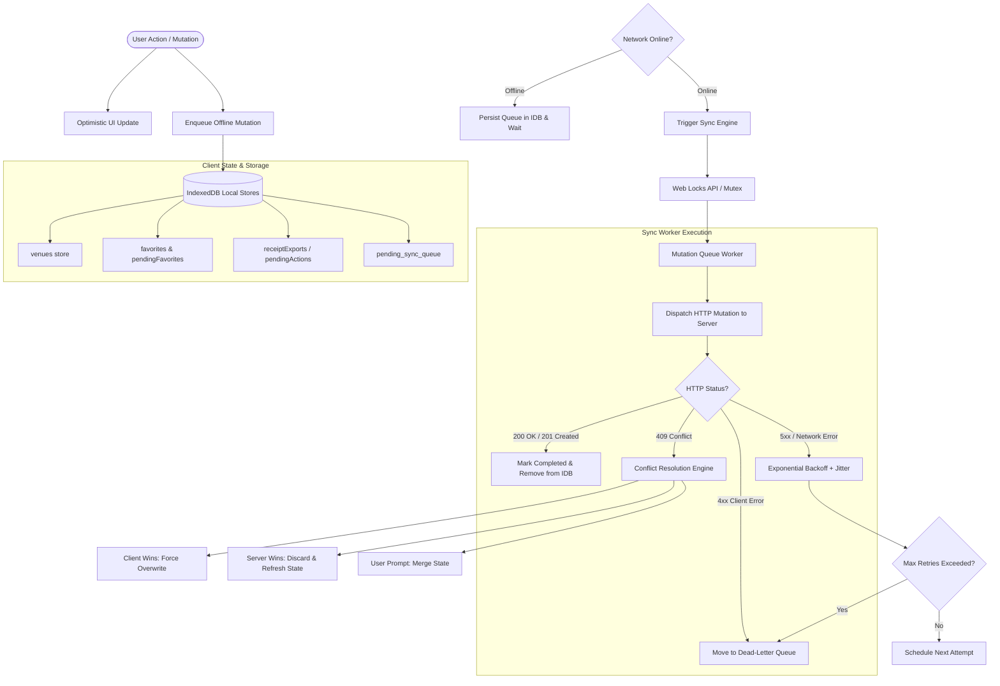
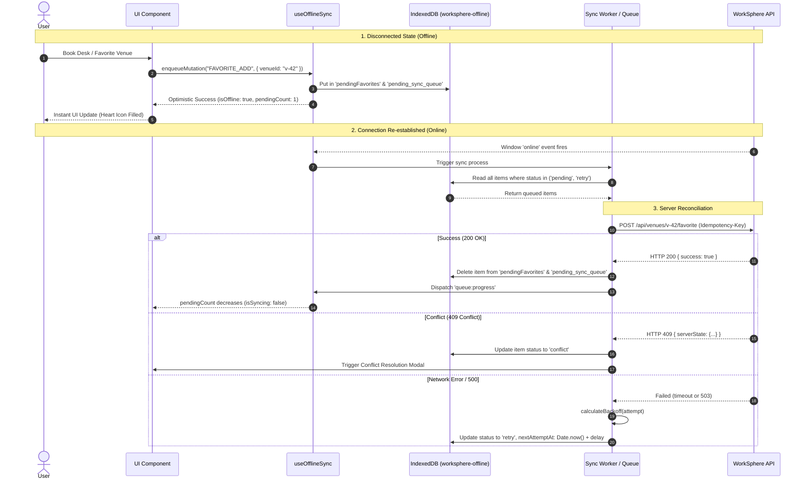

# WorkSphere IndexedDB Offline Mutations & Sync Architecture

## Overview

WorkSphere is engineered to operate seamlessly as an offline-first Progressive Web Application (PWA). Users can browse venues, manage desk reservations, toggle favorite locations, write venue reviews, and modify collaborative workspace notes whether they have high-speed connectivity, intermittent cellular data, or zero network access (e.g., in basements, transit tunnels, or flight mode).

This document details the offline state management, IndexedDB storage schema, mutation queueing mechanisms, retry backoff algorithms, conflict resolution paradigms, and background sync worker lifecycles implemented in:
- `src/lib/offline/db.ts`: Central IndexedDB database connection and schema migrations.
- `src/hooks/useOfflineSync.ts`: React hook orchestrating offline detection, mutation queueing, and UI status updates.
- `src/lib/offlineSyncQueue.ts`: Concurrency-controlled mutation queue with exponential backoff and dead-letter queues.
- `src/lib/offline/sync/syncEngine.ts` & `src/lib/offline/conflictService.ts`: Extensible sync plugins and multi-strategy conflict resolution.

---

## 1. High-Level Architecture

The offline synchronization engine operates on an optimistic UI model coupled with reliable background reconciliation:



---

## 2. IndexedDB Schema & Object Stores (`src/lib/offline/db.ts`)

WorkSphere manages local offline storage using the native browser `indexedDB` API via the `worksphere-offline` database (current schema version `8`). 

Connections are opened through `initOfflineDB()`, which handles:
1. Graceful version migration in `onupgradeneeded`.
2. Connection blocking resolution in `onblocked`.
3. Private browsing mode detection (such as Safari private window quota restrictions) through fallback alerts and error handling.
4. Clean connection closure on browser `beforeunload` events.

### Object Store Specification

| Object Store | Key Path | Auto Increment | Indexes | Purpose & Description |
| :--- | :--- | :--- | :--- | :--- |
| `venues` | `id` | `false` | `type`, `savedAt` | Caches complete venue metadata, desk layouts, amenities, and WiFi speed scores for offline discovery. |
| `favorites` | `id` | `false` | `savedAt` | Persists user favorite venues locally for zero-latency toggles and offline navigation. |
| `pendingFavorites` | `id` | `false` | None | Dedicated queue tracking venue bookmark additions and removals while offline. |
| `favorite_tags` | `id` | `false` | None | Stores user tags, notes, and custom categories attached to favorite venues. |
| `pending_sync_queue` | `id` | `false` | `domain`, `status`, `timestamp` | Generic prioritized mutation queue storing payloads across all domains pending server delivery. |
| `pendingActions` | `id` | `true` | None | Sequential queue of generic optimistic UI operations (e.g., check-ins, rating updates). |
| `receiptExports` | `bookingId` | `false` | `status`, `createdAt` | Offline reservation records, check-in barcodes, and downloadable PDF/ICS receipts. |
| `searches` | `query` | `false` | `timestamp` | Offline search history and recently executed query suggestions. |
| `recentlyViewedVenues` | `id` | `false` | `viewedAt` | LRU cache of recently inspected workspaces for quick offline recall. |
| `pendingReviews` | `id` | `false` | `venueId`, `status`, `createdAt` | User venue reviews, star ratings, and noise feedback drafted offline. |
| `preference_rankings` | `id` | `false` | None | Locally cached AI/collaborative desk recommendation weights and embeddings. |
| `notes_cache` | `folderId` | `false` | None | Snapshots of collaborative team notes and scratchpads for instant offline loading. |
| `pending_notes_queue` | `id` | `true` | `by-folder` (`folderId`) | Incremental CRDT delta updates and note edits created without an active WebSocket session. |

---

## 3. Offline Mutation Enqueueing & React Lifecycle (`src/hooks/useOfflineSync.ts`)

Components interface with offline storage through the `useOfflineSync` hook. The hook acts as the presentation bridge between React component state, browser network events, and background storage queues.

### `useOfflineSync` State Properties

- `isOffline`: Boolean reflecting `!navigator.onLine`. Updates dynamically via `window.addEventListener("online" | "offline")`.
- `hasPendingChanges`: Boolean indicating whether there are unsynchronized mutations residing in IndexedDB.
- `isSyncing`: Boolean indicating that an active synchronization cycle is currently executing.
- `pendingCount`: Total count of pending mutations across all queues.
- `enqueueMutation(type, payload, options)`: Type-safe function to enqueue an optimistic mutation.

### Idempotency & Duplicate Prevention

To prevent duplicate mutations from entering the queue when users rapidly tap buttons or re-trigger actions while offline, `enqueueOfflineMutation` generates deterministic idempotency keys:

```typescript
export function enqueueOfflineMutation<T = unknown>(
  type: string,
  payload: T,
  options: { maxRetries?: number; id?: string } = {}
): SyncQueueItem<T> {
  const id = options.id || generateIdempotencyKey(type, payload);
  return globalSyncQueue.enqueue(type, payload, { ...options, id });
}
```

The key generation derives a 32-bit hash from the mutation `type` and deterministic sorted JSON representation of the `payload`. If an item with the same idempotency key already exists in the pending queue, it is refreshed in place rather than creating a duplicate network call.

---

## 4. Mutation Queue Processing & Retry Backoff (`src/lib/offlineSyncQueue.ts`)

The background sync processor (`SyncQueue`) manages execution constraints, concurrency limits, and retry policies.

### Queue Configuration Defaults

```typescript
export const DEFAULT_QUEUE_CONFIG: QueueConfig = {
  baseDelayMs: 1000,    // 1 second base delay
  maxDelayMs: 30000,    // 30 seconds maximum backoff cap
  maxRetries: 5,        // Maximum 5 retries before dead-lettering
  concurrency: 3,       // Up to 3 parallel requests
  jitterFactor: 0.5,    // 50% randomized jitter spread
  maxQueueSize: 5000,   // In-memory / storage item limit
};
```

### Full-Jitter Exponential Backoff Algorithm

To protect the backend API from the "thundering herd" problem when thousands of clients regain connectivity simultaneously, retry delays are calculated using exponential backoff with full jitter:

$$\text{rawBackoff} = \min\left(\text{maxDelay}, \text{baseDelay} \times 2^{\text{attempt}}\right)$$

$$\text{delay} = \min\left(\text{maxDelay}, \text{rawBackoff} + \text{rawBackoff} \times \text{jitterFactor} \times \text{random}()\right)$$

In TypeScript:
```typescript
export function calculateBackoff(
  attempt: number,
  config: Partial<QueueConfig> = {},
  randomFn: () => number = Math.random,
): number {
  const base = config.baseDelayMs ?? DEFAULT_QUEUE_CONFIG.baseDelayMs;
  const max = config.maxDelayMs ?? DEFAULT_QUEUE_CONFIG.maxDelayMs;
  const jitterFactor = config.jitterFactor ?? DEFAULT_QUEUE_CONFIG.jitterFactor;

  const rawBackoff = Math.min(max, base * Math.pow(2, Math.max(0, attempt)));
  const jitter = rawBackoff * jitterFactor * randomFn();

  return Math.round(Math.min(max, rawBackoff + jitter));
}
```

### Error Classification & Dead-Letter Queue (DLQ)

Errors encountered during sync are classified into two categories:
1. **Transient Errors (5xx Server Errors, Network Timeouts, Socket Drops):** The item status is transitioned to `"retry"`, its `attempts` counter increments, and `nextAttemptAt` is scheduled according to the backoff formula.
2. **Permanent / Unrecoverable Client Errors (400 Bad Request, 422 Unprocessable Entity, Schema Invalidation):** Re-trying will never succeed and wastes battery/bandwidth. The item is marked `"dead_letter"` with `failureReason: "unrecoverable_client_error"` and moved to the Dead-Letter Queue for inspection or manual resolution.

---

## 5. Conflict Resolution Framework (`src/lib/offline/conflictService.ts`)

When an offline mutation arrives at the server, the server state may have progressed (e.g., another user claimed the same seat, or an admin updated venue operating hours). In these scenarios, the server responds with HTTP `409 Conflict`.

WorkSphere handles conflicts via `conflictService.ts` with three discrete strategies:

```typescript
export type ConflictResolutionStrategy = "client_wins" | "server_wins" | "custom_merge";
```

### 1. Client Wins (`client_wins`)
- Overwrites the server's conflicting state with the client's local mutation.
- Suitable for: User personal preferences, display names, favorite toggles, and user notes.
- Mechanism: Re-dispatches the mutation with a force overwrite flag (`?force=true` or `If-Match: *`).

### 2. Server Wins (`server_wins`)
- Discards the pending local mutation and synchronizes the client's local IndexedDB with the latest server state.
- Suitable for: Desk seat locks, venue capacity caps, pricing changes, and payment invoices.
- Mechanism: The local pending mutation is purged, and the server payload is saved directly into `venues` or `receiptExports`.

### 3. Custom / Interactive Merge (`custom_merge`)
- Merges non-conflicting fields automatically, or flags the conflict for manual user arbitration via the `OfflineConflictResolutionModal` component.
- Suitable for: Venue reviews containing local text drafts vs. server moderation changes, or collaborative note documents.

---

## 6. End-to-End Lifecycle Sequence



---

## 7. Developer Guidelines & Best Practices

1. **Always Use Idempotency Keys:** When queueing mutations from any custom component or hook, use `generateIdempotencyKey(type, payload)` to prevent duplicate actions on unstable networks.
2. **Never Store Sensitive Auth Secrets in IndexedDB:** Store only non-sensitive domain entities, tokens, or blinded commitments. Do not persist raw cryptographic seed keys or passwords.
3. **Handle Safari Private Browsing:** Safari in private mode throws `QuotaExceededError` or blocks IndexedDB instantiation. Always catch exceptions from `initOfflineDB()` and provide graceful fallback degradation.
4. **Clean Up Database Connections:** Ensure `closeOfflineDB()` is called when tear-down is required to prevent schema migration locks.
