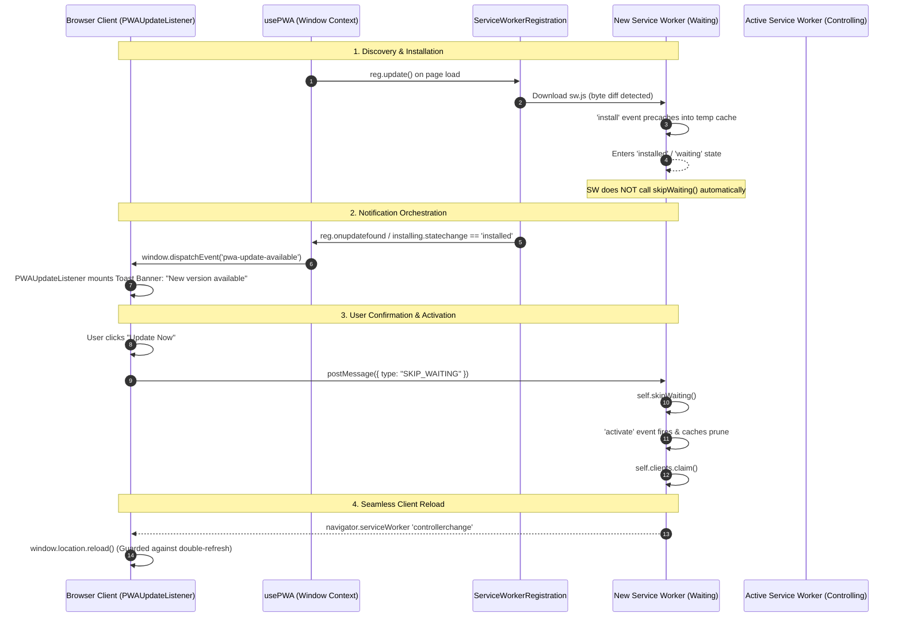

# PWA Service Worker Caching Strategy & Update Orchestration

This document details WorkSphere's progressive web application (PWA) Service Worker architecture, caching policies, asset version hashing, quota safeguards, and the client update orchestration lifecycle.

---

## 1. Architecture Overview

WorkSphere employs a production Service Worker located at [`public/sw.js`](file:///public/sw.js), alongside a dedicated client update listener component ([`src/components/PWAUpdateListener.tsx`](file:///src/components/PWAUpdateListener.tsx)) and client-side lifecycle hook ([`src/hooks/usePWA.tsx`](file:///src/hooks/usePWA.tsx)).

```
┌────────────────────────────────────────────────────────────────────────┐
│                             Client Browser                             │
│                                                                        │
│   ┌──────────────────────────┐         ┌───────────────────────────┐   │
│   │   usePWA / Page Root     │         │    PWAUpdateListener      │   │
│   │  (navigator.serviceWorker│         │   (Toast / Update Banner) │   │
│   │      .register)          │         │                           │   │
│   └────────────┬─────────────┘         └─────────────▲─────────────┘   │
│                │ reg.update()                        │                 │
│                ▼                                     │ 'pwa-update-    │
│   ┌──────────────────────────┐                       │  available'     │
│   │  Browser SW Lifecycle    ├───────────────────────┘                 │
│   │  (install / waiting)     │                                         │
│   └────────────┬─────────────┘                                         │
│                │                                                       │
│                │ postMessage({ type: 'SKIP_WAITING' })                 │
│                ▼                                                       │
│   ┌────────────────────────────────────────────────────────────────┐   │
│   │              Active Service Worker (public/sw.js)              │   │
│   │                                                                │   │
│   │  ┌───────────────────────┐         ┌────────────────────────┐  │   │
│   │  │ Cache-First Strategies│         │ Network-First Routing  │  │   │
│   │  │ (Maps, Images, Media) │         │ (Venues, Reservations) │  │   │
│   │  └──────────┬────────────┘         └───────────┬────────────┘  │   │
│   └─────────────┼──────────────────────────────────┼───────────────┘   │
└─────────────────┼──────────────────────────────────┼───────────────────┘
                  ▼                                  ▼
        ┌───────────────────┐              ┌───────────────────┐
        │   Cache Storage   │              │   Network / API   │
        │(LRU Quota Enforced│              │ (PostgreSQL /     │
        │   20MB Cap)       │              │  Next.js Server)  │
        └───────────────────┘              └───────────────────┘
```

---

## 2. Cache Names & Multi-Tier Caching

WorkSphere organizes stored responses across specialized cache namespaces to isolate lifecycles, size limits, and invalidation dynamics:

| Cache Namespace | Identifier Constant | Purpose & Contents | Quota / Size Policy |
| :--- | :--- | :--- | :--- |
| **Core App Shell** | `worksphere-v3` (`CACHE_NAME`) | Critical navigation shell, HTML pages, precached assets, core JS/CSS. | System Default |
| **External Images** | `worksphere-images-v4` (`IMAGE_CACHE_NAME`) | Unsplash images, external photo CDNs (`images.unsplash.com`). | **20MB Cap** with LRU eviction |
| **Map Tiles** | `worksphere-maptiles-v1` (`MAP_TILE_CACHE_NAME`) | OpenStreetMap and CartoDB basemap PNG tiles. | On-demand / Spatial prefetch |
| **Video Tours** | `worksphere-video-tours-v1` (`VIDEO_CACHE_NAME`) | Venue virtual video walkthroughs. | Quota-guarded (5MB threshold) |
| **Prefetched Venues**| `worksphere-prefetch-v1` (`PREFETCH_CACHE_NAME`) | Nearby venue details, floorplans, and map tiles. | Dynamic prefetch cache |

---

## 3. Route Routing Strategies: Cache-First vs Network-First

```mermaid
flowchart TD
    Req[Incoming GET Request] --> MethodCheck{Method == GET?}
    MethodCheck -- No --> NetworkDirect[Direct Network Bypass]
    MethodCheck -- Yes --> DownloadCheck{URL contains /download?}
    DownloadCheck -- Yes --> NetworkDirect
    DownloadCheck -- No --> PrefetchMatch{Matches PREFETCH_CACHE?}
    PrefetchMatch -- Yes --> ServePrefetched[Serve Prefetched Response]
    PrefetchMatch -- No --> RouteType{Route Evaluation}

    RouteType -- "/api/venues" OR "/api/reservations/availability" --> NetFirstAPI[Network-First API Strategy]
    NetFirstAPI --> TryFetchAPI{Fetch Online?}
    TryFetchAPI -- Success --> PutCache[Update CACHE_NAME] --> ReturnResp[Return Response]
    TryFetchAPI -- Offline / Fail --> MatchCacheAPI{Match Cache?}
    MatchCacheAPI -- Found --> ServeCachedAPI[Return Cached Data]
    MatchCacheAPI -- Not Found --> SynthOffline[Return Synthetic Offline JSON]

    RouteType -- "tile.openstreetmap.org" OR "basemaps.cartocdn.com" --> CacheFirstMap[Cache-First Strategy]
    CacheFirstMap --> MatchTile{Cache Match?}
    MatchTile -- Hit --> ServeTile[Return Cached Tile]
    MatchTile -- Miss --> FetchTile[Fetch Network -> Store -> Return]

    RouteType -- "images.unsplash.com" --> CacheFirstImg[Cache-First with LRU Quota]
    CacheFirstImg --> MatchImg{Cache Match?}
    MatchImg -- Hit --> TouchLRU[Update LRU Timestamp -> Return Cached]
    MatchImg -- Miss --> FetchImg[Fetch Network -> Store -> Enforce LRU -> Return]

    RouteType -- Navigation & Static Assets --> NetFirstNav[Network-First with Fallback]
    NetFirstNav --> TryNav{Fetch Online?}
    TryNav -- Success --> UpdateNavCache[Update CACHE_NAME -> Return]
    TryNav -- Offline --> MatchNavCache{Match Cache?}
    MatchNavCache -- Hit --> ServeNav[Return Cached Asset]
    MatchNavCache -- Miss & mode==navigate --> ServeOfflineFallback[Serve /offline HTML Fallback]
```

### 3.1 Network-First Routes

- **Endpoints:**
  - `/api/venues`
  - `/api/reservations/availability`
  - Top-level document navigations (`request.mode === 'navigate'`)
- **Behavior:**
  1. Requests are sent over the network first to guarantee fresh real-time desk availability and venue pricing.
  2. If the network call succeeds with HTTP 200, a clone of the response is stored into `worksphere-v3`.
  3. If the network fails (offline or timeout):
     - Checks `worksphere-v3` cache for a previous response.
     - For `/api/reservations/availability`, returns a fallback JSON: `{ seats: [], offline: true, cached: true }`.
     - For `/api/venues`, returns a fallback JSON: `{ venues: [], offline: true, cached: true }`.
     - For page navigation (`request.mode === 'navigate'`), returns the precached `/offline` standalone page.

### 3.2 Cache-First Routes

- **Map Tiles (`tile.openstreetmap.org`, `basemaps.cartocdn.com`):**
  - Checked in `worksphere-maptiles-v1` first.
  - Returns instantly without network latency. If missing, fetches from the tile CDN and writes to the cache.
- **External Photo Assets (`images.unsplash.com`):**
  - Checked in `worksphere-images-v4` first.
  - Cache hits update the asset's LRU timestamp (`touchLRURecord`).
  - Cache misses fetch over network, record size (parsing `Content-Length` or defaulting to 400KB for opaque responses), and enforce the **20MB quota limit**.

---

## 4. Asset Version Hashing & Invalidation Rules

### 4.1 Next.js Content Hashing
Next.js outputs immutable static assets under `/_next/static/` with cryptographic content hashes (e.g. `/_next/static/chunks/app/page-[hash].js`).
- Static chunks are cached with long HTTP `Cache-Control: public, max-age=31536000, immutable` headers.
- When application code changes, Next.js generates new content-hashed file names.
- Old versions are never modified in place, preventing stale cache contamination.

### 4.2 Precaching & Temporary Install Caches
During the `install` event:
```javascript
const tempCacheName = `${CACHE_NAME}-installing`;
event.waitUntil(
  caches.open(tempCacheName).then((cache) => cache.addAll(PRECACHE_ASSETS))
);
```
- Core assets (`/`, `/offline`, `/icons/icon.svg`, `/manifest.json`) are downloaded into an isolated temporary cache (`worksphere-v3-installing`).
- This guarantees that a slow or interrupted installation never locks or corrupts the active `worksphere-v3` cache.

### 4.3 Activation & Stale Cache Pruning
During the `activate` event:
```javascript
caches.keys().then((cacheNames) =>
  Promise.all(
    cacheNames
      .filter(
        (name) =>
          name !== CACHE_NAME &&
          name !== IMAGE_CACHE_NAME &&
          name !== MAP_TILE_CACHE_NAME &&
          name !== VIDEO_CACHE_NAME &&
          name !== PREFETCH_CACHE_NAME &&
          !name.endsWith("-installing"),
      )
      .map((name) => caches.delete(name)),
  )
);
```
- All unrecognised or previous versions (e.g., `worksphere-v1`, `worksphere-v2`) are automatically deleted.
- Any leftover `-installing` caches are cleaned up.
- `self.clients.claim()` takes immediate control of open clients once activation completes.

---

## 5. Storage Quota Guards & 20MB LRU Eviction

Mobile browsers (particularly iOS Safari PWAs with ~50MB overall storage caps) aggressively terminate PWAs that exceed storage limits.

### 5.1 Quota Pre-Flight Check
Before large writes (e.g., video tours or high-res maps), [`public/sw.js`](file:///public/sw.js) calls `hasSufficientStorageQuota(requiredBytes)` using `navigator.storage.estimate()`:
- Verifies at least `(requiredBytes + 5MB)` of available buffer exists.
- Safely skips pre-fetching if storage space is constrained.

### 5.2 20MB Image Cache LRU Enforcement
- Tracked via IndexedDB (`image-lru-store`).
- Stored records contain `{ url, size, lastAccessed }`.
- When `totalSize > 20MB`, the oldest accessed entries are dropped from `IMAGE_CACHE_NAME` until total usage returns below the ceiling.

---

## 6. Update Orchestration: `skipWaiting` and Client Reload Banners

A common hazard in single-page PWA applications is an aggressive `self.skipWaiting()` call that activates in the background, causing running JavaScript clients to request old chunks that have been removed or replaced, leading to runtime chunk errors (`ChunkLoadError`).

WorkSphere orchestrates updates cleanly through collaborative message handshakes:



### 6.1 Step-by-Step Orchestration Flow

1. **Passive Waiting by Default:**
   In [`public/sw.js`](file:///public/sw.js), the install event does **not** call `self.skipWaiting()`. The newly installed worker remains in the `waiting` phase until explicitly authorized by the user.

2. **Detection & Event Dispatch:**
   In [`src/hooks/usePWA.tsx`](file:///src/hooks/usePWA.tsx):
   - `reg.update()` checks the server for updated `sw.js` on every navigation.
   - When a new worker finishes installing while a controller is already active, it dispatches:
     ```typescript
     window.dispatchEvent(
       new CustomEvent("pwa-update-available", { detail: installingWorker })
     );
     ```

3. **User Notification via [`PWAUpdateListener`](file:///src/components/PWAUpdateListener.tsx):**
   - Renders a floating notification banner: `"New version available"` with action `"Update Now"`.
   - Also inspects `navigator.serviceWorker.getRegistration().then(reg => reg.waiting)` upon component mount to catch updates that landed while navigating.

4. **Triggering `SKIP_WAITING`:**
   When the user clicks `"Update Now"`, the client sends a direct message to the waiting worker:
   ```typescript
   waitingWorker.postMessage({ type: "SKIP_WAITING" });
   ```
   The service worker handles the message:
   ```javascript
   self.addEventListener("message", (event) => {
     if (event.data?.type === "SKIP_WAITING") {
       self.skipWaiting();
     }
   });
   ```

5. **Safe Single-Fire Reload on `controllerchange`:**
   Once the new worker activates and claims the clients, `navigator.serviceWorker` fires `controllerchange`. Both [`PWAUpdateListener.tsx`](file:///src/components/PWAUpdateListener.tsx) and [`usePWA.tsx`](file:///src/hooks/usePWA.tsx) feature ref guards (`refreshingRef.current`) to ensure `window.location.reload()` executes exactly once.

---

## 7. Verification & Troubleshooting

### Inspecting in Chrome DevTools
1. Press `F12` and navigate to the **Application** tab.
2. Select **Service Workers**:
   - Check the active Service Worker version and registration status.
   - Note the **Waiting to activate** section when a new build is deployed.
3. Select **Cache Storage**:
   - Verify `worksphere-v3`, `worksphere-images-v4`, and `worksphere-maptiles-v1` are populated.
4. Select **Storage**:
   - View current storage quota usage and click **Clear site data** for fresh initial testing.
