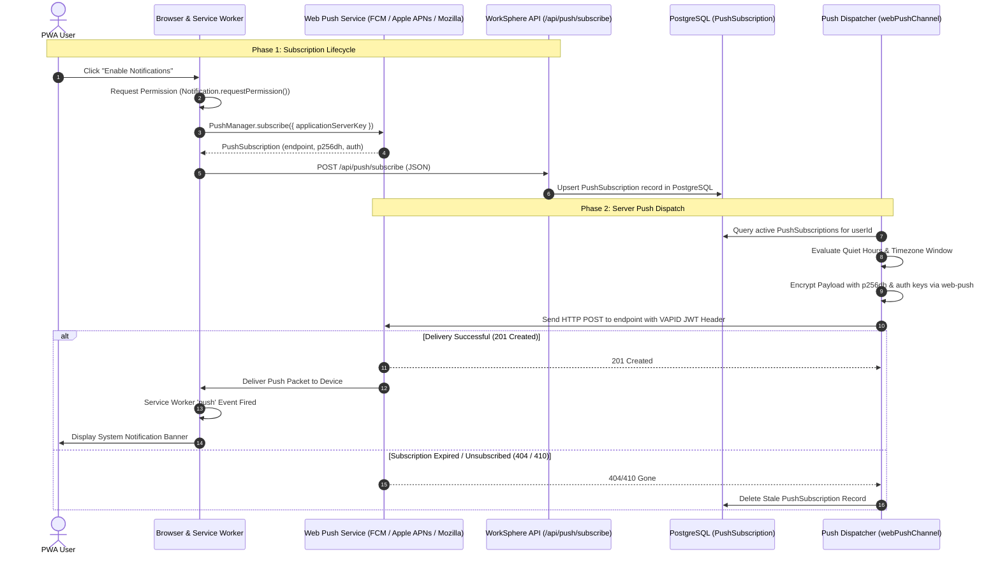
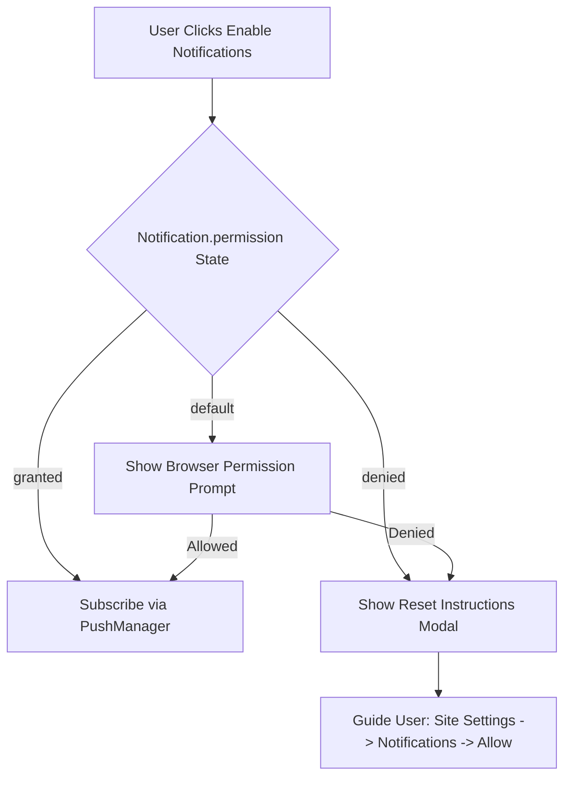

# Web Push API Subscription Lifecycle & Payload Specification

This document provides a comprehensive technical guide for WorkSphere's Web Push notification infrastructure, covering VAPID key configuration, client subscription lifecycles, PostgreSQL storage schemas, Service Worker push event handlers, JSON payload specifications, and mobile browser troubleshooting.

---

## 1. Executive Summary & Web Push Architecture

WorkSphere delivers real-time workspace alerts, venue availability updates, and booking reminders using standard W3C Web Push API directives.

### Key Technical Standards
- **VAPID Authentication (RFC 8292)**: Asymmetric ECDSA P-256 signing for Voluntary Application Server Identification.
- **Payload Encryption (RFC 8188 & RFC 8291)**: Encrypted payloads delivered via `aes128gcm` or `aesgcm` content encodings using client `p256dh` and `auth` secret keys.
- **Service Worker Push Listener**: Background event handler (`self.addEventListener('push')`) displaying system notification banners even when the application is closed.



---

## 2. VAPID Key Generation & Environment Setup

WorkSphere requires VAPID (Voluntary Application Server Identification) credentials to authenticate server requests sent to push services (Google FCM, Apple APNs, Mozilla Push).

### 2.1 Generating VAPID Keys
Generate a new VAPID keypair using the `web-push` CLI:

```bash
npx web-push generate-vapid-keys
```

### 2.2 Environment Variable Configuration
Configure the generated keys in `.env.local` or environment secrets:

```env
# Public VAPID Key (Exposed to client for PushManager.subscribe)
NEXT_PUBLIC_VAPID_PUBLIC_KEY=BEl62iUYgUivxIkv69yViEuiBIa-Ib9-gZ8jKw3w80...

# Private VAPID Key (Secret server-side signing key)
VAPID_PRIVATE_KEY=3kQZ1aX9yR...

# VAPID Subject Contact (Mailto URI or URL)
VAPID_SUBJECT=mailto:admin@worksphere.app
```

### 2.3 Server VAPID Helper Implementation (`src/lib/vapidUtils.ts`)

```typescript
import webPush from "web-push";

export interface VapidConfig {
  publicKey: string;
  privateKey: string;
  subject: string;
}

/**
 * Initializes server VAPID details for web-push library calls.
 */
export function getVapidConfig(): VapidConfig {
  const publicKey = process.env.NEXT_PUBLIC_VAPID_PUBLIC_KEY;
  const privateKey = process.env.VAPID_PRIVATE_KEY;
  const subject = process.env.VAPID_SUBJECT || "mailto:admin@worksphere.app";

  if (!publicKey || !privateKey) {
    throw new Error("VAPID keys missing. Please configure NEXT_PUBLIC_VAPID_PUBLIC_KEY and VAPID_PRIVATE_KEY.");
  }

  return { publicKey, privateKey, subject };
}

export function initVapid(): void {
  const config = getVapidConfig();
  webPush.setVapidDetails(config.subject, config.publicKey, config.privateKey);
}
```

---

## 3. Client-Side Subscription Lifecycle

### 3.1 Base64 Key Converter Utility
The `PushManager` requires the public VAPID key formatted as a `Uint8Array`:

```typescript
export function urlBase64ToUint8Array(base64String: string): Uint8Array {
  const padding = "=".repeat((4 - (base64String.length % 4)) % 4);
  const base64 = (base64String + padding)
    .replace(/-/g, "+")
    .replace(/_/g, "/");

  const rawData = window.atob(base64);
  const outputArray = new Uint8Array(rawData.length);

  for (let i = 0; i < rawData.length; ++i) {
    outputArray[i] = rawData.charCodeAt(i);
  }
  return outputArray;
}
```

### 3.2 React Hook: `useWebPushSubscription`

```typescript
import { useState, useEffect, useCallback } from "react";
import { urlBase64ToUint8Array } from "@/lib/vapidUtils";

export interface WebPushState {
  isSupported: boolean;
  permission: NotificationPermission;
  isSubscribed: boolean;
  loading: boolean;
  error: string | null;
}

export function useWebPushSubscription() {
  const [state, setState] = useState<WebPushState>({
    isSupported: false,
    permission: "default",
    isSubscribed: false,
    loading: true,
    error: null,
  });

  const checkSubscription = useCallback(async () => {
    if (
      typeof window === "undefined" ||
      !("serviceWorker" in navigator) ||
      !("PushManager" in window)
    ) {
      setState((prev) => ({ ...prev, isSupported: false, loading: false }));
      return;
    }

    try {
      const reg = await navigator.serviceWorker.ready;
      const sub = await reg.pushManager.getSubscription();

      setState({
        isSupported: true,
        permission: Notification.permission,
        isSubscribed: Boolean(sub),
        loading: false,
        error: null,
      });
    } catch (err: any) {
      setState((prev) => ({
        ...prev,
        loading: false,
        error: err.message || "Failed to inspect push subscription",
      }));
    }
  }, []);

  useEffect(() => {
    checkSubscription();
  }, [checkSubscription]);

  const subscribe = useCallback(async (): Promise<boolean> => {
    setState((prev) => ({ ...prev, loading: true, error: null }));
    try {
      const perm = await Notification.requestPermission();
      if (perm !== "granted") {
        throw new Error("Notification permission was denied by user.");
      }

      const vapidPublicKey = process.env.NEXT_PUBLIC_VAPID_PUBLIC_KEY;
      if (!vapidPublicKey) {
        throw new Error("VAPID public key not configured on client.");
      }

      const reg = await navigator.serviceWorker.ready;
      const subscription = await reg.pushManager.subscribe({
        userVisibleOnly: true,
        applicationServerKey: urlBase64ToUint8Array(vapidPublicKey),
      });

      const subJson = subscription.toJSON();
      const endpoint = subJson.endpoint;
      const p256dh = subJson.keys?.p256dh;
      const authKey = subJson.keys?.auth;

      if (!endpoint || !p256dh || !authKey) {
        throw new Error("Invalid PushSubscription key attributes returned from browser.");
      }

      const res = await fetch("/api/push/subscribe", {
        method: "POST",
        headers: { "Content-Type": "application/json" },
        body: JSON.stringify({
          endpoint,
          p256dh,
          auth: authKey,
        }),
      });

      if (!res.ok) {
        const errorData = await res.json().catch(() => ({}));
        throw new Error(errorData.error || "Server failed to save push subscription.");
      }

      setState({
        isSupported: true,
        permission: "granted",
        isSubscribed: true,
        loading: false,
        error: null,
      });
      return true;
    } catch (err: any) {
      setState((prev) => ({
        ...prev,
        loading: false,
        error: err.message || "Failed to subscribe to Web Push notifications.",
      }));
      return false;
    }
  }, []);

  const unsubscribe = useCallback(async (): Promise<boolean> => {
    setState((prev) => ({ ...prev, loading: true, error: null }));
    try {
      const reg = await navigator.serviceWorker.ready;
      const sub = await reg.pushManager.getSubscription();

      if (sub) {
        const endpoint = sub.endpoint;
        await sub.unsubscribe();

        await fetch("/api/push/unsubscribe", {
          method: "POST",
          headers: { "Content-Type": "application/json" },
          body: JSON.stringify({ endpoint }),
        });
      }

      setState((prev) => ({
        ...prev,
        isSubscribed: false,
        loading: false,
      }));
      return true;
    } catch (err: any) {
      setState((prev) => ({
        ...prev,
        loading: false,
        error: err.message || "Failed to unsubscribe.",
      }));
      return false;
    }
  }, []);

  return {
    ...state,
    subscribe,
    unsubscribe,
    refreshStatus: checkSubscription,
  };
}
```

---

## 4. PostgreSQL Database Schema & Storage

WorkSphere stores active Web Push subscriptions in PostgreSQL via Prisma.

### 4.1 Prisma Schema Definition

```prisma
model PushSubscription {
  id              String   @id @default(uuid())
  userId          String
  endpoint        String   @unique
  p256dh          String
  auth            String
  contentEncoding String?  @default("aes128gcm")
  userAgent       String?
  lastUsedAt      DateTime @default(now())
  createdAt       DateTime @default(now())

  user            User     @relation(fields: [userId], references: [id], onDelete: Cascade)

  @@index([userId])
  @@index([endpoint])
}
```

### 4.2 Subscription Ingest API (`src/app/api/push/subscribe/route.ts`)

```typescript
import { NextRequest, NextResponse } from "next/server";
import { auth } from "@clerk/nextjs/server";
import { prisma } from "@/lib/prisma";

export async function POST(req: NextRequest) {
  const { userId } = await auth();
  if (!userId) {
    return NextResponse.json({ error: "Unauthorized" }, { status: 401 });
  }

  const { endpoint, p256dh, auth: authKey, contentEncoding } = await req.json();

  if (!endpoint || !p256dh || !authKey) {
    return NextResponse.json({ error: "Missing required subscription keys" }, { status: 400 });
  }

  await prisma.pushSubscription.upsert({
    where: { endpoint },
    update: {
      userId,
      p256dh,
      auth: authKey,
      contentEncoding: contentEncoding || "aes128gcm",
      lastUsedAt: new Date(),
    },
    create: {
      userId,
      endpoint,
      p256dh,
      auth: authKey,
      contentEncoding: contentEncoding || "aes128gcm",
      userAgent: req.headers.get("user-agent"),
    },
  });

  return NextResponse.json({ success: true }, { status: 200 });
}
```

---

## 5. Push Payload JSON Schemas

All Web Push notification payloads delivered by WorkSphere conform to strict JSON schemas.

### 5.1 PushPayload TypeScript Interface

```typescript
export interface PushNotificationActionButton {
  action: string;
  title: string;
  icon?: string;
}

export interface PushPayloadData {
  url?: string;
  bookingId?: string;
  venueId?: string;
  type?: "BOOKING_REMINDER" | "VENUE_AVAILABILITY" | "EMERGENCY_ALERT" | "CHAT_MESSAGE";
  actionButtons?: PushNotificationActionButton[];
  [key: string]: unknown;
}

export interface PushPayload {
  title: string;
  body: string;
  icon?: string;
  badge?: string;
  image?: string;
  tag?: string;
  renotify?: boolean;
  requireInteraction?: boolean;
  vibrate?: number[];
  isCritical?: boolean;
  data?: PushPayloadData;
}
```

### 5.2 Event Payload Examples

#### Example 1: 30-Minute Booking Reminder (`BOOKING_REMINDER`)
```json
{
  "title": "Upcoming Workspace Booking",
  "body": "Your desk reservation at Blue Bottle Cafe starts in 30 minutes (10:00 AM).",
  "icon": "/icons/icon-192x192.png",
  "badge": "/icons/badge-72x72.png",
  "tag": "booking-reminder-WS-89F1A2",
  "requireInteraction": true,
  "vibrate": [200, 100, 200],
  "data": {
    "type": "BOOKING_REMINDER",
    "bookingId": "cmid_bk_9812",
    "venueId": "v_blue_bottle_sf",
    "url": "/reserve/v_blue_bottle_sf?confirmationId=WS-89F1A2",
    "actionButtons": [
      { "action": "view", "title": "View Ticket" },
      { "action": "directions", "title": "Get Directions" }
    ]
  }
}
```

#### Example 2: Venue Seat Availability Alert (`VENUE_AVAILABILITY`)
```json
{
  "title": "Seat Available at Capital One Cafe",
  "body": "A quiet booth seat with power outlets just opened up for your requested date.",
  "icon": "/icons/icon-192x192.png",
  "badge": "/icons/badge-72x72.png",
  "tag": "seat-available-v_cap_one",
  "vibrate": [100, 50, 100],
  "data": {
    "type": "VENUE_AVAILABILITY",
    "venueId": "v_cap_one",
    "url": "/reserve/v_cap_one?seatId=booth-04"
  }
}
```

---

## 6. Service Worker Push Event Handler (`public/sw.js`)

The Service Worker listens for incoming encrypted `push` events, parses JSON payloads, and displays system notification banners.

```javascript
// public/sw.js - Production Web Push Handler

self.addEventListener("push", (event) => {
  if (!event.data) {
    console.warn("[SW Push] Received push event without payload data.");
    return;
  }

  let payload;
  try {
    payload = event.data.json();
  } catch (err) {
    console.error("[SW Push] Failed to parse push JSON payload:", err);
    payload = {
      title: "WorkSphere Notification",
      body: event.data.text(),
    };
  }

  const title = payload.title || "WorkSphere Alert";
  const options = {
    body: payload.body || "",
    icon: payload.icon || "/icons/icon-192x192.png",
    badge: payload.badge || "/icons/badge-72x72.png",
    image: payload.image || undefined,
    tag: payload.tag || "worksphere-general",
    renotify: payload.renotify ?? true,
    requireInteraction: payload.requireInteraction ?? payload.isCritical ?? false,
    vibrate: payload.vibrate || [100, 50, 100],
    data: payload.data || { url: "/" },
    actions: payload.data?.actionButtons || [
      { action: "open", title: "Open WorkSphere" },
    ],
  };

  event.waitUntil(self.registration.showNotification(title, options));
});

self.addEventListener("notificationclick", (event) => {
  event.notification.close();

  const action = event.action;
  const targetUrl = event.notification.data?.url || "/";

  event.waitUntil(
    clients.matchAll({ type: "window", includeUncontrolled: true }).then((windowClients) => {
      // Focus existing open tab if available
      for (const client of windowClients) {
        if (client.url.includes(self.location.origin) && "focus" in client) {
          client.navigate(targetUrl);
          return client.focus();
        }
      }
      // Otherwise open new browser window
      if (clients.openWindow) {
        return clients.openWindow(targetUrl);
      }
    })
  );
});
```

---

## 7. Server Dispatcher & Quiet Hours Engine

`sendPushNotification` (`src/lib/notifications/channels/webPushChannel.ts`) evaluates timezone-aware Quiet Hours preferences before calling `webPush.sendNotification`.

```typescript
import webPush from "web-push";
import { prisma } from "@/lib/prisma";
import { initVapid } from "@/lib/vapidUtils";

export async function dispatchUserPush(
  userId: string,
  payload: PushPayload,
  isCritical = false
) {
  initVapid();

  // Fetch subscriptions
  const subscriptions = await prisma.pushSubscription.findMany({
    where: { userId },
  });

  if (subscriptions.length === 0) return { sent: 0, failed: 0 };

  const payloadString = JSON.stringify(payload);
  let sent = 0;
  let failed = 0;

  await Promise.all(
    subscriptions.map(async (sub) => {
      const pushSubscription = {
        endpoint: sub.endpoint,
        keys: {
          p256dh: sub.p256dh,
          auth: sub.auth,
        },
      };

      try {
        await webPush.sendNotification(pushSubscription, payloadString, {
          contentEncoding: sub.contentEncoding || "aes128gcm",
          TTL: isCritical ? 86400 : 3600,
          urgency: isCritical ? "high" : "normal",
        });
        sent++;
      } catch (err: any) {
        failed++;
        // Evict expired subscriptions on 404/410 GONE
        if (err.statusCode === 404 || err.statusCode === 410) {
          await prisma.pushSubscription
            .delete({ where: { id: sub.id } })
            .catch(() => {});
        }
      }
    })
  );

  return { sent, failed };
}
```

---

## 8. Mobile Browser Troubleshooting Guide

### 8.1 iOS / Safari (iOS 16.4+) Requirements
On iOS devices, Web Push API is **only supported** when the application is added to the home screen as a standalone PWA.

| Platform / Browser | Web Push Supported | Standalone PWA Required |
| :--- | :---: | :---: |
| **iOS Safari (iOS 16.4+)** | ✅ Yes | ⚠️ **YES** (Must tap "Add to Home Screen") |
| **iOS Chrome / Firefox** | ✅ Yes (iOS 16.4+) | ⚠️ **YES** (Uses WebKit PWA Engine) |
| **Android Chrome** | ✅ Yes | ❌ No (Works in browser & PWA) |
| **Android Firefox / Edge** | ✅ Yes | ❌ No (Works in browser & PWA) |
| **Desktop Chrome / Edge / Safari** | ✅ Yes | ❌ No |

### 8.2 Common Permission Denied States & Recovery

If a user accidentally clicks **"Block"** or **"Don't Allow"**, `Notification.requestPermission()` will permanently return `"denied"` without prompting again.



#### Step-by-Step UI Recovery Instructions for Users:
1. **iOS Safari**: Open `Settings -> Safari -> Advanced -> Experimental Features -> Push API` (Ensure active). Ensure site is added to Home Screen via Share menu.
2. **Android Chrome**: Tap the lock/tune icon in address bar $\rightarrow$ **Permissions** $\rightarrow$ **Notifications** $\rightarrow$ Reset to **Allow**.
3. **Desktop Chrome / Edge**: Click lock icon next to URL $\rightarrow$ Toggle **Notifications** to **On** $\rightarrow$ Refresh page.

---

## 9. Operation & Monitoring Runbook

Push notification delivery metrics and VAPID key health can be inspected in the Admin Performance Dashboard (`/admin/performance`).
