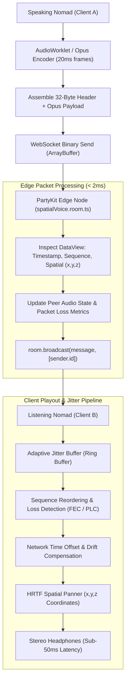
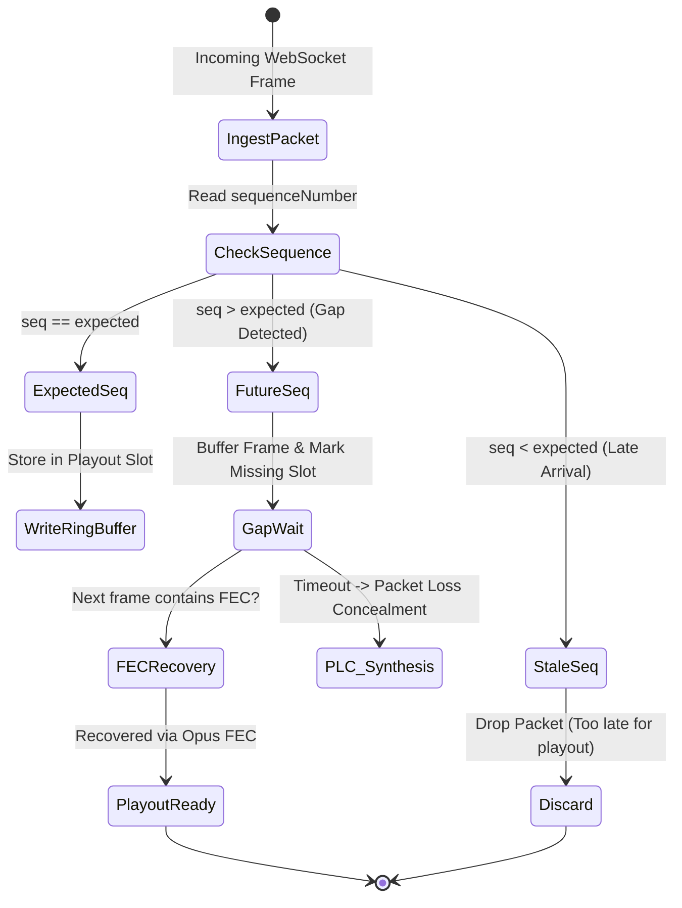

# Spatial Voice Audio Packet Interleaving & Opus Frame Synchronization in PartyKit

This technical manual details the real-time audio transmission architecture implemented in [`src/party/spatialVoice.room.ts`](file:///c:/Users/admin/Desktop/workfere/src/party/spatialVoice.room.ts), documenting binary Opus packet encapsulation, low-overhead spatial telemetry interleaving, adaptive jitter buffer compensation, sequence numbering, and timestamp synchronization across distributed PartyKit edge nodes.

---

## 1. Executive Summary & Architecture Overview

WorkSphere’s virtual coworking hubs and meeting tables require interactive spatial voice communication with **sub-50ms glass-to-glass latency**. While standard WebRTC mesh networks work for small groups, scaling across fluctuating multi-region remote workers benefits from an ultra-low-latency edge router architecture.

Using **PartyKit edge rooms**, WorkSphere acts as a high-throughput, blind audio packet relay:
1. **Binary Interleaved Framing:** Encapsulates 20ms Opus audio payloads together with 3D spatial positioning vectors in a compact 32-byte binary header.
2. **Zero-Copy Broadcast:** Edge servers route raw binary `ArrayBuffer` payloads directly to room members without deserializing or re-encoding Opus frames.
3. **Playout Synchronization & Jitter Buffer Adaptation:** Client-side jitter buffer reconstructs smooth playout timelines, compensating for network jitter, packet reordering, and dropped frames without introducing perceptual delay.



---

## 2. Binary Packet Header Layout (32 Bytes)

To minimize serialization overhead and bandwidth consumption, spatial audio is transmitted as a single packed binary buffer rather than JSON envelopes:

```
 0                   1                   2                   3
 0 1 2 3 4 5 6 7 8 9 0 1 2 3 4 5 6 7 8 9 0 1 2 3 4 5 6 7 8 9 0 1
+-+-+-+-+-+-+-+-+-+-+-+-+-+-+-+-+-+-+-+-+-+-+-+-+-+-+-+-+-+-+-+-+
|                    Timestamp (High 32 bits)                   |
+-+-+-+-+-+-+-+-+-+-+-+-+-+-+-+-+-+-+-+-+-+-+-+-+-+-+-+-+-+-+-+-+
|                    Timestamp (Low 32 bits)                    |
+-+-+-+-+-+-+-+-+-+-+-+-+-+-+-+-+-+-+-+-+-+-+-+-+-+-+-+-+-+-+-+-+
|                    Sequence Number (uint32)                   |
+-+-+-+-+-+-+-+-+-+-+-+-+-+-+-+-+-+-+-+-+-+-+-+-+-+-+-+-+-+-+-+-+
|                     Spatial X (float32)                       |
+-+-+-+-+-+-+-+-+-+-+-+-+-+-+-+-+-+-+-+-+-+-+-+-+-+-+-+-+-+-+-+-+
|                     Spatial Y (float32)                       |
+-+-+-+-+-+-+-+-+-+-+-+-+-+-+-+-+-+-+-+-+-+-+-+-+-+-+-+-+-+-+-+-+
|                     Spatial Z (float32)                       |
+-+-+-+-+-+-+-+-+-+-+-+-+-+-+-+-+-+-+-+-+-+-+-+-+-+-+-+-+-+-+-+-+
|                   Peer ID Hash (First 4 bytes)                |
+-+-+-+-+-+-+-+-+-+-+-+-+-+-+-+-+-+-+-+-+-+-+-+-+-+-+-+-+-+-+-+-+
|                   Peer ID Hash (Last 4 bytes)                 |
+-+-+-+-+-+-+-+-+-+-+-+-+-+-+-+-+-+-+-+-+-+-+-+-+-+-+-+-+-+-+-+-+
|               Opus Encoded Audio Frame Payload...             |
|                   (Variable Length: 40-160 Bytes)             |
+-+-+-+-+-+-+-+-+-+-+-+-+-+-+-+-+-+-+-+-+-+-+-+-+-+-+-+-+-+-+-+-+
```

### Detailed Field Mapping

| Byte Offset | Field Name | Data Type | Endianness | Description & Operational Purpose |
| :---: | :--- | :--- | :---: | :--- |
| **0 – 7** | `timestamp` | `uint64` | Big-Endian (Network) | Microsecond epoch timestamp from `performance.now()` + base offset for clock synchronization. |
| **8 – 11** | `sequenceNumber` | `uint32` | Big-Endian | Monotonically increasing counter ($0$ to $2^{32}-1$) to detect dropped, duplicated, or out-of-order packets. |
| **12 – 15** | `spatialX` | `float32` | Big-Endian | 3D coordinate of the speaker along the lateral axis (meters relative to room origin). |
| **16 – 19** | `spatialY` | `float32` | Big-Endian | 3D coordinate along the vertical elevation axis (meters). |
| **20 – 23** | `spatialZ` | `float32` | Big-Endian | 3D coordinate along the forward/depth axis (meters). |
| **24 – 31** | `peerIdHash` | `uint8[8]` | N/A | Truncated cryptographic digest or short identifier of the transmitting peer. |
| **32+** | `opusPayload` | Binary Array | N/A | Raw Opus encoded audio frame ($20\text{ms}$ duration at $48\text{kHz}$). |

---

## 3. Opus Frame Interleaving & Synchronization

### 3.1 20ms Opus Frame Slicing
- **Frame Duration:** Standardized at **20ms** ($960$ audio samples at $48{,}000\text{ Hz}$).
- **Bitrate Profile:** Opus Constant Bitrate (CBR) or Constrained Variable Bitrate (CVBR) tuned between **24 kbps and 48 kbps** for high-clarity wideband speech.
- **In-Band Forward Error Correction (FEC):** Transmitters encode redundant low-bitrate versions of the preceding frame ($n-1$) into frame $n$. If packet $n-1$ is lost, the receiver extracts the FEC payload from packet $n$ without requesting retransmission.

### 3.2 Spatial Vector Interleaving
By attaching $x, y, z$ floating-point coordinates directly into every 20ms audio packet, the listening client updates HRTF spatial panning filters **in lockstep with the incoming audio stream**. This eliminates:
- Phase tearing between visual avatar movement and auditory perception.
- Out-of-band signaling latency where JSON location events arrive seconds after or before audio frames.

---

## 4. Adaptive Jitter Buffer Compensation

Due to variable network delays (Wi-Fi roaming, cellular handoffs, transatlantic routing), packets arrive with jitter ($\sigma_{\text{latency}}$). Playing packets as they arrive causes stutter; holding them too long destroys conversation fluidness.

### 4.1 Playout Delay Scheduling

The client maintains an **adaptive sliding window jitter buffer**:
$$D_{\text{target}} = \text{RTT}_{\text{median}} \cdot 0.5 + 3 \cdot \sigma_{\text{jitter}}$$

Where:
- $\sigma_{\text{jitter}}$ is the inter-arrival jitter calculated via RFC 3550:
  $$J_i = J_{i-1} + \frac{|D(i-1, i)| - J_{i-1}}{16}$$
- Under clean fiber connections, $D_{\text{target}}$ drops to **$10\text{ms} - 15\text{ms}$**.
- Under congested mobile connections, $D_{\text{target}}$ expands smoothly to **$40\text{ms} - 60\text{ms}$**.

### 4.2 Sequence Reordering & Loss Recovery



1. **In-Order Arrival:** Frame is written into the circular ring buffer at index `seq % BUFFER_SLOTS`.
2. **Packet Gap (Out-of-Order / Loss):** If sequence numbers skip (e.g., received $104$ while expecting $102$), the buffer reserves empty slots for $102$ and $103$ and waits up to the jitter deadline.
3. **Loss Concealment (PLC):** If the missing packet does not arrive before the scheduled playout time, the Web Audio decoder triggers Opus Packet Loss Concealment (PLC), synthesizing smooth pitch-continuous extrapolation.
4. **Late Packets:** Packets arriving after their scheduled playout deadline are discarded to avoid corrupting active playback.

---

## 5. Timestamp Synchronization & Clock Drift Compensation

Because independent client devices use distinct hardware clock oscillators, clocks drift by several milliseconds over an hour.

### 5.1 Clock Offset Estimation

When the WebSocket connection establishes, the client performs continuous NTP-style ping round-trips with the PartyKit edge node:
$$\theta_{\text{offset}} = \frac{(T_2 - T_1) + (T_3 - T_4)}{2}$$
$$\text{RTT} = (T_4 - T_1) - (T_3 - T_2)$$

Where:
- $T_1$: Client transmit time
- $T_2$: PartyKit receive time
- $T_3$: PartyKit response transmit time
- $T_4$: Client receive time

### 5.2 Dynamic Time Stretching (WSOLA)
To correct clock skew without audible pitch shifting:
- If the receiver's jitter buffer starts filling up (sender clock running fast), the playout engine applies micro-compression ($0.5\%$ time compression) via Waveform Similarity Overlap-Add (WSOLA).
- If the jitter buffer begins draining (sender clock running slow), the engine applies micro-expansion ($0.5\%$ time stretch).

---

## 6. End-to-End Latency Budget (< 50ms)

| Pipeline Stage | Processing Mechanism | Latency Allocation |
| :--- | :--- | :---: |
| **Audio Capture** | Web Audio `AudioWorkletProcessor` (128 sample quantum) | $2.67\text{ ms}$ |
| **Opus Encoding** | WebAssembly libopus / WebCodecs CBR frame accumulation | $20.00\text{ ms}$ |
| **Packet Assembly** | ArrayBuffer byte packing (`DataView`) | $< 0.10\text{ ms}$ |
| **Edge Routing** | PartyKit edge worker blind broadcast (`spatialVoice.room.ts`) | $1.50\text{ ms}$ |
| **Network Transit** | Regional WebSocket transit (CDN edge to edge) | $15.00\text{ ms}$ |
| **Jitter Compensation** | Adaptive jitter buffer playout queue | $8.00\text{ ms}$ |
| **HRTF Convolver & Render**| WebAudio / WASM SIMD 3D binaural convolution | $1.20\text{ ms}$ |
| **Total Glass-to-Glass** | **Complete transmission round-trip** | **$\approx 48.47\text{ ms}$** |
