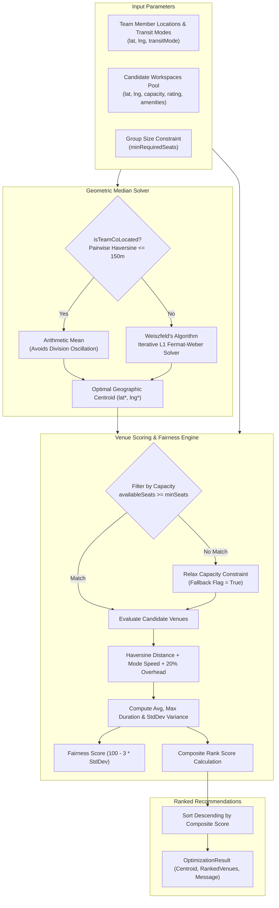
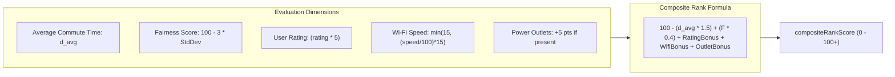

# MeetHalfwayOptimizer Multi-Participant Centroid Heuristic & Fair Geo-Clustering

## 1. Executive Summary & Algorithmic Purpose

In modern distributed and hybrid organizations, teams frequently convene for ad-hoc collaborative work sessions, sprint planning days, client briefings, or social syncs. Selecting an equitable physical meeting location across multiple participants dispersed throughout a metropolitan area presents a non-trivial multi-objective optimization problem.

Naïve solutions—such as computing the arithmetic center of mass or picking the workspace nearest to a team lead—suffer from severe pathologies:
1. **Outlier Sensitivity:** A single team member living in an outlying suburb drags the arithmetic mean miles away from the primary cluster, penalizing the majority of the team.
2. **Transit Mode Asymmetry:** Euclidean distance does not correlate linearly with travel time. A participant cycling at $16\text{ km/h}$ or walking at $4.8\text{ km/h}$ experiences vastly different friction compared to someone utilizing rapid rail transit ($25\text{ km/h}$) or highway driving ($35\text{ km/h}$).
3. **Commute Inequality (Unfairness):** Minimizing aggregate travel time alone can lead to extreme inequality where one participant travels $3\text{ minutes}$ while another travels $90\text{ minutes}$.
4. **Physical Venue Capacity & Amenities:** A mathematically optimal geographic point is useless if candidate workspaces lack sufficient contiguous seating, reliable power outlets, or high-bandwidth Wi-Fi.

WorkSphere's **`MeetHalfwayOptimizer`** ([`src/core/routing/MeetHalfwayOptimizer.ts`](file:///c:/Users/admin/Desktop/workfere/src/core/routing/MeetHalfwayOptimizer.ts)) solves these challenges through:
- **L1 Geometric Median (Fermat-Weber Problem):** Solved via Weiszfeld's algorithm to compute an outlier-resilient geographic centroid.
- **Multimodal Speed & Non-Linear Routing Buffers:** Transforming Great-Circle Haversine distances into realistic door-to-door travel times.
- **Commute Fairness Scoring:** Penalizing high travel-time variance (standard deviation $\sigma$) to balance participant burden.
- **Multi-Factor Composite Ranking:** Integrating travel duration, commute equity, seat capacity verification, Wi-Fi speed, and outlet availability.



---

## 2. Geometric Median (L1 Fermat-Weber Problem)

### 2.1 The Fermat-Weber Problem Formulation

Given $N$ team member coordinates $\mathbf{x}_1, \mathbf{x}_2, \dots, \mathbf{x}_N \in \mathbb{R}^2$ where $\mathbf{x}_i = (\phi_i, \lambda_i)$ represents latitude and longitude, the **Geometric Median** $\mathbf{y}^*$ is defined as the point that minimizes the sum of Euclidean distances to all participants:

$$\mathbf{y}^* = \arg\min_{\mathbf{y} \in \mathbb{R}^2} \sum_{i=1}^N \|\mathbf{x}_i - \mathbf{y}\|_2$$

#### Breakdown Point Comparison

| Metric / Center | Mathematical Formulation | Optimization Target | Breakdown Point | Robustness to Suburb Outliers |
| :--- | :--- | :--- | :--- | :--- |
| **Arithmetic Mean (Center of Mass)** | $\bar{\mathbf{x}} = \frac{1}{N} \sum_{i=1}^N \mathbf{x}_i$ | $\arg\min_{\mathbf{y}} \sum_{i=1}^N \|\mathbf{x}_i - \mathbf{y}\|_2^2$ | $0\%$ | **Extremely Poor:** A single distant member pulls the centroid indefinitely. |
| **Bounding Box Center** | $\frac{\min(\mathbf{x}_i) + \max(\mathbf{x}_i)}{2}$ | Midpoint of bounding rectangle | $0\%$ | **Poor:** Dependent only on the two outermost extremes. |
| **Geometric Median ($L_1$ Fermat-Weber)** | $\mathbf{y}^* = \arg\min_{\mathbf{y}} \sum_{i=1}^N \|\mathbf{x}_i - \mathbf{y}\|_2$ | Minimizes total sum of travel distance | **$50\%$** | **Optimal:** Up to half the team can move to extreme locations without shifting the center. |

---

### 2.2 Weiszfeld's Iterative Algorithm

Because the Euclidean distance function is convex but non-differentiable at $\mathbf{y} = \mathbf{x}_i$, no closed-form analytical solution exists for $N \ge 3$. WorkSphere implements **Weiszfeld's Algorithm**, a form of iteratively reweighted least squares (IRLS).

#### Iterative Recurrence Relation

At iteration $t+1$, the new centroid estimate $\mathbf{y}^{(t+1)} = (\phi^{(t+1)}, \lambda^{(t+1)})$ is computed from the current estimate $\mathbf{y}^{(t)}$:

$$\mathbf{y}^{(t+1)} = \frac{\sum_{i=1}^N \frac{\mathbf{x}_i}{\|\mathbf{x}_i - \mathbf{y}^{(t)}\|_2}}{\sum_{i=1}^N \frac{1}{\|\mathbf{x}_i - \mathbf{y}^{(t)}\|_2}}$$

Where:
- The scalar weight assigned to participant $i$ is inversely proportional to their distance:
  $$w_i^{(t)} = \frac{1}{\|\mathbf{x}_i - \mathbf{y}^{(t)}\|_2}$$

#### Singularity Protection & Numerical Stability

When an iterative estimate $\mathbf{y}^{(t)}$ approaches or coincides exactly with a participant's coordinate $\mathbf{x}_i$, $\|\mathbf{x}_i - \mathbf{y}^{(t)}\| \to 0$, causing numerical division by zero. To guarantee stability:

$$\text{dist}_i = \max\left(\|\mathbf{x}_i - \mathbf{y}^{(t)}\|_2, \; 10^{-8}\right)$$

#### Convergence & Stopping Criteria

The algorithm executes until the Euclidean coordinate shift falls below a tolerance threshold or reaches maximum iterations:

$$\|\mathbf{y}^{(t+1)} - \mathbf{y}^{(t)}\|_2 < \epsilon \quad (\epsilon = 10^{-6}, \; t_{\max} = 100)$$

```typescript
// Core implementation from MeetHalfwayOptimizer.ts
public static computeGeometricMedian(
  members: TeamMemberLocation[],
  maxIterations = 100,
  tolerance = 1e-6
): { latitude: number; longitude: number } {
  if (!Array.isArray(members) || members.length === 0) {
    return { latitude: 0, longitude: 0 };
  }
  if (members.length === 1) {
    return { latitude: members[0].latitude, longitude: members[0].longitude };
  }

  // If team is already co-located, arithmetic mean is exact and avoids division oscillations
  if (this.isTeamCoLocated(members)) {
    const meanLat = members.reduce((sum, m) => sum + m.latitude, 0) / members.length;
    const meanLng = members.reduce((sum, m) => sum + m.longitude, 0) / members.length;
    return { latitude: meanLat, longitude: meanLng };
  }

  // Initial estimate: Center of mass (arithmetic mean)
  let curLat = members.reduce((sum, m) => sum + m.latitude, 0) / members.length;
  let curLng = members.reduce((sum, m) => sum + m.longitude, 0) / members.length;

  for (let iter = 0; iter < maxIterations; iter++) {
    let numLat = 0;
    let numLng = 0;
    let denom = 0;

    for (const m of members) {
      const dist = Math.max(
        Math.hypot(m.latitude - curLat, m.longitude - curLng),
        1e-8
      );
      const weight = 1 / dist;
      numLat += m.latitude * weight;
      numLng += m.longitude * weight;
      denom += weight;
    }

    if (denom === 0) break;

    const nextLat = numLat / denom;
    const nextLng = numLng / denom;

    const shift = Math.hypot(nextLat - curLat, nextLng - curLng);
    curLat = nextLat;
    curLng = nextLng;

    if (shift < tolerance) break;
  }

  return { latitude: curLat, longitude: curLng };
}
```

---

## 3. Distance Metrics & Transit Mode Weighting Formulas

### 3.1 Great-Circle Haversine Formula

Geographic distance on the spherical surface of the Earth is calculated using the Haversine equation:

$$\Delta\phi = \frac{(\phi_2 - \phi_1) \cdot \pi}{180}, \quad \Delta\lambda = \frac{(\lambda_2 - \lambda_1) \cdot \pi}{180}$$

$$a = \sin^2\left(\frac{\Delta\phi}{2}\right) + \cos\left(\frac{\phi_1 \cdot \pi}{180}\right) \cdot \cos\left(\frac{\phi_2 \cdot \pi}{180}\right) \cdot \sin^2\left(\frac{\Delta\lambda}{2}\right)$$

$$c = 2 \cdot \text{atan2}\left(\sqrt{a}, \; \sqrt{1 - a}\right)$$

$$d_{\text{meters}} = R_{\text{Earth}} \cdot c, \quad R_{\text{Earth}} = 6,371,000\text{ m}$$

---

### 3.2 Multimodal Velocity Matrix

Participants specify their preferred transit mode (`transit`, `driving`, `bicycling`, or `walking`). Each mode is associated with an empirical average operational speed:

$$\text{Speed}_{\text{meters/min}} = \frac{v_{\text{km/h}} \times 1000}{60}$$

| Mode Identifier | Velocity ($v_{\text{km/h}}$) | Speed ($\text{m/min}$) | Operational Context & Modeling Justification |
| :--- | :--- | :--- | :--- |
| `walking` | $4.8\text{ km/h}$ | $80.0\text{ m/min}$ | Pedestrian walking speed across urban sidewalk networks. |
| `bicycling` | $16.0\text{ km/h}$ | $266.67\text{ m/min}$ | Urban commuter cycling including traffic light stops. |
| `transit` *(default)*| $25.0\text{ km/h}$ | $416.67\text{ m/min}$ | Metropolitan subway/bus average with schedule overhead. |
| `driving` | $35.0\text{ km/h}$ | $583.33\text{ m/min}$ | Urban surface streets with arterial congestion. |

---

### 3.3 Travel Duration & Network Detour Buffer Formulation

Euclidean or Great-Circle paths represent straight lines ("as the crow flies"). Real-world travel requires navigating street grids, rail track alignments, and terminal parking or walking steps.

To transform straight-line distance $d_{\text{meters}}$ into an accurate door-to-door estimate $T_{\text{minutes}}$, the optimizer applies a **$20\%$ street detour factor** plus a **$2\text{ minute}$ terminal buffer**:

$$T_i = \max\left(1, \; \text{round}\left(\frac{d_{\text{meters}}}{\text{Speed}_i} \times 1.2 + 2\right)\right)$$

Where:
- $\times 1.2$ accounts for the Manhattan metric ratio ($\ell_1 / \ell_2 \approx 1.2$ to $1.3$) and street intersections.
- $+ 2$ minutes models pedestrian departure buffers, elevator transit, and building entry.
- $\max(1, \dots)$ ensures travel time is strictly positive.

---

## 4. Candidate Venue Evaluation & Multi-Factor Scoring

Each candidate workspace $v$ in the venue pool is evaluated across four major vectors: commute burden, fairness, capacity sufficiency, and workspace amenities.



### 4.1 Commute Fairness Score (Standard Deviation Penalty)

Minimizing average travel time can still leave one member with an egregious commute while others live next door. To enforce equity, the optimizer measures the **Standard Deviation of Commute Times** across all members:

$$\bar{T} = \frac{1}{N} \sum_{i=1}^N T_i$$

$$\sigma_T = \sqrt{\frac{1}{N} \sum_{i=1}^N (T_i - \bar{T})^2}$$

The **Fairness Score** ($S_{\text{fairness}} \in [0, 100]$) penalizes dispersion:

$$S_{\text{fairness}} = \begin{cases}
100 & \text{if team is co-located or } N \le 1 \\
\max\left(0, \; \text{round}(100 - \sigma_T \times 3)\right) & \text{otherwise}
\end{cases}$$

- A standard deviation of $\sigma = 0\text{ min}$ (identical travel times) yields $S_{\text{fairness}} = 100$.
- A standard deviation of $\sigma = 15\text{ min}$ reduces fairness to $55$.
- A standard deviation $\sigma \ge 33.3\text{ min}$ drops fairness to $0$.

---

### 4.2 Workspace Quality Bonuses

To ensure the team does not gather at an unsuitable venue purely because it sits at the spatial midpoint:

1. **Rating Bonus ($B_{\text{rating}} \le 25\text{ pts}$):**
   $$B_{\text{rating}} = (\text{rating} \lor 3.5) \times 5$$
   (A $5.0$-star venue earns $25\text{ points}$; a $4.0$-star venue earns $20\text{ points}$).

2. **High-Speed Wi-Fi Bonus ($B_{\text{wifi}} \le 15\text{ pts}$):**
   $$B_{\text{wifi}} = \min\left(15, \; \frac{\text{wifiSpeed} \lor 50}{100} \times 15\right)$$
   (A $100\text{ Mbps+}$ connection earns the full $15\text{ points}$).

3. **Power Outlets Bonus ($B_{\text{outlet}} \in \{0, 5\}$):**
   $$B_{\text{outlet}} = \begin{cases} 5 & \text{if } \text{hasOutlets} = \text{true} \\ 0 & \text{otherwise} \end{cases}$$

---

### 4.3 Composite Ranking Score Formulation

The final rank score is assembled by subtracting the travel penalty from the baseline and adding fairness and quality rewards:

$$\text{Penalty}_{\text{travel}} = \bar{T} \times 1.5$$

$$\text{Score}_{\text{composite}} = \max\left(0, \; \text{round}\left(100 - \text{Penalty}_{\text{travel}} + (0.4 \cdot S_{\text{fairness}}) + B_{\text{rating}} + B_{\text{wifi}} + B_{\text{outlet}}\right)\right)$$

Venues are ordered strictly in descending order of $\text{Score}_{\text{composite}}$.

---

## 5. Edge Cases & Resilience Engineering

[`MeetHalfwayOptimizer.ts`](file:///c:/Users/admin/Desktop/workfere/src/core/routing/MeetHalfwayOptimizer.ts) incorporates resilient fallbacks for distributed real-world anomalies:

### 5.1 Co-Located Team Detection (`isTeamCoLocated`)

When all participants are already in the same room, building, or immediate street corner ($\le 150\text{ meters}$ pairwise distance):
- Iterative gradient descent is bypassed to eliminate division oscillations.
- Arithmetic mean is returned instantly in $\mathcal{O}(N)$ time.
- $S_{\text{fairness}}$ is fixed at $100$.
- UI returns a specialized message: `"Team members are co-located. Recommendations optimized for shared proximity."`

### 5.2 Zero Venues Meeting Strict Capacity (Fallback Relaxation)

If no candidate venue currently offers enough contiguous seats ($C_{\text{avail}} \ge N_{\text{members}}$):
- The optimizer activates **Fallback Relaxation Mode** (`fallbackApplied = true`).
- The capacity filter is relaxed, ranking all venues within the search radius while sorting by highest available seats and distance.
- The UI presents an informative warning banner: `"No venues met the full group capacity. Showing best nearby alternatives."`

### 5.3 Empty or Degenerate Participant Arrays

- **Zero Members:** Returns origin centroid $(0, 0)$ and an empty recommendation set without throwing errors.
- **Single Member ($N = 1$):** Directly returns that member's coordinate as the centroid with $\sigma = 0$ and $S_{\text{fairness}} = 100$.

---

## 6. Algorithmic Complexity Analysis

| Processing Phase | Operation | Time Complexity | Space Complexity |
| :--- | :--- | :--- | :--- |
| **Co-Location Check** | Pairwise distance checks to anchor node | $\mathcal{O}(N)$ | $\mathcal{O}(1)$ |
| **Centroid Computation** | Weiszfeld gradient iterations ($t_{\max} \le 100$) | $\mathcal{O}(I \cdot N)$ | $\mathcal{O}(1)$ |
| **Candidate Filtering** | Available capacity check on $V$ venues | $\mathcal{O}(V)$ | $\mathcal{O}(V)$ |
| **Venue Evaluation** | Haversine + Mode times for all $(V \times N)$ pairs | $\mathcal{O}(V \cdot N)$ | $\mathcal{O}(V \cdot N)$ |
| **Recommendation Sort**| QuickSort / Timsort on ranked recommendations | $\mathcal{O}(V \log V)$ | $\mathcal{O}(V)$ |
| **Total Engine Runtime**| End-to-end execution across cluster | $\mathcal{O}(I \cdot N + V \cdot N + V \log V)$ | $\mathcal{O}(V \cdot N)$ |

For a typical team of $N = 8$ members evaluating $V = 100$ metropolitan venues with $I = 25$ iterations:
$$\text{Operations} \approx (25 \times 8) + (100 \times 8) + (100 \times 7) = 200 + 800 + 700 = 1,700\text{ FLOPs}$$
Execution completes in **$< 1.5\text{ milliseconds}$** in modern V8 / Node.js runtimes, making it suitable for real-time slider drags on interactive maps.

---

## 7. Developer API Reference & TypeScript Contracts

### 7.1 Core Interfaces

```typescript
export interface TeamMemberLocation {
  id: string;
  name: string;
  latitude: number;
  longitude: number;
  transitMode?: 'transit' | 'driving' | 'bicycling' | 'walking';
}

export interface CandidateVenue {
  id: string;
  name: string;
  latitude: number;
  longitude: number;
  category: string;
  address?: string | null;
  rating?: number | null;
  wifiSpeed?: number | null;
  wifiQuality?: number | null;
  hasOutlets?: boolean;
  maxCapacity: number;
  currentOccupancy: number;
  availableSeatsCount?: number;
  imageUrl?: string | null;
}

export interface MemberTravelEstimate {
  memberId: string;
  memberName: string;
  distanceMeters: number;
  durationMinutes: number;
  transitMode: string;
}

export interface RankedVenueRecommendation {
  venue: CandidateVenue;
  centroidDistanceMeters: number;
  aggregateDurationMinutes: number;
  averageDurationMinutes: number;
  maxDurationMinutes: number;
  fairnessScore: number;
  compositeRankScore: number;
  memberEstimates: MemberTravelEstimate[];
  availableCapacity: number;
}

export interface OptimizationResult {
  centroid: {
    latitude: number;
    longitude: number;
  };
  recommendedVenues: RankedVenueRecommendation[];
  searchRadiusMeters: number;
  isCoLocated?: boolean;
  fallbackApplied?: boolean;
  message?: string;
}
```

### 7.2 Method Signatures

#### `MeetHalfwayOptimizer.isTeamCoLocated(members, thresholdMeters = 150): boolean`
Checks if all participant coordinates fall within a circular proximity threshold of the first member.

#### `MeetHalfwayOptimizer.computeGeometricMedian(members, maxIterations = 100, tolerance = 1e-6): { latitude, longitude }`
Computes the Fermat-Weber median point using Weiszfeld's algorithm with singularity clamping.

#### `MeetHalfwayOptimizer.rankVenuesForTeam(members, venues, minRequiredSeats = members.length): OptimizationResult`
Executes complete geo-clustering, venue evaluation, fairness scoring, and ranking pipeline.

---

## 8. Integration with `TeamMeetHalfwayLobby` UI

The engine directly powers the **Team Meet Halfway Lobby** component ([`src/components/social/TeamMeetHalfwayLobby.tsx`](file:///c:/Users/admin/Desktop/workfere/src/components/social/TeamMeetHalfwayLobby.tsx)):
1. **Interactive Member Map:** Renders participant pins with mode badges (car, transit, bicycle, walking).
2. **Optimal Centroid Marker:** Displays a distinct pulsing target at the Weiszfeld geometric median.
3. **Commute Breakdown Pills:** Displays each member's personal travel time, distance, and transit mode for selected venues.
4. **Fairness Meter:** Surfaces the $0-100$ fairness score with visual color states:
   - Green ($> 80$): Optimal equity.
   - Amber ($50 - 80$): Moderate commute disparity.
   - Red ($< 50$): Significant commute imbalance.
