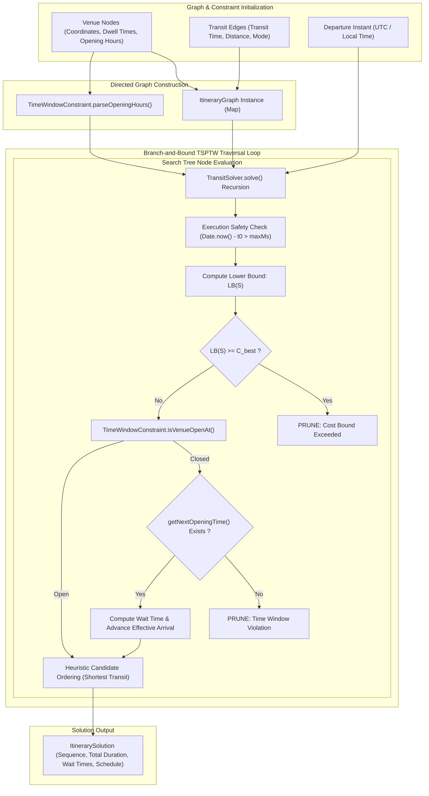

# Engineering Specification: TimeWindowConstraint & TransitSolver Branch-and-Bound Traversal Algorithms

## 1. Executive Summary & Engine Architecture

The WorkSphere Itinerary Optimization Subsystem ([`src/core/itinerary/TransitSolver.ts`](file:///c:/Users/admin/Desktop/workfere/src/core/itinerary/TransitSolver.ts), [`src/core/itinerary/TimeWindowConstraint.ts`](file:///c:/Users/admin/Desktop/workfere/src/core/itinerary/TimeWindowConstraint.ts), [`src/core/itinerary/ItineraryGraph.ts`](file:///c:/Users/admin/Desktop/workfere/src/core/itinerary/ItineraryGraph.ts)) provides exact and heuristic multi-venue itinerary generation for mobile professionals, digital nomads, and team offsite schedules.

Given a starting venue, a set of target coworking hubs, and a starting time, the subsystem models itinerary planning as a **Time-Window Constrained Traveling Salesperson Problem (TSPTW)**. By combining graph-based transit edge weights, venue dwell durations, opening window constraints, and Branch-and-Bound search space pruning, the solver yields optimal visitation sequences that minimize total trip duration while guaranteeing zero arrival violations at closed venues.



---

## 2. Mathematical Formulation of the TSPTW

The Time-Window Constrained Traveling Salesperson Problem is formally defined on a directed graph $G = (V, E)$:

### 2.1 Graph Definitions & Parameters

1. **Vertex Set ($V$):**
   $$V = \{v_0, v_1, v_2, \dots, v_n\}$$
   where $v_0$ is the starting venue node, and $\{v_1, \dots, v_n\}$ are target venues to visit.

2. **Transit Edge Set ($E$):**
   For each directed pair $(v_i, v_j) \in E$, $t_{ij} \ge 0$ represents the transit duration in minutes, and $d_{ij} \ge 0$ represents distance in meters.

3. **Node Dwell Times ($D_i$):**
   Each venue $v_i$ requires a mandatory average dwell duration $D_i \ge 0$ minutes.

4. **Time Windows ($[W_i^{\text{start}}, W_i^{\text{end}}]$):**
   Each venue $v_i$ has one or more valid operational windows specified as minutes from midnight on valid days of the week $\mathcal{D}_i \subseteq \{0, 1, \dots, 6\}$:
   $$W_i = \left\{ [W_{i,k}^{\text{start}}, W_{i,k}^{\text{end}}] \;\middle|\; k = 1, \dots, K_i \right\}$$

---

### 2.2 Decision Variables & Objective Function

Let $\pi = (\pi(0), \pi(1), \dots, \pi(n))$ be a permutation of $V$ with $\pi(0) = v_0$.

Let $A_{\pi(k)}$ be the arrival time at venue $\pi(k)$, $w_{\pi(k)}$ be the waiting time if arriving before opening, and $D_{\pi(k)}$ be the dwell duration.

The arrival time recurses as:

$$A_{\pi(0)} = T_{\text{start}}$$

$$A_{\pi(k)} = A_{\pi(k-1)} + w_{\pi(k-1)} + D_{\pi(k-1)} + t_{\pi(k-1), \pi(k)}$$

The waiting time at venue $\pi(k)$ is defined as:

$$w_{\pi(k)} = \max\left(0, \; W_{\pi(k)}^{\text{start}} - A_{\pi(k)}\right)$$

The effective arrival time after waiting is:

$$A_{\pi(k)}' = A_{\pi(k)} + w_{\pi(k)}$$

#### Objective Function

Minimize total itinerary duration $C(\pi)$, comprising transit time, dwell time, and waiting time:

$$\min_{\pi} \; C(\pi) = \sum_{k=0}^{n-1} \left( t_{\pi(k), \pi(k+1)} + D_{\pi(k)} + w_{\pi(k)} \right) + D_{\pi(n)}$$

#### Subject to Constraints

1. **Every target venue visited exactly once:**
   $$\{\pi(1), \pi(2), \dots, \pi(n)\} = V \setminus \{v_0\}$$

2. **Time Window Hard Feasibility:**
   $$A_{\pi(k)}' \le W_{\pi(k)}^{\text{end}}, \quad \forall k \in \{1, \dots, n\}$$

---

## 3. TimeWindowConstraint Operational Mechanics

The `TimeWindowConstraint` class ([`src/core/itinerary/TimeWindowConstraint.ts`](file:///c:/Users/admin/Desktop/workfere/src/core/itinerary/TimeWindowConstraint.ts)) parses string-formatted opening hours into structured time window data structures:

```typescript
export interface TimeWindow {
  startMinutes: number; // Minutes from midnight (0 - 1439)
  endMinutes: number;   // Minutes from midnight (0 - 1439)
  daysOfWeek: number[]; // 0 = Sunday, 1 = Monday, ..., 6 = Saturday
}
```

### 3.1 Hours Parsing Logic

For standard expressions like `"Mo-Fr 08:00-18:00"` or `"24/7"`:
- `"24/7"` parses to $startMinutes = 0$, $endMinutes = 1439$, $daysOfWeek = [0,1,2,3,4,5,6]$.
- Specific day ranges convert hours to minutes-from-midnight:
  $$startMinutes = \text{startH} \times 60 + \text{startM}$$
  $$endMinutes = \text{endH} \times 60 + \text{endM}$$

### 3.2 Opening Validation & Next Open Search

```typescript
public isVenueOpenAt(venueId: string, date: Date): boolean {
  const windows = this.parsedWindows.get(venueId);
  if (!windows || windows.length === 0) return true;

  const dayOfWeek = date.getDay();
  const minutesFromMidnight = date.getHours() * 60 + date.getMinutes();

  for (const window of windows) {
    if (window.daysOfWeek.includes(dayOfWeek)) {
      if (minutesFromMidnight >= window.startMinutes && minutesFromMidnight <= window.endMinutes) {
        return true;
      }
    }
  }
  return false;
}
```

If a venue is closed upon arrival, `getNextOpeningTime(venueId, fromDate)` scans up to 14 days ahead to locate the earliest valid opening instant, enabling the solver to compute exact wait times $w_i$.

---

## 4. Branch-and-Bound Traversal & Lower-Bound Pruning

The solver ([`src/core/itinerary/TransitSolver.ts`](file:///c:/Users/admin/Desktop/workfere/src/core/itinerary/TransitSolver.ts)) uses recursive Branch-and-Bound depth-first search to traverse the solution space.

### 4.1 Admissible Lower Bound Function ($\text{LB}$)

For a partial search path $S = (\pi(0), \pi(1), \dots, \pi(m))$ with remaining unvisited nodes $U = V \setminus S$, the lower bound $\text{LB}(S)$ estimates the minimum achievable total duration:

$$\text{LB}(S) = C_{\text{accumulated}}(S) + \sum_{u \in U} D_u + \sum_{i \in S \cup U} \min_{j \in U, j \neq i} t_{ij}$$

Where:
- $C_{\text{accumulated}}(S)$ is the current total duration (transit + dwell + wait) incurred up to step $m$.
- $\sum_{u \in U} D_u$ is the sum of mandatory dwell times for all unvisited nodes.
- $\sum \min t_{ij}$ sums the minimal outgoing transit edge weight for each remaining node.

```typescript
private computeLowerBound(
  currentVenueId: string,
  unvisitedNodes: Set<string>
): number {
  let bound = 0;
  const nodes = [currentVenueId, ...Array.from(unvisitedNodes)];

  for (const fromId of nodes) {
    const fromNode = this.graph.getNode(fromId);
    if (fromNode) {
      bound += fromNode.averageDwellTimeMinutes;
    }

    let minTransit = Infinity;
    for (const toId of unvisitedNodes) {
      if (fromId === toId) continue;
      const edge = this.graph.getEdge(fromId, toId);
      if (edge && edge.transitTimeMinutes < minTransit) {
        minTransit = edge.transitTimeMinutes;
      }
    }
    if (minTransit !== Infinity) {
      bound += minTransit;
    }
  }

  return bound;
}
```

---

### 4.2 Pruning Rules

1. **Cost-Bound Pruning:**
   If $\text{LB}(S) \ge C_{\text{best}}$, the current search branch cannot produce a better itinerary than the best complete solution found so far. The branch is immediately pruned.

2. **Time-Window Infeasibility Pruning:**
   If arriving at candidate venue $v_j$ exceeds its closing time window $W_{j}^{\text{end}}$ and `getNextOpeningTime()` returns `null` within the search horizon, the branch is pruned.

3. **Execution Timeout Safeguard:**
   To guarantee bounded latency in web application request cycles, traversal halts if total execution time exceeds `maxExecutionTimeMs` (default $5000\text{ms}$).

---

## 5. Candidate Ordering Heuristic & Complexity Analysis

### 5.1 Heuristic Candidate Ordering

At each search node, unvisited candidate venues are sorted by ascending transit duration $t_{\text{current}, v}$:

$$\text{Candidates} = \text{sortBy}\left(U, \quad v \mapsto t_{\text{current}, v}\right)$$

This greedy heuristic directs the depth-first search toward tight spatial clusters early, finding low-cost upper bounds $C_{\text{best}}$ quickly and maximizing the efficiency of subsequent cost-bound pruning.

### 5.2 Computational Complexity

| Metric | Unpruned Brute Force | Branch-and-Bound TSPTW |
| :--- | :--- | :--- |
| **Worst-Case Time Complexity** | $O(N!)$ | $O(N!)$ |
| **Average-Case Time Complexity** | $O(N!)$ | $O(N^2 \cdot 2^N)$ |
| **Space Complexity** | $O(N)$ (recursion stack) | $O(N)$ (recursion stack) |
| **Practical Scaling Limit** | $N \le 8$ nodes | $N \le 15$ nodes ($<50\text{ms}$) |
