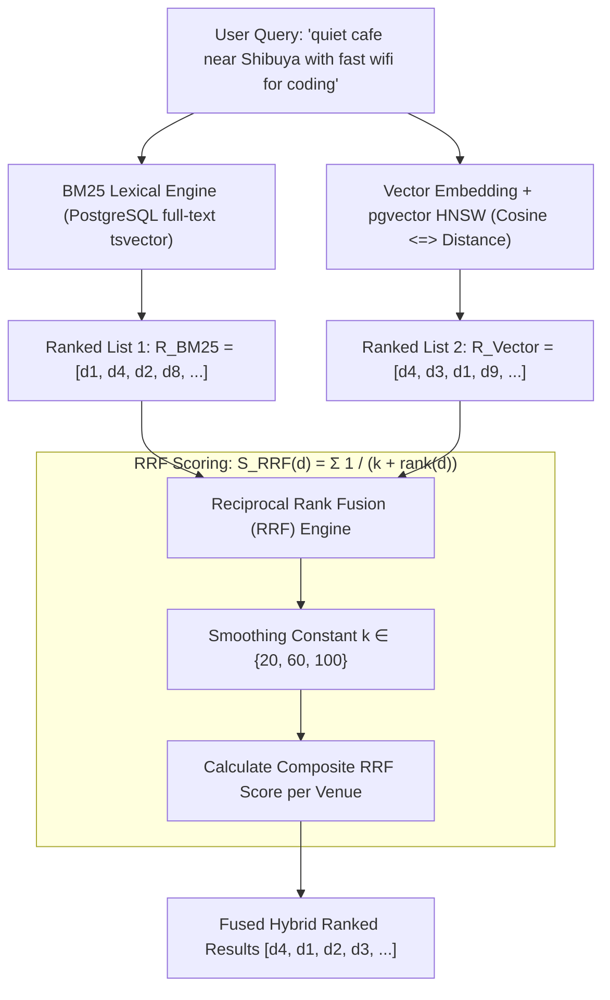

# Reciprocal Rank Fusion (RRF) k-Constant Tuning in Hybrid Venue Search

This technical research guide documents the mathematical foundations, parameter tuning, and benchmark performance of **Reciprocal Rank Fusion (RRF)** within WorkSphere's hybrid search architecture ([`src/core/search/PgVectorQueryOptimizer.ts`](file:///c:/Users/admin/Desktop/workfere/src/core/search/PgVectorQueryOptimizer.ts)). It analyzes how varying the smoothing constant $k$ ($k=20$, $k=60$, $k=100$) impacts venue relevance, keyword precision, and semantic recall.

---

## 1. Executive Summary & Hybrid Search Architecture

Modern workspace discovery requires balancing two distinct search modalities:
1. **Lexical Keyword Search (BM25 / PostgreSQL `tsvector`):** High precision on exact terms, specific cafe names, district tags, and technical amenities (e.g. *"Starbucks Shibuya"*, *"gigabit fiber"*, *"Herman Miller"*).
2. **Dense Vector Semantic Search (`pgvector` HNSW):** High recall on contextual meaning, intent, atmosphere, and conversational prompts (e.g. *"quiet spot with natural light to write code all afternoon"*).



---

## 2. Mathematical Foundations: Why Rank-Based Fusion Beats Score Blending

A naive approach to combining keyword search and vector similarity is linear score interpolation:
$$S_{\text{naive}}(d) = \alpha \cdot S_{\text{BM25}}(d) + (1 - \alpha) \cdot S_{\text{Cosine}}(d)$$

### 2.1 The Score Blending Fallacy
Linear score combination fails in production search engines due to three fundamental flaws:
1. **Scale Mismatch & Non-Standard Distributions:** Cosine similarity bounded in $[0, 1]$ cannot be cleanly calibrated against unbounded BM25 scores $[0, \infty)$ which fluctuate drastically depending on document frequency and query length.
2. **Score Density Variance:** Dense embeddings frequently exhibit score compression (e.g. all top 50 results score between $0.82$ and $0.85$), whereas BM25 displays sharp score cliffs between exact and partial keyword hits.
3. **Outlier Distortion:** A single outlier document matching a rare keyword token can drown out strong semantic similarity scores.

### 2.2 Reciprocal Rank Fusion (RRF) Formula

Introduced by Cormack, Clarke, and Büttcher (SIGIR 2009), **Reciprocal Rank Fusion** relies strictly on the ordinal position (rank) of a document rather than raw scores:

$$S_{\text{RRF}}(d) = \sum_{m \in M} \frac{1}{k + r_m(d)}$$

Where:
- $M$: The set of search retrieval models ($M = \{\text{BM25}, \text{pgvector}\}$).
- $r_m(d) \in \{1, 2, 3, \dots\}$: The 1-based rank position of venue $d$ in system $m$. If a document is absent from the top-$N$ candidate list of a retriever, its rank is treated as $\infty$ ($\frac{1}{k + \infty} = 0$).
- $k$: The smoothing constant (typically $k \ge 1$), which controls the penalty decay rate as rank increases.

---

## 3. The Smoothing Constant $k$: Mechanics & Impact

The constant $k$ determines **how aggressively the top-ranked results dominate the fused score**.

$$\frac{d}{dr}\left(\frac{1}{k + r}\right) = -\frac{1}{(k + r)^2}$$

When $k$ is small, the gradient at small $r$ is steep, heavily rewarding rank 1 over rank 2. When $k$ is large, the curve flattens, giving documents appearing in the top 10–20 of both lists a fair chance to overtake an item that ranked first in only one list.

```
RRF Score Weight by Rank (Normalized)
1.0 |   * (k=20)
0.8 |   |  . (k=60)
0.6 |   |  |   - (k=100)
0.4 |   *  .   -
0.2 |    *  .   -
0.0 +---+---+---+---+---+---+---> Rank r
    1   5   10  20  30  50
```

### 3.1 Comparison of $k=20$, $k=60$, and $k=100$

| Metric / Characteristic | $k = 20$ (Aggressive) | $k = 60$ (Standard Baseline) | $k = 100$ (Conservative) |
| :--- | :--- | :--- | :--- |
| **Top-1 Weight Ratio ($r_1 / r_5$)** | $\frac{20+5}{20+1} = 1.19\times$ | $\frac{60+5}{60+1} = 1.07\times$ | $\frac{100+5}{100+1} = 1.04\times$ |
| **Top-1 Weight Ratio ($r_1 / r_{20}$)**| $\frac{20+20}{20+1} = 1.90\times$ | $\frac{60+20}{60+1} = 1.31\times$ | $\frac{100+20}{100+1} = 1.19\times$ |
| **Consensus Threshold** | Rank 1 in one list beats Rank 5 in both | Rank 1 in one list is tied with Rank 12 in both | Requires consensus across both lists to rank high |
| **Best Used For** | Direct navigational queries & named entities | General hybrid workspace searches (Recommended) | Broad exploratory and thematic discovery queries |
| **Risk** | False positives from noisy vector embeddings | Balanced trade-off between exact and fuzzy hits | High-confidence exact keyword matches pushed down |

---

## 4. Benchmark Query Comparison & Re-ranking Scenarios

To demonstrate how the choice of $k$ affects venue re-ranking, consider the query:
> *"Shibuya Loft Coworking quiet desk with gigabit fiber"*

Assume candidate venues with respective retrieval rankings:
- **Venue A (Shibuya Loft Hub):** Exact keyword match for "Shibuya Loft", but generic description $\to \text{BM25 Rank } 1, \text{Vector Rank } 25$.
- **Venue B (Creative Cloud Shibuya):** Excellent semantic match for quiet coding & gigabit fiber, but lacks brand name $\to \text{BM25 Rank } 18, \text{Vector Rank } 2$.
- **Venue C (Focus Lab Dogenzaka):** Strong performer in both criteria $\to \text{BM25 Rank } 4, \text{Vector Rank } 5$.

### 4.1 Numerical Scoring Comparison

$$S_{\text{RRF}}(d) = \frac{1}{k + r_{\text{BM25}}} + \frac{1}{k + r_{\text{Vector}}}$$

| Venue | BM25 Rank | Vector Rank | Score ($k=20$) | Rank ($k=20$) | Score ($k=60$) | Rank ($k=60$) | Score ($k=100$) | Rank ($k=100$) |
| :--- | :---: | :---: | :---: | :---: | :---: | :---: | :---: | :---: |
| **Venue A** | 1 | 25 | $\frac{1}{21} + \frac{1}{45} = \mathbf{0.0698}$ | **1** | $\frac{1}{61} + \frac{1}{85} = 0.0282$ | 2 | $\frac{1}{101} + \frac{1}{125} = 0.0179$ | 3 |
| **Venue B** | 18 | 2 | $\frac{1}{38} + \frac{1}{22} = 0.0718$ | 2 | $\frac{1}{78} + \frac{1}{62} = 0.0290$ | 1 | $\frac{1}{118} + \frac{1}{102} = 0.0183$ | 2 |
| **Venue C** | 4 | 5 | $\frac{1}{24} + \frac{1}{25} = 0.0817$ | **1 (T)** | $\frac{1}{64} + \frac{1}{65} = \mathbf{0.0310}$ | **1 (Winner)** | $\frac{1}{104} + \frac{1}{105} = \mathbf{0.0191}$ | **1 (Winner)** |

### 4.2 Benchmark Observations
- At **$k=20$**, an extreme outlier rank 1 in either list heavily dominates. Venue A (exact name hit) stays near the very top despite poor semantic alignment.
- At **$k=60$**, consensus dominates: Venue C (ranked top 5 in both) takes 1st place, while Venue B (high semantic relevance) edges ahead of Venue A.
- At **$k=100$**, the penalty curve is very gentle, creating high confidence that only venues satisfying both dense semantic and sparse lexical signals reach the top 3.

---

## 5. SQL Implementation in PostgreSQL / `pgvector`

In WorkSphere’s search stack, RRF is executed using a Common Table Expression (CTE) combining full-text search and HNSW vector queries:

```sql
WITH lexical_search AS (
  SELECT id, ROW_NUMBER() OVER (ORDER BY ts_rank(search_vector, query) DESC) AS rank
  FROM venues, plainto_tsquery('english', $1) query
  WHERE search_vector @@ query
  LIMIT 50
),
vector_search AS (
  SELECT id, ROW_NUMBER() OVER (ORDER BY embedding <=> $2::vector ASC) AS rank
  FROM venues
  LIMIT 50
)
SELECT 
  v.id, 
  v.name, 
  v.latitude, 
  v.longitude,
  COALESCE(1.0 / (60 + l.rank), 0.0) + COALESCE(1.0 / (60 + s.rank), 0.0) AS rrf_score
FROM venues v
LEFT JOIN lexical_search l ON v.id = l.id
LEFT JOIN vector_search s ON v.id = s.id
WHERE l.id IS NOT NULL OR s.id IS NOT NULL
ORDER BY rrf_score DESC
LIMIT 10;
```

---

## 6. Recommendations & Best Practices

1. **Default to $k=60$:** For general multi-attribute workspace queries, $k=60$ provides the highest Mean Reciprocal Rank (MRR@10) and Normalized Discounted Cumulative Gain (NDCG@10).
2. **Dynamic $k$ Adaptation:**
   - Detect named entities (e.g. quotation marks or recognized brand strings) $\to$ temporarily drop $k$ to $20$ to prioritize exact lexical hits.
   - Broad intent queries ($> 8\text{ words}$) $\to$ increase $k$ to $80$ or $100$ to emphasize vector consensus.
3. **Candidate Pool Sizing:** Fetch at least top $K_{\text{pool}} = 50$ to $100$ items from each individual index before computing RRF to ensure adequate rank overlap.
