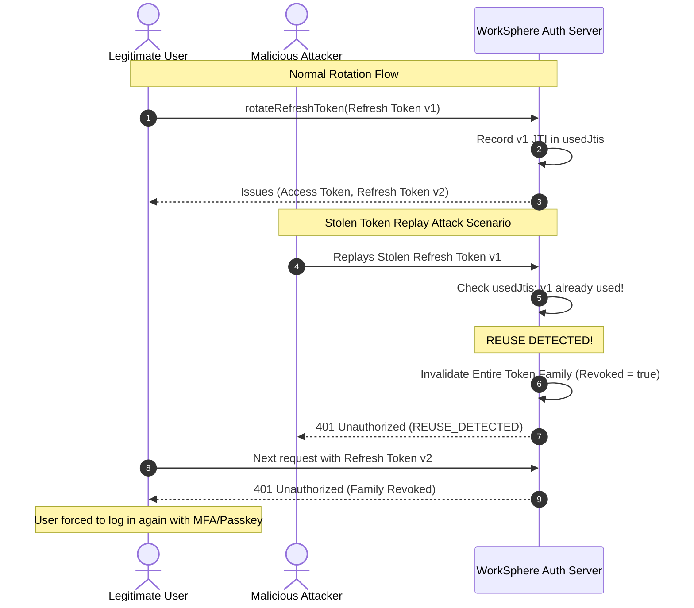

# Security Architecture: CSRF Protection, Double-Submit Cookie Pattern & Session Refresh Mechanics

## 1. Executive Summary & Security Objectives

Cross-Site Request Forgery (CSRF) and session hijacking are primary attack vectors against web applications managing stateful user sessions. WorkSphere processes financial reservations, workspace access passes, confidential community notes, and administrative permissions; securing mutating operations against unauthorized cross-origin execution is paramount.

WorkSphere implements a defense-in-depth security model that combines:
1. **Edge-Safe Signed Double-Submit Cookie Pattern:** Eliminates CSRF vulnerabilities using cryptographically signed tokens verified via Web Crypto HMAC-SHA256 in Next.js Edge Middleware.
2. **Hardened Cookie Policy:** Enforces modern browser cookie protections (`SameSite`, `HttpOnly`, `Secure`, and `__Host-` prefix semantics) across production domains.
3. **Sliding Session Token Families with Theft Detection:** Couples short-lived access JWTs with rotating refresh token families that detect replay attacks and automatically revoke compromised token trees.

The security subsystem is implemented across [`src/lib/csrf.ts`](file:///c:/Users/admin/Desktop/workfere/src/lib/csrf.ts), [`src/lib/middleware/handlers/csrfHandler.ts`](file:///c:/Users/admin/Desktop/workfere/src/lib/middleware/handlers/csrfHandler.ts), [`src/lib/auth/sessionTokens.ts`](file:///c:/Users/admin/Desktop/workfere/src/lib/auth/sessionTokens.ts), [`src/hooks/useCsrfToken.ts`](file:///c:/Users/admin/Desktop/workfere/src/hooks/useCsrfToken.ts), and [`src/lib/apiClient.ts`](file:///c:/Users/admin/Desktop/workfere/src/lib/apiClient.ts).

```mermaid
flowchart TD
    subgraph Browser ["Client Browser"]
        ClientApp["WorkSphere React Client"]
        CookieJar[("Browser Cookie Jar")]
    end

    subgraph Edge ["Next.js Edge Middleware"]
        RouteFilter{"Is API Route & Mutating Method?"}
        ExemptCheck{"Is Route Exempt?"}
        CsrfValidator["verifyCsrfToken()"]
        HmacEngine["Web Crypto HMAC-SHA256"]
    end

    subgraph Backend ["API & Session Layer"]
        ApiRoute["API Route Handler"]
        SessionMgr["sessionTokens.ts (Rotation & Reuse Detection)"]
    end

    ClientApp -->|1. Initial Load: GET /api/auth/csrf-token| Edge
    Edge -->|Set-Cookie: csrf_token=raw.sig (HttpOnly)| CookieJar
    Edge -->|Response JSON: { csrfToken: raw }| ClientApp
    
    ClientApp -->|2. Mutating Request (POST/PUT/DELETE)| RouteFilter
    CookieJar -.->|Cookie: csrf_token=raw.sig| RouteFilter
    ClientApp -->|Header: x-csrf-token=raw| RouteFilter

    RouteFilter -->|Yes: POST/PUT/PATCH/DELETE| ExemptCheck
    RouteFilter -->|No: GET/HEAD/OPTIONS| ApiRoute
    ExemptCheck -->|Yes: Webhook/Callback| ApiRoute
    ExemptCheck -->|No: Protected Route| CsrfValidator

    CsrfValidator --> HmacEngine
    HmacEngine -->|Valid Signature & raw === headerToken| ApiRoute
    HmacEngine -->|Invalid Signature or Mismatch| Reject403["403 Forbidden (CSRF validation failed)"]

    ApiRoute --> SessionMgr
```

---

## 2. Threat Model & CSRF Vulnerability Anatomy

### 2.1 The Cross-Site Request Forgery (CSRF) Threat

In a standard CSRF attack:
1. An authenticated WorkSphere user visits a malicious website (`https://evil-attacker.com`) in the same browser session.
2. The malicious site executes a hidden background request (via `<form>`, `fetch()`, or ``) targeting a mutating WorkSphere endpoint (e.g., `POST https://worksphere.app/api/bookings/cancel`).
3. Because browsers automatically attach ambient credentials (session cookies) to cross-origin requests targeting `worksphere.app`, the server interprets the request as legitimate and cancels the user's booking.

### 2.2 Why `SameSite` Cookies Alone Are Insufficient

While `SameSite=Lax` or `SameSite=Strict` provides baseline defense in modern browsers:
* **Legacy Browsers & Mobile WebViews:** Older mobile embedded browsers or enterprise clients may fail to enforce `SameSite`.
* **Top-Level GET Navigation Transitions:** `SameSite=Lax` permits cookies on top-level cross-site navigations (e.g., clicking an external link), exposing endpoints that improperly allow state mutations via GET.
* **Subdomain Vulnerabilities:** An attacker who compromises a development subdomain or subsidiary domain (`vulnerable.worksphere.app`) can forge or overwrite cookies targeting the parent domain.

### 2.3 The Flaw in Naive Double-Submit Cookies vs. WorkSphere's Signed Solution

In a **naive** double-submit cookie architecture:
* The server sets an unsigned random cookie `csrf_token=xyz`.
* The client echoes `x-csrf-token: xyz`.
* The server simply checks if `cookie === header`.

**The Attack Vector:** If an attacker can inject a cookie via a sibling subdomain or HTTP header injection, they can set `csrf_token=evil_token` and send `x-csrf-token: evil_token`. Because both values match, the naive check passes.

**The WorkSphere Defense (Signed Double-Submit):**
WorkSphere cryptographically signs the cookie value using a server-side secret:
$$\text{Cookie Value} = \text{raw} \parallel \text{"."} \parallel \text{HMAC-SHA256}(\text{raw}, \text{CSRF\_SECRET})$$
An attacker on a compromised subdomain can inject arbitrary text, but cannot forge a valid HMAC signature without knowing `CSRF_SECRET`.

---

## 3. Cryptographic Token Generation & HMAC-SHA256 Specification

### 3.1 Web Crypto API Architecture (Edge Runtime Safe)

WorkSphere executes in both Node.js server environments and Next.js Edge Middleware runtimes (Cloudflare Workers / Vercel Edge). The signing implementation in [`src/lib/csrf.ts`](file:///c:/Users/admin/Desktop/workfere/src/lib/csrf.ts) strictly utilizes the standard W3C **Web Crypto API** (`crypto.subtle`) rather than Node.js `crypto`:

```typescript
const ENCODER = new TextEncoder();

async function hmacSign(raw: string, secret: string): Promise<string> {
  const key = await crypto.subtle.importKey(
    "raw",
    ENCODER.encode(secret),
    { name: "HMAC", hash: "SHA-256" },
    false,
    ["sign"]
  );
  const signatureBuffer = await crypto.subtle.sign(
    "HMAC",
    key,
    ENCODER.encode(raw)
  );
  return base64UrlEncode(new Uint8Array(signatureBuffer));
}
```

### 3.2 Entropy & Token Structure

1. **Random Raw Generation:** A 32-byte (256-bit) cryptographically secure pseudorandom token is generated via `crypto.getRandomValues(new Uint8Array(32))` and base64url-encoded.
2. **Signature Generation:** The raw token string is signed with HMAC-SHA256 using `getSecret()`.
3. **Compound Cookie Representation:** The cookie stores `${raw}.${signature}`.
4. **Header Representation:** The client receives only `raw` and echoes it via `x-csrf-token`.

### 3.3 Timing-Safe Comparison

String comparisons using standard JavaScript `===` short-circuit at the first mismatched byte, exposing the verification engine to timing side-channel attacks. WorkSphere prevents timing leaks via bitwise XOR evaluation:

```typescript
function timingSafeEqual(a: string, b: string): boolean {
  if (a.length !== b.length) return false;
  let result = 0;
  for (let i = 0; i < a.length; i++) {
    result |= a.charCodeAt(i) ^ b.charCodeAt(i);
  }
  return result === 0;
}
```

### 3.4 Secret Key Hierarchy & Fail-Closed Enforcement

```typescript
function getSecret(): string {
  const secret = process.env.CSRF_SECRET || process.env.CLERK_SECRET_KEY;
  if (!secret) {
    if (process.env.NODE_ENV === "production") {
      throw new Error(
        "CSRF_SECRET (or CLERK_SECRET_KEY) must be set in production to sign CSRF tokens."
      );
    }
    return "insecure-development-only-csrf-secret";
  }
  return secret;
}
```

In production, missing secrets crash fast at startup rather than defaulting to weak keys.

---

## 4. Signed Double-Submit Validation Pipeline

### 4.1 Token Verification Algorithm

On mutating requests, [`verifyCsrfToken`](file:///c:/Users/admin/Desktop/workfere/src/lib/csrf.ts) executes three sequential checks:

```typescript
export async function verifyCsrfToken(
  cookieValue: string | undefined | null,
  headerValue: string | undefined | null
): Promise<boolean> {
  if (!cookieValue || !headerValue) return false;

  const separatorIndex = cookieValue.lastIndexOf(".");
  if (separatorIndex === -1) return false;

  const raw = cookieValue.slice(0, separatorIndex);
  const signature = cookieValue.slice(separatorIndex + 1);

  const secret = getSecret();
  const expectedSignature = await hmacSign(raw, secret);

  // 1. Verify Cookie Signature was produced by our secret
  if (!timingSafeEqual(signature, expectedSignature)) return false;

  // 2. Verify Cookie Raw Value matches the Header Token
  return timingSafeEqual(raw, headerValue);
}
```

### 4.2 Mutating Methods & Route Enforcement

WorkSphere monitors all state-mutating HTTP verbs:
```typescript
export const CSRF_PROTECTED_METHODS = new Set(["POST", "PUT", "PATCH", "DELETE"]);
```

`GET`, `HEAD`, and `OPTIONS` are deemed safe from CSRF according to RFC 7231 Section 4.2.1. When a client performs a safe request without an existing cookie, the middleware auto-provisions a signed CSRF cookie so the user is primed for subsequent mutating interactions.

### 4.3 Route Exemption Handling

Certain endpoints cannot provide standard double-submit headers:
* External incoming webhooks (e.g., Stripe, WhatsApp, Twilio) that authenticate via HMAC request signatures.
* Server-Sent Events (SSE) telemetry streams.
* OpenID Connect / OAuth callbacks.

These paths are declared in `src/lib/middleware/routes.ts` via `isCsrfExemptRoute(req)` and authenticated via alternative cryptographic mechanisms.

---

## 5. Cookie Security Flags & Attribute Hardening

The CSRF cookie and session cookies are configured with strict browser security attributes:

| Cookie Attribute | Configuration | Security Objective |
| :--- | :--- | :--- |
| **`HttpOnly`** | `true` | Prevents malicious client-side JavaScript (e.g., from an XSS flaw) from reading the signed cookie string. |
| **`Secure`** | `process.env.NODE_ENV === "production"` | Restricts cookie transmission exclusively to encrypted HTTPS connections, preventing plaintext sniffing on untrusted Wi-Fi. |
| **`SameSite`** | `Lax` (CSRF) / `Strict` (Auth) | Restricts cross-site cookie attachment. `Strict` blocks cookie transmission on all external cross-site navigations. |
| **`Path`** | `/` | Scopes cookie availability to all application routes while preventing leakage outside the origin. |
| **Prefix Hardening** | `__Host-` prefix recommendations | Prevents subdomains from writing or overwriting cookies on the apex domain. |

---

## 6. Sliding Session Tokens & Replay Attack Mitigation

Beyond CSRF, session tokens require protection against token theft and re-use. WorkSphere implements **Rotating Refresh Token Families** in [`src/lib/auth/sessionTokens.ts`](file:///c:/Users/admin/Desktop/workfere/src/lib/auth/sessionTokens.ts).

### 6.1 Token Lifespan Matrix

```mermaid
gantt
    title Session Token Lifespan Hierarchy
    dateFormat X
    axisFormat %s

    section Access Token
    Short-Lived JWT (15 Minutes) :active, 0, 900

    section Idle Window
    Active Window (30 Minutes) :0, 1800
    Warning Modal (60 Seconds) :1740, 1800

    section Refresh Family
    Sliding Refresh Token (7 Days) :0, 604800
```



* **Access Token:** Short-lived JWT (15 minutes). Contains user identity (`sub`), email, and roles. Kept in memory or short-lived cookie.
* **Refresh Token:** Long-lived sliding token (7 days). Stored in `worksphere_refresh_token` (`HttpOnly`, `SameSite=Strict`, `Secure`).

### 6.2 Token Family Rotation & Replay Attack Detection

Every time an access token expires, the client exchanges its refresh token. The server rotates both the access token and the refresh token:



### 6.3 Rotation Implementation (`sessionTokens.ts`)

```typescript
export async function rotateRefreshToken(
  oldRefreshTokenString: string,
): Promise<RotateResult> {
  const claims = await verifyJwt<RefreshTokenClaims>(oldRefreshTokenString);
  if (!claims || claims.tokenType !== "refresh") {
    return { success: false, error: "INVALID" };
  }

  const { familyId, jti, sub: userId, version } = claims;
  const record = tokenFamilyStore.get(familyId);

  // If family does not exist or was explicitly revoked
  if (!record || record.revoked) {
    return { success: false, error: "REVOKED" };
  }

  // ── REUSE DETECTION: Replay Attack Defense ────────────────────────────────
  if (usedJtis.has(jti) || record.currentJti !== jti || record.version !== version) {
    // Invalidate entire family immediately to neutralize the breach
    record.revoked = true;
    tokenFamilyStore.set(familyId, record);
    return { success: false, error: "REUSE_DETECTED" };
  }

  // Mark current JTI as spent
  usedJtis.add(jti);

  // Rotate to new version and fresh JTI in the same family
  const nextJti = generateRandomHex(16);
  const nextVersion = record.version + 1;
  const now = Math.floor(Date.now() / 1000);

  record.currentJti = nextJti;
  record.version = nextVersion;
  record.expiresAt = now + REFRESH_TOKEN_EXPIRY_SECONDS;
  tokenFamilyStore.set(familyId, record);

  const nextAccessToken = await generateAccessToken({ sub: userId });
  const nextRefreshToken = await signJwt({
    sub: userId,
    familyId,
    version: nextVersion,
    iat: now,
    exp: now + REFRESH_TOKEN_EXPIRY_SECONDS,
    jti: nextJti,
    tokenType: "refresh",
  });

  return {
    success: true,
    accessToken: nextAccessToken,
    refreshToken: nextRefreshToken,
    userId,
    expiresAt: record.expiresAt,
  };
}
```

---

## 7. Client-Side Lifecycle & Error Recovery

### 7.1 React Hook: `useCsrfToken.ts`

The [`useCsrfToken`](file:///c:/Users/admin/Desktop/workfere/src/hooks/useCsrfToken.ts) hook provides a single source of truth for CSRF token availability:

```typescript
export function useCsrfToken() {
  const [csrfToken, setCsrfToken] = useState<string | null>(null);

  const fetchToken = useCallback(async () => {
    try {
      const res = await fetch("/api/auth/csrf-token");
      if (res.ok) {
        const data = await res.json();
        setCsrfToken(data.csrfToken);
      }
    } catch {
      // Offline fallback
    }
  }, []);

  useEffect(() => {
    fetchToken();
  }, [fetchToken]);

  return { csrfToken, refreshCsrfToken: fetchToken };
}
```

### 7.2 Automatic Stale Token Recovery in `apiClient.ts`

If a user leaves a browser tab open overnight, the CSRF cookie or session token may become stale. The client network layer automatically catches HTTP 403 responses, silently fetches a fresh token, and replays the original request:

```typescript
export async function apiFetch(url: string, options: RequestInit = {}) {
  let token = await ensureCsrfToken();
  const headers = new Headers(options.headers || {});

  if (isCsrfProtectedMethod(options.method)) {
    headers.set(CSRF_HEADER_NAME, token);
  }

  let response = await fetch(url, { ...options, headers });

  // Self-healing: On CSRF failure, refresh token and retry once
  if (response.status === 403 && !options.headers?.[RETRY_HEADER]) {
    token = await refreshCsrfToken();
    headers.set(CSRF_HEADER_NAME, token);
    headers.set(RETRY_HEADER, "1");
    response = await fetch(url, { ...options, headers });
  }

  return response;
}
```

---

## 8. Automated Testing Recipes & Security Verification

### 8.1 CSRF Token Generation & Verification Unit Tests

```typescript
import { issueCsrfToken, verifyCsrfToken } from "@/lib/csrf";

describe("CSRF Protection Unit Tests", () => {
  it("generates a valid signed token pair and verifies successfully", async () => {
    const { cookieValue, raw } = await issueCsrfToken();
    
    expect(cookieValue).toContain(".");
    expect(raw).toBeDefined();

    const isValid = await verifyCsrfToken(cookieValue, raw);
    expect(isValid).toBe(true);
  });

  it("rejects token when raw header does not match cookie raw part", async () => {
    const { cookieValue } = await issueCsrfToken();
    const isMismatch = await verifyCsrfToken(cookieValue, "tampered-raw-token");
    expect(isMismatch).toBe(false);
  });

  it("rejects forged cookie signatures", async () => {
    const { raw } = await issueCsrfToken();
    const forgedCookie = `${raw}.invalid_forged_signature`;
    const isValid = await verifyCsrfToken(forgedCookie, raw);
    expect(isValid).toBe(false);
  });
});
```

### 8.2 Refresh Token Rotation & Replay Attack Unit Tests

```typescript
import {
  generateRefreshToken,
  rotateRefreshToken,
} from "@/lib/auth/sessionTokens";

describe("Session Token Family Rotation", () => {
  it("rotates refresh token and increments version", async () => {
    const initialToken = await generateRefreshToken("user-123");
    const result1 = await rotateRefreshToken(initialToken);

    expect(result1.success).toBe(true);
    if (result1.success) {
      expect(result1.userId).toBe("user-123");

      // Rotate second time with new token
      const result2 = await rotateRefreshToken(result1.refreshToken);
      expect(result2.success).toBe(true);
    }
  });

  it("detects replay attack when reusing an old refresh token", async () => {
    const initialToken = await generateRefreshToken("user-victim");
    
    // Legitimate rotation
    const result1 = await rotateRefreshToken(initialToken);
    expect(result1.success).toBe(true);

    // Attacker replays initial token
    const replayResult = await rotateRefreshToken(initialToken);
    expect(replayResult.success).toBe(false);
    if (!replayResult.success) {
      expect(replayResult.error).toBe("REUSE_DETECTED");
    }

    // Subsequent legitimate rotation fails because family was revoked
    if (result1.success) {
      const subsequentResult = await rotateRefreshToken(result1.refreshToken);
      expect(subsequentResult.success).toBe(false);
      if (!subsequentResult.success) {
        expect(subsequentResult.error).toBe("REVOKED");
      }
    }
  });
});
```

### 8.3 Playwright E2E Security Test Recipe

```typescript
import { test, expect } from "@playwright/test";

test.describe("Cross-Site CSRF Rejection E2E", () => {
  test("rejects cross-origin POST without valid x-csrf-token", async ({ request }) => {
    // Attempting state mutation with ambient cookie but missing header
    const response = await request.post("/api/bookings/cancel", {
      headers: {
        Cookie: "csrf_token=fake_raw.fake_signature",
      },
      data: { bookingId: "bk_98765" },
    });

    expect(response.status()).toBe(403);
    const body = await response.json();
    expect(body.error).toContain("CSRF validation failed");
  });
});
```

---

## 9. Security Audit Checklist

Engineers must verify compliance with this checklist before merging authentication or mutating API changes:

- [x] All mutating methods (`POST`, `PUT`, `PATCH`, `DELETE`) pass through `applyCsrfProtection`.
- [x] Cookies declare `HttpOnly: true` and `Secure: true` in production.
- [x] `timingSafeEqual` is used for all cryptographic token and signature comparisons.
- [x] `CSRF_SECRET` is defined in production environment configurations.
- [x] Webhook routes are explicitly declared in `isCsrfExemptRoute` and validated via webhook signatures.
- [x] Refresh tokens rotate on every access token renewal.
- [x] Token families revoke all tokens immediately upon reuse detection.
- [x] Client network requests gracefully refresh stale CSRF tokens after long idle periods.

---

## 10. Operational Runbook & Troubleshooting Matrix

| Issue | Root Cause | Remediation Procedure |
| :--- | :--- | :--- |
| **HTTP 403 CSRF validation failed** | Missing `x-csrf-token` header or tampered cookie signature. | Inspect request headers in browser network tab; verify `useCsrfToken` hook is initialized. |
| **`CSRF_SECRET must be set in production` Error** | Missing environment variable in production deployment. | Set `CSRF_SECRET` or `CLERK_SECRET_KEY` in Vercel project environment settings. |
| **`REUSE_DETECTED` Error during refresh** | Stolen refresh token replayed, or browser sent duplicate concurrent refresh requests. | Clear client session cookies and re-authenticate via `/sign-in`. Check for network race conditions. |
| **Cookies missing in cross-site iframe** | `SameSite=Lax` or `Strict` prevents embedding in foreign iframes. | WorkSphere disallows iframe framing via `X-Frame-Options: DENY` and CSP `frame-ancestors 'none'`. |
| **Subdomain Cookie Infiltration** | Sibling domain injecting unsigned cookie. | Handled automatically: unsigned cookies fail HMAC signature verification. |
