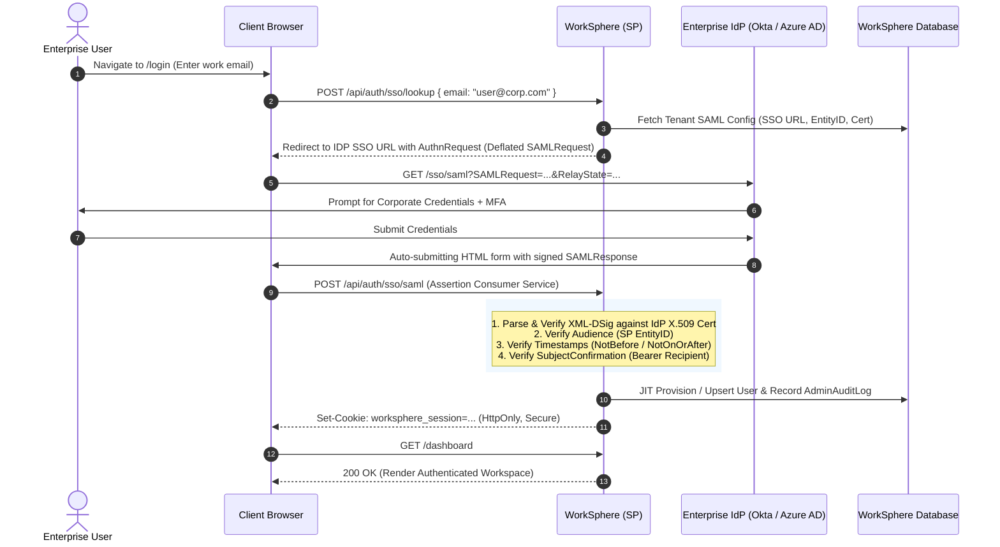
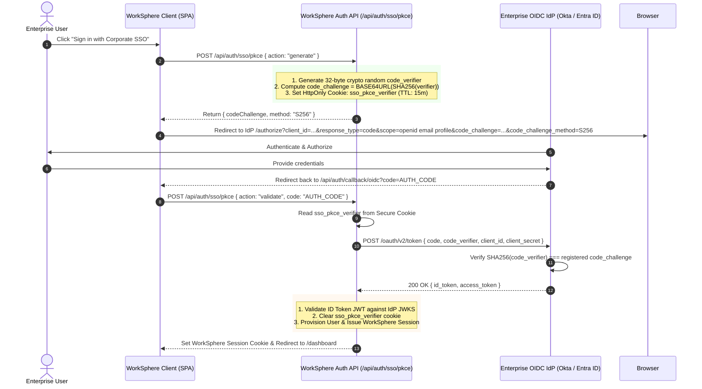

# Enterprise Single Sign-On (SSO): SAML 2.0 & OIDC Federation Architecture

This document provides a comprehensive security and implementation manual for **Enterprise Single Sign-On (SSO)** in WorkSphere. It details the federated authentication workflows across **SAML 2.0** (Security Assertion Markup Language) and **OIDC** (OpenID Connect with OAuth 2.0 PKCE), including cryptographic assertion verification, metadata resolution, Just-In-Time (JIT) provisioning, multi-tenant routing, and security threat mitigations.

---

## 1. Architectural Overview & Federation Strategy

WorkSphere delivers enterprise-grade identity federation enabling corporate organizations to integrate their existing Identity Providers (IdPs)—such as **Okta**, **Microsoft Entra ID (Azure AD)**, **Google Workspace**, **PingFederate**, and **JumpCloud**—directly into the workspace management platform.

```
┌─────────────────────────────────────────────────────────────────────────────────────────┐
│                               ENTERPRISE FEDERATION OVERVIEW                            │
└─────────────────────────────────────────────────────────────────────────────────────────┘

   Enterprise User Browser
             │
             ├─── (1) Enters user@enterprise.com ────────────────────────┐
             │                                                           ▼
   ┌─────────▼─────────┐                                      ┌──────────────────────┐
   │  WorkSphere Web   │ ◄─── (2) Discovers Tenant & Protocol ┤ Tenant Domain Router │
   │   (React / Next)  │                                      └──────────────────────┘
   └─────────┬─────────┘
             │
   ┌─────────┴───────────────────────────────────────┐
   │                                                 │
   ▼ (SAML 2.0 Route)                                ▼ (OIDC + PKCE Route)
┌───────────────────────────────┐                 ┌───────────────────────────────────┐
│ Redirect / HTTP-POST to IdP   │                 │ Redirect to IdP /authorize with   │
│ with SAML AuthnRequest        │                 │ code_challenge (S256)             │
└──────────────┬────────────────┘                 └─────────────────┬─────────────────┘
               │                                                    │
               ▼                                                    ▼
┌───────────────────────────────┐                 ┌───────────────────────────────────┐
│ Enterprise IdP (Okta / Entra) │                 │ Enterprise IdP (Okta / Entra)     │
│ - Authenticates user + MFA    │                 │ - Authenticates user + MFA        │
│ - Signs SAML XML Assertion    │                 │ - Issues Auth Code                │
└──────────────┬────────────────┘                 └─────────────────┬─────────────────┘
               │                                                    │
               ▼ (POST SAMLResponse)                                ▼ (POST Code + Verifier)
┌───────────────────────────────┐                 ┌───────────────────────────────────┐
│ WorkSphere SAML ACS Endpoint  │                 │ WorkSphere PKCE Token Exchange    │
│  /api/auth/sso/saml           │                 │  /api/auth/sso/pkce               │
│ - Validates XML Signature     │                 │ - Verifies S256 Challenge         │
│ - Validates Audience/Time     │                 │ - Validates ID Token (JWKS)       │
└──────────────┬────────────────┘                 └─────────────────┬─────────────────┘
               │                                                    │
               └───────────────────────┬────────────────────────────┘
                                       │
                                       ▼
                    ┌──────────────────────────────────────┐
                    │ JIT Provisioning & Session Dispatch  │
                    │ - Sync user profile & groups         │
                    │ - Issue HttpOnly Secure Session JWT  │
                    │ - Log Security Audit Trail           │
                    └──────────────────────────────────────┘
```

### 1.1 Federation Protocol Comparison

| Dimension | SAML 2.0 | OpenID Connect (OIDC) + PKCE |
| :--- | :--- | :--- |
| **Data Format** | XML (XML-DSig enveloped/enveloping) | JSON / JWT (JWS signed, JWE optional) |
| **Transport** | HTTP-POST / HTTP-Redirect binding | HTTP REST / JSON over TLS |
| **Trust Model** | X.509 Public Key Certificates in XML metadata | JSON Web Key Sets (JWKS) via `.well-known/openid-configuration` |
| **Initiation Modes** | SP-Initiated & IdP-Initiated | SP-Initiated (Standard) |
| **Client Security** | Digital signature over XML assertion | S256 PKCE Code Challenge (RFC 7636) |
| **Primary Use Case** | Traditional enterprise IdPs (Okta, Entra ID, Ping) | Modern cloud IdPs, mobile apps, SPA clients |

---

## 2. SAML 2.0 Federation Deep-Dive

### 2.1 SAML 2.0 SP-Initiated Authentication Sequence



### 2.2 Dynamic IdP Metadata Resolution with SSRF Protection

WorkSphere dynamically discovers and caches IdP configurations (EntityID, SSO URLs, X.509 signing certificates) from the enterprise customer's metadata endpoint.

To protect internal infrastructure from **Server-Side Request Forgery (SSRF)**, the metadata resolver in `src/lib/auth/sso/metadataResolver.ts` applies strict network perimeter validations:

```typescript
// src/lib/auth/sso/metadataResolver.ts
import { XMLParser } from "fast-xml-parser";
import { isSafeWebhookUrl } from "@/lib/ssrfValidation";

const METADATA_FETCH_TIMEOUT_MS = 5_000;
const MAX_METADATA_BYTES = 512_000; // 500 KB limit

export async function resolveIdpMetadata(metadataUrl: string): Promise<IDPMetadata> {
  // 1. SSRF Defense: Reject loopback, private RFC 1918 IPs, link-local (169.254.x.x), non-HTTP(S)
  const safety = await isSafeWebhookUrl(metadataUrl);
  if (!safety.isSafe) {
    throw new UnsafeMetadataUrlError(safety.reason ?? "Metadata URL is not permitted.");
  }

  // 2. Fetch with manual redirect handling (disallows redirect bouncing to internal endpoints)
  const response = await fetch(metadataUrl, {
    method: "GET",
    redirect: "manual",
    signal: AbortSignal.timeout(METADATA_FETCH_TIMEOUT_MS),
    headers: { Accept: "application/xml, text/xml" },
  });

  if (!response.ok) {
    throw new Error(`Failed to fetch metadata. Status: ${response.status}`);
  }

  // 3. Payload size enforcement (mitigates XML entity expansion and memory exhaustion)
  const xmlData = await response.text();
  if (xmlData.length > MAX_METADATA_BYTES) {
    throw new Error("Metadata response exceeds maximum allowed size (500KB)");
  }

  // 4. Safe XML Parsing without entity expansion
  const parser = new XMLParser({
    ignoreAttributes: false,
    attributeNamePrefix: "@_",
    removeNSPrefix: true,
  });

  const parsed = parser.parse(xmlData);
  const entityDescriptor = parsed.EntityDescriptor;
  if (!entityDescriptor) {
    throw new Error("Invalid SAML Metadata: Missing EntityDescriptor");
  }

  const entityId = entityDescriptor["@_entityID"];
  const idpSsoDescriptor = entityDescriptor.IDPSSODescriptor;

  // Extract SingleSignOnService (Preference: HTTP-Redirect binding)
  const ssoServices = Array.isArray(idpSsoDescriptor.SingleSignOnService)
    ? idpSsoDescriptor.SingleSignOnService
    : [idpSsoDescriptor.SingleSignOnService];

  let ssoUrl = "";
  for (const service of ssoServices) {
    if (service?.["@_Binding"] === "urn:oasis:names:tc:SAML:2.0:bindings:HTTP-Redirect") {
      ssoUrl = service["@_Location"];
      break;
    }
  }
  if (!ssoUrl && ssoServices[0]) {
    ssoUrl = ssoServices[0]["@_Location"];
  }

  // Extract KeyDescriptor signing certificates
  const keyDescriptors = Array.isArray(idpSsoDescriptor.KeyDescriptor)
    ? idpSsoDescriptor.KeyDescriptor
    : [idpSsoDescriptor.KeyDescriptor];

  const x509Certificates: string[] = [];
  for (const kd of keyDescriptors) {
    if (!kd || kd["@_use"] === "encryption") continue; // Skip pure encryption keys
    const x509Data = kd.KeyInfo?.X509Data?.X509Certificate;
    if (x509Data) {
      x509Certificates.push(String(x509Data).trim());
    }
  }

  return { entityId, ssoUrl, x509Certificates };
}
```

### 2.3 Cryptographic SAML Assertion Validation

Assertion validation in `src/lib/auth/sso/samlValidator.ts` executes rigorous multi-stage security checks:

```
┌─────────────────────────────────────────────────────────────────────────────┐
│                    SAML ASSERTION VALIDATION PIPELINE                       │
├─────────────────────────────────────────────────────────────────────────────┤
│ 1. Signature Discovery & Certificate Normalization                          │
│    - Extracts <ds:Signature> element via DOMParser                          │
│    - Formats IdP X.509 into standard 64-char wrapped PEM format             │
│                                                                             │
│ 2. Canonicalization & XML-DSig Verification (xml-crypto)                     │
│    - Verifies DigestValue over Canonicalized signed nodes                   │
│    - Verifies SignatureValue using IdP Public Key                           │
│                                                                             │
│ 3. Single-Signed Reference Isolation (Anti-XSW Defense)                    │
│    - Asserts getSignedReferences().length === 1                             │
│    - Parses exclusively the XML block validated by the signature            │
│                                                                             │
│ 4. SubjectConfirmation & Recipient Validation                               │
│    - Verifies Method="urn:oasis:names:tc:SAML:2.0:cm:bearer"                │
│    - Matches Recipient === expected ACS endpoint URL                        │
│                                                                             │
│ 5. Temporal Validity Checks (Clock Skew Tolerance)                          │
│    - Evaluates: NotBefore - 60s <= NOW() < NotOnOrAfter + 60s               │
│                                                                             │
│ 6. Audience Restriction Verification                                        │
│    - Validates Audience element strictly equals WorkSphere SAML_SP_ENTITY_ID│
│                                                                             │
│ 7. Attribute Extraction & NameID Resolution                                 │
│    - Extracts email, firstName, lastName, roles, department claims          │
└─────────────────────────────────────────────────────────────────────────────┘
```

#### Canonical Verification Code
```typescript
// src/lib/auth/sso/samlValidator.ts
import { SignedXml } from "xml-crypto";
import { DOMParser } from "@xmldom/xmldom";
import { XMLParser } from "fast-xml-parser";

export function validateSamlAssertion(
  xmlString: string,
  expectedCert: string,
  expectedAudience?: string,
  expectedRecipient?: string,
) {
  const doc = new DOMParser().parseFromString(xmlString, "text/xml");
  const signature = doc.getElementsByTagNameNS("http://www.w3.org/2000/09/xmldsig#", "Signature")[0];

  if (!signature) {
    throw new Error("Invalid SAML: No signature found");
  }

  // Format into standard PEM string
  const normalizedCert = expectedCert
    .replace(/-----BEGIN CERTIFICATE-----/g, "")
    .replace(/-----END CERTIFICATE-----/g, "")
    .replace(/\s+/g, "");

  const publicCert = Buffer.from(
    `-----BEGIN CERTIFICATE-----\n${normalizedCert.replace(/(.{64})/g, "$1\n")}\n-----END CERTIFICATE-----`
  );

  const sig = new SignedXml({
    publicCert,
    getCertFromKeyInfo: () => null, // Disallow untrusted in-band keys from KeyInfo
  });

  sig.loadSignature(signature.toString());

  const isValid = sig.checkSignature(xmlString);
  if (!isValid) {
    throw new Error("SAML Signature validation failed");
  }

  const signedReferences = sig.getSignedReferences();
  if (signedReferences.length !== 1) {
    throw new Error("Invalid SAML: Expected exactly one signed reference");
  }

  // Parse ONLY the cryptographically verified XML chunk
  const verifiedXml = signedReferences[0];
  const parser = new XMLParser({
    ignoreAttributes: false,
    attributeNamePrefix: "@_",
    removeNSPrefix: true,
  });

  const parsed = parser.parse(verifiedXml);
  const response = parsed.Response;
  const assertion = response?.Assertion || parsed.Assertion;
  if (!assertion) {
    throw new Error("Invalid SAML: No Assertion found");
  }

  // Validate SubjectConfirmation
  const subject = assertion.Subject;
  const confirmations = Array.isArray(subject?.SubjectConfirmation)
    ? subject.SubjectConfirmation
    : [subject?.SubjectConfirmation];

  const bearer = confirmations.find(
    (c) => c?.["@_Method"] === "urn:oasis:names:tc:SAML:2.0:cm:bearer"
  );
  if (!bearer) {
    throw new Error("Invalid SAML: Missing Bearer SubjectConfirmation");
  }

  const recipient = bearer.SubjectConfirmationData?.["@_Recipient"];
  if (expectedRecipient && recipient && recipient !== expectedRecipient) {
    throw new Error(`Invalid SAML: Recipient mismatch. Expected ${expectedRecipient}, got ${recipient}`);
  }

  // Validate Timestamps with 60-second clock skew buffer
  const conditions = assertion.Conditions;
  const now = new Date();
  const skewMs = 60 * 1000;

  if (conditions?.["@_NotBefore"]) {
    const notBefore = new Date(conditions["@_NotBefore"]);
    if (now.getTime() < notBefore.getTime() - skewMs) {
      throw new Error("SAML Assertion is not yet valid");
    }
  }

  if (conditions?.["@_NotOnOrAfter"]) {
    const notOnOrAfter = new Date(conditions["@_NotOnOrAfter"]);
    if (now.getTime() >= notOnOrAfter.getTime() + skewMs) {
      throw new Error("SAML Assertion has expired");
    }
  }

  // Validate Audience
  if (expectedAudience && conditions?.AudienceRestriction) {
    const audiences = Array.isArray(conditions.AudienceRestriction.Audience)
      ? conditions.AudienceRestriction.Audience
      : [conditions.AudienceRestriction.Audience];

    if (!audiences.includes(expectedAudience)) {
      throw new Error(`SAML Audience mismatch. Expected ${expectedAudience}`);
    }
  }

  // Extract NameID & Attribute Statements
  const nameId = typeof subject.NameID === "object" ? subject.NameID["#text"] : subject.NameID;
  const attributes: Record<string, string> = {};

  if (assertion.AttributeStatement?.Attribute) {
    const rawAttrs = Array.isArray(assertion.AttributeStatement.Attribute)
      ? assertion.AttributeStatement.Attribute
      : [assertion.AttributeStatement.Attribute];

    for (const attr of rawAttrs) {
      const name = attr["@_Name"] || attr["@_FriendlyName"];
      const val = attr.AttributeValue;
      attributes[name] = typeof val === "object" ? (val["#text"] ?? JSON.stringify(val)) : String(val);
    }
  }

  return { nameId, attributes };
}
```

---

## 3. OIDC & OAuth 2.0 with PKCE Federation

For modern enterprise web, mobile, and single-page clients, WorkSphere implements RFC 7636 **Proof Key for Code Exchange (PKCE)** to secure the authorization code exchange against interception and authorization code injection attacks.

### 3.1 PKCE Flow Architecture



### 3.2 Cryptographic Challenge Generation & Validation

```typescript
// src/lib/auth/sso/pkce.ts
import crypto from "crypto";

export function generateCodeVerifier(length = 43): string {
  const byteLength = Math.ceil((length * 3) / 4);
  return crypto
    .randomBytes(byteLength)
    .toString("base64url")
    .slice(0, length);
}

export function generateCodeChallenge(verifier: string): string {
  return crypto
    .createHash("sha256")
    .update(verifier, "ascii")
    .digest("base64url");
}

export function validateCodeVerifier(verifier: string, challenge: string): boolean {
  if (!verifier || !challenge) return false;
  const computed = generateCodeChallenge(verifier);
  // Constant-time comparison to prevent timing attacks
  const a = Buffer.from(computed);
  const b = Buffer.from(challenge);
  if (a.length !== b.length) return false;
  return crypto.timingSafeEqual(a, b);
}
```

---

## 4. Multi-Tenant Routing & Just-In-Time (JIT) Provisioning

### 4.1 Tenant Discovery Engine

When an unauthenticated user enters an email address:
1. WorkSphere extracts the domain component (`@corporate-acme.com`).
2. The domain lookup service queries the database for active enterprise federation profiles.
3. If an SSO profile exists:
   - Evaluates policy flags: `enforceSsoOnly` vs `allowPasswordFallback`.
   - Resolves tenant SSO configuration (SAML Metadata vs OIDC Discovery).
   - Directs the browser to the dedicated IdP authentication URL.

### 4.2 JIT User Provisioning & Group Role Mapping

Upon successful assertion verification, WorkSphere synchronizes the identity into PostgreSQL via Prisma:

```typescript
// JIT Provisioning Logic
export async function provisionEnterpriseUser(
  tenantId: string,
  assertion: {
    email: string;
    firstName?: string;
    lastName?: string;
    groups?: string[];
    department?: string;
  }
) {
  const normalizedEmail = assertion.email.toLowerCase().trim();

  // Map enterprise IdP groups to WorkSphere application roles
  let role = "MEMBER";
  if (assertion.groups?.includes("WorkSphere_Admins") || assertion.groups?.includes("Global_Admin")) {
    role = "ADMIN";
  } else if (assertion.groups?.includes("WorkSphere_Managers")) {
    role = "FACILITY_MANAGER";
  }

  // Atomic Upsert User Record
  const user = await prisma.user.upsert({
    where: { email: normalizedEmail },
    update: {
      firstName: assertion.firstName,
      lastName: assertion.lastName,
      updatedAt: new Date(),
    },
    create: {
      email: normalizedEmail,
      firstName: assertion.firstName,
      lastName: assertion.lastName,
      role: role,
    },
  });

  // Write immutable audit log
  await prisma.adminAuditLog.create({
    data: {
      id: crypto.randomUUID(),
      timestamp: new Date(),
      actorId: user.id,
      action: "SSO_LOGIN_SUCCESS",
      resourceType: "User",
      resourceId: user.id,
      payload: {
        tenantId,
        protocol: "SAML_2.0",
        groups: assertion.groups,
        email: normalizedEmail,
      },
    },
  });

  return user;
}
```

---

## 5. Security Architecture & Threat Mitigations

### 5.1 XML Signature Wrapping (XSW) Protection

**Threat**: Attackers inject fake unsigned assertions while retaining a valid signed element elsewhere in the XML document (XSW Attacks 1 through 8).

**Mitigation**:
- WorkSphere requires `xml-crypto` signature validation to yield exactly one signed reference (`signedReferences.length === 1`).
- The validator directly parses only the extracted verified XML node (`signedReferences[0]`), discarding any surrounding untrusted envelope XML.

### 5.2 Replay Attack Prevention

**Threat**: Intercepting and re-submitting a valid SAML response before its expiration window closes.

**Mitigation**:
- Assertion IDs are tracked in distributed memory/Redis with a TTL matching `NotOnOrAfter`.
- Duplicate assertion IDs within their validity window are rejected immediately.

### 5.3 In-Band Key Rejection

**Threat**: An attacker generates their own key pair, signs a spoofed assertion, and embeds their public key in the `<ds:KeyInfo>` block.

**Mitigation**:
- The validator explicitly configures `getCertFromKeyInfo: () => null`.
- Signature verification is strictly restricted to pre-configured trusted certificates registered during tenant onboarding or validated via official IdP metadata.

---

## 6. Enterprise Configuration Guides

### 6.1 Okta Integration Parameters

| Parameter | Value in Okta SAML Application |
| :--- | :--- |
| **Single Sign-On URL (ACS)** | `https://app.worksphere.io/api/auth/sso/saml` |
| **Recipient URL** | `https://app.worksphere.io/api/auth/sso/saml` |
| **Destination URL** | `https://app.worksphere.io/api/auth/sso/saml` |
| **Audience URI (SP Entity ID)** | `https://app.worksphere.io/sp/saml/metadata` |
| **Name ID Format** | `EmailAddress` |
| **Application Username** | `Email` |
| **Attribute Statements** | `email` $\rightarrow$ `user.email`<br/>`firstName` $\rightarrow$ `user.firstName`<br/>`lastName` $\rightarrow$ `user.lastName` |
| **Group Attribute Statements** | `groups` $\rightarrow$ Matches regex `WorkSphere.*` |

### 6.2 Microsoft Entra ID (Azure AD) Enterprise Application

| Parameter | Value in Entra ID |
| :--- | :--- |
| **Identifier (Entity ID)** | `https://app.worksphere.io/sp/saml/metadata` |
| **Reply URL (ACS)** | `https://app.worksphere.io/api/auth/sso/saml` |
| **Sign-on URL** | `https://app.worksphere.io/login` |
| **Token Signing Certificate** | Export Base64 `.cer` and upload to WorkSphere Tenant Portal |
| **Attributes & Claims** | Unique User Identifier: `user.userprincipalname`<br/>`email`: `user.mail`<br/>`firstName`: `user.givenname`<br/>`lastName`: `user.surname` |

---

## 7. Error Codes & Diagnostic Taxonomy

| Error Code | HTTP Status | Description | Remediation |
| :--- | :--- | :--- | :--- |
| `SAML_NO_SIGNATURE` | 400 | SAML Response lacks `<ds:Signature>` element | Ensure IdP has "Sign Assertion" or "Sign Response" enabled |
| `SAML_SIGNATURE_INVALID` | 401 | Digital signature mismatch against public cert | Verify IdP certificate has not expired or rotated |
| `SAML_AUDIENCE_MISMATCH` | 403 | Assertion Audience does not match SP EntityID | Check configured `SAML_SP_ENTITY_ID` in tenant settings |
| `SAML_ASSERTION_EXPIRED` | 401 | `NotOnOrAfter` timestamp is in the past | Synchronize IdP server clock via NTP; check client clock skew |
| `SSRF_METADATA_REJECTED` | 400 | Metadata URL points to private/internal IP | Provide a publicly accessible HTTPS metadata URL |
| `PKCE_CHALLENGE_MISMATCH` | 401 | `SHA256(verifier) !== challenge` | Ensure cookies are preserved across redirects; check 15m TTL |
| `TENANT_NOT_FOUND` | 404 | Email domain not registered for enterprise SSO | Onboard domain in WorkSphere Enterprise Admin Console |

---

## 8. Summary File Index

- **Core SAML Validator**: `src/lib/auth/sso/samlValidator.ts`
- **Metadata Resolver**: `src/lib/auth/sso/metadataResolver.ts`
- **PKCE Engine**: `src/lib/auth/sso/pkce.ts`
- **SAML ACS API Handler**: `src/app/api/auth/sso/saml/route.ts`
- **PKCE Challenge API Handler**: `src/app/api/auth/sso/pkce/route.ts`
- **Metadata API Handler**: `src/app/api/auth/sso/metadata/route.ts`
