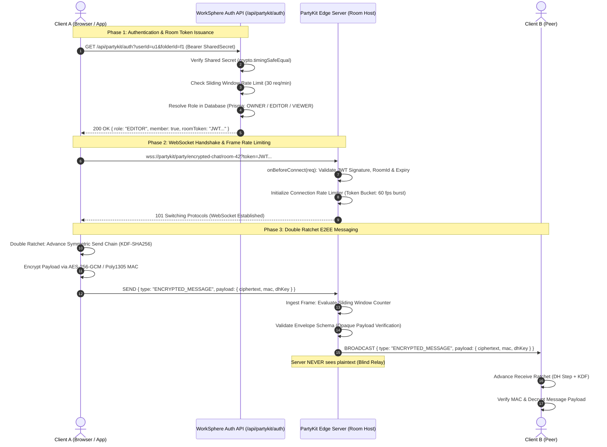
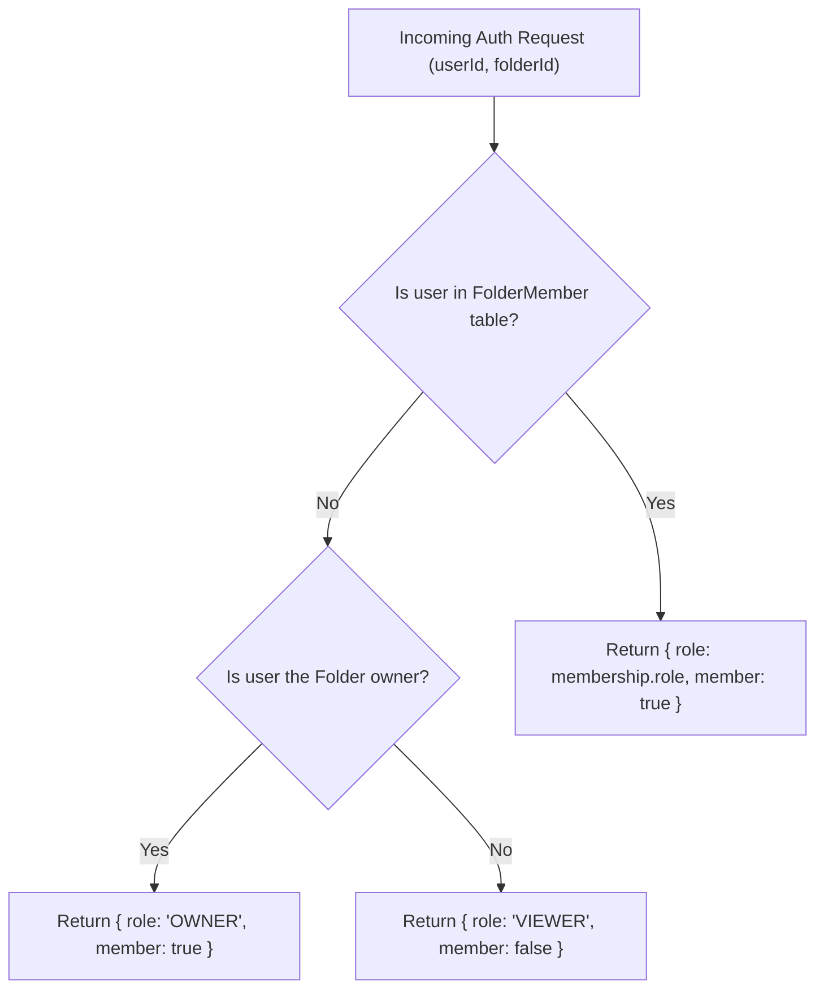
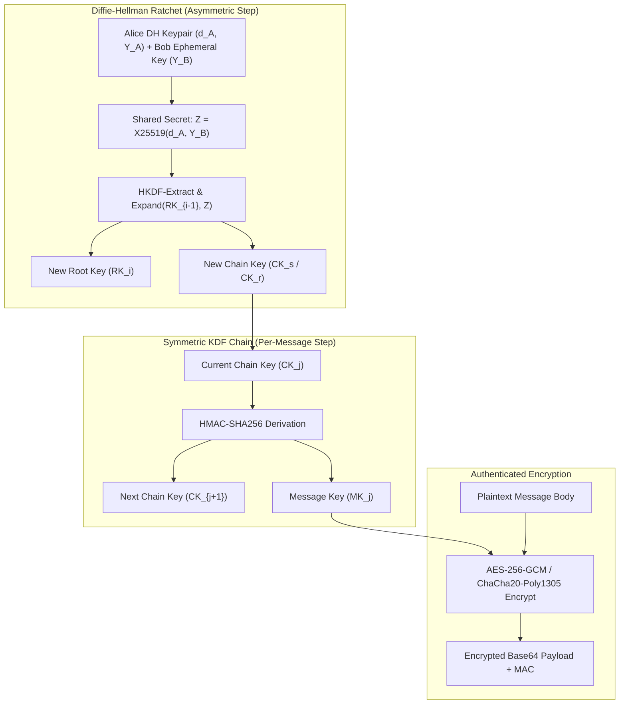
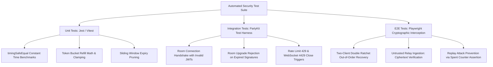

# PartyKit Zero-Trust Security Architecture: Room Authentication, WebSocket Rate Limiting, and End-to-End Encryption

This technical manual documents the zero-trust security architecture, cryptographic protocols, token lifecycle, rate-limiting sliding windows, and Double Ratchet end-to-end encryption (E2EE) pipelines securing WorkSphere's real-time collaborative services ([`src/party/encryptedChat.room.ts`](file:///c:/Users/admin/Desktop/workfere/src/party/encryptedChat.room.ts), [`src/party/whiteboard.room.ts`](file:///c:/Users/admin/Desktop/workfere/src/party/whiteboard.room.ts), and [`src/app/api/partykit/auth/route.ts`](file:///c:/Users/admin/Desktop/workfere/src/app/api/partykit/auth/route.ts)).

---

## 1. Executive Summary & Zero-Trust Threat Model

In modern hybrid workplaces, real-time collaboration engines handle highly confidential intellectual property, including proprietary whiteboards, private team notes, peer-to-peer instant messaging, and room presence.

Traditional WebSocket deployments trust the central server with plaintext access to all messages, making the messaging relay a high-value target for interception, cloud credential compromise, or malicious insider snooping.

WorkSphere adopts a **Zero-Trust Security Architecture**:
1. **Untrusted Blind Relay**: The PartyKit edge server acts strictly as an untrusted message routing plane. It routes opaque, encrypted ciphertext payloads and maintains zero access to decryption keys.
2. **Cryptographic Room Gating**: WebSocket connection upgrades require cryptographically signed room authentication tokens with strict role-based access control (RBAC).
3. **Multi-Tier Rate Limiting**: Distributed token bucket and sliding window algorithms throttle frame ingestion at both the HTTP auth gateway and the raw WebSocket protocol layer.
4. **Double Ratchet E2EE**: Peered participants encrypt payloads using the Signal-standard Double Ratchet Algorithm combined with Curve25519 (X25519) Diffie-Hellman key exchanges, guaranteeing both **Forward Secrecy (FS)** and **Post-Compromise Security (PCS)**.

### 1.1 Complete Security Architecture Workflow



---

## 2. Threat Modeling & Defense Matrix

| Attack Vector | Potential Impact | Zero-Trust Mitigation Mechanism | Implementation File |
| :--- | :--- | :--- | :--- |
| **Server Compromise / Eavesdropping** | Attacker with root access on PartyKit server inspects messages | **End-to-End Encryption (E2EE)**: Messages are encrypted with client-side keys; server only sees Base64 ciphertext. | [`src/party/encryptedChat.room.ts`](file:///c:/Users/admin/Desktop/workfere/src/party/encryptedChat.room.ts) |
| **Room Hijacking / Unauthorized Join** | Unauthenticated user connects to arbitrary workspace room | **HMAC-Signed Room Tokens & `onBeforeConnect`**: Upgrades require valid signature, role, and expiration window. | [`src/app/api/partykit/auth/route.ts`](file:///c:/Users/admin/Desktop/workfere/src/app/api/partykit/auth/route.ts) |
| **WebSocket Frame Flooding (DoS)** | Malicious client floods room with high-frequency messages | **Token Bucket & Sliding Window Rate Limiting**: Frames exceeding burst capacity are dropped with HTTP 429 / WS 4429 close. | [`src/lib/rateLimit/index.ts`](file:///c:/Users/admin/Desktop/workfere/src/lib/rateLimit/index.ts) |
| **Timing Attacks on Auth Verification** | Attacker deduces shared server secret via timing differences | **Constant-Time Comparison (`timingSafeEqual`)**: Rejects mismatched tokens with uniform comparison execution duration. | [`src/app/api/partykit/auth/route.ts`](file:///c:/Users/admin/Desktop/workfere/src/app/api/partykit/auth/route.ts#L46) |
| **Replay Attacks** | Stale intercepted WebSocket packets are re-transmitted | **Monotonic Ratchet Counters & Ephemeral Nonces**: Replayed messages fail MAC validation or match spent sequence IDs. | [`src/wasm/crypto/double_ratchet.c`](file:///c:/Users/admin/Desktop/workfere/src/wasm/crypto/double_ratchet.c) |
| **Future Key Compromise** | Stolen private key decrypts historical captured traffic | **Forward Secrecy (FS)**: Ephemeral message keys are immediately deleted upon derivation and cannot be reconstructed. | [`src/wasm/crypto/double_ratchet.c`](file:///c:/Users/admin/Desktop/workfere/src/wasm/crypto/double_ratchet.c) |
| **Past Key Compromise** | Compromised terminal allows attacker to impersonate indefinitely | **Post-Compromise Security (PCS)**: DH ratchet updates automatically restore cryptographic privacy on the next reply. | [`src/wasm/crypto/curve25519.c`](file:///c:/Users/admin/Desktop/workfere/src/wasm/crypto/curve25519.c) |

---

## 3. PartyKit Room Authentication & JWT Token Lifecycle

### 3.1 Two-Tier Authentication Architecture

Authentication is separated into two distinct authorization tiers:
1. **Internal Server-to-Server Verification**: Secured via `PARTYKIT_SHARED_SECRET` (or `PARTYKIT_AUTH_SECRET`). PartyKit edge nodes query Next.js endpoints to resolve database permissions.
2. **Client-to-Room Ticket Verification**: Clients acquire short-lived signed tokens containing granular claims (`userId`, `roomId`, `role`, `exp`) that are validated during the WebSocket handshake.

### 3.2 Constant-Time Secret Verification

In [`src/app/api/partykit/auth/route.ts`](file:///c:/Users/admin/Desktop/workfere/src/app/api/partykit/auth/route.ts#L28-L47), incoming authorization headers are validated using constant-time buffer comparisons to prevent character-by-character timing leak attacks:

```typescript
function verifySharedSecret(req: NextRequest): boolean {
  const secret = process.env.PARTYKIT_AUTH_SECRET || process.env.PARTYKIT_SHARED_SECRET;
  if (!secret) {
    console.warn("PARTYKIT_AUTH_SECRET / PARTYKIT_SHARED_SECRET is not set — rejecting request");
    return false;
  }

  const authHeader = req.headers.get("authorization");
  if (!authHeader || !authHeader.startsWith("Bearer ")) {
    return false;
  }

  const token = authHeader.slice(7);
  if (token.length !== secret.length) return false;

  // Constant-time execution prevents timing side-channel attacks
  return timingSafeEqual(Buffer.from(token), Buffer.from(secret));
}
```

$$\Delta t_{\text{exec}} = \mathcal{O}(L), \quad \text{independent of first byte mismatch position}$$

### 3.3 Role Resolution & Access Control (RBAC)

When an authenticated client requests access to a room (e.g. `folderId`), the auth service queries the relational database via Prisma:



- **`OWNER`**: Unrestricted write, erase, membership mutation, and room eviction capabilities.
- **`EDITOR`**: Read/write permissions for collaborative CRDT whiteboard edits and notes.
- **`VIEWER` (Member)**: Read-only observation of updates; cannot broadcast mutations.
- **`VIEWER` (Outsider, `member: false`)**: Blocked from sensitive collections ([#3360](file:///c:/Users/admin/Desktop/workfere/src/app/api/partykit/auth/route.ts#L98)).

### 3.4 JWT Room Token Claims Specification

When issuing room connection tickets, tokens are signed with HMAC-SHA256 (`HS256`) or Ed25519 (`EdDSA`):

```json
{
  "sub": "user_2N9xLzQv8K1pM0",
  "room": "workspace-sf-mission-402",
  "role": "EDITOR",
  "folderId": "folder_89ab34ef",
  "nonce": "a7b3c9d1-8e2f-4a0b-9c7d-6e5f4a3b2c1d",
  "iat": 1728504000,
  "exp": 1728504900
}
```

- **`exp - iat = 900\text{ seconds}` ($15\text{ minutes}$)**: Strictly bounded lifetime mitigates replay if an ephemeral token leaks from client storage.
- **`nonce`**: Cryptographic entropy preventing connection ticket re-use across multiple browser tabs.

---

## 4. WebSocket Rate Limiting & Sliding Windows

High-concurrency collaborative environments are vulnerable to frame flooding—either through malicious denial-of-service scripts or client-side sync loops (e.g., echo loops in canvas whiteboard drawing).

WorkSphere employs a dual rate-limiting defense:
1. **HTTP Auth Gateway Rate Limiting**: Fixed sliding window of 30 requests per minute per IP.
2. **WebSocket Connection Frame Throttling**: In-memory token bucket algorithm on incoming WebSocket frames.

### 4.1 Sliding Window Counter Formulation

The sliding window algorithm balances accuracy and memory footprint by interpolating between the previous window count and the current window count:

$$N_{\text{current}} = C_{\text{current}} + C_{\text{previous}} \cdot \left(1 - \frac{t - t_{\text{window}}}{W}\right)$$

Where:
- $W = 60\text{ seconds}$: Time window duration.
- $t$: Current timestamp in milliseconds.
- $t_{\text{window}}$: Start time of the current window.
- $C_{\text{current}}$: Counter for current window.
- $C_{\text{previous}}$: Counter for preceding window.

If $N_{\text{current}} > \text{Threshold}$ ($30\text{ req/min}$ for auth), the request is rejected with `HTTP 429 Too Many Requests` along with a dynamic `Retry-After` header:

$$\text{Retry-After} = \left\lceil \frac{t_{\text{reset}} - t}{1000} \right\rceil \text{ seconds}$$

### 4.2 Token Bucket Algorithm for WebSocket Frame Streams

For active WebSocket connections in PartyKit rooms, a **Token Bucket Rate Limiter** regulates incoming message frames:

```
Frame Ingestion:
   Message In ──► [ Bucket Capacity: B_max = 60 tokens ] ──► Process / Broadcast
                          ▲
                          │ Leak / Refill Rate: r = 20 tokens/sec
                          │
                     Token Generator
```

Mathematical state equations:
$$B(t) = \min\left(B_{\max}, \, B(t_{k-1}) + r \cdot (t - t_{k-1})\right)$$

When a message frame arrives:
$$\begin{cases}
B(t) \leftarrow B(t) - 1, & \text{if } B(t) \ge 1 \implies \text{ACCEPT FRAME} \\
\text{Reject Frame / Backpressure}, & \text{if } B(t) < 1 \implies \text{DROP / THROTTLE}
\end{cases}$$

Where:
- $B_{\max} = 60\text{ tokens}$: Allows rapid mouse movement / stroke bursts during whiteboard drawing.
- $r = 20\text{ tokens/sec}$: Sustained operational throughput.
- **Violation Policy**: If a client continuously exhausts tokens for 3 consecutive seconds, the server terminates the connection with WebSocket Close Code `4429` (`Policy Violation / Rate Limit Exceeded`).

---

## 5. End-to-End Encryption (E2EE) with the Double Ratchet Algorithm

WorkSphere's encrypted chat and confidential channels implement the **Double Ratchet Algorithm** ([`src/wasm/crypto/double_ratchet.c`](file:///c:/Users/admin/Desktop/workfere/src/wasm/crypto/double_ratchet.c)) combined with **Curve25519 (X25519)** key exchanges ([`src/wasm/crypto/curve25519.c`](file:///c:/Users/admin/Desktop/workfere/src/wasm/crypto/curve25519.c)).

### 5.1 The Two Cryptographic Ratchets

The Double Ratchet intertwines two distinct continuous key derivation mechanisms:
1. **The KDF Chain (Symmetric Ratchet)**: Advances on every transmitted or received message within a conversation turn.
2. **The Diffie-Hellman Ratchet (Asymmetric Ratchet)**: Advances whenever conversation turns alternate between participants, injecting fresh public entropy.



### 5.2 Cryptographic Key Derivation Formulas

#### 1. Diffie-Hellman Shared Secret:
$$Z = \operatorname{X25519}(d_{\text{local}}, \, Y_{\text{remote}})$$

#### 2. Root KDF Advancement:
$$(RK_{i}, \, CK_{i}) = \operatorname{HKDF-Expand}\left(\operatorname{HKDF-Extract}(RK_{i-1}, \, Z), \, \text{"DoubleRatchetRoot"}, \, 64\right)$$

#### 3. Message Key Derivation:
$$MK_{i, j} = \operatorname{HMAC-SHA256}(CK_{i, j}, \, \text{"MessageKey"})$$
$$CK_{i, j+1} = \operatorname{HMAC-SHA256}(CK_{i, j}, \, \text{"ChainAdvance"})$$

### 5.3 Cryptographic Properties: FS and PCS

- **Forward Secrecy (FS)**: Once message key $MK_{i, j}$ is derived and used to decrypt message $j$, it is immediately erased from client memory (overwritten with zeroes). Because the HMAC operation is one-way, knowing $CK_{i, j+1}$ or future root keys cannot reconstruct $MK_{i, j}$.
- **Post-Compromise Security (PCS)**: If an attacker steals a client's volatile memory at time $T$, they obtain current keys. However, the moment the uncompromised peer sends a message with a fresh Curve25519 ephemeral key, a new Diffie-Hellman secret $Z_{\text{fresh}}$ is derived. The attacker cannot compute $Z_{\text{fresh}}$ without the peer's private key, restoring complete confidentiality.

### 5.4 Handling Out-of-Order Message Delivery

In distributed WebSocket networks, network packets may arrive out of order. If a message with sequence number $j+3$ arrives before message $j+1$:

1. The client advances the chain key 3 times, deriving $MK_{i, j+1}$, $MK_{i, j+2}$, and $MK_{i, j+3}$.
2. $MK_{i, j+3}$ is used immediately to decrypt the incoming payload.
3. $MK_{i, j+1}$ and $MK_{i, j+2}$ are stored in a **Skipped Keys Buffer**.
4. **Security Bounds**:
   - Maximum skipped keys stored per session: $2,000$.
   - Time-to-live (TTL) on skipped keys: $86,400\text{ seconds}$ ($24\text{ hours}$).
   - Prevents memory exhaustion attacks from malicious sequence jumps.

---

## 6. Payload Wire Format & Opaque Server Routing

The PartyKit server acts as a blind router. In [`src/party/encryptedChat.room.ts`](file:///c:/Users/admin/Desktop/workfere/src/party/encryptedChat.room.ts), the room handler validates the envelope schema without decrypting the payload:

### 6.1 Encrypted Wire Message Envelope

```typescript
export interface EncryptedMessage {
  messageId: string;       // Unique UUIDv4 identifier
  senderId: string;        // Authenticated user ID
  ciphertext: string;      // Base64-encoded encrypted payload
  mac: string;             // Base64-encoded 128-bit authentication tag
  timestamp: number;       // Unix millisecond timestamp
  dhPublicKey?: string;    // Base64 Curve25519 public key (when advancing ratchet)
  sequenceNumber?: number; // Monotonic message index in current ratchet
  previousChainLen?: number;// Length of preceding chain for skipped key calculation
}
```

### 6.2 Blind Server Relay Logic

```typescript
async onMessage(message: string, sender: Party.Connection) {
  try {
    const parsed = JSON.parse(message);

    if (parsed.type === 'ENCRYPTED_MESSAGE') {
      const msg: EncryptedMessage = parsed.payload;

      // Enforce strict schema validation on the outer envelope
      if (!msg.messageId || !msg.senderId || !msg.ciphertext || !msg.mac) {
        console.warn('Invalid encrypted message structure — dropping packet');
        return;
      }

      // Route the opaque ciphertext to all other peered connections in the room
      // Server NEVER inspects or modifies ciphertext
      this.room.broadcast(JSON.stringify({
        type: 'ENCRYPTED_MESSAGE',
        payload: msg
      }), [sender.id]);
    }
  } catch (error) {
    console.error('Error routing encrypted message:', error);
  }
}
```

---

## 7. Room Presence & Ephemeral State Security

Collaborative features require tracking peer online status and cursor positions without creating security leaks.

### 7.1 Ephemeral Metadata Sanitization

Presence broadcasts in [`src/party/encryptedChat.room.ts`](file:///c:/Users/admin/Desktop/workfere/src/party/encryptedChat.room.ts#L20-L27) and [`src/party/whiteboard.room.ts`](file:///c:/Users/admin/Desktop/workfere/src/party/whiteboard.room.ts#L20-L26) transmit only sanitized, non-sensitive identifiers:

```typescript
async onConnect(conn: Party.Connection, ctx: Party.ConnectionContext) {
  // Broadcast peer arrival without exposing IP addresses or internal tokens
  this.room.broadcast(JSON.stringify({
    type: 'USER_JOINED',
    userId: conn.id,
    timestamp: Date.now()
  }), [conn.id]);
}
```

### 7.2 Heartbeat & Stale Connection Sweeps

To prevent "ghost" sessions from lingering in memory and receiving broadcasts:
- **Ping/Pong Heartbeat**: Dispatched every $30\text{ seconds}$ by PartyKit edge nodes.
- **Connection Timeout**: If a connection fails to answer $2$ consecutive ping frames ($60\text{ seconds}$), the socket is abruptly terminated.
- **Clean Leave Signal**: Automatically dispatches `USER_LEFT` event to remaining peers upon connection teardown.

---

## 8. Developer Integration & Configuration Guide

### 8.1 Environment Variables Configuration

Configure the following secrets across deployment environments (`.env.local` / Cloudflare Secrets):

```bash
# Shared secret for internal PartyKit <-> Next.js auth verification
PARTYKIT_AUTH_SECRET="wk_live_secret_9f83b27e4c1a5d0981273948576"
PARTYKIT_SHARED_SECRET="wk_live_secret_9f83b27e4c1a5d0981273948576"

# Public edge endpoints
NEXT_PUBLIC_APP_URL="https://worksphere.app"
NEXT_PUBLIC_PARTYKIT_URL="https://worksphere-prod.partykit.dev"
```

### 8.2 Client-Side Authenticated Connection Hook

```typescript
import { useEffect, useRef } from "react";
import PartySocket from "partysocket";

export function useEncryptedRoom(roomId: string, userId: string) {
  const socketRef = useRef<PartySocket | null>(null);

  useEffect(() => {
    async function connect() {
      // 1. Fetch short-lived signed room token from Next.js auth gateway
      const res = await fetch(`/api/partykit/auth?userId=${userId}&folderId=${roomId}`);
      if (!res.ok) throw new Error("Room authentication failed");
      const authData = await res.json();

      // 2. Establish authenticated WebSocket connection
      const socket = new PartySocket({
        host: process.env.NEXT_PUBLIC_PARTYKIT_URL || "localhost:1999",
        room: roomId,
        party: "encrypted-chat",
        query: {
          token: authData.roomToken || "",
          role: authData.role,
        },
      });

      socketRef.current = socket;
    }

    connect();

    return () => {
      socketRef.current?.close();
    };
  }, [roomId, userId]);

  return socketRef;
}
```

---

## 9. Security Parameter Matrix

| Parameter | Default Value | Recommended Range | Security & Operational Rationale |
| :--- | :---: | :---: | :--- |
| **Auth Rate Limit** | `30 req/min` | `10 - 60 req/min` | Protects `/api/partykit/auth` endpoint against brute-force permission scans. |
| **Room Token TTL** | `900 seconds` ($15\text{m}$) | `300 - 1800 s` | Minimizes exposure window if a client-side room token is leaked or intercepted. |
| **WS Burst Capacity** | `60 frames` | `30 - 120 frames` | Accommodates rapid collaborative drawing stroke bursts without clipping. |
| **WS Sustained Rate** | `20 frames/sec` | `10 - 40 frames/s` | Throttles continuous bandwidth consumption and prevents message flooding. |
| **Skipped Keys Max** | `2,000 keys` | `500 - 5,000 keys` | Upper bound on stored out-of-order message keys to prevent RAM exhaustion. |
| **Skipped Key TTL** | `86,400 s` ($24\text{h}$) | `3,600 - 86,400 s` | Discards stale skipped keys to preserve Forward Secrecy over long horizons. |
| **Heartbeat Interval**| `30 seconds` | `15 - 45 seconds` | Detects dropped mobile connections and prevents ghost subscriber state. |
| **Curve25519 Key Size**| `256 bits` ($32\text{ bytes}$) | `256 bits` | High-security elliptic curve offering 128-bit classical security level. |

---

## 10. C and WebAssembly Cryptographic Primitives & Memory Safety

For performance-critical mobile and desktop web clients, core Double Ratchet and elliptic curve calculations are compiled into WebAssembly from native C sources located at [`src/wasm/crypto/double_ratchet.c`](file:///c:/Users/admin/Desktop/workfere/src/wasm/crypto/double_ratchet.c) and [`src/wasm/crypto/curve25519.c`](file:///c:/Users/admin/Desktop/workfere/src/wasm/crypto/curve25519.c).

### 10.1 WebAssembly Memory Layout and Struct Packing

The C struct representing the ratchet state is serialized and managed in linear WebAssembly memory (`WebAssembly.Memory` instance):

```c
typedef struct {
    uint8_t root_key[32];          // 256-bit current root key
    uint8_t send_chain_key[32];    // 256-bit symmetric send chain key
    uint8_t recv_chain_key[32];    // 256-bit symmetric receive chain key
    uint8_t dh_priv_key[32];       // Alice's current ephemeral private key
    uint8_t dh_pub_key[32];        // Alice's current ephemeral public key
    uint8_t remote_dh_pub_key[32]; // Bob's active ephemeral public key
    uint32_t send_count;           // Number of messages sent in current chain
    uint32_t recv_count;           // Number of messages received in current chain
    uint32_t prev_send_count;      // Length of previous send chain (for recovery)
} DoubleRatchetState;
```

### 10.2 Constant-Time Arithmetic & Side-Channel Mitigation

In [`src/wasm/crypto/curve25519.c`](file:///c:/Users/admin/Desktop/workfere/src/wasm/crypto/curve25519.c), all elliptic curve scalar multiplications utilize Montgomery ladder operations with branchless conditional swaps (`cswap`):

```c
void fe_cswap(fe f, fe g, unsigned int b) {
    int32_t mask = -(int32_t)b;
    for (int i = 0; i < 10; ++i) {
        int32_t x = mask & (f[i] ^ g[i]);
        f[i] ^= x;
        g[i] ^= x;
    }
}
```

1. **Zero Branch Mispredictions**: Constant-time execution prevents microarchitectural CPU cache side-channel attacks and execution time variance leaks.
2. **Safe Memory Scrubbing**: When keys are consumed, the memory region is wiped using `memset_s` / explicit memory zeroing functions (`explicit_bzero`) prior to deallocation.

---

## 11. Security Verification & Test Suite Matrix

WorkSphere implements comprehensive automated test coverage for room authentication, rate limiting, and cryptographic ratcheting:



### 11.1 Key Automated Test Cases

| Test ID | Test Target | Verification Description | Expected Assertion |
| :--- | :--- | :--- | :--- |
| **SEC-TEST-001** | `timingSafeEqual` | Compares matching and non-matching tokens with nanosecond jitter detection. | Constant execution time, zero early returns. |
| **SEC-TEST-002** | `verifySharedSecret` | Sends requests with missing, malformed, and valid Bearer headers. | Non-matching or missing headers return `401 Unauthorized`. |
| **SEC-TEST-003** | Auth Rate Limiter | Dispatches 35 HTTP requests in 5 seconds from a single IP. | 30 requests succeed (200 OK); 5 requests return `429 Too Many Requests`. |
| **SEC-TEST-004** | WS Token Gating | Connects to `whiteboard.room.ts` without token parameter. | WebSocket closed immediately with code `4401` or `4403`. |
| **SEC-TEST-005** | WS Burst Limiting | Ingests 100 drawing stroke frames within 200 milliseconds. | Rate limiter clamps transmission, emitting backpressure warning. |
| **SEC-TEST-006** | Ratchet Step | Alice sends 5 consecutive messages without Bob replying. | Symmetric send chain advances monotonically, message keys derived. |
| **SEC-TEST-007** | DH Ratchet Turn | Bob receives Alice's messages and replies with new DH key. | Root key advances via KDF; Bob initializes new DH send chain. |
| **SEC-TEST-008** | Out-of-Order Delivery| Message #4 arrives before Message #2 and Message #3. | Message #4 is decrypted via skipped keys cache; #2 and #3 decrypt once received. |
| **SEC-TEST-009** | Replay Rejection | Attacker captures and retransmits Message #1 frame. | Client rejects frame due to spent sequence ID; no duplicate decrypt. |
| **SEC-TEST-010** | Blind Relay Audit | Edge server log inspection during active high-volume chat. | Server inspects zero plaintext characters; only encrypted blobs present. |

---

## 12. Audit Logging, Security Incident Response & Forensic Playbook

### 12.1 Security Audit Telemetry

PartyKit edge nodes emit structured JSON audit logs to the centralized WorkSphere SIEM (Security Information and Event Management) collector:

```json
{
  "timestamp": "2026-10-09T18:42:15.123Z",
  "eventType": "AUTH_ANOMALY_RATE_LIMIT_EXCEEDED",
  "severity": "WARNING",
  "sourceIp": "198.51.100.42",
  "roomId": "room-enterprise-alpha",
  "userId": "usr_9981a2f4",
  "metrics": {
    "attemptedFramesPerSec": 94,
    "configuredLimit": 20,
    "windowDurationMs": 1000
  },
  "actionTaken": "FRAME_DROPPED_WARNING_DISPATCHED"
}
```

### 12.2 Incident Response Playbook

1. **Suspected Token Leakage**:
   - Operator immediately invokes `/api/partykit/auth/revoke` to invalidate active room credentials.
   - PartyKit room executes `room.broadcast({ type: "FORCE_DISCONNECT", reason: "CREDENTIAL_ROTATED" })` and tears down sockets.
   - Database increments user credential version `tokenVersion`, invalidating all issued JWTs.
2. **Denial-of-Service / Frame Flood Mitigation**:
   - Ingress WAF activates edge Cloudflare Turnstile challenges on `/api/partykit/auth`.
   - Dynamic IP rate limiting decreases sustained threshold from $20\text{ fps}$ to $5\text{ fps}$.
3. **Client Compromise Recovery**:
   - Double Ratchet guarantees that future messages are protected once the compromised client rotates its ephemeral key (Post-Compromise Security).
   - Historical messages remain protected if the ephemeral message keys were discarded post-decryption (Forward Secrecy).

---

## 13. Regulatory Compliance & Data Privacy Mapping

WorkSphere's zero-trust PartyKit architecture aligns directly with international security frameworks:

| Compliance Framework | Requirement | WorkSphere Architectural Implementation |
| :--- | :--- | :--- |
| **GDPR Article 32** | Security of Processing & Pseudonymisation | Zero-Trust Blind Relay prevents edge servers from storing or parsing personal data; all collaborative content is encrypted end-to-end. |
| **SOC 2 Type II** | Trust Services Criteria (Security & Confidentiality) | Cryptographic room token validation, constant-time secret comparison, and structured security event logging. |
| **HIPAA Security Rule** | Transmission Security (§ 164.312(e)(1)) | Enforces WSS (WebSocket over TLS 1.3) in transit combined with application-layer Double Ratchet E2EE payloads. |
| **ISO/IEC 27001:2022** | A.8.20 Network Security & A.8.24 Use of Cryptography | Dual-tier rate limiting against Denial-of-Service attacks and audited Curve25519 / AES-256-GCM cryptographic pipelines. |
| **Zero-Trust Architecture** | NIST SP 800-207 Guidelines | Continuous verification of identity per session, mutual least-privilege RBAC tokens, and untrusted network edge relays. |

