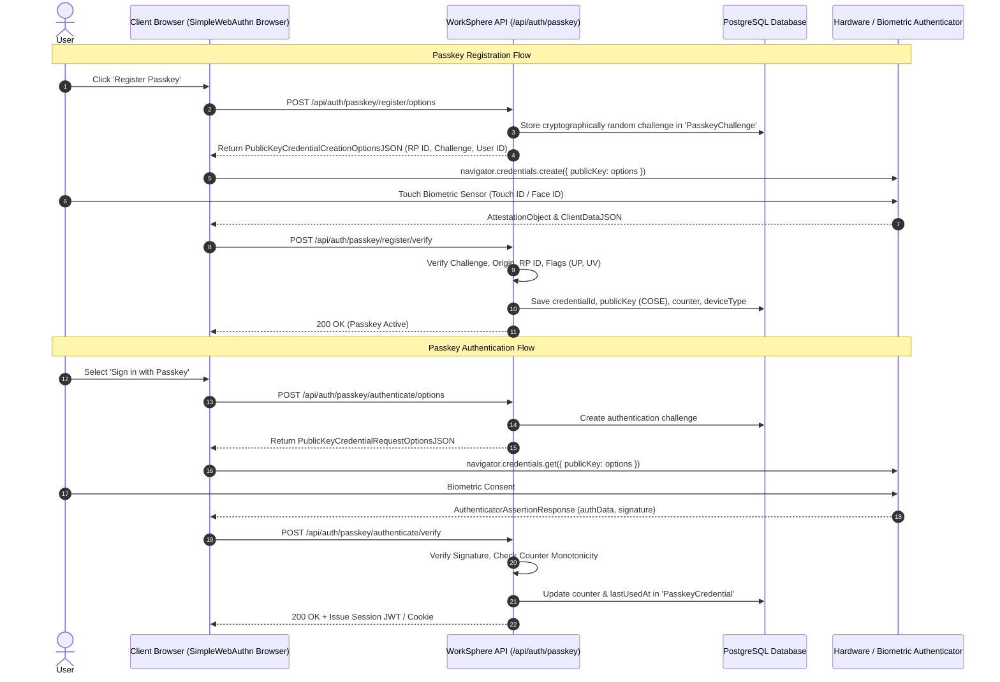

# FIDO2 / WebAuthn Passkey Security Architecture & Key Rotation Guide

## Overview

WorkSphere implements biometric, phishing-resistant, passwordless authentication using the **W3C Web Authentication (WebAuthn)** standard and **FIDO2 / CTAP2** protocols. Users can authenticate across Apple Touch ID/Face ID, Windows Hello, Android Biometrics, and hardware security keys (e.g., YubiKey).

This document details the security architecture, options generation endpoints, cryptographic verification routines (authenticator data, signatures, monotonic counters, backup flags), email OTP second-factor step-up authentication, friendly name updating, and credential rotation workflows.

---

## 1. WebAuthn Authentication & Registration Flows

---

## 2. Options Generation Endpoints

### 2.1 Registration Options (`POST /api/auth/passkey/register/options`)
Prepares parameters required by `navigator.credentials.create()`:
- **RP Name & RP ID:** Bound strictly to the server's effective domain (e.g., `worksphere.app`).
- **Challenge:** A high-entropy 64-byte random buffer stored in PostgreSQL with a 5-minute TTL.
- **User Verification:** Enforces `"preferred"` or `"required"` to guarantee on-device biometric or PIN authorization.
- **Excluded Credentials:** Queries all existing credentials registered by the user and passes them in `excludeCredentials` to prevent re-registering an identical hardware authenticator.
- **Authenticator Selection:**
  - `residentKey: "preferred"` (Discoverable credential support).
  - `requireResidentKey: false`.

### 2.2 Authentication Options (`POST /api/auth/passkey/authenticate/options`)
Prepares parameters for `navigator.credentials.get()`:
- Generates a fresh single-use authentication challenge.
- Supports conditional UI / Autofill (`mediation: "conditional"`), allowing users to sign in directly from form autocomplete dropdowns.

---

## 3. Cryptographic Verification & Security Checks

All verification occurs server-side in `verifyAuthenticationResponse` and `verifyRegistrationResponse`:

### 3.1 `clientDataJSON` Verification
The client data payload contains JSON metadata hashed inside the signature:
1. **Challenge Match:** Verifies that `clientData.challenge` matches the exact stored challenge in `PasskeyChallenge`.
2. **Origin Validation:** Validates `clientData.origin` against the application's configured domain (accounting for staging/production origins and native app prefixes).
3. **Type Check:** Ensures `clientData.type` matches `"webauthn.create"` for registration or `"webauthn.get"` for authentication.

### 3.2 `authenticatorData` Flag Verification
`authData` contains bitflags reflecting the physical authenticator state:

| Bit Position | Flag Name | Requirement | Security Purpose |
| :--- | :--- | :--- | :--- |
| **Bit 0** | User Present (`UP`) | **Must be 1** | Guarantees human presence during the ceremony. |
| **Bit 2** | User Verified (`UV`) | **Must be 1** | Confirms biometric match (fingerprint/face) or device PIN entered. |
| **Bit 3** | Backup Eligibility (`BE`) | Evaluated | Indicates if the key can be synced via iCloud Keychain / Google Password Manager. |
| **Bit 4** | Backup State (`BS`) | Evaluated | Indicates if the key is currently backed up in a multi-device synced keychain. |
| **Bit 6** | Attested Credential Data (`AT`) | 1 on Register | Signals that public key and credential ID are included in registration. |

### 3.3 Signature & Monotonic Counter Checks
1. **Signature Algorithm:** Verified using the stored public key (COSE algorithms: ES256, RS256, or Ed25519).
2. **Signature Digest:** Validates signature over `SHA256(clientDataJSON)` prepended with raw `authenticatorData`.
3. **Monotonic Clone Detection:**
   - Single-device hardware authenticators increment an internal signature `counter` on every assertion.
   - If `incomingCounter <= storedCounter` and both values are $> 0$, the request is flagged as a cloned authenticator attack, rejecting the ceremony and triggering a security audit log.

---

## 4. Passkey Nickname Renaming & Management

Users can assign friendly nicknames to their credentials (e.g., *"MacBook Air Touch ID"*, *"Backup YubiKey 5C"*).

### Renaming Endpoint (`PATCH /api/auth/passkey/credentials/[id]`)
- **Payload:** `{ name: string, otp: string }`.
- **Validation:** Name length capped at 64 characters with whitespace trimming.
- **Second-Factor Protection:** High-security modifications require an out-of-band Email OTP verification (`action: "rename"`), preventing unauthorized modifications from compromised sessions.
- **Audit Logging:** Logs audit trail (`passkeyAuditLogService.log`) recording old name, new name, IP address, and user-agent.

---

## 5. Passkey Key Rotation & Revocation

Passkeys can expire or require proactive rotation due to hardware changes, lost devices, or company policy.

### 5.1 Credential Rotation Workflow (`POST /api/auth/passkey/rotation`)
WorkSphere implements zero-downtime atomic key rotation:

1. **OTP Verification:** User submits an Email OTP requested for `action: "rotate"` on target `credentialId`.
2. **Successor Registration:** Client executes `navigator.credentials.create()` for the successor key.
3. **Atomic Replacement:**
   - In a single Prisma database transaction, the successor credential is saved with a fresh expiration date (e.g., 365-day TTL).
   - The predecessor credential is automatically revoked and archived.
4. **Audit Trail:** Action recorded as `ROTATE` in the security audit log with timestamps and predecessor references.

### 5.2 Expired Key Cleanup (`action: "cleanup"`)
Automatic maintenance route removing revoked or expired credentials that have exceeded their retention window.

---

## 6. Threat Model & Countermeasures

| Threat Vector | Mitigation Strategy |
| :--- | :--- |
| **Phishing / Credential Harvesting** | Public-private key pairs are bound to the cryptographic origin (`rpId`). Attackers on spoofed domains cannot request assertions for `worksphere.app`. |
| **Replay Attacks** | Every WebAuthn ceremony requires signing a single-use random 64-byte challenge with a strict 5-minute expiration. |
| **Authenticator Cloning** | Server-side monotonic signature counter validation flags cloned keys. |
| **Brute-Force & Denial of Service** | Sliding-window IP and user-rate limits enforced via Redis/Upstash (`10 attempts / minute`). |
| **Session Hijacking / CSRF** | Step-up operations (revocation, rotation, and rename) require an email-verified second-factor OTP. |
