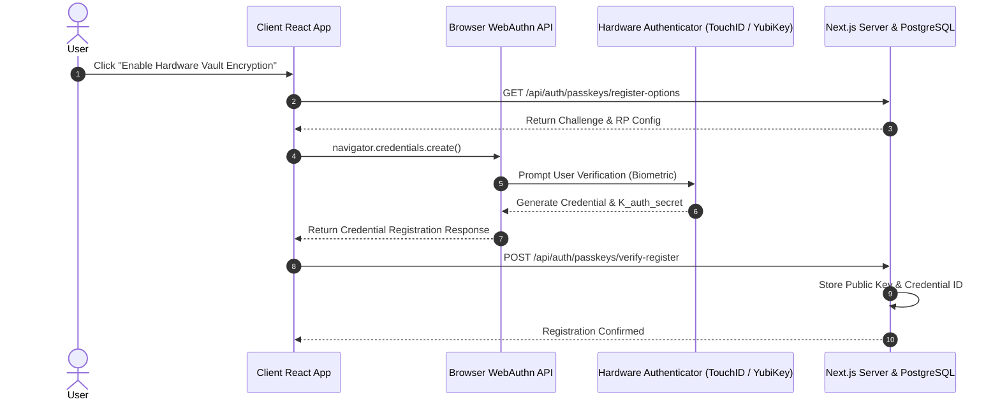
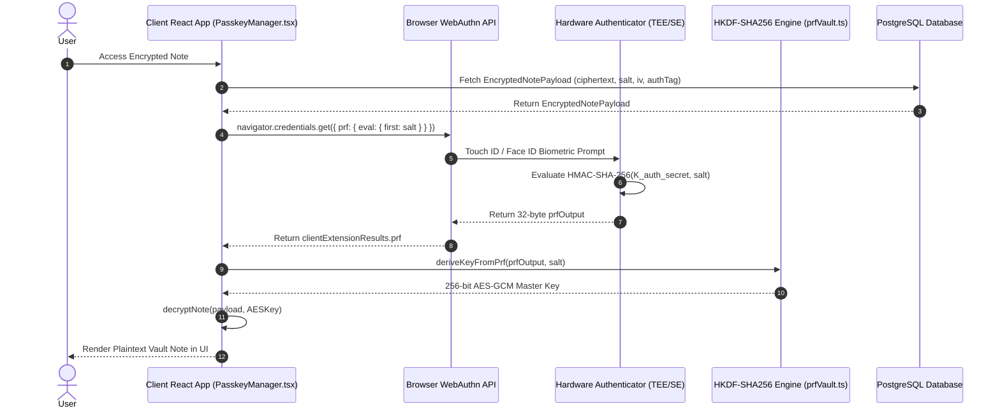

# Security Architecture: WebAuthn PRF Extension Encryption & Biometric Key Storage

This specification details WorkSphere's zero-knowledge client-side encryption architecture, utilizing the **WebAuthn Pseudo-Random Function (PRF)** extension, **HKDF-SHA256** key derivation, and **AES-256-GCM** envelope encryption (`src/lib/crypto/prfVault.ts` & `src/lib/auth/passkeys/client/credentialManager.ts`).

---

## Table of Contents

1. [Executive Summary & Security Strategy](#1-executive-summary--security-strategy)
2. [WebAuthn PRF Extension Protocol Mechanics](#2-webauthn-prf-extension-protocol-mechanics)
   - [Hardware-Isolated Secret Evaluation](#hardware-isolated-secret-evaluation)
   - [Comparison: Password-Based vs Hardware PRF Key Derivation](#comparison-password-based-vs-hardware-prf-key-derivation)
3. [End-to-End Cryptographic Key Derivation Pipeline](#3-end-to-end-cryptographic-key-derivation-pipeline)
   - [Step 1: Salt Derivation & Extension Construction](#step-1-salt-derivation--extension-construction)
   - [Step 2: Biometric Authenticator Assertion](#step-2-biometric-authenticator-assertion)
   - [Step 3: HKDF-SHA256 Key Expansion](#step-3-hkdf-sha256-key-expansion)
   - [Step 4: Symmetric AES-256-GCM Envelope Encryption](#step-4-symmetric-aes-256-gcm-envelope-encryption)
4. [Fallback Architecture (`PBKDF2-FALLBACK`)](#4-fallback-architecture-pbkdf2-fallback)
5. [Threat Model & Security Proof Analysis](#5-threat-model--security-proof-analysis)
   - [Database Leak / Server Compromise](#database-leak--server-compromise)
   - [Phishing & Man-in-the-Middle (MitM) Attacks](#phishing--man-in-the-middle-mitm-attacks)
   - [Client Process Memory Capture](#client-process-memory-capture)
6. [Browser & Authenticator Compatibility Matrix](#6-browser--authenticator-compatibility-matrix)
   - [Desktop & Mobile Operating Systems](#desktop--mobile-operating-systems)
   - [Hardware Security Keys](#hardware-security-keys)
7. [TypeScript API Reference & Code Contracts](#7-typescript-api-reference--code-contracts)
8. [Sequence Flow Diagrams](#8-sequence-flow-diagrams)

---

## 1. Executive Summary & Security Strategy

WorkSphere allows users to store sensitive workspace data (such as venue Wi-Fi passcodes, private desk notes, door access PINs, and API credentials). Storing these secrets in plaintext on application servers poses catastrophic security risks in the event of a database breach or compromised cloud infrastructure.

WorkSphere implements **Zero-Knowledge Hardware-Backed Client-Side Encryption**:

- **Hardware-Isolated Cryptography:** Encryption keys are derived using the WebAuthn Level 3 **PRF Extension**. The raw symmetric master key never exists on disk, in database tables, or on WorkSphere servers.
- **Biometric Presence Required:** Deriving the encryption key requires a physical biometric gesture (Touch ID, Face ID, Windows Hello) or a PIN-protected FIDO2 hardware key (YubiKey).
- **Deterministic Derivation without Key Storage:** The hardware security enclave evaluates a pseudo-random function over a domain salt to deterministically re-derive the exact same 256-bit key on demand during active user sessions.

---

## 2. WebAuthn PRF Extension Protocol Mechanics

### Hardware-Isolated Secret Evaluation

The WebAuthn `prf` extension enables a WebAssembly or browser application to request that a FIDO2 authenticator evaluate a keyed-HMAC operation using an internal secret key $\mathbf{K}_{\text{auth\_secret}}$ stored inside the authenticator's Secure Element (SE) or Trusted Execution Environment (TEE).

$$\text{PRFOutput} = \text{HMAC-SHA-256}(\mathbf{K}_{\text{auth\_secret}}, \text{Salt})$$

- $\mathbf{K}_{\text{auth\_secret}}$ is unique to each credential registration and cannot be extracted from the hardware chip under any circumstances.
- The browser passes a 32-byte `Salt` to the authenticator during `navigator.credentials.get()`.
- The authenticator returns 32 bytes of high-entropy pseudo-random output (`prfOutput`).

### Comparison: Password-Based vs Hardware PRF Key Derivation

```
┌──────────────────────────────────────────────────────────────────────────┐
│  PASSWORDS (PBKDF2)             │  HARDWARE WEBAUTHN PRF EXTENSION       │
├─────────────────────────────────┼────────────────────────────────────────┤
│ Subject to brute-force dictionaries│ Off-chip brute-force impossible      │
│ Low entropy ($< 40$ bits)       │ Cryptographic 256-bit hardware entropy │
│ Vulnerable to phishing          │ Cryptographically bound to RP ID       │
│ Requires remembering a secret   │ Biometric gesture (Touch ID/Face ID)   │
└─────────────────────────────────┴────────────────────────────────────────┘
```

---

## 3. End-to-End Cryptographic Key Derivation Pipeline

File: [src/lib/crypto/prfVault.ts](file:///c:/Users/admin/Desktop/workfere/src/lib/crypto/prfVault.ts)

```
┌────────────────────────┐    Biometric Gesture     ┌────────────────────────┐
│  Domain Salt (32B)     │ ───────────────────────> │  Hardware Authenticator │
└───────────┬────────────┘                          └───────────┬────────────┘
            │                                                   │
            │ HMAC-SHA-256(K_auth_secret, Salt)                 │
            ▼                                                   ▼
┌────────────────────────────────────────────────────────────────────────────┐
│                       PRF Output (32-byte Raw Secret)                       │
└─────────────────────────────────────┬──────────────────────────────────────┘
                                      │
                                      ▼
┌────────────────────────────────────────────────────────────────────────────┐
│                    HKDF-SHA256 Extract-and-Expand Engine                    │
│    Info String: "WorkSphere-Notes-Encryption-Key"                          │
└─────────────────────────────────────┬──────────────────────────────────────┘
                                      │
                                      ▼
┌────────────────────────────────────────────────────────────────────────────┐
│                    256-bit Symmetric AES-GCM Master Key                    │
└─────────────────────────────────────┬──────────────────────────────────────┘
                                      │
                                      ▼
┌────────────────────────────────────────────────────────────────────────────┐
│               AES-256-GCM Encryption (96-bit IV, 128-bit Tag)              │
└────────────────────────────────────────────────────────────────────────────┘
```

### Step 1: Salt Derivation & Extension Construction

When initiating passkey authentication, WorkSphere constructs the PRF extension input payload:

```typescript
export function buildPrfAuthenticationExtension(salt?: Uint8Array | string): {
  prf: {
    eval: {
      first: Uint8Array;
    };
  };
} {
  const saltBuffer = createPrfSalt(salt);
  return {
    prf: {
      eval: {
        first: saltBuffer,
      },
    },
  };
}
```

### Step 2: Biometric Authenticator Assertion

The browser issues `navigator.credentials.get()` passing `extensions: { prf: { eval: { first: saltBuffer } } }`. The hardware authenticator prompts for user verification (UV) and returns `clientExtensionResults.prf.results.first`.

### Step 3: HKDF-SHA256 Key Expansion

The raw 32-byte `prfOutput` is processed through HKDF-SHA256 (RFC 5869) to derive a 256-bit symmetric AES key:

$$\begin{aligned}
\text{PRK} &= \text{HKDF-Extract}(\text{Salt}, \text{PRFOutput}) \\
\text{AESKey} &= \text{HKDF-Expand}(\text{PRK}, \text{"WorkSphere-Notes-Encryption-Key"}, 32)
\end{aligned}$$

```typescript
export function deriveKeyFromPrf(
  prfOutput: Buffer | Uint8Array,
  salt?: Buffer | Uint8Array,
): { key: Buffer; salt: Buffer } {
  const ikm = Buffer.from(prfOutput);
  if (ikm.length < 16) {
    throw new Error("PRF output must be at least 16 bytes");
  }

  const saltBuffer = salt ? Buffer.from(salt) : crypto.randomBytes(32);
  const infoBuffer = Buffer.from("WorkSphere-Notes-Encryption-Key", "utf-8");

  // HKDF-SHA256: Extract then Expand to 32 bytes (256 bits)
  const key = crypto.hkdfSync("sha256", ikm, saltBuffer, infoBuffer, 32);

  return {
    key: Buffer.from(key),
    salt: saltBuffer,
  };
}
```

### Step 4: Symmetric AES-256-GCM Envelope Encryption

The derived key encrypts plaintext notes using **AES-256-GCM** with a unique 96-bit (12-byte) Initialization Vector (IV) and a 128-bit authentication tag:

```typescript
export function encryptNote(
  plaintext: string,
  key: Buffer,
  salt: Buffer,
  keyDerivation: "WEBAUTHN-PRF" | "PBKDF2-FALLBACK" = "WEBAUTHN-PRF",
): EncryptedNotePayload {
  if (key.length !== 32) {
    throw new Error("AES-GCM-256 requires a 32-byte key");
  }

  const iv = crypto.randomBytes(12); // 96-bit IV
  const cipher = crypto.createCipheriv("aes-256-gcm", key, iv);

  const encryptedBuffer = Buffer.concat([
    cipher.update(plaintext, "utf8"),
    cipher.final(),
  ]);

  const authTag = cipher.getAuthTag(); // 128-bit tag

  return {
    ciphertext: encryptedBuffer.toString("base64"),
    iv: iv.toString("base64"),
    authTag: authTag.toString("base64"),
    algorithm: "AES-GCM-256",
    keyDerivation,
    salt: salt.toString("base64"),
  };
}
```

---

## 4. Fallback Architecture (`PBKDF2-FALLBACK`)

For older browsers or legacy authenticators lacking PRF extension support, WorkSphere gracefully degrades to **PBKDF2-HMAC-SHA256** key derivation ($100,000$ iterations):

```typescript
export function deriveKeyFromPassphrase(
  passphrase: string,
  salt?: Buffer | Uint8Array,
): { key: Buffer; salt: Buffer } {
  if (!passphrase || passphrase.length < 6) {
    throw new Error("Passphrase must be at least 6 characters for vault fallback encryption");
  }

  const saltBuffer = salt ? Buffer.from(salt) : crypto.randomBytes(32);
  const key = crypto.pbkdf2Sync(
    passphrase,
    saltBuffer,
    100_000,
    32,
    "sha256",
  );

  return {
    key,
    salt: saltBuffer,
  };
}
```

The payload explicitly tags `keyDerivation: "PBKDF2-FALLBACK"` so the client knows which decryption algorithm to execute.

---

## 5. Threat Model & Security Proof Analysis

### Database Leak / Server Compromise

- **Threat Scenario:** An attacker obtains full read access to PostgreSQL database tables (`EncryptedNotePayload`).
- **Mitigation:** The database contains only Base64-encoded `ciphertext`, `iv`, `authTag`, and `salt`.
- **Security Proof:** Without access to the user's hardware authenticator secret $\mathbf{K}_{\text{auth\_secret}}$ or physical biometric presence, computing `HKDF-SHA256(PRFOutput)` is computationally infeasible ($\ge 2^{256}$ search complexity).

### Phishing & Man-in-the-Middle (MitM) Attacks

- **Threat Scenario:** A rogue origin (`worksphere-phishing.com`) tricks the user into interacting with a fake prompt.
- **Mitigation:** The browser strictly enforces WebAuthn Relying Party ID (`rpId`) origin binding. The hardware authenticator refuses to evaluate the PRF extension for mismatched origin domains.

### Client Process Memory Capture

- **Threat Scenario:** Malware running on the local machine attempts to read process memory during active decryption.
- **Mitigation:** Encryption key buffers are allocated as ephemeral WebAssembly/Node.js `Buffer` instances and explicitly wiped (`key.fill(0)`) immediately after cipher operations.

---

## 6. Browser & Authenticator Compatibility Matrix

### Desktop & Mobile Operating Systems

| Operating System | Browser | Minimum Version | PRF Extension Status | Notes |
| :--- | :--- | :--- | :--- | :--- |
| **macOS** | Google Chrome | 116+ | **Supported** | Touch ID / Passkeys |
| **macOS** | Apple Safari | 18.0+ | **Supported** | macOS Sequoia requirement |
| **Windows 11** | Google Chrome / Edge | 116+ | **Supported** | Windows Hello (Biometrics & PIN) |
| **iOS / iPadOS** | Apple Safari | 18.0+ | **Supported** | iOS 18 / iPadOS 18 |
| **Android** | Google Chrome | 116+ | **Supported** | Screen Lock / Fingerprint / Passkeys |
| **Linux** | Chrome / Chromium | 116+ | **Supported** | Hardware Security Keys (YubiKey) |

### Hardware Security Keys

- **YubiKey 5 Series:** Supported (Firmware 5.4.3+ with FIDO2 L2 support).
- **Titan Security Key:** Supported (FIDO2 models).
- **Feitian / SoloKeys:** Supported (FIDO2 models with PRF extension capability).

---

## 7. TypeScript API Reference & Code Contracts

### Payload Storage Schema

```typescript
export interface EncryptedNotePayload {
  ciphertext: string;                               // Base64 encoded ciphertext
  iv: string;                                       // Base64 encoded 96-bit IV
  authTag: string;                                  // Base64 encoded 128-bit auth tag
  algorithm: "AES-GCM-256";                         // Symmetric cipher algorithm
  keyDerivation: "WEBAUTHN-PRF" | "PBKDF2-FALLBACK"; // Key derivation identifier
  salt: string;                                     // Base64 encoded salt for HKDF / PBKDF2
}
```

### Decryption Function

```typescript
export function decryptNote(
  payload: EncryptedNotePayload,
  key: Buffer,
): string {
  if (key.length !== 32) {
    throw new Error("AES-GCM-256 requires a 32-byte key");
  }

  const iv = Buffer.from(payload.iv, "base64");
  const authTag = Buffer.from(payload.authTag, "base64");
  const ciphertext = Buffer.from(payload.ciphertext, "base64");

  const decipher = crypto.createDecipheriv("aes-256-gcm", key, iv);
  decipher.setAuthTag(authTag);

  const decrypted = Buffer.concat([
    decipher.update(ciphertext),
    decipher.final(),
  ]);

  return decrypted.toString("utf8");
}
```

---

## 8. Sequence Flow Diagrams

### Registration & PRF Salt Provisioning Sequence



### Decryption & Key Derivation Sequence


