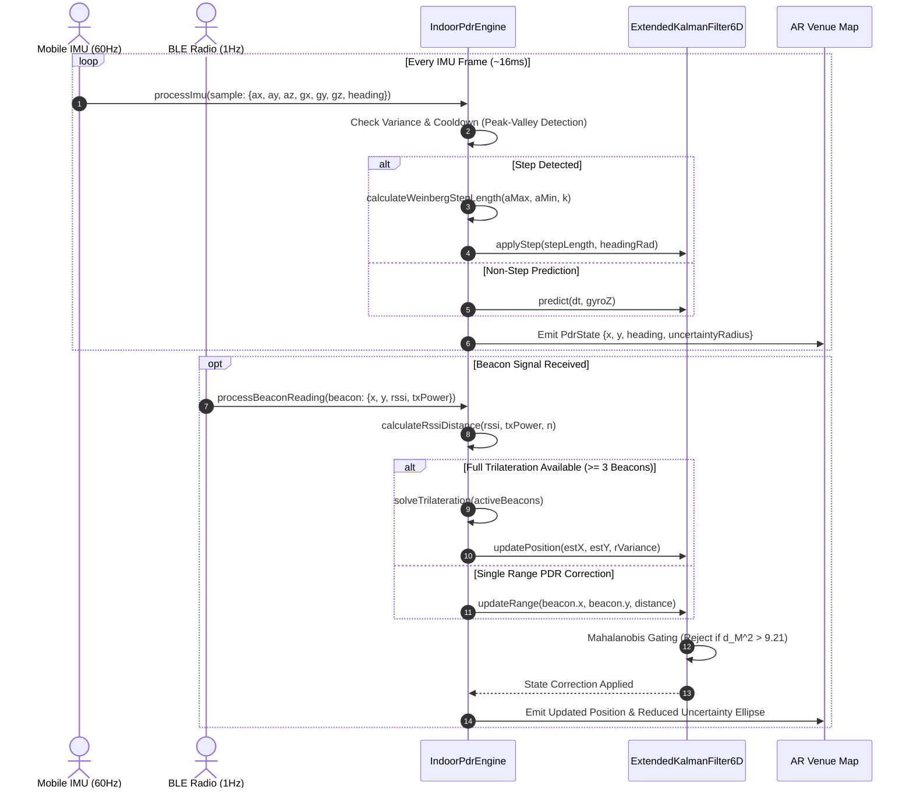

# Indoor Pedestrian Dead Reckoning (PDR) & Sensor Fusion Engine

This technical manual documents the mathematical foundations, kinematic models, signal processing pipelines, and state estimation algorithms powering WorkSphere's **Indoor Pedestrian Dead Reckoning (PDR)** and **Extended Kalman Filter (EKF) Sensor Fusion Engine** (`src/lib/spatial/indoorPdrEngine.ts`).

---

## 1. Executive Summary & Architectural Overview

In indoor corporate venues, multi-story office parks, and subterranean co-working environments, satellite-based GNSS/GPS signals are unavailable or severely degraded by multipath reflections and concrete attenuation.

WorkSphere achieves high-precision, sub-meter indoor tracking by fusing **high-frequency Inertial Measurement Unit (IMU)** dead reckoning (accelerometer + gyroscope at 60–100 Hz) with **asynchronous low-frequency radio frequency (RF) Bluetooth Low Energy (BLE) beacons** (1–5 Hz) via a continuous-discrete 6-State Extended Kalman Filter.

```
┌────────────────────────────────────────────────────────────────────────────────────────┐
│                        INDOOR PDR SENSOR FUSION ARCHITECTURE                           │
└────────────────────────────────────────────────────────────────────────────────────────┘

    Device IMU (60-100Hz)                                BLE Beacons / Anchors (1-5Hz)
   ┌───────────────────────┐                            ┌──────────────────────────────┐
   │ 3-Axis Accelerometer  │                            │ BLE Beacon RSSI Feeds (iBeacon│
   │ 3-Axis Gyroscope      │                            │ or Eddystone UUID / TxPower) │
   └───────────┬───────────┘                            └──────────────┬───────────────┘
               │                                                       │
               ▼                                                       ▼
   ┌───────────────────────┐                            ┌──────────────────────────────┐
   │ Kinematic Step Engine │                            │ Log-Distance Path Loss Model │
   │ - Dynamic peak/valley │                            │ - Distance: d = 10^((Tx-RSSI)│
   │ - Variance gate (ZUPT)│                            │             / (10*n))        │
   │ - Weinberg step length│                            └──────────────┬───────────────┘
   └───────────┬───────────┘                                           │
               │                                                       ▼
               │ (Step Length L, Heading θ)             ┌──────────────────────────────┐
               │                                        │ Linearized Least-Squares     │
               │                                        │ Trilateration / Single-Range │
               │                                        └──────────────┬───────────────┘
               │                                                       │ (x_b, y_b, d)
               ▼                                                       ▼
   ┌───────────────────────────────────────────────────────────────────────────────────┐
   │                      6-STATE EXTENDED KALMAN FILTER (EKF)                         │
   │                                                                                   │
   │   State Vector: x = [ x, y, vx, vy, θ, bg ]^T                                     │
   │                                                                                   │
   │   1. Prediction (IMU Kinematics & Gyro Integration):                              │
   │      x^- = f(x, ω, dt)                                                            │
   │      P^- = F * P * F^T + Q                                                        │
   │                                                                                   │
   │   2. Mahalanobis Innovation Gating (Outlier / Multipath Rejection):               │
   │      d_M^2 = y^T * S^-1 * y <= χ^2_threshold (9.21 @ 99% CI)                     │
   │                                                                                   │
   │   3. Measurement Update (Beacon Fixes / Range Ingestion):                         │
   │      K = P^- * H^T * S^-1                                                         │
   │      x^+ = x^- + K * y                                                            │
   │      P^+ = (I - K * H) * P^-                                                      │
   └─────────────────────────────────────────┬─────────────────────────────────────────┘
                                             │
                                             ▼
                          ┌──────────────────────────────────────┐
                          │ Output Position & Uncertainty:       │
                          │ - Estimated (x, y) coordinates (m)   │
                          │ - Smoothed Heading θ (rad/deg)       │
                          │ - 1-Sigma Covariance Ellipse (a,b,φ) │
                          │ - Velocity Vector (vx, vy)           │
                          └──────────────────────────────────────┘
```

---

## 2. IMU Step Detection & Stature Biomechanics

### 2.1 Dynamic Acceleration & Zero-Crossing Detection

The step detection algorithm isolates vertical pedestrian locomotion impulses from high-frequency device vibration, phone handling, and ambient noise.

1. **Norm Acceleration**: Total acceleration magnitude is computed from 3-axis readings:
   $$a_{\text{norm}}(t) = \sqrt{a_x^2(t) + a_y^2(t) + a_z^2(t)}$$

2. **Stationary Variance Gating (ZUPT / Anti-Jitter)**:
   To prevent false step increments when the user is seated or holding the phone at a standing desk, a sliding window of acceleration variance $\sigma_a^2$ is monitored:
   $$\sigma_a^2 = \frac{1}{N} \sum_{i=1}^{N} (a_{\text{norm}, i} - \bar{a})^2$$
   If $\sigma_a^2 < 0.05\text{ g}^2$ (`minStationaryVariance`), the device is classified as stationary, and zero-velocity updates (ZUPT) damp the velocity state.

3. **Peak-Valley Detection Rules**:
   A valid pedestrian footstep is recognized when:
   - Acceleration swing: $\Delta a = a_{\text{peak}} - a_{\text{valley}} \ge 1.2\text{ m/s}^2$ (`stepAccelThreshold`).
   - Temporal cooldown: Time since last step $\Delta t \ge 280\text{ ms}$ (`stepMinIntervalMs`), preventing double-counting from heel-strike rebound harmonics.

### 2.2 Weinberg Biomechanical Step Length Model

Human step length varies non-linearly with walking speed and vertical center-of-mass oscillation. WorkSphere employs the empirical **Weinberg Step Length Model**:

$$L_{\text{step}} = k \cdot \sqrt[4]{a_{\max} - a_{\min}} = k \cdot (a_{\max} - a_{\min})^{0.25}$$

Where:
- $a_{\max}$: Maximum vertical acceleration recorded during the step cycle ($\text{m/s}^2$).
- $a_{\min}$: Minimum vertical acceleration recorded during the step cycle ($\text{m/s}^2$).
- $k$: Biomechanical stature coefficient (calibrated default: $k = 0.42$).

To guarantee physical plausibility across diverse user heights, the estimated step length is bounded:
$$L_{\text{step}} = \text{clamp}\left(k \cdot (a_{\max} - a_{\min})^{0.25}, \, 0.30\text{ m}, \, 1.25\text{ m}\right)$$

```typescript
export function calculateWeinbergStepLength(
  aMax: number,
  aMin: number,
  k = 0.42,
): number {
  const bounce = Math.max(0, aMax - aMin);
  if (bounce <= 0) return 0.5;

  const rawLength = k * Math.pow(bounce, 0.25);
  return Math.max(0.3, Math.min(1.25, Math.round(rawLength * 1000) / 1000));
}
```

---

## 3. Orientation & Tilt-Compensated Heading Fusion

### 3.1 Gyroscope & Magnetometer Complementary Fusion

Heading angle $\theta$ (yaw) relative to the venue reference frame is updated by blending high-rate gyroscope integration with low-frequency magnetometer compass readings:

$$\theta_k = \alpha \cdot (\theta_{k-1} + (\omega_z - b_g) \cdot \Delta t) + (1 - \alpha) \cdot \theta_{\text{mag}}$$

Where:
- $\alpha$: Filter weighting constant (default: $0.96$).
- $\omega_z$: Raw z-axis angular velocity ($\text{rad/s}$).
- $b_g$: Online estimated gyroscope bias ($\text{rad/s}$).
- $\theta_{\text{mag}}$: Magnetometer heading adjusted for magnetic declination and tilt.

### 3.2 Continuous Angular Unwrapping

To eliminate filter instability at the $0 \leftrightarrow 2\pi$ ($-\pi \leftrightarrow \pi$) circular boundary, all angular differences are wrapped through modular reduction:

$$\text{normalizeAngle}(\theta) = \theta - 2\pi \cdot \left\lfloor \frac{\theta + \pi}{2\pi} \right\rfloor \in [-\pi, \pi]$$

---

## 4. RF Beacon Propagation & Non-Linear Multilateration

### 4.1 Log-Distance Path Loss Model

BLE beacon Received Signal Strength Indication (RSSI) is converted to physical distance $d$ (meters) using the indoor logarithmic path loss model:

$$\text{RSSI}(d) = P_{\text{tx}} - 10 \cdot n \cdot \log_{10}\left(\frac{d}{d_0}\right) + X_\sigma$$

Solving for distance $d$ (with reference distance $d_0 = 1\text{ meter}$):

$$d = 10^{\frac{P_{\text{tx}} - \text{RSSI}}{10 \cdot n}}$$

Where:
- $P_{\text{tx}}$: Calibrated RSSI at 1 meter (default: $-59\text{ dBm}$).
- $n$: Indoor path-loss exponent (typically $2.0 \le n \le 3.5$; WorkSphere default: $2.5$).
- $X_\sigma$: Zero-mean Gaussian shadow fading random variable ($\text{dB}$).

### 4.2 Linearized Least-Squares Multilateration

Given $N \ge 3$ active beacons located at $(x_i, y_i)$ with estimated distances $d_i$, the non-linear circle intersection equations are linearized by subtracting the reference anchor $m = N$:

$$\begin{bmatrix}
2(x_1 - x_m) & 2(y_1 - y_m) \\
2(x_2 - x_m) & 2(y_2 - y_m) \\
\vdots & \vdots \\
2(x_{N-1} - x_m) & 2(y_{N-1} - y_m)
\end{bmatrix}
\begin{bmatrix}
x \\
y
\end{bmatrix}
=
\begin{bmatrix}
x_1^2 + y_1^2 - d_1^2 - (x_m^2 + y_m^2 - d_m^2) \\
x_2^2 + y_2^2 - d_2^2 - (x_m^2 + y_m^2 - d_m^2) \\
\vdots \\
x_{N-1}^2 + y_{N-1}^2 - d_{N-1}^2 - (x_m^2 + y_m^2 - d_m^2)
\end{bmatrix}$$

$$\mathbf{A} \mathbf{x} = \mathbf{b} \implies \mathbf{x} = (\mathbf{A}^T \mathbf{A})^{-1} \mathbf{A}^T \mathbf{b}$$

If $\det(\mathbf{A}^T \mathbf{A}) \approx 0$ (collinear beacons), the solver automatically degrades to an inverse-variance weighted centroid:
$$\mathbf{x}_{\text{centroid}} = \frac{\sum_{i=1}^N w_i \mathbf{x}_i}{\sum_{i=1}^N w_i}, \quad w_i = \frac{1}{d_i^2}$$

---

## 5. 6-State Extended Kalman Filter (EKF) Formulation

### 5.1 State Vector Definition

The continuous state vector $\mathbf{x} \in \mathbb{R}^6$ represents 2D position, planar velocities, orientation, and sensor bias:

$$\mathbf{x} = \begin{bmatrix} x \\ y \\ v_x \\ v_y \\ \theta \\ b_g \end{bmatrix} = \begin{bmatrix} \text{East position (meters)} \\ \text{North position (meters)} \\ \text{East velocity (m/s)} \\ \text{North velocity (m/s)} \\ \text{Heading angle (radians)} \\ \text{Gyroscope Z-axis bias (rad/s)} \end{bmatrix}$$

### 5.2 Kinematic State Prediction (Time Update)

During inertial propagation between measurement updates ($\Delta t = t_k - t_{k-1}$):

$$\mathbf{x}_k^- = \begin{bmatrix}
x_{k-1} + v_{x, k-1} \cdot \Delta t \\
y_{k-1} + v_{y, k-1} \cdot \Delta t \\
v_{x, k-1} \cdot \gamma \\
v_{y, k-1} \cdot \gamma \\
\text{normalizeAngle}(\theta_{k-1} + (\omega_{z, k} - b_{g, k-1}) \cdot \Delta t) \\
b_{g, k-1}
\end{bmatrix}$$

Where $\gamma = 0.95$ is a kinematic velocity damping factor preventing unbound runaway velocity during prolonged stationary intervals.

#### State Transition Jacobian Matrix $\mathbf{F} \in \mathbb{R}^{6 \times 6}$:
$$\mathbf{F} = \frac{\partial \mathbf{f}}{\partial \mathbf{x}} = \begin{bmatrix}
1 & 0 & \Delta t & 0 & 0 & 0 \\
0 & 1 & 0 & \Delta t & 0 & 0 \\
0 & 0 & \gamma & 0 & 0 & 0 \\
0 & 0 & 0 & \gamma & 0 & 0 \\
0 & 0 & 0 & 0 & 1 & -\Delta t \\
0 & 0 & 0 & 0 & 0 & 1
\end{bmatrix}$$

#### Covariance Prediction:
$$\mathbf{P}_k^- = \mathbf{F} \mathbf{P}_{k-1}^+ \mathbf{F}^T + \mathbf{Q}$$

Where process noise covariance $\mathbf{Q} = \text{diag}(\sigma_x^2, \sigma_y^2, \sigma_{vx}^2, \sigma_{vy}^2, \sigma_\theta^2, \sigma_{bg}^2)$.

---

### 5.3 Measurement Update & Outlier Gating

#### Method A: Direct 2D Position Fix Update (from Multilateration)
When a complete 2D position fix $\mathbf{z} = [z_x, z_y]^T$ is received:
- Measurement Model: $\mathbf{h}(\mathbf{x}) = [x, y]^T$
- Measurement Jacobian: $\mathbf{H} = \begin{bmatrix} 1 & 0 & 0 & 0 & 0 & 0 \\ 0 & 1 & 0 & 0 & 0 & 0 \end{bmatrix}$
- Innovation Residual: $\mathbf{y} = \mathbf{z} - \mathbf{H} \mathbf{x}^-$
- Innovation Covariance: $\mathbf{S} = \mathbf{H} \mathbf{P}^- \mathbf{H}^T + \mathbf{R} \in \mathbb{R}^{2 \times 2}$

#### Mahalanobis Distance Innovation Gating (Anti-Multipath Shield):
To reject multipath RF bounces and sudden sensor jumps, the squared Mahalanobis distance is computed:
$$d_M^2 = \mathbf{y}^T \mathbf{S}^{-1} \mathbf{y}$$

Under Gaussian noise, $d_M^2 \sim \chi_2^2$ (Chi-square distribution with 2 degrees of freedom).
WorkSphere enforces a 99% confidence rejection threshold:
$$d_M^2 > 9.21 \implies \text{REJECT OUTLIER (Skip update)}$$

#### Kalman Gain & State Correction:
$$\mathbf{K} = \mathbf{P}^- \mathbf{H}^T \mathbf{S}^{-1}$$
$$\mathbf{x}^+ = \mathbf{x}^- + \mathbf{K} \mathbf{y}$$
$$\mathbf{P}^+ = (\mathbf{I} - \mathbf{K} \mathbf{H}) \mathbf{P}^-$$

---

#### Method B: Single-Beacon Non-Linear Range Update (Extended Kalman)
When isolated beacon pings arrive asynchronously without full 3-beacon coverage:
- Range Function: $h(\mathbf{x}) = \sqrt{(x - x_b)^2 + (y - y_b)^2}$
- Range Jacobian $\mathbf{H} \in \mathbb{R}^{1 \times 6}$:
  $$\mathbf{H} = \left[ \frac{x - x_b}{\hat{d}}, \, \frac{y - y_b}{\hat{d}}, \, 0, \, 0, \, 0, \, 0 \right], \quad \hat{d} = h(\mathbf{x})$$
- Scalar Innovation Variance: $S = \mathbf{H} \mathbf{P}^- \mathbf{H}^T + \sigma_{\text{range}}^2$
- 1-DOF Mahalanobis Test: $\frac{y^2}{S} \le 6.63$ (99% CI for $\chi_1^2$)

---

## 6. 2D Spatial Uncertainty Covariance Ellipse

The filter computes a geometric uncertainty ellipse representing the 1-sigma ($68.3\%$) or 2-sigma ($95.4\%$) confidence boundary of the user's physical position.

Given the $2 \times 2$ positional sub-matrix of covariance $\mathbf{P}_{xy} = \begin{bmatrix} P_{xx} & P_{xy} \\ P_{yx} & P_{yy} \end{bmatrix}$:

1. **Eigenvalues $\lambda_1, \lambda_2$**:
   $$\lambda_{1,2} = \frac{\text{tr}(\mathbf{P}_{xy}) \pm \sqrt{\text{tr}(\mathbf{P}_{xy})^2 - 4 \det(\mathbf{P}_{xy})}}{2}$$

2. **Semi-Major Axis ($a$) and Semi-Minor Axis ($b$)**:
   $$a = \sqrt{\lambda_1}, \quad b = \sqrt{\lambda_2}$$

3. **Orientation Angle $\phi$**:
   $$\phi = \frac{1}{2} \operatorname{atan2}(2 P_{xy}, \, P_{xx} - P_{yy})$$

4. **1-Sigma Uncertainty Radius ($R_{1\sigma}$)**:
   $$R_{1\sigma} = \sqrt{\operatorname{tr}(\mathbf{P}_{xy})} = \sqrt{P_{xx} + P_{yy}}$$

---

## 7. Engine Lifecycle & Sequence Flow



---

## 8. Developer API & TypeScript Integration Guide

### 8.1 Instantiation & Configuration

```typescript
import { IndoorPdrEngine } from "@/lib/spatial/indoorPdrEngine";

const pdr = new IndoorPdrEngine(
  { x: 10.0, y: 5.0, heading: 0 }, // Initial venue coordinates (meters, radians)
  {
    weinbergK: 0.42,              // User stature factor
    stepAccelThreshold: 1.2,      // Min peak-valley m/s^2
    minStationaryVariance: 0.05,  // Anti-jitter floor
    gyroAlpha: 0.96,              // Gyroscope complementary weight
    measurementNoiseBeacon: 4.0,  // RF variance (m^2)
    outlierGateThreshold: 9.21,   // Mahalanobis Chi-Square 99%
  }
);
```

### 8.2 Ingesting Sensor Data

```typescript
// 1. Ingest continuous IMU samples (window.addEventListener("devicemotion"))
window.addEventListener("devicemotion", (event) => {
  const acc = event.accelerationIncludingGravity;
  const rot = event.rotationRate;
  if (!acc) return;

  const result = pdr.processImu({
    timestamp: performance.now(),
    ax: acc.x || 0,
    ay: acc.y || 0,
    az: acc.z || 0,
    gz: rot?.alpha ? (rot.alpha * Math.PI) / 180 : undefined,
  });

  if (result.stepDetected) {
    console.log(`Step ${result.stepResult?.stepCount} length: ${result.stepResult?.stepLength}m`);
  }
});

// 2. Ingest asynchronous BLE Beacon packets
function onBleBeaconPacket(beaconId: string, rssi: number) {
  const beaconMeta = venueBeaconMap.get(beaconId);
  if (!beaconMeta) return;

  pdr.processBeaconReading({
    id: beaconId,
    x: beaconMeta.x,
    y: beaconMeta.y,
    rssi: rssi,
    txPower: -59,
    pathLossExponent: 2.5,
  });
}

// 3. Read current estimated pose & uncertainty
const state = pdr.getState();
const ellipse = pdr.getUncertaintyEllipse();

console.log(`Position: (${state.x.toFixed(2)}m, ${state.y.toFixed(2)}m) ± ${state.uncertaintyRadius.toFixed(2)}m`);
console.log(`Heading: ${state.headingDegrees.toFixed(1)}°`);
```

---

## 9. Parameter Tuning Matrix

| Parameter | Default | Range | Description & Operational Impact |
| :--- | :--- | :--- | :--- |
| `weinbergK` | `0.42` | $0.35 - 0.55$ | Stature multiplier. Increase for taller users ($>1.85\text{m}$); decrease for shorter users ($<1.60\text{m}$). |
| `stepAccelThreshold` | `1.2` | $0.8 - 2.5\text{ m/s}^2$ | Peak-to-valley acceleration swing required to trigger a step. Higher values suppress handheld fidgeting. |
| `stepMinIntervalMs` | `280` | $200 - 450\text{ ms}$ | Minimum step cooldown. Prevents double step triggers on high impact footfalls. |
| `minStationaryVariance`| `0.05` | $0.02 - 0.15\text{ g}^2$| Variance threshold below which step detection is frozen (Zero-Velocity Update). |
| `gyroAlpha` | `0.96` | $0.90 - 0.99$ | Complementary filter gyro weight. Higher values resist magnetic distortions; lower values correct gyro drift faster. |
| `measurementNoiseBeacon`| `4.0` | $1.0 - 16.0\text{ m}^2$| EKF measurement covariance $\mathbf{R}$. Higher values trust dead reckoning more than noisy RF beacons. |
| `outlierGateThreshold` | `9.21` | $5.99 - 13.82$ | Mahalanobis $\chi^2$ threshold for 2-DOF updates. Controls how aggressively multipath RF outliers are gated. |
