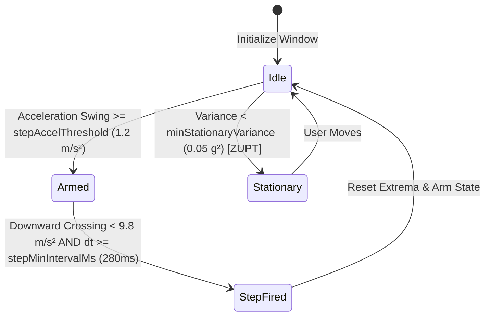
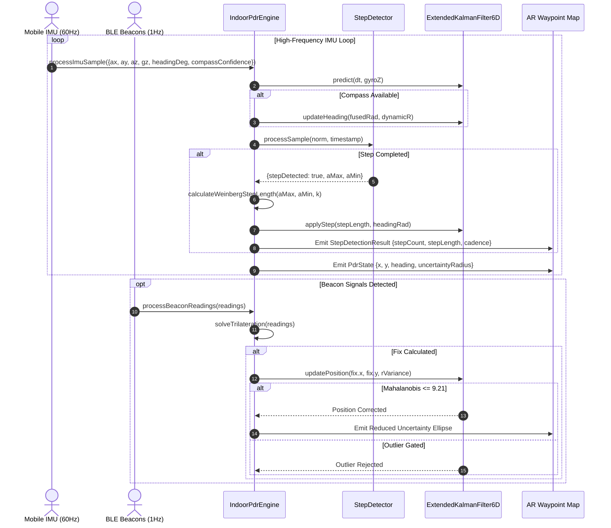

# Indoor Pedestrian Dead Reckoning (PDR) & Sensor Fusion Engine

This technical manual documents the mathematical foundations, kinematic models, signal processing pipelines, and state estimation algorithms powering WorkSphere's **Indoor Pedestrian Dead Reckoning (PDR)** and **Extended Kalman Filter (EKF) Sensor Fusion Engine** ([`src/lib/spatial/indoorPdrEngine.ts`](file:///c:/Users/admin/Desktop/workfere/src/lib/spatial/indoorPdrEngine.ts)).

---

## 1. Executive Summary & Architectural Overview

In indoor corporate venues, multi-story office parks, and subterranean co-working environments, satellite-based GNSS/GPS signals are unavailable or severely degraded by multipath reflections and concrete attenuation.

WorkSphere achieves continuous sub-meter indoor localization by fusing:
1. **High-Frequency Inertial Measurement Unit (IMU)** dead reckoning (accelerometer + gyroscope at 60–100 Hz).
2. **Tilt-Compensated Magnetometer Heading** with dynamic confidence weighting.
3. **Asynchronous RF Bluetooth Low Energy (BLE) Beacons** (1–5 Hz) via a continuous-discrete 6-State Extended Kalman Filter.

```
┌────────────────────────────────────────────────────────────────────────────────────────┐
│                        INDOOR PDR SENSOR FUSION ARCHITECTURE                           │
└────────────────────────────────────────────────────────────────────────────────────────┘

    Device IMU (60-100Hz)                                BLE Beacons / Anchors (1-5Hz)
   ┌───────────────────────┐                            ┌──────────────────────────────┐
   │ 3-Axis Accelerometer  │                            │ BLE Beacon RSSI Feeds (iBeacon│
   │ 3-Axis Gyroscope      │                            │ or Eddystone UUID / TxPower) │
   └───────────┬───────────┘                            └──────────────┬───────────────┘
               │                                                       │
               ▼                                                       ▼
   ┌───────────────────────┐                            ┌──────────────────────────────┐
   │ Kinematic Step Engine │                            │ Log-Distance Path Loss Model │
   │ - Dynamic peak/valley │                            │ - Distance: d = 10^((Tx-RSSI)│
   │ - Variance gate (ZUPT)│                            │             / (10*n))        │
   │ - Weinberg step length│                            └──────────────┬───────────────┘
   └───────────┬───────────┘                                           │
               │                                                       ▼
               │ (Step Length L, Heading θ)             ┌──────────────────────────────┐
               │                                        │ Linearized Least-Squares     │
               │                                        │ Trilateration / Single-Range │
               │                                        └──────────────┬───────────────┘
               │                                                       │ (x_b, y_b, d)
               ▼                                                       ▼
   ┌───────────────────────────────────────────────────────────────────────────────────┐
   │                      6-STATE EXTENDED KALMAN FILTER (EKF)                         │
   │                                                                                   │
   │   State Vector: x = [ x, y, vx, vy, θ, bg ]^T                                     │
   │                                                                                   │
   │   1. Prediction (IMU Kinematics & Gyro Integration):                              │
   │      x^- = f(x, ω, dt)                                                            │
   │      P^- = F * P * F^T + Q                                                        │
   │                                                                                   │
   │   2. Mahalanobis Innovation Gating (Outlier / Multipath Rejection):               │
   │      d_M^2 = y^T * S^-1 * y <= χ^2_threshold (9.21 @ 99% CI)                     │
   │                                                                                   │
   │   3. Measurement Update (Beacon Fixes / Range Ingestion):                         │
   │      K = P^- * H^T * S^-1                                                         │
   │      x^+ = x^- + K * y                                                            │
   │      P^+ = (I - K * H) * P^-                                                      │
   └─────────────────────────────────────────┬─────────────────────────────────────────┘
                                             │
                                             ▼
                          ┌──────────────────────────────────────┐
                          │ Output Position & Uncertainty:       │
                          │ - Estimated (x, y) coordinates (m)   │
                          │ - Smoothed Heading θ (rad/deg)       │
                          │ - 1-Sigma Covariance Ellipse (a,b,φ) │
                          │ - Step Cadence & Frequency (Hz/SPM)  │
                          │ - Velocity Vector (vx, vy)           │
                          └──────────────────────────────────────┘
```

---

## 2. IMU Step Detection & Stature Biomechanics

### 2.1 Dynamic Acceleration & Zero-Crossing Detection

The step detection engine (`StepDetector`) isolates vertical pedestrian locomotion impulses from high-frequency device vibration, phone handling, and ambient noise.



1. **Norm Acceleration**: Total acceleration magnitude is computed from 3-axis readings:
   $$a_{\text{norm}}(t) = \sqrt{a_x^2(t) + a_y^2(t) + a_z^2(t)}$$

2. **Moving Average Filter**:
   High-frequency jitter is eliminated using a sliding window moving average ($N = 7$ samples):
   $$a_{\text{smoothed}}(t) = \frac{1}{N} \sum_{i=0}^{N-1} a_{\text{norm}}(t - i)$$

3. **Stationary Variance Gating (Zero-Velocity Update / Anti-Jitter)**:
   To prevent false step increments when the user is seated or holding the phone at a desk, a 10-sample sliding window of acceleration sample variance $\sigma_a^2$ in $g^2$ is monitored:
   $$\sigma_a^2 = \frac{1}{M \cdot g^2} \sum_{i=1}^{M} (a_{\text{norm}, i} - \bar{a})^2, \quad g = 9.80665\text{ m/s}^2$$
   If $\sigma_a^2 < 0.05\text{ g}^2$ (`minStationaryVariance`), the detector disarms, freezes local extrema, and suppresses false step detections.

4. **Finite State Machine & Zero-Crossing Trigger**:
   - **Arming Condition**: The state machine tracks local extrema ($a_{\text{peak}}, a_{\text{valley}}$). When the dynamic swing $\Delta a = a_{\text{peak}} - a_{\text{valley}} \ge 1.2\text{ m/s}^2$ (`stepAccelThreshold`), the detector is armed.
   - **Trigger Condition**: When armed, a valid footstep is triggered when the smoothed acceleration falls back through gravity ($a_{\text{smoothed}} < 9.8\text{ m/s}^2$) and the cooldown interval has elapsed:
     $$\Delta t = t_{\text{current}} - t_{\text{lastStep}} \ge 280\text{ ms} \quad (\texttt{stepMinIntervalMs})$$

### 2.2 Step Frequency & Cadence Derivation

Pedestrian step frequency and cadence are computed using the timestamp delta between successive verified step peaks (`calculateStepFrequency`):

$$f_{\text{step}} = \frac{1000}{\max(100, \, \Delta t_{\text{ms}})} \text{ Hz}$$
$$\text{Cadence}_{\text{spm}} = f_{\text{step}} \times 60 \text{ steps/min}$$

- **Numerical Guarding**: Enforces a floor of $100\text{ ms}$ on $\Delta t$ and verifies `Number.isFinite(deltaMs) && deltaMs > 0` to prevent division-by-zero or `Infinity` upon sensor anomalies.

### 2.3 Weinberg Biomechanical Step Length Model

Human stride length varies non-linearly with vertical center-of-mass bounce. WorkSphere utilizes the empirical **Weinberg Step Length Model** (`calculateWeinbergStepLength`):

$$L_{\text{step}} = k \cdot \sqrt[4]{a_{\max} - a_{\min}} = k \cdot (a_{\max} - a_{\min})^{0.25}$$

Where:
- $a_{\max}$: Peak vertical acceleration recorded during the step stride cycle ($\text{m/s}^2$).
- $a_{\min}$: Valley vertical acceleration recorded during the step stride cycle ($\text{m/s}^2$).
- $k$: Calibrated user stature coefficient (default: $k = 0.42$).

To guarantee physical plausibility across user demographics, the estimated step length is clamped:
$$L_{\text{step}} = \text{clamp}\left(k \cdot (a_{\max} - a_{\min})^{0.25}, \, 0.30\text{ m}, \, 1.25\text{ m}\right)$$

### 2.4 Discrete Step Displacement & Velocity Decoupling

In the EKF (`applyStep`), a detected step is applied as a discrete coordinate displacement:
$$\Delta x = L_{\text{step}} \cos(\theta), \quad \Delta y = L_{\text{step}} \sin(\theta)$$
$$x \leftarrow x + \Delta x, \quad y \leftarrow y + \Delta y$$

> [!IMPORTANT]
> The step detector triggers at the **end** of a pedestrian stride. Seeding continuous velocity state ($v_x = \frac{\Delta x}{\Delta t}$) previously caused the continuous prediction step (`predict()`) to integrate the displacement repeatedly on every subsequent IMU sample, inflating reported distance by $10\times$–$19\times$. WorkSphere zeroes the continuous velocity state ($v_x = 0, v_y = 0$) upon step application and injects a discrete variance pulse ($\Delta P = 0.05 L_{\text{step}}^2$) into the position covariance.

---

## 3. Orientation & Tilt-Compensated Heading Fusion

### 3.1 Gyroscope & Magnetometer Complementary Fusion

Yaw heading angle $\theta$ relative to the venue coordinate frame blends high-rate angular velocity integration with magnetometer compass azimuth:

$$\theta_{\text{gyro}} = \text{normalizeAngle}(\theta_{k-1} + \omega_z \cdot \Delta t)$$
$$\theta_{\text{fused}} = \text{normalizeAngle}(\alpha_{\text{dynamic}} \cdot \theta_{\text{gyro}} + (1 - \alpha_{\text{dynamic}}) \cdot \theta_{\text{mag}})$$

Where:
- $\omega_z$: Gyroscope angular rate around the Z-axis corrected for bias $(\omega_z - b_g)$.
- $\theta_{\text{mag}}$: Tilt-compensated magnetometer compass heading converted to radians via `degToRad()`.
- $\alpha_{\text{dynamic}}$: Adaptive complementary weight.

### 3.2 Dynamic Sensor Confidence & Covariance Scaling

Indoor office environments often suffer from localized magnetic distortion caused by structural steel beams, server racks, and elevator motors. The engine dynamically scales both the complementary filter weight and the EKF measurement covariance ($R$) based on reported magnetometer confidence $c \in [0.001, 1.0]$:

$$R_{\text{dynamic}} = \frac{R_{\text{base}}}{c}, \quad R_{\text{base}} = 0.05\text{ rad}^2$$
$$\alpha_{\text{dynamic}} = 1 - (1 - \alpha_{\text{base}}) \cdot c, \quad \alpha_{\text{base}} = 0.96$$

- **High Magnetometer Accuracy ($c \to 1.0$)**: $\alpha \to 0.96$, fusing 4% magnetometer corrections per step.
- **Magnetic Interference / Distortion ($c \to 0$)**: $\alpha \to 1.0$ and $R_{\text{dynamic}} \to \infty$, causing the filter to smoothly ignore corrupted compass readings and rely strictly on gyro dead reckoning.

### 3.3 Continuous Angular Unwrapping

To eliminate circular discontinuity artifacts at the $-\pi \leftrightarrow \pi$ boundary, all angular differences undergo modular normalization:

$$\text{normalizeAngle}(\theta) = \theta - 2\pi \cdot \left\lfloor \frac{\theta + \pi}{2\pi} \right\rfloor \in [-\pi, \pi]$$

---

## 4. RF Beacon Propagation & Multilateration

### 4.1 Log-Distance Path Loss Model

Received Signal Strength Indication (RSSI) from BLE beacons is transformed into physical distance $d$ via the indoor log-distance path loss formulation (`calculateRssiDistance`):

$$\text{RSSI} = P_{\text{tx}} - 10 \cdot n \cdot \log_{10}\left(\frac{d}{d_0}\right) + X_\sigma$$

Solving for distance $d$ (reference distance $d_0 = 1\text{ meter}$):

$$d = 10^{\frac{P_{\text{tx}} - \text{RSSI}}{10 \cdot n}}$$

Where:
- $P_{\text{tx}}$: Factory-calibrated RSSI at 1 meter (default: $-59\text{ dBm}$).
- $n$: Indoor attenuation path loss exponent (default: $2.5$).
- Output bounds: Clamped between $0.1\text{ m}$ and $100.0\text{ m}$.

### 4.2 Linearized Least-Squares Multilateration

When 3 or more valid beacon signals are received (`solveTrilateration`), circle intersection equations $(x - x_i)^2 + (y - y_i)^2 = d_i^2$ are linearized by subtracting the reference anchor $m = N$:

$$\begin{bmatrix}
2(x_1 - x_m) & 2(y_1 - y_m) \\
2(x_2 - x_m) & 2(y_2 - y_m)
\end{bmatrix}
\begin{bmatrix}
x \\ y
\end{bmatrix}
=
\begin{bmatrix}
x_1^2 + y_1^2 - d_1^2 - (x_m^2 + y_m^2 - d_m^2) \\
x_2^2 + y_2^2 - d_2^2 - (x_m^2 + y_m^2 - d_m^2)
\end{bmatrix}$$

$$\mathbf{A} \mathbf{x} = \mathbf{b} \implies \begin{bmatrix} \hat{x} \\ \hat{y} \end{bmatrix} = \frac{1}{\det(\mathbf{A})} \begin{bmatrix} A_{22} b_1 - A_{12} b_2 \\ -A_{21} b_1 + A_{11} b_2 \end{bmatrix}$$

#### Collinear Anchor Detection & Weighted Centroid Fallback
If the determinant $|\det(\mathbf{A})| < 10^{-6}$ (e.g. beacons deployed along a straight corridor wall), matrix inversion is ill-conditioned. The solver automatically degrades to an inverse-variance weighted centroid:

$$\mathbf{x}_{\text{centroid}} = \frac{\sum_{i=1}^N w_i \mathbf{x}_i}{\sum_{i=1}^N w_i}, \quad w_i = \frac{1}{\max(0.1, d_i^2)}$$

### 4.3 Asynchronous Single-Beacon Ranging Update

When fewer than 3 beacons are detected, the engine applies scalar range corrections (`processSingleBeaconRssi` / `updateRange`) to prevent dead-reckoning drift:

- **Non-Linear Range Function**: $h(\mathbf{x}) = \sqrt{(x - x_b)^2 + (y - y_b)^2}$
- **Measurement Jacobian**: $\mathbf{H} = \left[ \frac{x - x_b}{\hat{d}}, \, \frac{y - y_b}{\hat{d}}, \, 0, \, 0, \, 0, \, 0 \right]$
- **Distance-Dependent Measurement Variance**:
  $$\sigma_R^2 = \max\left(1.0, \, (0.25 d)^2 + 1.5\right)$$
- **1-DOF Mahalanobis Innovation Gating**:
  $$\frac{y^2}{S} \le 6.63 \quad (\chi_1^2 \text{ at } 99\% \text{ CI})$$

---

## 5. 6-State Extended Kalman Filter (EKF)

### 5.1 State Vector Definition

The continuous kinematic state $\mathbf{x} \in \mathbb{R}^6$ tracks 2D planar position, velocities, yaw, and gyro bias:

$$\mathbf{x} = \begin{bmatrix} x \\ y \\ v_x \\ v_y \\ \theta \\ b_g \end{bmatrix} = \begin{bmatrix} \text{Local East position (meters)} \\ \text{Local North position (meters)} \\ \text{East velocity (m/s)} \\ \text{North velocity (m/s)} \\ \text{Heading angle (radians)} \\ \text{Gyroscope Z-axis bias (rad/s)} \end{bmatrix}$$

### 5.2 Kinematic Prediction (Time Update)

Between measurement updates, state propagation over sampling interval $\Delta t$ follows:

$$\mathbf{x}_k^- = \begin{bmatrix}
x_{k-1} + v_{x, k-1} \cdot \Delta t \\
y_{k-1} + v_{y, k-1} \cdot \Delta t \\
v_{x, k-1} \cdot \gamma \\
v_{y, k-1} \cdot \gamma \\
\text{normalizeAngle}(\theta_{k-1} + (\omega_{z, k} - b_{g, k-1}) \cdot \Delta t) \\
b_{g, k-1}
\end{bmatrix}$$

Where $\gamma = 0.95$ is a velocity damping coefficient.

#### Covariance Time Update:
$$\mathbf{P}_k^- = \mathbf{F} \mathbf{P}_{k-1}^+ \mathbf{F}^T + \mathbf{Q}$$

Process noise diagonal:
$$\mathbf{Q} = \text{diag}\left(\sigma_x^2, \, \sigma_y^2, \, \sigma_{vx}^2, \, \sigma_{vy}^2, \, \sigma_\theta^2, \, \sigma_{bg}^2\right)$$

### 5.3 2D Position Measurement Update & Mahalanobis Gating

When a 2D trilateration fix $\mathbf{z} = [z_x, z_y]^T$ is ingested:
- Innovation: $\mathbf{y} = \mathbf{z} - [x^-, y^-]^T$
- Innovation Covariance: $\mathbf{S} = \mathbf{H} \mathbf{P}^- \mathbf{H}^T + \mathbf{R} \in \mathbb{R}^{2 \times 2}$

#### Mahalanobis Multipath Rejection:
$$d_M^2 = \mathbf{y}^T \mathbf{S}^{-1} \mathbf{y}$$
$$\text{If } d_M^2 > 9.21 \implies \text{REJECT OUTLIER (Multipath reflection or jump)}$$

#### Kalman Gain & State Correction:
$$\mathbf{K} = \mathbf{P}^- \mathbf{H}^T \mathbf{S}^{-1}$$
$$\mathbf{x}^+ = \mathbf{x}^- + \mathbf{K} \mathbf{y}$$
$$\mathbf{P}^+ = (\mathbf{I} - \mathbf{K} \mathbf{H}) \mathbf{P}^-$$

---

## 6. Spatial Uncertainty Covariance Ellipse

The 1-sigma positional uncertainty ellipse is derived from the $2 \times 2$ submatrix $\mathbf{P}_{xy} = \begin{bmatrix} P_{xx} & P_{xy} \\ P_{yx} & P_{yy} \end{bmatrix}$:

1. **Eigenvalues $\lambda_1, \lambda_2$**:
   $$\lambda_{1,2} = \frac{\text{tr}(\mathbf{P}_{xy}) \pm \sqrt{\text{tr}(\mathbf{P}_{xy})^2 - 4 \det(\mathbf{P}_{xy})}}{2}$$
2. **Semi-Axes**:
   $$a = \sqrt{\lambda_1}, \quad b = \sqrt{\lambda_2}$$
3. **Ellipse Orientation $\phi$**:
   $$\phi = \frac{1}{2} \operatorname{atan2}(2 P_{xy}, \, P_{xx} - P_{yy})$$
4. **1-Sigma Uncertainty Radius ($R_{1\sigma}$)**:
   $$R_{1\sigma} = \sqrt{\operatorname{tr}(\mathbf{P}_{xy})} = \sqrt{P_{xx} + P_{yy}}$$

---

## 7. Engine Lifecycle Sequence Flow



---

## 8. Developer Integration Guide

### 8.1 Engine Instantiation

```typescript
import {
  IndoorPdrEngine,
  type ImuSample,
  type BeaconReading,
} from "@/lib/spatial/indoorPdrEngine";

const pdrEngine = new IndoorPdrEngine(
  { x: 0, y: 0, heading: 0 },
  {
    weinbergK: 0.42,
    stepAccelThreshold: 1.2,
    minStationaryVariance: 0.05,
    gyroAlpha: 0.96,
    measurementNoiseBeacon: 4.0,
    outlierGateThreshold: 9.21,
  }
);
```

### 8.2 Ingesting IMU & Beacon Telemetry

```typescript
// 1. Device Motion & Orientation Ingestion
window.addEventListener("devicemotion", (event) => {
  const acc = event.accelerationIncludingGravity;
  const rot = event.rotationRate;
  if (!acc) return;

  const sample: ImuSample = {
    timestamp: performance.now(),
    ax: acc.x || 0,
    ay: acc.y || 0,
    az: acc.z || 0,
    gz: rot?.alpha ? (rot.alpha * Math.PI) / 180 : undefined,
  };

  const stepResult = pdrEngine.processImuSample(sample);
  if (stepResult) {
    console.log(`Step ${stepResult.stepCount} detected: ${stepResult.stepLength}m, Cadence: ${stepResult.cadence} Hz`);
  }
});

// 2. BLE Beacon Multilateration Ingestion
function handleBleBeaconScan(beacons: BeaconReading[]) {
  const positionFix = pdrEngine.processBeaconReadings(beacons);
  if (positionFix) {
    console.log(`Fused Beacon Fix: (${positionFix.x}m, ${positionFix.y}m) ± ${positionFix.estimatedAccuracy}m`);
  }
}

// 3. Query Real-Time State & Uncertainty Ellipse
const state = pdrEngine.getState();
const ellipse = pdrEngine.getUncertaintyEllipse();

console.log(`Coordinates: (${state.x.toFixed(2)}m, ${state.y.toFixed(2)}m) ± ${state.uncertaintyRadius.toFixed(2)}m`);
console.log(`Heading: ${state.headingDegrees.toFixed(1)}°`);
```

---

## 9. Parameter Tuning Matrix

| Parameter | Default | Recommended Range | Description & Operational Impact |
| :--- | :--- | :--- | :--- |
| `weinbergK` | `0.42` | $0.35 - 0.55$ | Biomechanical stature multiplier. Calibrate up for taller users ($>1.85\text{m}$) and down for shorter users ($<1.60\text{m}$). |
| `stepAccelThreshold` | `1.2` | $0.8 - 2.2\text{ m/s}^2$ | Peak-to-valley acceleration swing required to arm step detection. Suppresses handheld typing jitter. |
| `stepMinIntervalMs` | `280` | $200 - 450\text{ ms}$ | Minimum step cooldown threshold. Prevents double-counting from heel-strike reverberation. |
| `minStationaryVariance` | `0.05` | $0.02 - 0.15\text{ g}^2$ | Acceleration sample variance floor. Rejects false steps while seated or resting device on a desk. |
| `gyroAlpha` | `0.96` | $0.90 - 0.99$ | Complementary filter gyro weight. Higher values resist indoor magnetic disturbances. |
| `processNoisePosition` | `0.05` | $0.01 - 0.20\text{ m}^2$ | EKF process noise covariance for position states. |
| `measurementNoiseBeacon`| `4.0` | $1.0 - 16.0\text{ m}^2$ | Beacon measurement noise variance $\mathbf{R}$. Controls trust balance between RF anchors and IMU dead reckoning. |
| `outlierGateThreshold` | `9.21` | $5.99 - 13.82$ | Mahalanobis $\chi_2^2$ threshold at 99% CI. Filters out multipath RF bounces and sudden sensor jumps. |
