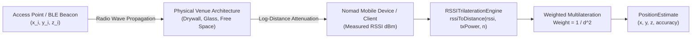

# RSSITrilaterationEngine: Path Loss Exponent (PLE) & Reference RSSI Calibration Manual

## 1. Executive Summary

WorkSphere uses indoor wireless radio triangulation to power autonomous desk check-ins, indoor wayfinding, and spatial occupancy heatmaps. The **`RSSITrilaterationEngine`** ([`src/core/spatial/RSSITrilaterationEngine.ts`](file:///c:/Users/admin/Desktop/workfere/src/core/spatial/RSSITrilaterationEngine.ts)) and background worker ([`src/workers/wifiScanningWorker.ts`](file:///c:/Users/admin/Desktop/workfere/src/workers/wifiScanningWorker.ts)) convert raw Received Signal Strength Indication (RSSI) samples into 2D/3D Euclidean coordinates $(x, y, z)$.

Because electromagnetic waves attenuate non-linearly through walls, furniture, glass partitions, and human bodies, uncalibrated trilateration can yield errors exceeding $5\text{--}8\text{ meters}$. This manual provides venue managers and deployment engineers with:
- **Log-Distance Path Loss Model Fundamentals:** Mathematical basis linking RSSI to metric distance.
- **Reference Signal Strength ($A_0$ / `txPower` at 1m):** Standardized calibration protocol.
- **Path Loss Exponent ($n$ / PLE) Matrix:** Environment-specific tuning for open coworking lounges, cubicle layouts, and dense concrete partitioned offices.
- **Field Calibration Step-by-Step Procedure:** Linear regression methodology for site surveys.

---

## 2. Radio Propagation Model & Mathematical Foundations



### 2.1 The Log-Distance Path Loss Model

The received signal strength at a physical distance $d$ (in meters) is modeled by:

$$\text{RSSI}(d) = A_0 - 10 \cdot n \cdot \log_{10}(d) + X_\sigma$$

Where:
- $\text{RSSI}(d)$: Received signal strength indicator in dBm at distance $d$.
- $A_0$ (`txPower`): Reference RSSI at exactly $1.0\text{ meter}$ from the transmitter (typically $-35\text{ dBm}$ to $-55\text{ dBm}$).
- $n$ (`n` / PLE): **Path Loss Exponent**, capturing the environmental rate of signal decay.
- $d$: Euclidean distance in meters between the transmitter and mobile device.
- $X_\sigma$: Zero-mean Gaussian random variable representing shadow fading and multipath interference ($X_\sigma \sim \mathcal{N}(0, \sigma^2)$).

### 2.2 Distance Inversion Equation

To convert observed RSSI back to a metric distance estimate:

$$d = 10^{\frac{A_0 - \text{RSSI}}{10 \cdot n}}$$

Implemented in `RSSITrilaterationEngine.ts`:

```typescript
public rssiToDistance(rssi: number, txPower: number, n: number): number {
    if (rssi >= txPower) return 1.0;
    const ratio = (txPower - rssi) / (10 * n);
    return Math.pow(10, ratio);
}
```

---

## 3. Parameter Reference & Layout Tuning Matrix

The Path Loss Exponent $n$ directly dictates how rapidly distance estimates expand per decibel drop:
- A **lower $n$** assumes open line-of-sight propagation with low decay.
- A **higher $n$** compensates for structural signal absorption by walls, columns, and metal fixtures.

### 3.1 Recommended PLE & $A_0$ Matrix by Venue Layout

| Architectural Layout | Typical PLE ($n$) | Reference RSSI ($A_0$ @ 1m) | Shadow Margin ($\sigma$) | Description & Dominant Obstacles |
| :--- | :---: | :---: | :---: | :--- |
| **Free Space / Anechoic** | $2.0$ | $-40\text{ to } -45\text{ dBm}$ | $\pm 1\text{ dB}$ | Theoretical baseline; unobstructed line-of-sight (LOS). |
| **Open Coworking Hall** | $2.2\text{--}2.5$ | $-42\text{ to } -48\text{ dBm}$ | $\pm 3\text{ dB}$ | High ceilings, open hot-desk tables, minimal partitions, soft chairs. |
| **Semi-Open / Cubicles** | $2.6\text{--}3.0$ | $-45\text{ to } -50\text{ dBm}$ | $\pm 4\text{ dB}$ | Acoustic fabric dividers, wood bookshelves, monitor clusters. |
| **Glass Enclosures / Phone Pods** | $3.1\text{--}3.5$ | $-48\text{ to } -54\text{ dBm}$ | $\pm 5\text{ dB}$ | Soundproof double-glazed meeting rooms, acoustic phone booths. |
| **Walled Offices (Drywall / Wood)** | $3.3\text{--}3.8$ | $-50\text{ to } -56\text{ dBm}$ | $\pm 6\text{ dB}$ | Closed private offices, hollow gypsum walls, solid wooden doors. |
| **Dense Industrial / Concrete** | $4.0\text{--}4.5$ | $-54\text{ to } -62\text{ dBm}$ | $\pm 8\text{ dB}$ | Reinforced concrete pillars, metal elevator shafts, brick firewalls. |

---

## 4. Step-by-Step Field Calibration Protocol

Venue managers should perform calibration during venue setup or after major architectural remodeling.

### Phase 1: Reference Signal Calibration ($A_0$)
1. Position a test device (smartphone or tablet) at exactly **$1.0\text{ meter}$** along the direct line-of-sight (LOS) from the Access Point or BLE anchor.
2. Ensure no humans or metal objects stand between the transmitter and receiver.
3. Record 60 consecutive RSSI samples (sampling at $1\text{ Hz}$ for 1 minute).
4. Compute the arithmetic mean:
   $$A_0 = \frac{1}{M} \sum_{i=1}^{M} \text{RSSI}_i$$
5. Update `txPower` for this access point in the venue configuration.

### Phase 2: Multi-Distance Survey & PLE Regression ($n$)
1. Measure and mark known ground-truth distances from the AP across the room:
   $$d \in \{1.0\text{m}, 2.0\text{m}, 4.0\text{m}, 6.0\text{m}, 8.0\text{m}, 10.0\text{m}\}$$
2. At each distance point $k$, record average RSSI $\overline{\text{RSSI}}_k$.
3. Convert distances to log scale: $x_k = 10 \cdot \log_{10}(d_k)$.
4. Compute signal drop: $y_k = A_0 - \overline{\text{RSSI}}_k$.
5. Fit a linear regression through the origin ($y = n \cdot x$):
   $$n = \frac{\sum (x_k \cdot y_k)}{\sum (x_k^2)}$$

```
Signal Drop (dB)
 ^
 |             * (10m, y_6)
 |          * (8m, y_5)
 |       * (6m, y_4)
 |    * (4m, y_3)
 |  * (2m, y_2)
 | * (1m, y_1 = 0)
 +-------------------------> 10 * log10(d)
```

---

## 5. Multilateration & Error Weighting

In [`src/core/spatial/RSSITrilaterationEngine.ts`](file:///c:/Users/admin/Desktop/workfere/src/core/spatial/RSSITrilaterationEngine.ts), proximity weighting minimizes error from distant APs:

$$W_i = \frac{1}{d_i^2}$$

$$\hat{x} = \frac{\sum_{i=1}^M x_i \cdot W_i}{\sum_{i=1}^M W_i}, \quad \hat{y} = \frac{\sum_{i=1}^M y_i \cdot W_i}{\sum_{i=1}^M W_i}, \quad \hat{z} = \frac{\sum_{i=1}^M z_i \cdot W_i}{\sum_{i=1}^M W_i}$$

### Residual Accuracy Metric
The engine calculates empirical accuracy by evaluating distance residuals across all anchors:

$$\text{accuracy} = \frac{1}{M} \sum_{i=1}^M \left| \sqrt{(\hat{x} - x_i)^2 + (\hat{y} - y_i)^2 + (\hat{z} - z_i)^2} - d_i \right|$$

- An `accuracy` value $< 1.5\text{ m}$ indicates high confidence for seat-level localization.
- Values $> 3.5\text{ m}$ indicate severe multipath distortion or mismatched PLE parameters.

---

## 6. Access Point Configuration Schema

Venue managers configure access point coordinates and calibrated PLE parameters in venue layout records:

```typescript
import { AccessPoint } from '@/core/spatial/RSSITrilaterationEngine';

export const SOMA_VENUE_BEACONS: AccessPoint[] = [
  {
    id: "ap-lounge-01",
    x: 4.5,
    y: 12.0,
    z: 2.8,
    rssi: -58,
    txPower: -44, // Calibrated A0 at 1m
    n: 2.4        // Open coworking space
  },
  {
    id: "ap-booth-02",
    x: 18.2,
    y: 6.5,
    z: 2.8,
    rssi: -71,
    txPower: -46, // Calibrated A0 at 1m
    n: 3.4        // Acoustic phone booth zone
  },
  {
    id: "ap-office-03",
    x: 22.0,
    y: 19.5,
    z: 2.8,
    rssi: -66,
    txPower: -48, // Calibrated A0 at 1m
    n: 3.6        // Walled private team rooms
  }
];
```
