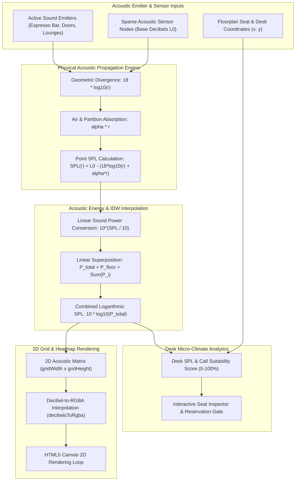

# Engineering Specification: SpatialAcousticGradientViewer 2D Sound-Level Heat-Map & IDW Interpolation Mechanics

## 1. Executive Summary & Engine Architecture

The WorkSphere Spatial Acoustic Engine ([`src/lib/spatial/acousticGradientEngine.ts`](file:///c:/Users/admin/Desktop/workfere/src/lib/spatial/acousticGradientEngine.ts)) and UI Viewer ([`src/components/venue/SpatialAcousticGradientViewer.tsx`](file:///c:/Users/admin/Desktop/workfere/src/components/venue/SpatialAcousticGradientViewer.tsx)) provide real-time 2D spatial acoustic modeling, sound pressure level (SPL) decay, and heat-map gradient rendering across venue floorplans. Remote workers require precise acoustic transparency to find quiet reading nooks, avoid loud espresso steam wands, or locate suitable areas for confidential voice calls.

By combining physical geometric sound attenuation with logarithmic acoustic energy superposition and Inverse Distance Weighting (IDW) interpolation mechanics, the engine renders continuous $30\text{ dB}$ to $75\text{ dB}$ sound pressure contours from sparse sensor nodes and discrete acoustic emitters.



---

## 2. Physical Acoustic Decay & Sound Attenuation Mathematics

Sound pressure level (SPL) degrades with distance from a noise source due to spherical wave divergence and atmospheric/partition absorption.

### 2.1 Geometric Divergence & Atmospheric Absorption

The acoustic field engine models point SPL decay using a modified inverse square law that includes an air absorption factor $\alpha$:

$$\text{SPL}(r) = \max\left(30, L_{\text{source}} - \left(18 \cdot \log_{10}(r) + \alpha \cdot r\right)\right)$$

Where:
- $L_{\text{source}}$ is the base emission level of the noise source in decibels ($\text{dB}$).
- $r$ is the Euclidean distance between the emitter $(x_e, y_e)$ and target location $(x, y)$, clamped to a minimum distance of $1.0\text{ unit}$ to avoid singularities near point sources:
  $$r = \max\left(1.0, \sqrt{(x - x_e)^2 + (y - y_e)^2}\right)$$
- $\alpha = 0.08\text{ dB/unit}$ represents atmospheric sound absorption and room partition dampening.

```typescript
export function calculatePointSPL(
  sourceDb: number,
  distanceUnits: number,
  absorptionFactor = 0.08
): number {
  const r = Math.max(1.0, distanceUnits);
  // Geometric divergence: 18 * log10(r) + atmospheric/partition absorption
  const decay = 18 * Math.log10(r) + absorptionFactor * r;
  return Math.max(30, Number((sourceDb - decay).toFixed(1)));
}
```

---

## 3. Inverse Distance Weighting (IDW) & Energy Superposition Mechanics

Because decibels are logarithmic ($10 \cdot \log_{10}(P/P_0)$), sound levels cannot be added linearly. Summing sound pressure from multiple emitters or interpolating between sparse sensor nodes requires converting decibels to linear sound power quantities.

### 3.1 Linear Sound Power Superposition

For a field coordinate $(x, y)$ influenced by $N$ active acoustic emitters, the total sound power $P_{\text{total}}$ combines the ambient acoustic room floor ($P_{\text{floor}} = 10^{30/10} = 1000\text{ linear energy units}$) with the contribution from each emitter:

$$P_{\text{total}} = 10^{\frac{30}{10}} + \sum_{i=1}^{N} 10^{\frac{\text{SPL}_i(r_i)}{10}}$$

The combined sound pressure level in decibels ($\text{SPL}_{\text{combined}}$) is calculated by converting $P_{\text{total}}$ back to logarithmic decibels, bounded between $30\text{ dB}$ (silent baseline) and $75\text{ dB}$ (maximum indoor threshold):

$$\text{SPL}_{\text{combined}} = \min\left(75, \max\left(30, 10 \cdot \log_{10}(P_{\text{total}})\right)\right)$$

### 3.2 Inverse Distance Weighting (IDW) for Sparse Sensor Interpolation

When interpolating continuous sound levels across grid coordinates $(x,y)$ from $K$ sparse sensor nodes $(x_k, y_k)$ with observed SPL levels $Z_k$, Inverse Distance Weighting assigns weights $w_k(x,y)$ inversely proportional to distance raised to power $p$ (typically $p=2$):

$$w_k(x,y) = \frac{1}{d((x,y), (x_k, y_k))^p}$$

$$\hat{Z}(x,y) = \frac{\sum_{k=1}^{K} w_k(x,y) \cdot Z_k}{\sum_{k=1}^{K} w_k(x,y)}$$

```typescript
// Core loop from src/lib/spatial/acousticGradientEngine.ts
for (let r = 0; r < gridHeight; r++) {
  const py = (r / (gridHeight - 1)) * 100;

  for (let c = 0; c < gridWidth; c++) {
    const px = (c / (gridWidth - 1)) * 100;

    let totalLinearEnergy = Math.pow(10, 30 / 10); // 30 dB ambient room floor

    for (const emitter of activeEmitters) {
      const dist = Math.hypot(px - emitter.x, py - emitter.y);
      const spl = calculatePointSPL(emitter.baseDecibels, dist);
      totalLinearEnergy += Math.pow(10, spl / 10);
    }

    const combinedDecibels = Math.min(
      75,
      Math.max(30, Number((10 * Math.log10(totalLinearEnergy)).toFixed(1)))
    );
    row.push(combinedDecibels);
  }
  grid.push(row);
}
```

---

## 4. Seat Micro-Climate Analytics & Call Suitability Scoring

Each desk or seat location $(x_d, y_d)$ is evaluated against all active sound sources to derive its predicted sound level, nearest noise hazard, distance metric, and suitability score for confidential voice calls.

### 4.1 Call Suitability Score Algorithm

Call suitability is expressed as a score from $0\%$ to $100\%$:
- $\le 36\text{ dB}$: $100\%$ optimal call suitability.
- $\ge 65\text{ dB}$: $5\%$ minimal call suitability.
- Intermediate levels decay linearly at approximately $-3.3\%$ per decibel above $36\text{ dB}$:

$$\text{Score}_{\text{call}} = \max\left(5, \min\left(100, \text{round}\left(100 - (\text{SPL}_{\text{predicted}} - 36) \times 3.3\right)\right)\right)$$

### 4.2 Acoustic Zone Categorization Matrix

| Zone Name | Decibel Range | Color Mapping | Description & Use Case | Call Suitability |
| :--- | :--- | :--- | :--- | :--- |
| **Silent Focus** | $\le 38\text{ dB}$ | Emerald (`#10B981`) | Deep focus reading, complex coding, confidential calls | $95\% - 100\%$ |
| **Soft Ambient** | $39 - 46\text{ dB}$ | Gentle Cyan (`#06B6D4`) | Standard desk working, light collaboration | $70\% - 94\%$ |
| **Buzz Lounge** | $47 - 56\text{ dB}$ | Amber (`#F59E0B`) | Group discussions, cafe background, casual meetings | $35\% - 69\%$ |
| **High Noise** | $> 56\text{ dB}$ | Crimson (`#EF4444`) | Active espresso bar, high foot-traffic entryways | $5\% - 34\%$ |

---

## 5. Heat-Map Color Mapping & HTML5 Canvas Rendering Loop

To render a smooth 2D gradient on the HTML5 Canvas, continuous decibel values in the matrix grid are mapped to RGBA color vectors using `decibelsToRgba(db)`:

```typescript
export function decibelsToRgba(db: number): [number, number, number, number] {
  if (db <= 38) {
    // Deep Focus Emerald (30-38 dB)
    return [16, 185, 129, 0.75];
  } else if (db <= 46) {
    // Gentle Cyan (39-46 dB)
    return [6, 182, 212, 0.75];
  } else if (db <= 56) {
    // Amber Buzz (47-56 dB)
    return [245, 158, 11, 0.8];
  } else {
    // Noise Hazard Crimson (>56 dB)
    return [239, 68, 68, 0.85];
  }
}
```

### 5.1 Canvas Projection Loop

The canvas render function projected in [`src/components/venue/SpatialAcousticGradientViewer.tsx`](file:///c:/Users/admin/Desktop/workfere/src/components/venue/SpatialAcousticGradientViewer.tsx) iterates across all cell coordinates $(r, c)$:

$$\text{cellW} = \frac{\text{canvas.width}}{\text{gridWidth}}, \quad \text{cellH} = \frac{\text{canvas.height}}{\text{gridHeight}}$$

```typescript
// Draw interpolated cells
for (let r = 0; r < gridHeight; r++) {
  for (let c = 0; c < gridWidth; c++) {
    const db = grid[r][c];
    const [red, green, blue, alpha] = decibelsToRgba(db);
    ctx.fillStyle = `rgba(${red}, ${green}, ${blue}, ${alpha})`;
    ctx.fillRect(c * cellW, r * cellH, cellW + 1, cellH + 1);
  }
}
```

Grid overlay lines ($40\text{px}$ pitch) are drawn over the heatmap buffer to provide spatial context and coordinate alignment.

---

## 6. Performance Optimization & Real-Time Execution

1. **Computational Complexity:**
   Computing a $50 \times 30$ grid ($1,500\text{ cells}$) with $N=4$ emitters requires $6,000$ distance calculations per frame, taking $< 2\text{ms}$ on modern JS V8 engines.
2. **Memoization & Double Buffering:**
   The gradient map calculation is memoized using React `useEffect` hooks triggered only when emitter states change. Canvas rendering uses direct 2D context manipulation to avoid unnecessary DOM element overhead.
