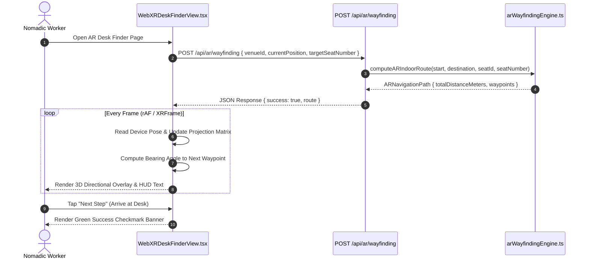

# WebXRDeskFinderView: AR Camera Projection & Device Prerequisites

## 1. Executive Summary & Overview

WorkSphere provides a WebXR-powered Augmented Reality (AR) indoor navigation system (`WebXRDeskFinderView.tsx`, `useWebXR.ts`, `arWayfindingEngine.ts`). By projecting real-time 3D directional path arrows, spatial anchors, and glowing desk bounding boxes onto a smartphone or AR headset camera stream, WorkSphere guides nomadic workers from a venue's entrance directly to their reserved desk.

```
+-----------------------------------------------------------------------------------+
|                            WEBXR DEVICE CAPABILITY CHECK                          |
|             (navigator.xr.isSessionSupported("immersive-ar"))                     |
+-----------------------------------------+-----------------------------------------+
                                          |
                      1. Check AR Support & Media Permissions
                                          |
                                          v
+-----------------------------------------------------------------------------------+
|                        WEBXR IMMERSIVE-AR SESSION INITIATION                      |
|  - requestSession("immersive-ar", { requiredFeatures: ["hit-test", "anchors"] })  |
|  - WebGL Context Binding & Camera Projection Matrix Initialization                |
+-----------------------------------------+-----------------------------------------+
                                          |
                      2. Raycast Hit-Test Anchors & Camera View Pose
                                          |
                                          v
+-----------------------------------------------------------------------------------+
|                         SPATIAL AR WAYFINDING ENGINE                              |
|  - Euclidean Distance: d = sqrt(Δx² + Δy² + Δz²)                                  |
|  - Horizontal Bearing Angle: θ = atan2(Δx, -Δz) * 180 / π                         |
|  - Turn-by-Turn Waypoint Actions (STRAIGHT, TURN_LEFT, TURN_RIGHT, ARRIVED)       |
+-----------------------------------------+-----------------------------------------+
                                          |
                      3. Render 3D HUD & Perspective Grid Overlay
                                          |
                                          v
+-----------------------------------------------------------------------------------+
|                        AUGMENTED REALITY DESK HUD VIEWPORT                        |
|                       (WebXRDeskFinderView.tsx)                                   |
+-----------------------------------------------------------------------------------+
```

Key objectives:
- **Device Session Initialization:** Standardized WebXR `immersive-ar` session handshake with fallback pathways for non-AR WebGL browsers.
- **Perspective Camera Projection:** 3D projection matrix calculations aligning WebGL render targets with the physical device camera field of view.
- **Spatial Hit-Testing & Anchors:** Real-time surface detection and local spatial anchor binding (`xrFrame.getHitTestResults`).
- **ADA Accessible Turn-by-Turn Guidance:** Directional wayfindingHUD with visual, text, and audible cue assistance.

---

## 2. WebXR Device Prerequisites & Session Initialization

Before initializing an AR session, WorkSphere performs feature detection against `navigator.xr` (`src/lib/webxr.ts`, `src/hooks/useWebXR.ts`).

### 2.1 Feature Detection & Capability Check

```typescript
export async function checkWebXRSupport(): Promise<boolean> {
  if (typeof navigator !== "undefined" && "xr" in navigator) {
    try {
      return await navigator.xr.isSessionSupported("immersive-ar");
    } catch {
      return false;
    }
  }
  return false;
}
```

### 2.2 WebXR Session Request Configuration

When requesting an `immersive-ar` session, required and optional WebXR features are specified:

```typescript
export async function startARSession(): Promise<XRSession | null> {
  if (!navigator.xr) return null;

  try {
    const session = await navigator.xr.requestSession("immersive-ar", {
      requiredFeatures: ["hit-test", "local-floor", "anchors"],
      optionalFeatures: ["dom-overlay", "light-estimation"],
      domOverlay: { root: document.getElementById("ar-overlay-root")! },
    });
    return session;
  } catch (err) {
    console.error("[WebXR] Failed to launch AR session:", err);
    return null;
  }
}
```

### 2.3 Browser Media Permission Handling

For devices that lack native WebXR hardware acceleration, `WebXRDeskFinderView.tsx` falls back to an environment camera stream (`getUserMedia`) layered under a WebGL 2D/3D HUD canvas:

```typescript
useEffect(() => {
  if (typeof navigator !== "undefined" && navigator.mediaDevices?.getUserMedia) {
    navigator.mediaDevices
      .getUserMedia({ video: { facingMode: "environment" } })
      .then((stream) => {
        if (videoRef.current) {
          videoRef.current.srcObject = stream;
        }
      })
      .catch(() => {
        // Camera permission denied or mock environment fallback
        setArSupported(false);
      });
  }
}, []);
```

---

## 3. Camera Projection Matrix Calculations

To correctly align 3D virtual waypoints with physical camera frames, the renderer updates the 3D camera projection matrix $\mathbf{P}$ every animation frame based on the active WebXR view configuration.

### 3.1 4x4 Perspective Projection Matrix Formulation

The general $4 \times 4$ perspective projection matrix $\mathbf{P}$ for a camera with near plane $n$, far plane $f$, aspect ratio $A = w / h$, and vertical field of view $\text{fov}_y$ is defined as:

$$\mathbf{P} = \begin{bmatrix}
\frac{1}{A \cdot \tan(\text{fov}_y / 2)} & 0 & 0 & 0 \\
0 & \frac{1}{\tan(\text{fov}_y / 2)} & 0 & 0 \\
0 & 0 & -\frac{f + n}{f - n} & -\frac{2 \cdot f \cdot n}{f - n} \\
0 & 0 & -1 & 0
\end{bmatrix}$$

For off-center asymmetric viewports (such as binocular WebXR head-mounted displays with frustum bounds $l, r, b, t$):

$$\mathbf{P} = \begin{bmatrix}
\frac{2n}{r - l} & 0 & \frac{r + l}{r - l} & 0 \\
0 & \frac{2n}{t - b} & \frac{t + b}{t - b} & 0 \\
0 & 0 & -\frac{f + n}{f - n} & -\frac{2fn}{f - n} \\
0 & 0 & -1 & 0
\end{bmatrix}$$

### 3.2 Model-View-Projection (MVP) Transformation

For any spatial 3D waypoint coordinate $\mathbf{p}_{\text{world}} = (x, y, z, 1)^T$:

$$\mathbf{p}_{\text{clip}} = \mathbf{P} \cdot \mathbf{V} \cdot \mathbf{M} \cdot \mathbf{p}_{\text{world}}$$

where $\mathbf{M}$ is the model matrix, $\mathbf{V}$ is the camera view matrix (`xrView.transform.inverse.matrix`), and $\mathbf{P}$ is the projection matrix (`xrView.projectionMatrix`).

```typescript
// Update Camera Matrix per Frame (src/components/ar/SeatARPointer.tsx)
function updateARCameraProjection(xrView: XRView, camera: THREE.PerspectiveCamera) {
  // Sync Three.js / WebGL projection matrix directly from WebXR XRView
  camera.projectionMatrix.fromArray(xrView.projectionMatrix);
  camera.projectionMatrixInverse.copy(camera.projectionMatrix).invert();
}
```

---

## 4. Spatial Hit-Test Anchors & Vector Mathematics (`arWayfindingEngine.ts`)

The spatial navigation engine computes distances and bearings between the device pose and targeted seat positions.

### 4.1 3D Spatial Distance Calculation

The 3D Euclidean distance $d(p_1, p_2)$ between camera position $p_1 = (x_1, y_1, z_1)$ and target seat $p_2 = (x_2, y_2, z_2)$:

$$d(p_1, p_2) = \sqrt{(x_2 - x_1)^2 + (y_2 - y_1)^2 + (z_2 - z_1)^2}$$

```typescript
export function calculate3DDistance(p1: Vector3D, p2: Vector3D): number {
  return Math.sqrt(
    Math.pow(p2.x - p1.x, 2) +
    Math.pow(p2.y - p1.y, 2) +
    Math.pow(p2.z - p1.z, 2)
  );
}
```

### 4.2 Horizontal Bearing Angle Calculation

The horizontal compass bearing angle $\theta_{\text{bearing}}$ (in degrees $0^\circ - 360^\circ$) from the camera pose to the target destination:

$$\theta_{\text{bearing}} = \text{atan2}(\Delta x, -\Delta z) \cdot \frac{180}{\pi} \pmod{360} \quad \text{where } \Delta x = x_2 - x_1, \, \Delta z = z_2 - z_1$$

```typescript
export function calculateHorizontalBearingDeg(from: Vector3D, to: Vector3D): number {
  const dx = to.x - from.x;
  const dz = to.z - from.z;
  let angle = Math.atan2(dx, -dz) * (180 / Math.PI);
  if (angle < 0) angle += 360;
  return Number(angle.toFixed(1));
}
```

---

## 5. Waypoint Navigation Flow & API Integration



### 5.1 Waypoint Action Categories

| Action Type | Description | HUD Visual Symbol |
| :--- | :--- | :--- |
| **`STRAIGHT`** | Continue straight along main corridor | ⬆️ Glowing Cyan Forward Arrow |
| **`TURN_LEFT`** | Turn 90° left into hallway aisle | ⬅️ Amber Left Turn Arrow |
| **`TURN_RIGHT`** | Turn 90° right towards desk pod | ➡️ Amber Right Turn Arrow |
| **`STAIRS_ELEVATOR`** | Ascend or descend floor levels | 📶 Level Change Indicator |
| **`ARRIVED`** | Reached reserved desk destination | ✅ Emerald Arrival Target Checkmark |

---

## 6. Summary Reference Matrix

| Property / Parameter | Variable / Constant | Default Value | Description |
| :--- | :--- | :--- | :--- |
| **Target WebXR Mode** | `sessionMode` | `"immersive-ar"` | Required WebXR session mode for passthrough AR |
| **Near Frustum Plane** | $n$ | `0.1 meters` | Minimum rendering distance threshold |
| **Far Frustum Plane** | $f$ | `100.0 meters` | Maximum rendering distance threshold |
| **Direct Line Threshold** | `DIRECT_LINE_DIST` | `4.0 meters` | Distance threshold for direct vs multi-waypoint pathing |
| **Polling Refresh Rate** | `rAF` / `XRSession` | $60 - 90\text{ FPS}$ | Animation frame rate for projection matrix updates |
