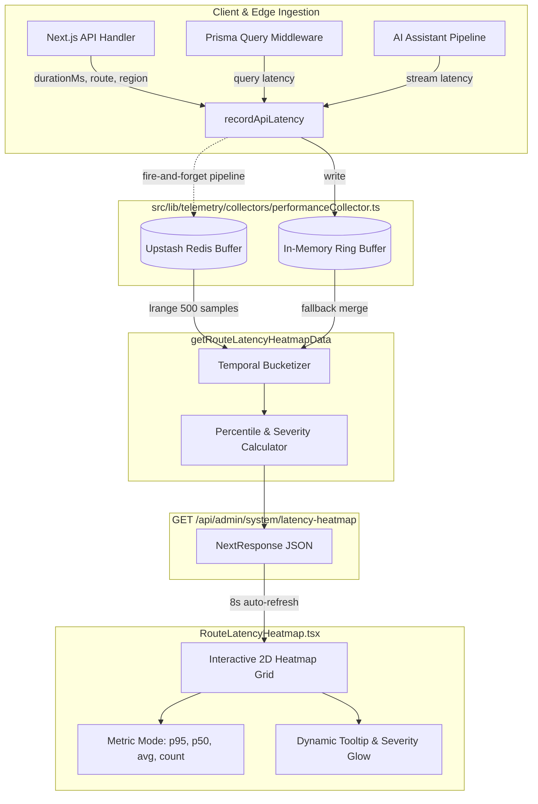

# Real-Time Route Latency Heatmap Telemetry Engine & Collector Architecture

This document provides a comprehensive technical manual for WorkSphere's real-time latency heatmap telemetry engine, metric collectors (`src/lib/telemetry/collectors/performanceCollector.ts`), Redis aggregation pipelines, administrative REST endpoints (`src/app/api/admin/system/latency-heatmap/route.ts`), and the visual heatmap matrix dashboard (`src/components/admin/RouteLatencyHeatmap.tsx`).

---

## Table of Contents

1. [Architectural Overview & Design Principles](#1-architectural-overview--design-principles)
2. [Telemetry Pipeline & Data Ingestion Flow](#2-telemetry-pipeline--data-ingestion-flow)
   - [Asynchronous Ingestion Hook (`recordApiLatency`)](#asynchronous-ingestion-hook-recordapilatency)
   - [Dual-Layer Storage: Upstash Redis & Bounded Ring Buffer](#dual-layer-storage-upstash-redis--bounded-ring-buffer)
   - [Timeout Isolation & Fault Tolerance](#timeout-isolation--fault-tolerance)
3. [Time-Series Matrix Discretization & Time Buckets](#3-time-series-matrix-discretization--time-buckets)
   - [Windowing Strategy ($1\text{h}$, $24\text{h}$, $7\text{d}$)](#windowing-strategy-1h-24h-7d)
   - [Bucket Interval Mathematics](#bucket-interval-mathematics)
4. [Statistical Aggregation & Percentile Engine](#4-statistical-aggregation--percentile-engine)
   - [Percentile Algorithms ($p_{50}, p_{95}, \text{avg}$)](#percentile-algorithms-p_50-p_95-textavg)
   - [Input Validation & Metric Guards](#input-validation--metric-guards)
5. [Latency Severity Classification & SLA Thresholds](#5-latency-severity-classification--sla-thresholds)
   - [Severity Grading Matrix](#severity-grading-matrix)
   - [Route Categorization Taxonomy](#route-categorization-taxonomy)
   - [Monitored Endpoints & Performance Baselines](#monitored-endpoints--performance-baselines)
6. [Heatmap REST API Specification](#6-heatmap-rest-api-specification)
   - [Endpoint Contract (`GET /api/admin/system/latency-heatmap`)](#endpoint-contract-get-apiadminsystemlatency-heatmap)
   - [Response Schema & Payload Structure](#response-schema--payload-structure)
7. [Admin UI Visualization Engine (`RouteLatencyHeatmap.tsx`)](#7-admin-ui-visualization-engine-routelatencyheatmaptsx)
   - [2D Temporal Heatmap Grid](#2d-temporal-heatmap-grid)
   - [Interactive Controls & Multi-Metric Modes](#interactive-controls--multi-metric-modes)
   - [Live Polling Loop & Race Condition Prevention](#live-polling-loop--race-condition-prevention)
8. [Operational Troubleshooting & Bottleneck Remediation](#8-operational-troubleshooting--bottleneck-remediation)

---

## 1. Architectural Overview & Design Principles

WorkSphere routes high-frequency real-time operations across AI streaming, spatial vector search, desk reservation mutexes, passkey authentications, and WebRTC signaling. To detect regressions and latency spikes across distributed microservices, the **Route Latency Heatmap** provides an interactive, two-dimensional temporal matrix showing latency distributions over time.



### Core Design Principles
1. **Zero Production Blocking:** Telemetry collection uses non-blocking fire-and-forget writes. Redis timeouts are bounded to $2{,}000\text{ ms}$ with immediate catch fallbacks to avoid degrading user-facing API performance.
2. **Outlier Skew Resilience:** Evaluates endpoints at both median ($p_{50}$) and tail ($p_{95}$) latencies to differentiate between systemic slowdowns and isolated network anomalies.
3. **Temporal Granularity:** Groups historical samples into dynamic time buckets matching the selected timeframe ($1\text{h}$, $24\text{h}$, $7\text{d}$).
4. **Hierarchical Categorization:** Segregates monitored routes into functional categories (`ai`, `api`, `auth`, `admin`, `db`, `telemetry`, `wallet`, `service`).

---

## 2. Telemetry Pipeline & Data Ingestion Flow

File: [`src/lib/telemetry/collectors/performanceCollector.ts`](file:///c:/Users/Rushabh%20Mahajan/Documents/GitHub/WorkSphere/src/lib/telemetry/collectors/performanceCollector.ts)

### Asynchronous Ingestion Hook (`recordApiLatency`)

Every API route and database query execution records its performance via `recordApiLatency(route, durationMs, region)`.

```typescript
export function recordApiLatency(
  route: string,
  durationMs: number,
  region = "unknown",
): void {
  const sample: PerfSample = {
    route,
    durationMs: isNaN(durationMs) || !isFinite(durationMs) || durationMs < 0 ? 0 : durationMs,
    region,
    timestamp: Date.now(),
  };

  // 1. In-memory write (always, bounded ring buffer)
  memSamples.push(sample);
  if (memSamples.length > MAX_SAMPLES) memSamples.shift();
  memRegions.set(region, (memRegions.get(region) ?? 0) + 1);

  // 2. Async Redis pipeline (fire-and-forget with timeout protection)
  const redis = getRedis();
  if (!redis) return;

  const serialized = JSON.stringify(sample);
  const pipeline = redis.pipeline();
  pipeline.lpush("worksphere:perf:samples", serialized);
  pipeline.ltrim("worksphere:perf:samples", 0, MAX_SAMPLES - 1);
  pipeline.sadd("worksphere:perf:routes", route);
  pipeline.lpush(`worksphere:perf:route:${route}`, serialized);
  pipeline.ltrim(`worksphere:perf:route:${route}`, 0, 99);
  pipeline.hincrby("worksphere:perf:regions", region, 1);

  withTimeout(pipeline.exec(), 2000).catch((err) => {
    console.error("[performanceTelemetry] Redis write failed:", err);
  });
}
```

### Dual-Layer Storage: Upstash Redis & Bounded Ring Buffer

The collector architecture implements a dual-layer storage topology:
- **Primary Cache (Upstash Redis):** Persists samples across serverless lambdas and containers using atomic pipeline commands:
  - `worksphere:perf:samples`: Global bounded list of the latest $500$ performance samples.
  - `worksphere:perf:route:<route>`: Per-route sub-buffers tracking the last $100$ executions.
  - `worksphere:perf:routes`: Set tracking active monitored endpoint keys.
  - `worksphere:perf:regions`: Hash map storing geographic request counters.
- **In-Memory Ring Buffer (`memSamples`):** Zero-dependency array storing up to `MAX_SAMPLES = 500` items locally. When Redis credentials are missing or the connection times out, the system automatically falls back to in-memory samples without throwing unhandled exceptions.

### Timeout Isolation & Fault Tolerance

Redis operations are wrapped in `withTimeout(promise, ms)` with a strict $2{,}000\text{ ms}$ threshold:

```typescript
function withTimeout<T>(promise: Promise<T>, ms: number): Promise<T> {
  return new Promise<T>((resolve, reject) => {
    const timer = setTimeout(() => reject(new Error(`Timeout after ${ms}ms`)), ms);
    promise
      .then((v) => { clearTimeout(timer); resolve(v); })
      .catch((e) => { clearTimeout(timer); reject(e); });
  });
}
```

---

## 3. Time-Series Matrix Discretization & Time Buckets

### Windowing Strategy ($1\text{h}$, $24\text{h}$, $7\text{d}$)

To maintain optimal visual density on high-DPI displays without overwhelming network payloads, time ranges are mapped to discrete bucket counts:

| Range Option | Window Duration | Bucket Count | Bucket Duration | Time Label Format |
| :--- | :--- | :--- | :--- | :--- |
| **`1h`** | $60\text{ minutes}$ | $12\text{ buckets}$ | $5\text{ minutes}$ | `HH:MM` (e.g. `22:15`) |
| **`24h`** | $24\text{ hours}$ | $24\text{ buckets}$ | $60\text{ minutes}$ | `HH:MM` (e.g. `18:00`) |
| **`7d`** | $7\text{ days}$ | $14\text{ buckets}$ | $12\text{ hours}$ | `MMM DD AM/PM` (e.g. `Oct 07 AM`) |

### Bucket Interval Mathematics

For a given time range and reference timestamp $T_{\text{now}}$, the $i$-th bucket index for a sample with timestamp $T_{\text{sample}}$ is computed as:

$$\Delta T = T_{\text{now}} - T_{\text{sample}}$$

$$\text{bucketIndex} = (N_{\text{buckets}} - 1) - \left\lfloor \frac{\Delta T}{T_{\text{interval}}} \right\rfloor$$

Where:
- $N_{\text{buckets}} \in \{12, 24, 14\}$
- $T_{\text{interval}} = \text{bucketIntervalMinutes} \times 60 \times 1000\text{ ms}$
- Valid samples satisfy $0 \le \Delta T \le N_{\text{buckets}} \times T_{\text{interval}}$ and $0 \le \text{bucketIndex} < N_{\text{buckets}}$.

---

## 4. Statistical Aggregation & Percentile Engine

### Percentile Algorithms ($p_{50}, p_{95}, \text{avg}$)

Within each cell of the heatmap matrix, sample durations are sorted in ascending order $D = [d_0, d_1, \dots, d_{n-1}]$:

#### 1. Arithmetic Mean
$$\text{avgMs} = \frac{1}{n} \sum_{i=0}^{n-1} d_i$$

#### 2. Percentile ($p_k$)
$$k = \min\left(n - 1, \left\lfloor \frac{P}{100} \times n \right\rfloor\right)$$
$$p_P = d_k$$

- **$p_{50}$ (Median):** Represents the typical user experience.
- **$p_{95}$ (Tail Latency):** Captures tail latency affecting the slowest $5\%$ of requests (cold starts, cache misses, database lock contention).

### Input Validation & Metric Guards

All numeric metrics are sanitized through `validateTelemetryMetricsPayload`:
- Non-finite numbers (`NaN`, `Infinity`, `-Infinity`) are clamped to `0`.
- Negative duration values are converted to `0`.

---

## 5. Latency Severity Classification & SLA Thresholds

### Severity Grading Matrix

Every cell and route summary row is assigned a semantic severity status based on $p_{95}$ latency:

| Severity Level | $p_{95}$ Latency Threshold | Visual State | Color Token | Meaning |
| :--- | :--- | :--- | :--- | :--- |
| **`optimal`** | $< 80\text{ ms}$ | Emerald Green | `#10b981` | Well within SLA targets. Fast cache hits or edge execution. |
| **`normal`** | $80\text{ ms} - 149\text{ ms}$ | Cyan / Sky Blue | `#0ea5e9` | Standard operational latency. Acceptable for DB queries. |
| **`amber`** | $150\text{ ms} - 299\text{ ms}$ | Warning Amber | `#f59e0b` | Elevated latency. Potential lock contention or slow network. |
| **`red`** | $\ge 300\text{ ms}$ | Critical Red (Pulsing) | `#ef4444` | High latency surge. Requires immediate investigation. |
| **`idle`** | Count $= 0$ | Muted Zinc | `#27272a` | No traffic recorded in this time slice. |

```typescript
function getLatencySeverity(p95Ms: number, count: number): LatencySeverity {
  if (count === 0) return "idle";
  if (p95Ms < 80) return "optimal";
  if (p95Ms < 150) return "normal";
  if (p95Ms < 300) return "amber";
  return "red";
}
```

### Route Categorization Taxonomy

1. **`ai`**: Large Language Model assistant streaming (`/api/ai/chat`, `/api/ai/copilot`).
2. **`api`**: Core business logic endpoints (venues, search, booking creation, budgeting).
3. **`auth`**: Identity & security (JWT sessions, WebAuthn passkey handshakes).
4. **`admin`**: System diagnostics and partition managers (`/api/admin/partitions`, `/api/admin/system`).
5. **`db`**: Direct Prisma ORM query mutex telemetry (`prisma:Booking`, `prisma:Venue`).
6. **`telemetry`**: Client telemetry and Web Vitals aggregators (`/api/telemetry`, `/api/vitals`).
7. **`wallet`**: Apple Wallet PKPass generation endpoints (`/api/wallet/pass`).

### Monitored Endpoints & Performance Baselines

| Route Identifier | Display Name | Category | Base Latency ($p_{50}$) | SLA Target ($p_{95}$) |
| :--- | :--- | :--- | :--- | :--- |
| `/api/ai/chat` | AI Assistant (LLM Streaming) | `ai` | $295\text{ ms}$ | $< 500\text{ ms}$ |
| `/api/ai/copilot` | Copilot Contextual Engine | `ai` | $220\text{ ms}$ | $< 400\text{ ms}$ |
| `/api/venues/search` | Spatial Vector Search | `api` | $175\text{ ms}$ | $< 300\text{ ms}$ |
| `/api/venues` | Venue Catalog & Details | `api` | $110\text{ ms}$ | $< 180\text{ ms}$ |
| `/api/bookings` | Desk Booking Transactions | `api` | $135\text{ ms}$ | $< 250\text{ ms}$ |
| `/api/wallet/pass` | Mobile Pass Generation (PKPass) | `wallet` | $105\text{ ms}$ | $< 180\text{ ms}$ |
| `/api/auth/passkey` | WebAuthn Passkey Handshake | `auth` | $62\text{ ms}$ | $< 120\text{ ms}$ |
| `/api/auth/session` | User Session & JWT Auth | `auth` | $42\text{ ms}$ | $< 80\text{ ms}$ |
| `prisma:Booking` | Prisma Booking Row Mutex | `db` | $36\text{ ms}$ | $< 70\text{ ms}$ |
| `prisma:Venue` | Prisma Venue Spatial Queries | `db` | $24\text{ ms}$ | $< 50\text{ ms}$ |

---

## 6. Heatmap REST API Specification

### Endpoint Contract (`GET /api/admin/system/latency-heatmap`)

- **Route:** `/api/admin/system/latency-heatmap`
- **Method:** `GET`
- **Authentication:** Admin session token verified via `getAdminUser()`.
- **Query Parameters:**
  - `range` *(optional)*: `"1h"` | `"24h"` | `"7d"` (Defaults to `"1h"`).
- **Headers:**
  - `Cache-Control`: `private, no-store, max-age=0`

### Response Schema & Payload Structure

```json
{
  "generatedAt": "2026-10-07T22:20:00.000Z",
  "range": "1h",
  "bucketIntervalMinutes": 5,
  "timeBuckets": [
    { "index": 0, "label": "21:25", "timestamp": 1791408300000 },
    { "index": 11, "label": "22:20", "timestamp": 1791411600000 }
  ],
  "routes": [
    {
      "route": "/api/ai/chat",
      "displayName": "AI Assistant (LLM Streaming)",
      "category": "ai",
      "totalRequests": 216,
      "overallAvgMs": 312,
      "overallP95Ms": 485,
      "isSlowPath": true,
      "severity": "red",
      "cells": [
        {
          "bucketIndex": 0,
          "timeLabel": "21:25",
          "timestamp": 1791408300000,
          "route": "/api/ai/chat",
          "count": 18,
          "avgMs": 298,
          "p50Ms": 280,
          "p95Ms": 440,
          "minMs": 180,
          "maxMs": 520,
          "status": "red"
        }
      ]
    }
  ],
  "summary": {
    "totalEndpoints": 16,
    "slowEndpointsCount": 4,
    "criticalEndpointsCount": 2,
    "systemP95Ms": 295,
    "systemAvgMs": 98,
    "totalRequests": 2450
  }
}
```

---

## 7. Admin UI Visualization Engine (`RouteLatencyHeatmap.tsx`)

File: [`src/components/admin/RouteLatencyHeatmap.tsx`](file:///c:/Users/Rushabh%20Mahajan/Documents/GitHub/WorkSphere/src/components/admin/RouteLatencyHeatmap.tsx)

### 2D Temporal Heatmap Grid

The component renders a matrix where:
- **Y-Axis (Rows):** Monitored routes, sorted with slow/critical endpoints pinned to the top.
- **X-Axis (Columns):** Dynamic time buckets from oldest to newest.
- **Cell Fill:** CSS gradients dynamically computed using `getCellColor(cell, metricMode)` based on the selected metric.

```tsx
// Cell styling mapping
function getCellColor(cell: RouteHeatmapCell, mode: MetricMode) {
  if (cell.count === 0) {
    return {
      fill: "bg-zinc-900/40",
      text: "text-zinc-600",
      border: "border-white/5",
      glow: "",
    };
  }

  const val = mode === "p95" ? cell.p95Ms : mode === "p50" ? cell.p50Ms : cell.avgMs;

  if (val < 80) {
    return {
      fill: "bg-emerald-500/20 hover:bg-emerald-500/30",
      text: "text-emerald-400 font-semibold",
      border: "border-emerald-500/30",
      glow: "shadow-[0_0_12px_rgba(16,185,129,0.15)]",
    };
  }
  if (val < 150) {
    return {
      fill: "bg-cyan-500/20 hover:bg-cyan-500/30",
      text: "text-cyan-300 font-semibold",
      border: "border-cyan-500/30",
      glow: "shadow-[0_0_12px_rgba(6,182,212,0.15)]",
    };
  }
  if (val < 300) {
    return {
      fill: "bg-amber-500/25 hover:bg-amber-500/35",
      text: "text-amber-300 font-bold",
      border: "border-amber-500/40",
      glow: "shadow-[0_0_15px_rgba(245,158,11,0.2)]",
    };
  }
  return {
    fill: "bg-red-500/30 hover:bg-red-500/40 animate-pulse",
    text: "text-red-300 font-bold",
    border: "border-red-500/50",
    glow: "shadow-[0_0_20px_rgba(239,68,68,0.3)]",
  };
}
```

### Interactive Controls & Multi-Metric Modes

1. **Metric Selector**:
   - `p95` *(Default)*: Tail latency view for identifying SLA breaches.
   - `p50`: Median operational latency view.
   - `avg`: Mean arithmetic execution time.
   - `count`: Request volume density view.
2. **Category Filter Chips**: Filter routes by domain (`all`, `ai`, `api`, `auth`, `db`, `telemetry`, `wallet`, `admin`).
3. **Slow Paths Filter Toggle (`Slow Only`)**: Isolates routes with overall $p_{95} \ge 150\text{ ms}$.
4. **Interactive Hover Tooltips**: Displays full cell metrics ($p_{50}, p_{95}, \text{avg}, \text{min}, \text{max}$, sample count) clamped to the viewport.

### Live Polling Loop & Race Condition Prevention

The dashboard executes background auto-refresh every $8\text{ seconds}$ with a visual countdown timer.

To prevent race conditions when switching time ranges while a background fetch is in flight, the component uses an incremental `fetchId` ref:

```typescript
const fetchId = useRef(0);

async function fetchHeatmap(selectedRange = range, isBackground = false) {
  const currentId = ++fetchId.current;
  // ... fetch data
  const json = await res.json();
  if (currentId === fetchId.current) {
    setData(json);
  }
}
```

---

## 8. Operational Troubleshooting & Bottleneck Remediation

### Common Latency Surge Patterns

```
Pattern 1: Column-Wide Vertical Red Stripe
┌─────────────────────────────────────────────────┐
│ Route / Time    │ 22:00 │ 22:05 │ 22:10 │ 22:15 │
│ /api/venues     │  85ms │ 340ms │  82ms │  80ms │
│ /api/bookings   │ 110ms │ 420ms │ 115ms │ 108ms │
│ prisma:Booking  │  32ms │ 290ms │  30ms │  28ms │
└─────────────────────────────────────────────────┘
Diagnosis: Global infrastructure bottleneck (DB connection pool exhaustion, CPU spike, or cold restart).
Action: Check database connection pool metrics in AdminSystemDashboard and verify Neon Postgres compute scaling.
```

```
Pattern 2: Persistent Horizontal Red Row
┌─────────────────────────────────────────────────┐
│ Route / Time    │ 22:00 │ 22:05 │ 22:10 │ 22:15 │
│ /api/ai/chat    │ 490ms │ 520ms │ 510ms │ 480ms │
│ /api/venues     │  85ms │  82ms │  80ms │  84ms │
└─────────────────────────────────────────────────┘
Diagnosis: Isolated endpoint bottleneck (e.g. LLM upstream API throttling or un-streamed token buffers).
Action: Enable token-level chunk streaming and check AI model rate limits.
```

### SLA Incident Remediation Playbook

1. **Prisma Mutex Locks (`prisma:Booking > 150ms`)**:
   - Inspect active row-level advisory locks during concurrent reservation transactions.
   - Ensure declarative PostgreSQL table partitions are attached and indexed by `venueId` and `createdAt`.
2. **Passkey WebAuthn Delays (`/api/auth/passkey > 120ms`)**:
   - Verify Redis session challenge TTLs.
   - Inspect public-key credential attestation signature verification time.
3. **Spatial Vector Search Spikes (`/api/venues/search > 300ms`)**:
   - Verify HNSW vector search index cache warmth.
   - Check if post-filtering on amenities is executing before or after vector distance scans.
