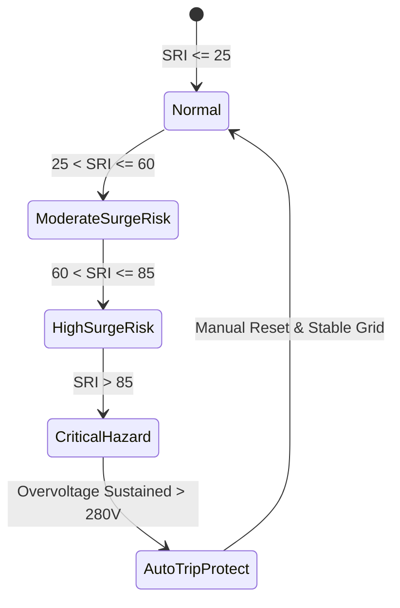

# Power Grid Reliability Monitor, Telemetry Polling & UPS Backup Architecture

## 1. Executive Summary & Architectural Overview

In co-working spaces, remote hubs, and enterprise work environments, electrical power continuity is a foundational prerequisite for productive knowledge work. Power outages, voltage sag/surge transients, and dirty power (harmonic distortion) damage expensive electronics, disrupt video conferences, and corrupt active data sessions.

The **Power Grid Reliability Monitor (`PowerGridReliabilityMonitor`)** is WorkSphere's dedicated real-time telemetry polling and electrical resilience subsystem. It tracks:
1. **Grid Uptime & Availability:** Continuous tracking of utility mains status, micro-blackouts, and brownout events.
2. **Surge Risk Index (SRI):** Algorithmic scoring of transient spikes, overvoltage conditions, frequency drift, and Total Harmonic Distortion (THD).
3. **Uninterruptible Power Supply (UPS) & Fallback Battery Telemetry:** Real-time state of charge ($\text{SoC}$), estimated remaining runtime under load, battery cell health, and automated failover detection.

```mermaid
flowchart TD
    subgraph IoT & Hardware Layer
        P1[Smart PDU / IoT Energy Meter] -->|Modbus / SNMP / MQTT| AGG[Edge Telemetry Gateway]
        UPS1[Online Double-Conversion UPS] -->|HID / Network Management Card| AGG
        SOL1[Solar Inverter / ESS Battery] -->|RS-485 / REST API| AGG
    end

    subgraph PowerGridReliabilityMonitor Polling Engine
        AGG -->|Secure Telemetry Ingestion (mTLS)| INGEST[Telemetry Ingestion Pipeline]
        INGEST --> BIND[Payload Validator & Sanitizer]
        BIND --> BUFFER[(In-Memory Ring Buffer)]
        BIND --> REDIS[(Redis Time-Series Store)]
    end

    subgraph Analytical & Calculation Engines
        BUFFER --> UPTIME[Uptime Calculation Engine]
        BUFFER --> SURGE[Surge Risk Index (SRI) Model]
        BUFFER --> BATT[Battery & Runtime Estimator]
    end

    subgraph Application & Presentation Layer
        UPTIME & SURGE & BATT --> AGG_STATUS[Consolidated Venue Power Health]
        AGG_STATUS --> AMENITY[Amenity Incident Service Auto-Trigger]
        AGG_STATUS --> API[GET /api/telemetry/power-grid/:venueId]
        AGG_STATUS --> WS[WebSocket Real-Time Power Status Stream]
        API & WS --> DASH[Venue Amenities Dashboard & Desk Map]
    end
```

---

## 2. Power Grid Uptime Calculation & Availability Modeling

### 2.1 Availability Mathematics

Grid uptime is calculated over configurable rolling analytical windows ($1\text{h}$, $24\text{h}$, $7\text{d}$, and $30\text{d}$) to eliminate short-term jitter while providing rigorous SLA grading for remote workers:

$$\text{Uptime Percentage} = \left( \frac{T_{\text{window}} - \sum T_{\text{outage}}}{T_{\text{window}}} \right) \times 100$$

Where:
* $T_{\text{window}}$ is the total analytical window duration in seconds.
* $\sum T_{\text{outage}}$ is the aggregate duration of power interruptions where mains line voltage dropped below operating threshold ($V_{\text{rms}} < 0.85 \times V_{\text{nominal}}$).

### 2.2 Micro-Interruption & Brownout Debounce Algorithm

Mains fluctuations frequently exhibit rapid voltage transients that recover within a few cycles ($< 50\text{ms}$). To prevent false flapping of venue status:
1. **Transient Filter ($< 100\text{ms}$):** Logged as power quality events (surges/sags) rather than grid outages.
2. **Brownout Threshold:** Voltage drop between $15\%$ and $30\%$ below nominal for $> 500\text{ms}$ transitions the venue grid status to `DEGRADED_VOLTAGE`.
3. **Blackout Detection:** Complete loss of utility voltage ($V_{\text{rms}} < 20\text{V}$) for $> 150\text{ms}$ automatically marks the grid state as `OUTAGE` and triggers fallback battery evaluation.

```typescript
export interface UptimeCalculationWindow {
  windowSeconds: number; // e.g., 86400 for 24h
  totalOutagesCount: number;
  totalOutageDurationSeconds: number;
  uptimePercentage: number; // 0.00 to 100.00
  meanTimeBetweenFailuresHours: number | null;
  meanTimeToRecoveryMinutes: number | null;
}
```

---

## 3. Surge Risk Index (SRI) & Harmonic Distortion Modeling

### 3.1 Surge Risk Index (SRI) Mathematical Formulation

The **Surge Risk Index (SRI)** is a normalized metric ($0$ to $100$) reflecting instantaneous and short-term risk to sensitive electronics:

$$\text{SRI} = \min\left(100, \, w_v \cdot S_v + w_{thd} \cdot S_{thd} + w_f \cdot S_f + w_t \cdot S_t\right)$$

| Component | Symbol | Description | Weight ($w$) | Metric Bounds |
| :--- | :---: | :--- | :---: | :--- |
| **Voltage Deviation** | $S_v$ | Deviation from nominal RMS voltage ($110\text{V}/230\text{V}$) | $0.40$ | $\frac{\|V_{\text{rms}} - V_{\text{nominal}}\|}{0.20 \times V_{\text{nominal}}} \times 100$ |
| **Total Harmonic Distortion** | $S_{thd}$ | Voltage waveform distortion | $0.25$ | $\frac{\text{THD}_v\%}{8\%} \times 100$ |
| **Frequency Drift** | $S_f$ | Deviation from nominal grid frequency ($50\text{Hz}/60\text{Hz}$) | $0.20$ | $\frac{\|\Delta f\|}{0.5\text{Hz}} \times 100$ |
| **Transient Spikes** | $S_t$ | Peak impulse voltage events within window | $0.15$ | Cumulative peak surge energy rating |

### 3.2 Risk Classification Matrix



* **Nominal / Low Risk ($\text{SRI} \le 25$):** Stable grid voltage ($\pm 5\%$), $\text{THD} < 3\%$, frequency stable. Safe for all unconditioned equipment.
* **Moderate Risk ($25 < \text{SRI} \le 60$):** Moderate line noise or sags. Recommend surge-protected strips.
* **High Risk ($60 < \text{SRI} \le 85$):** Significant voltage sags/surges, heavy electrical motor interference, or lightning proximity. Display warning banner on venue seat map.
* **Critical Hazard ($\text{SRI} > 85$):** Severe voltage spike potential; automated relay isolator alerts issued to venue manager.

---

## 4. Fallback Battery & UPS Telemetry Schemas

When mains power disconnects, WorkSphere tracks the Uninterruptible Power Supply (UPS) transition, battery capacity discharge curves, and remaining runtime.

### 4.1 TypeScript Telemetry Interfaces

```typescript
export type PowerSourceType = "MAINS_UTILITY" | "UPS_BATTERY" | "GENERATOR" | "SOLAR_INVERTER";

export type BatteryHealthStatus = "GOOD" | "DEGRADED" | "REPLACE_SOON" | "OVERHEATED" | "CRITICAL";

export interface UpsBatteryTelemetry {
  upsId: string;
  model: string;
  source: PowerSourceType;
  stateOfChargePercent: number; // 0 to 100
  estimatedRuntimeMinutes: number; // Remaining runtime under current load
  outputLoadWatts: number;
  outputLoadPercent: number; // 0 to 100% of rated capacity
  batteryVoltageVolts: number;
  temperatureCelsius: number;
  health: BatteryHealthStatus;
  cycleCount: number;
  transferTimeMs: number; // Time taken to engage inverter (typically 2-10ms)
  lastSelfTestTimestamp: string;
}

export interface PowerGridTelemetryPayload {
  venueId: string;
  timestamp: string;
  mainsVoltageRms: number;
  frequencyHz: number;
  totalHarmonicDistortionPercent: number;
  currentAmps: number;
  powerFactor: number;
  activePowerWatts: number;
  apparentPowerVa: number;
  surgeRiskIndex: number; // 0 to 100
  gridStatus: "ONLINE" | "DEGRADED" | "OFFLINE";
  upsTelemetry?: UpsBatteryTelemetry;
}
```

### 4.2 JSON Schema Specification

```json
{
  "$schema": "http://json-schema.org/draft-07/schema#",
  "title": "PowerGridTelemetryPayload",
  "type": "object",
  "required": [
    "venueId",
    "timestamp",
    "mainsVoltageRms",
    "frequencyHz",
    "totalHarmonicDistortionPercent",
    "surgeRiskIndex",
    "gridStatus"
  ],
  "properties": {
    "venueId": { "type": "string" },
    "timestamp": { "type": "string", "format": "date-time" },
    "mainsVoltageRms": { "type": "number", "minimum": 0, "maximum": 500 },
    "frequencyHz": { "type": "number", "minimum": 40, "maximum": 70 },
    "totalHarmonicDistortionPercent": { "type": "number", "minimum": 0, "maximum": 50 },
    "surgeRiskIndex": { "type": "number", "minimum": 0, "maximum": 100 },
    "gridStatus": {
      "type": "string",
      "enum": ["ONLINE", "DEGRADED", "OFFLINE"]
    },
    "upsTelemetry": {
      "type": "object",
      "properties": {
        "upsId": { "type": "string" },
        "source": {
          "type": "string",
          "enum": ["MAINS_UTILITY", "UPS_BATTERY", "GENERATOR", "SOLAR_INVERTER"]
        },
        "stateOfChargePercent": { "type": "number", "minimum": 0, "maximum": 100 },
        "estimatedRuntimeMinutes": { "type": "number", "minimum": 0 },
        "outputLoadWatts": { "type": "number", "minimum": 0 },
        "health": {
          "type": "string",
          "enum": ["GOOD", "DEGRADED", "REPLACE_SOON", "OVERHEATED", "CRITICAL"]
        }
      }
    }
  }
}
```

---

## 5. Polling Loop Mechanics & Failover Resiliency

### 5.1 Adaptive Telemetry Polling Intervals

The polling engine dynamically adjusts frequency depending on grid stability to minimize bandwidth while maintaining millisecond-level responsiveness during critical events:

* **Nominal Grid Mode ($30\text{s}$ interval):** Mains is stable, SRI $\le 25$, and no active outages.
* **Fluctuation / Elevated Mode ($5\text{s}$ interval):** Triggered when voltage deviates by $> 8\%$ or SRI $> 50$.
* **Mains Loss / UPS Inverter Mode ($2\text{s}$ interval):** Fast polling during battery discharge to project remaining runtime and notify seated occupants.
* **Sensor Timeout / Reconnection Backoff:** Exponential backoff ($1\text{s} \to 2\text{s} \to 4\text{s} \dots 30\text{s}$) with jitter on IoT communication failures.

### 5.2 Automated Venue Degradation & User Notifications

When a venue loses mains power and switches to UPS battery:
1. **Amenity Health Integration:** Telemetry pushes status update to `amenityIncidentService`, automatically marking `outlets` as `DEGRADED` (reserved for low-power laptops only) or `OUTAGE` (wall sockets shut down to preserve networking gear).
2. **Occupant Advisory:** Users with active seat reservations receive in-app notifications stating:
   > *"Venue running on backup UPS power. Estimated runtime remaining: 45 minutes. High-wattage chargers disabled."*
3. **Automatic Reservation Hold:** If estimated runtime drops below 15 minutes, new seat check-ins are temporarily held.

---

## 6. REST API & Integration Specifications

### 6.1 Status Endpoint Contract

`GET /api/telemetry/power-grid/:venueId`

#### Example Response Payload:

```json
{
  "venueId": "venue-sf-hub-01",
  "timestamp": "2026-10-09T13:10:00.000Z",
  "mains": {
    "status": "ONLINE",
    "voltageRms": 119.8,
    "frequencyHz": 60.02,
    "thdPercent": 1.8,
    "surgeRiskIndex": 12.4,
    "uptime24hPercent": 99.98
  },
  "ups": {
    "isEngaged": false,
    "source": "MAINS_UTILITY",
    "stateOfChargePercent": 100,
    "estimatedRuntimeMinutes": 120,
    "currentLoadWatts": 1450,
    "health": "GOOD"
  },
  "operationalAdvisory": {
    "level": "OPTIMAL",
    "message": "Power grid stable. All workstations and high-speed outlets operational."
  }
}
```

---

## 7. Verification & Operational Testing

Run the telemetry test suite to verify calculation accuracy, schema enforcement, and failure handling:

```bash
# Run telemetry test suites
npm test -- src/__tests__/lib/telemetry/
```
