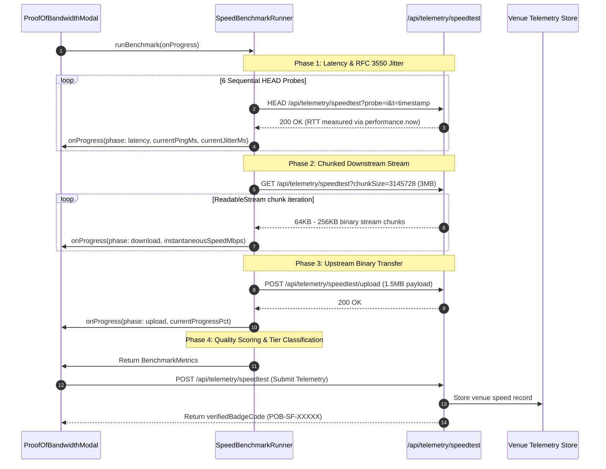

# ProofOfBandwidthModal Telemetry Measurement Parameters & Benchmark Specification

## 1. Overview & Architectural Motivation

In remote and distributed knowledge work, network reliability is a primary operational dependency. Traditional synthetic speed tests fail to capture real-time conversational stability parameters such as packet arrival variance (jitter) and buffer bloat under simultaneous upstream/downstream load.

The **`ProofOfBandwidthModal`** (located at `src/components/wifi/ProofOfBandwidthModal.tsx`) and the underlying **`SpeedBenchmarkRunner`** engine (`src/lib/wifi/speedBenchmarkEngine.ts`) execute a client-side network telemetry verification protocol. The system produces cryptographic Proof-of-Bandwidth attestations and publishes standardized network health metrics to WorkSphere's venue telemetry database.



---

## 2. Telemetry Measurement Parameters

The benchmark engine captures and derives six fundamental parameters:

### 2.1 Download Throughput (`downloadMbps`)
* **Unit:** Megabits per second ($\text{Mbps}$)
* **Measurement Mechanism:** Fetches a $3{,}145{,}728\,\text{byte}$ ($3\,\text{MB}$) binary payload via HTTP/2 or HTTP/3 chunked stream without disk caching (`cache: 'no-store'`).
* **Calculation:**
  $$\text{downloadMbps} = \frac{\text{Total Bytes Received} \times 8}{\Delta t_{\text{download\_seconds}} \times 1{,}000{,}000}$$

### 2.2 Upload Throughput (`uploadMbps`)
* **Unit:** Megabits per second ($\text{Mbps}$)
* **Measurement Mechanism:** Posts a $1{,}572{,}864\,\text{byte}$ ($1.5\,\text{MB}$) random `Uint8Array` buffer to `/api/telemetry/speedtest/upload` using `application/octet-stream`.
* **Calculation:**
  $$\text{uploadMbps} = \frac{\text{Payload Size (Bytes)} \times 8}{\Delta t_{\text{upload\_seconds}} \times 1{,}000{,}000}$$

### 2.3 Round-Trip Latency (`latencyMs`)
* **Unit:** Milliseconds ($\text{ms}$)
* **Measurement Mechanism:** Dispatches 6 sequential non-cached HTTP `HEAD` probes with high-precision timestamping via `performance.now()`.
* **Calculation:**
  $$\text{latencyMs} = \frac{1}{K} \sum_{i=1}^{K} \text{RTT}_i \quad (K = 6)$$

### 2.4 RFC 3550 Statistical Jitter (`jitterMs`)
* **Unit:** Milliseconds ($\text{ms}$)
* **Standard Reference:** IETF **RFC 3550 Section 6.4.1** (RTP Interarrival Jitter Formula).
* **Mathematical Definition:**
  Computes the continuous statistical variance of packet inter-arrival latency differences $D(i-1, i) = |\text{RTT}_i - \text{RTT}_{i-1}|$:
  $$J(i) = J(i-1) + \frac{|D(i-1, i)| - J(i-1)}{16}$$
  The constant divisor of $16$ provides an exponentially weighted moving average filter that smooths short transients while responding dynamically to persistent congestion.

```typescript
export function calculateRfc3550Jitter(samples: number[]): number {
  if (samples.length < 2) return 0;

  let jitter = 0;
  for (let i = 1; i < samples.length; i++) {
    const diff = Math.abs(samples[i] - samples[i - 1]);
    jitter += (diff - jitter) / 16;
  }
  return Number(jitter.toFixed(2));
}
```

### 2.5 Network Stability Score (`stabilityScore`)
* **Range:** $10 \text{ to } 100$ (normalized index)
* **Formulation:** Penalizes excessive jitter and high base latency against a 100-point ceiling:
  $$\text{Penalty}_{\text{jitter}} = \min(30, \, 2 \times \text{jitterMs})$$
  $$\text{Penalty}_{\text{latency}} = \min\left(30, \, \frac{\text{latencyMs}}{150} \times 30\right)$$
  $$\text{stabilityScore} = \max\left(10, \, 100 - \text{Penalty}_{\text{jitter}} - \text{Penalty}_{\text{latency}}\right)$$

### 2.6 Packet Loss Ratio (`packetLossPct`)
* **Unit:** Percentage ($0.0\% - 100.0\%$)
* **Measurement:** Proportion of dropped probe sockets or unacknowledged TCP/TLS handshakes during the 6-probe sequence.

---

## 3. Remote Work Suitability Tier Classification

WorkSphere evaluates the telemetry matrix against four tier classifications:

| Suitability Tier | Minimum Download | Minimum Upload | Max Latency | Max Jitter | Operational Use Cases |
| :--- | :---: | :---: | :---: | :---: | :--- |
| **`4K_CONFERENCING`** | $\ge 45\,\text{Mbps}$ | $\ge 15\,\text{Mbps}$ | $\le 35\,\text{ms}$ | $\le 6\,\text{ms}$ | 4K video calling, low-latency screen sharing, pair programming, Figma live streaming. |
| **`HD_CONFERENCING`** | $\ge 20\,\text{Mbps}$ | $\ge 5\,\text{Mbps}$ | $\le 70\,\text{ms}$ | $\le 15\,\text{ms}$ | 1080p Google Meet / Zoom conferences, large Git repository clones. |
| **`STANDARD_BROWSING`** | $\ge 5\,\text{Mbps}$ | $\ge 1\,\text{Mbps}$ | $\le 150\,\text{ms}$ | N/A | General asynchronous communication, Slack, Jira, email, web browsing. |
| **`UNSTABLE`** | $< 5\,\text{Mbps}$ | $< 1\,\text{Mbps}$ | $> 150\,\text{ms}$ | $> 15\,\text{ms}$ | High packet jitter or degraded bandwidth; video calls will exhibit frame dropping. |

---

## 4. TypeScript Interface Specifications

```typescript
export interface BenchmarkMetrics {
  downloadMbps: number;
  uploadMbps: number;
  latencyMs: number;
  jitterMs: number;
  packetLossPct: number;
  stabilityScore: number; // 0 to 100
  tier: "4K_CONFERENCING" | "HD_CONFERENCING" | "STANDARD_BROWSING" | "UNSTABLE";
  timestamp: string;
}

export interface BenchmarkProgress {
  phase: "idle" | "latency" | "download" | "upload" | "complete" | "error";
  currentProgressPct: number;
  instantaneousSpeedMbps?: number;
  currentPingMs?: number;
  currentJitterMs?: number;
}
```

---

## 5. Telemetry Ingestion Contract & Proof-of-Bandwidth Attestation

Upon benchmark completion, `ProofOfBandwidthModal` sends the telemetry payload to the WorkSphere ingestion endpoint:

### POST `/api/telemetry/speedtest`

#### Request Payload:
```json
{
  "venueId": "sample-venue-sf",
  "downloadMbps": 84.5,
  "uploadMbps": 28.2,
  "latencyMs": 18.4,
  "jitterMs": 2.15,
  "crowdLevel": "moderate"
}
```

#### Response Payload:
```json
{
  "success": true,
  "telemetryId": "tel_998124_sf",
  "verifiedBadge": {
    "badgeCode": "POB-SF-84M-18MS",
    "issuedAt": "2026-10-09T13:45:00.000Z",
    "tier": "4K_CONFERENCING",
    "stabilityScore": 96
  }
}
```
