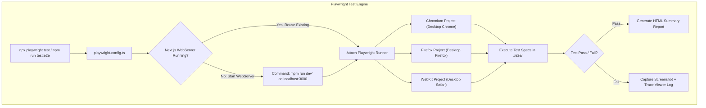

# Playwright End-to-End (E2E) Testing & Local Debugging Guide

## Executive Summary

WorkSphere utilizes [Playwright](https://playwright.dev/) for cross-browser end-to-end (E2E) testing. Playwright automates real browser interactions across Chromium, Firefox, and WebKit (Safari) to verify critical user workflows—including venue search, seat reservations, map navigation, offline sync, and user profile management.

This document serves as the authoritative guide for installing browser binaries, running headless and interactive UI tests, debugging failed test runs using Playwright Trace Viewer, inspecting video/screenshot artifacts, and authoring robust E2E test suites.

---

## 1. System Architecture Overview

Playwright integrates directly with Next.js development and production servers via the configuration defined in [playwright.config.ts](file:///c:/Users/admin/Desktop/workfere/playwright.config.ts).



---

## 2. Prerequisites & Local Browser Installation

Before running Playwright tests locally, you must install the matching browser binaries and operating system dependencies.

### 2.1 Installing Browsers and OS Dependencies (Recommended)

Run the following command in your terminal to install Chromium, Firefox, and WebKit browser engines along with necessary Linux/Windows system packages:

```bash
npx playwright install --with-deps
```

> [!TIP]
> Running `--with-deps` ensures required system libraries (such as font packages, OpenGL drivers, and NSS cryptography libraries) are installed automatically, preventing missing shared object (`.so` / `.dll`) errors.

---

### 2.2 Target-Specific Browser Installation Commands

If you only want to install a specific browser engine (for faster setup):

```bash
# Install Chromium browser engine only
npx playwright install chromium

# Install Firefox browser engine only
npx playwright install firefox

# Install WebKit (Safari engine) only
npx playwright install webkit
```

---

### 2.3 Verifying Local Browser Cache Installation

Playwright stores browser binaries in the OS user cache directory:
- **Windows**: `%LOCALAPPDATA%\ms-playwright`
- **macOS**: `~/Library/Caches/ms-playwright`
- **Linux**: `~/.cache/ms-playwright`

To verify which browser binaries are currently installed on your machine:

```bash
npx playwright install --dry-run
```

---

## 3. Test Execution Command Reference Matrix

WorkSphere provides pre-configured npm scripts in `package.json` for running tests across different modes:

| Command | Execution Mode | Headless? | Primary Purpose |
| :--- | :--- | :---: | :--- |
| **`npm run test:e2e`** | Command Line | **Yes** | Runs all spec files in `./e2e/` across all configured browsers in parallel. |
| **`npm run test:e2e:ui`** | Interactive App | **No** | Launches the interactive Playwright Time-Travel UI for visual debugging. |
| **`npm run test:e2e:headed`** | Visual Browser | **No** | Launches real browser windows showing test actions in real-time. |
| **`npm run test:e2e:debug`** | Inspector Debug | **No** | Pauses execution at breakpoints and opens Playwright Inspector GUI. |

---

### 3.1 Running Tests in Headless Mode (`npm run test:e2e`)

Headless mode executes tests in the background without rendering browser windows, offering maximum execution speed for local verification and CI pipelines:

```bash
npm run test:e2e
```

Equivalently using the Playwright CLI directly:

```bash
npx playwright test
```

#### Filtering Tests by Specific Spec File

```bash
# Run only venue search tests
npx playwright test e2e/venue-search.spec.ts

# Run venue search and seat reservation tests
npx playwright test e2e/venue-search.spec.ts e2e/seat-reservation.spec.ts
```

#### Filtering Tests by Specific Browser Project

```bash
# Run tests exclusively on Chromium
npx playwright test --project=chromium

# Run tests on Firefox only
npx playwright test --project=firefox

# Run tests on WebKit (Safari) only
npx playwright test --project=webkit
```

#### Running Tests by Title Keywords (`-g` flag)

```bash
# Run only test cases containing "filter by noise level" in their title
npx playwright test -g "filter by noise level"
```

---

### 3.2 Running Tests in Interactive UI Mode (`npm run test:e2e:ui`)

Playwright UI Mode provides an interactive desktop application featuring time-travel debugging, live DOM inspection, network request logs, console outputs, and instant test re-runs.

```bash
npm run test:e2e:ui
```

```
+-----------------------------------------------------------------------------------+
|                            Playwright Interactive UI Mode                         |
+-----------------------------------------------------------------------------------+
|  [ Sidebar: Specs ]   |  [ Center: Time-Travel Preview ] | [ Right: Watch Panel ] |
|  - venue-search.spec  |  (Live DOM snapshot at step)     | - Actions Log          |
|  - reservation.spec   |  ------------------------------- | - Console Output       |
|  - profile.spec       |  [ Click button#search ]         | - Network Traffic      |
+-----------------------------------------------------------------------------------+
```

#### Features of UI Mode:
- **Time Travel**: Step backward and forward through DOM action snapshots.
- **Watch Mode**: Automatically re-runs test specs as you save code changes.
- **Locator Picker**: Click any UI element in the preview pane to generate resilient Playwright locators (`getByRole`, `getByTestId`).
- **Network Tab**: Inspect HTTP request/response payloads sent during test execution.

---

### 3.3 Debugging Tests with Playwright Inspector (`npx playwright test --debug`)

Playwright Inspector pauses execution at every step, allowing you to step through actions line by line and evaluate expressions in the browser console.

```bash
npx playwright test e2e/venue-search.spec.ts --debug
```

#### Adding Manual Breakpoints in Test Code

Call `await page.pause()` anywhere inside a test spec file to trigger a breakpoint during debug runs:

```typescript
import { test, expect } from '@playwright/test';

test('inspect venue filter state', async ({ page }) => {
  await page.goto('/ai');
  await page.getByRole('button', { name: /filter/i }).click();

  // Execution will pause here when running with --debug
  await page.pause();

  await expect(page.getByTestId('noise-filter-drawer')).toBeVisible();
});
```

---

## 4. Inspecting Artifacts: Traces, Reports, and Screenshots

When a test fails, Playwright captures diagnostic artifacts according to settings in `playwright.config.ts`:

```typescript
// Configured artifact policies in playwright.config.ts
use: {
  baseURL: 'http://localhost:3000',
  trace: 'on-first-retry',      // Capture zip trace file on first retry attempt
  screenshot: 'only-on-failure',// Take full-page PNG screenshot on test failure
}
```

---

### 4.1 Viewing HTML Test Summary Reports

After test completion, open the generated HTML report to view execution durations, pass/fail counts, and step details:

```bash
npx playwright show-report
```

This command launches a local web server (typically `http://localhost:9323`) displaying an interactive dashboard of all test results.

---

### 4.2 Playwright Trace Viewer (`npx playwright show-trace`)

Trace Viewer is a diagnostic tool that captures complete DOM snapshots, action logs, network har files, and console logs for failed runs.

```
+-----------------------------------------------------------------------------------+
|                           Playwright Trace Viewer GUI                             |
+-----------------------------------------------------------------------------------+
| Timeline: |=====================[Click Search]==========[Verify Grid]==========| |
|                                                                                   |
|  DOM Snapshot Preview          | Action Call Stack       | Network Requests       |
|  [Rendered React UI State]     | 1. page.goto('/ai')     | GET /api/venues (200)  |
|                                | 2. page.click('#btn')   | POST /api/sync (202)   |
+-----------------------------------------------------------------------------------+
```

#### Opening a Trace File

When a test retries or fails, Playwright saves a `.zip` trace file in `test-results/`. Inspect it using:

```bash
npx playwright show-trace test-results/venue-search-chromium/trace.zip
```

#### Viewing Traces Online

Alternatively, upload `trace.zip` to the official web-based inspector at [trace.playwright.dev](https://trace.playwright.dev/).

---

## 5. Visual Regression & Pixel Snapshot Comparisons

Playwright provides built-in visual comparison assertions using pixel-by-pixel image diffing:

```typescript
import { test, expect } from '@playwright/test';

test('venue detail page matches visual golden snapshot', async ({ page }) => {
  await page.goto('/venues/v-88291a');

  // Verify visual snapshot
  await expect(page).toHaveScreenshot('venue-detail-golden.png', {
    maxDiffPixels: 100, // Threshold for minor anti-aliasing variations
  });
});
```

#### Updating Visual Snapshots

To regenerate reference golden screenshots after intentional design changes:

```bash
npx playwright test --update-snapshots
```

---

## 6. Advanced Authentication Setup & Storage State Preservation

To avoid logging in before every test case, use Playwright's `storageState` feature to reuse authenticated session cookies and local storage tokens.

### 6.1 Global Setup Authentication Script (`e2e/global-setup.ts`)

```typescript
import { chromium, FullConfig } from '@playwright/test';

async function globalSetup(config: FullConfig) {
  const browser = await chromium.launch();
  const page = await browser.newPage();

  // Perform one-time sign in
  await page.goto('http://localhost:3000/sign-in');
  await page.getByLabel(/email/i).fill('test-user@worksphere.com');
  await page.getByLabel(/password/i).fill('Password123!');
  await page.getByRole('button', { name: /sign in/i }).click();

  // Wait for session cookie confirmation
  await page.waitForURL('**/dashboard');

  // Save authenticated state to file
  await page.context().storageState({ path: 'e2e/.auth/user.json' });
  await browser.close();
}

export default globalSetup;
```

### 6.2 Configuring `playwright.config.ts` for Auth State

```typescript
use: {
  baseURL: 'http://localhost:3000',
  storageState: 'e2e/.auth/user.json', // Automatically load session state in all tests
}
```

---

## 7. Accessibility (a11y) Auditing with `@axe-core/playwright`

Playwright integrates with Deque's Axe accessibility engine to run automated WCAG 2.1 AA audits on WorkSphere pages:

```typescript
import { test, expect } from '@playwright/test';
import AxeBuilder from '@axe-core/playwright';

test.describe('Accessibility Verification', () => {
  test('venue details page passes WCAG 2.1 AA audit', async ({ page }) => {
    await page.goto('/venues/v-88291a');

    // Run Axe accessibility scan
    const accessibilityScanResults = await new AxeBuilder({ page })
      .withTags(['wcag2a', 'wcag2aa', 'wcag21a', 'wcag21aa'])
      .analyze();

    // Assert zero accessibility violations
    expect(accessibilityScanResults.violations).toEqual([]);
  });
});
```

---

## 8. Authoring End-to-End Tests for WorkSphere

All E2E test files are located in the `./e2e/` directory and use the `.spec.ts` extension.

### 8.1 Test File Structure & Best Practices

```typescript
// e2e/venue-search.spec.ts
import { test, expect } from '@playwright/test';

test.describe('Venue Search & Filtering Flow', () => {
  test.beforeEach(async ({ page }) => {
    // Navigate to the AI search page before each test
    await page.goto('/ai');
  });

  test('filters venues by noise level tag', async ({ page }) => {
    // 1. Open the filter drawer
    const filterButton = page.getByRole('button', { name: /filter/i });
    await expect(filterButton).toBeVisible();
    await filterButton.click();

    // 2. Select "Quiet" noise filter tag
    const quietTag = page.getByTestId('noise-filter-quiet');
    await quietTag.click();

    // 3. Verify URL search params update
    await expect(page).toHaveURL(/.*noise=quiet/);

    // 4. Confirm filtered venue cards display in the UI grid
    const venueGrid = page.getByTestId('venue-grid');
    await expect(venueGrid).toBeVisible();
  });
});
```

---

### 8.2 Locating Elements (Accessibility-First Selectors)

Always prefer accessible role and text locators over brittle CSS class selectors:

```typescript
// GOOD: Resilient accessible locators
page.getByRole('button', { name: /submit/i })
page.getByLabel(/username/i)
page.getByPlaceholder(/search cafes/i)
page.getByTestId('visited-venues-count')

// BAD: Brittle CSS selectors vulnerable to styling changes
page.locator('div.flex > button.bg-blue-500:nth-child(2)')
```

---

### 8.3 Mocking API Route Responses

To test UI edge cases without hitting real databases or backend servers, mock network routes using `page.route()`:

```typescript
test('displays empty state when no venues match query', async ({ page }) => {
  // Intercept GET requests to /api/venues and return empty array
  await page.route('/api/venues*', async (route) => {
    await route.fulfill({
      status: 200,
      contentType: 'application/json',
      body: JSON.stringify({ venues: [] }),
    });
  });

  await page.goto('/ai');
  await expect(page.getByTestId('venue-search-empty')).toBeVisible();
});
```

---

## 9. Continuous Integration (GitHub Actions)

Playwright tests run automatically on Pull Requests via GitHub Actions (`.github/workflows/playwright-e2e.yml`).

### 9.1 GitHub Actions Workflow Definition

```yaml
name: Playwright E2E Tests

on:
  push:
    branches: [main]
  pull_request:
    branches: [main]

jobs:
  test-e2e:
    timeout-minutes: 60
    runs-on: ubuntu-latest
    steps:
      - uses: actions/checkout@v4
      - uses: actions/setup-node@v4
        with:
          node-version: 20
          cache: 'npm'

      - name: Install dependencies
        run: npm ci

      - name: Install Playwright Browsers with System Dependencies
        run: npx playwright install --with-deps

      - name: Execute Playwright E2E Tests
        run: npm run test:e2e
        env:
          CI: true

      - name: Upload Test Report & Failure Traces
        if: always()
        uses: actions/upload-artifact@v4
        with:
          name: playwright-report
          path: playwright-report/
          retention-days: 30
```

---

## 10. Troubleshooting Matrix

| Symptom / Error | Root Cause | Recommended Action / Fix |
| :--- | :--- | :--- |
| `browserType.launch: Executable doesn't exist` | Playwright browser binaries not installed | Run `npx playwright install --with-deps` in project root. |
| `webServer command 'npm run dev' timed out` | Dev server taking > 120s to boot | Increase `timeout` in `playwright.config.ts` or run server beforehand. |
| `Error: page.goto: net::ERR_CONNECTION_REFUSED` | App not listening on `http://localhost:3000` | Verify port 3000 is open; check `.env` configuration. |
| Test passes locally but fails intermittently in CI | Flaky timing or race condition in DOM update | Replace static `page.waitForTimeout()` with auto-waiting `expect(locator).toBeVisible()`. |
| `Target closed / browser context destroyed` | Browser process crashed due to low RAM in VM | Reduce worker concurrency in `playwright.config.ts`: `workers: 1`. |

---

## 11. Verification Checklist

- [x] Documented prerequisite `npx playwright install --with-deps` command.
- [x] Documented `npm run test:e2e`, `npm run test:e2e:ui`, `--headed`, and `--debug` execution modes.
- [x] Explained Playwright Trace Viewer inspection (`npx playwright show-trace`).
- [x] Documented HTML summary reports (`npx playwright show-report`).
- [x] Documented visual regression snapshot testing (`expect(page).toHaveScreenshot()`).
- [x] Documented storage state authentication setup (`e2e/global-setup.ts`).
- [x] Documented automated WCAG accessibility scans with `@axe-core/playwright`.
- [x] Provided Page Object Model and element locator best practices.
- [x] Added API route mocking examples (`page.route()`).
- [x] Added GitHub Actions CI pipeline configuration example.
