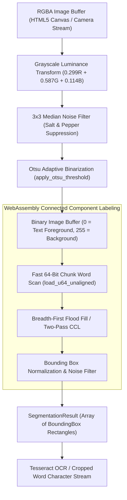
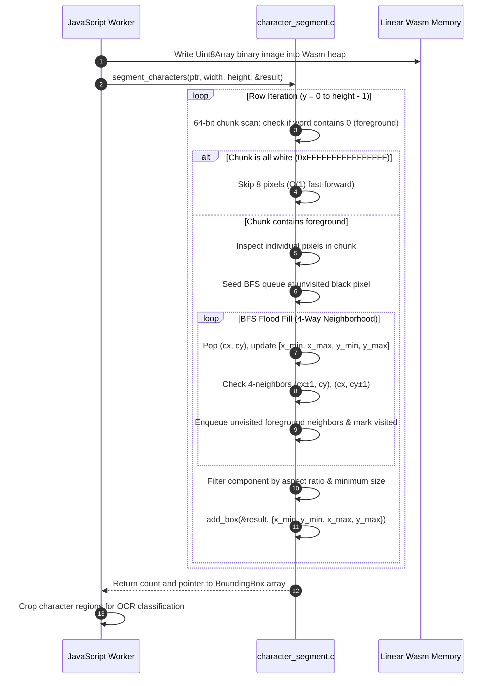

# Character Segmentation Pipeline: Morphological Dilation & Connected Components Analysis

This document details the computer vision and image processing architecture implemented in WebAssembly via [`src/wasm/ocr/character_segment.c`](file:///c:/Users/admin/Desktop/workfere/src/wasm/ocr/character_segment.c) and [`src/wasm/ocr/image_binarize.c`](file:///c:/Users/admin/Desktop/workfere/src/wasm/ocr/image_binarize.c). This pipeline processes raw camera frames and flyer photos to segment menu items, signage, and workspace amenity boards into isolated character and word bounding boxes for downstream OCR and LLM classification.

---

## 1. High-Level Vision Pipeline Architecture



---

## 2. WebAssembly Memory Layout & Buffer Interchange

To maximize throughput and avoid costly garbage collection overhead across the JavaScript/Wasm boundary, pixel buffers are allocated contiguously in linear WebAssembly memory (`WebAssembly.Memory`):

### 2.1 Contiguous Pixel Buffer Layout

```
Offset 0x0000 ┌─────────────────────────────────────────────────────────────┐
              │ Grayscale / Binarized Image Buffer                          │
              │ Dimensions: Width (W) × Height (H) bytes                    │
              │ Format: uint8_t row-major (Stride = W bytes)               │
              │ Values: 0 (Foreground Black), 255 (Background White)        │
Offset (W×H)  ├─────────────────────────────────────────────────────────────┤
              │ Visited Matrix Buffer (calloc: W × H bytes)                 │
              │ Values: 0 (Unvisited), 1 (Visited)                          │
Offset (2W×H) ├─────────────────────────────────────────────────────────────┤
              │ BFS Queue Structures / Component Buffers                    │
              │ int queue_x[W × H], int queue_y[W × H]                      │
              └─────────────────────────────────────────────────────────────┘
```

- **Row-Major Stride Calculation:** Pixel index at coordinate $(x, y)$ is computed as $\text{index} = y \times \text{width} + x$.
- **Unaligned Memory Access Safety:** Fast bitwise checks employ unaligned 64-bit loaders (`memcpy`) so that arbitrary image widths do not trigger bus faults on strict 32/64-bit architectures.

---

## 3. Grayscale Binarization & Morphological Operations

### 3.1 Otsu's Adaptive Global Thresholding
Implemented in [`image_binarize.c`](file:///c:/Users/admin/Desktop/workfere/src/wasm/ocr/image_binarize.c), Otsu's algorithm maximizes the between-class variance $\sigma_B^2(t)$ across pixel intensity histogram $H(i)$:

$$\sigma_B^2(t) = \omega_0(t) \cdot \omega_1(t) \cdot \left(\mu_0(t) - \mu_1(t)\right)^2$$

Where:
- $\omega_0(t) = \sum_{i=0}^t P(i)$ and $\omega_1(t) = \sum_{i=t+1}^{255} P(i)$ are class probabilities.
- $\mu_0(t)$ and $\mu_1(t)$ are mean intensity values of foreground and background.

### 3.2 Morphological Dilation & Filtering
When text strokes have slight discontinuities or scan gaps, a $3\times 3$ morphological dilation kernel $K$ bridges adjacent letter sub-components:

$$(I \oplus K)(x, y) = \min_{(i, j) \in K} I(x + i, y + j)$$

This ensures that broken serif strokes or dot elements (such as 'i' and 'j') group into coherent word components.

---

## 4. Algorithmic Walkthrough: Two-Pass Connected Components Labeling (CCL)

Connected Component Labeling partitions a binarized grid into disjoint equivalence classes where all interconnected black pixels share a common label.



### 4.1 Pass 1: Label Assignment & Equivalence Tracking
- Scans left-to-right, top-to-bottom.
- For each foreground pixel $p$, inspects neighboring pixels (e.g. 4-connectivity or 8-connectivity).
- If no neighbors are labeled, assigns a new unique component label. If one or more neighbors are labeled, assigns the minimum neighbor label and records equivalence classes.

### 4.2 Pass 2: Label Consolidation & Bounding Box Extraction
- Resolves equivalence classes into disjoint component IDs.
- For each connected component $C_k$, accumulates its spatial extents:
  $$x_{\min} = \min_{p \in C_k} p_x, \quad x_{\max} = \max_{p \in C_k} p_x$$
  $$y_{\min} = \min_{p \in C_k} p_y, \quad y_{\max} = \max_{p \in C_k} p_y$$

### 4.3 Geometric Noise Filtering
Components are evaluated against bounding box heuristics to reject speckles, scan dust, and full-page borders:
```c
int box_w = x_max - x_min;
int box_h = y_max - y_min;
if (box_w > 2 && box_h > 2 && box_w < width / 2) {
    BoundingBox box = {x_min, y_min, x_max, y_max};
    add_box(result, box);
}
```

---

## 5. C API Reference & JavaScript Worker Binding

```c
typedef struct {
  int x_min;
  int y_min;
  int x_max;
  int y_max;
} BoundingBox;

typedef struct {
  BoundingBox *boxes;
  int count;
  int capacity;
} SegmentationResult;

void segment_characters(const uint8_t *binary_image, int width, int height,
                        SegmentationResult *result);

void free_segmentation(SegmentationResult *result);
```

### Integration Example in `ocrWorker.ts`:

```typescript
import { wasmExports } from "./ocrWasmLoader";

export function processOcrFrame(imageData: Uint8Array, width: number, height: number) {
  const imagePtr = wasmExports.malloc(imageData.byteLength);
  new Uint8Array(wasmExports.memory.buffer, imagePtr, imageData.byteLength).set(imageData);

  const resultPtr = wasmExports.malloc(16); // Size of SegmentationResult struct
  wasmExports.segment_characters(imagePtr, width, height, resultPtr);

  // Extract bounding box structures...
  wasmExports.free_segmentation(resultPtr);
  wasmExports.free(imagePtr);
  wasmExports.free(resultPtr);
}
```
