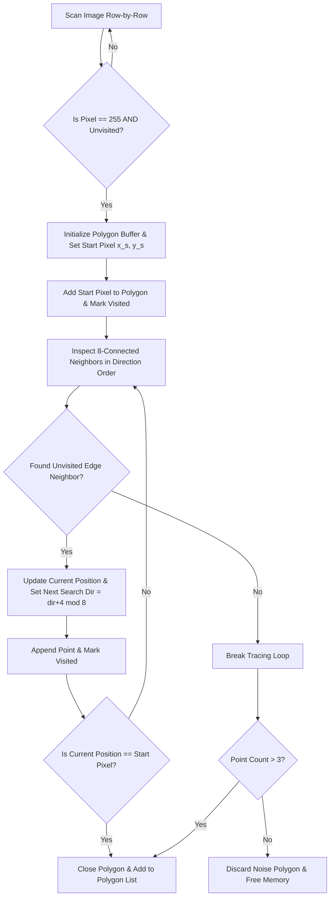
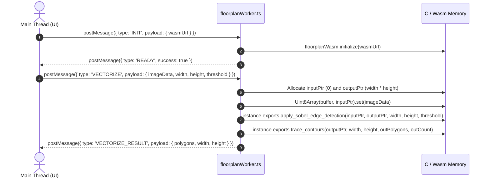

# Sobel Filter Edge Detection & Vector Contour Tracing C-to-Wasm Pipeline

## 1. Architectural Executive Summary

WorkSphere processes floorplan raster images, spatial heatmaps, and venue occupancy grids into crisp, interactive vector polygons. To ensure $60\text{ FPS}$ UI responsiveness during real-time floorplan vectorization, heavy pixel-level 2D convolution and boundary tracing are implemented in **C** (`src/wasm/floorplan/sobel_edge.c`, `src/wasm/floorplan/contour_tracer.c`) and compiled to **WebAssembly (Wasm)**. The Wasm module runs inside dedicated Web Workers (`src/workers/floorplanWorker.ts`), preventing main thread UI jank.

```
+-----------------------------------------------------------------------------------+
|                              MAIN THREAD UI & STATE                               |
|                        (Canvas Viewer / Floorplan Uploader)                       |
+-----------------------------------------+-----------------------------------------+
                                          |
                        PostMessage({ type: 'VECTORIZE', imageData })
                                          |
                                          v
+-----------------------------------------------------------------------------------+
|                             WEB WORKER THREAD BRIDGE                              |
|                             (floorplanWorker.ts)                                  |
+-----------------------------------------+-----------------------------------------+
                                          |
                         Linear Memory Pointer Ingest
                                          |
                                          v
+-----------------------------------------------------------------------------------+
|                          C / WEBASSEMBLY EXECUTION ENGINE                         |
|  +-----------------------------------+  +--------------------------------------+  |
|  |  Sobel 2D Convolution & Adaptive  |  |  Moore-Neighbor 8-Connected Vector   |  |
|  |     Thresholding (sobel_edge.c)   |  |    Contour Tracer (contour_tracer.c) |  |
|  +-----------------------------------+  +--------------------------------------+  |
+-----------------------------------------------------------------------------------+
```

Key technical objectives:
- **Sub-10ms Floorplan Vectorization:** High-throughput 2D spatial convolution and vector extraction compiled to native Wasm instructions.
- **Adaptive Statistical Thresholding:** Automated edge binarization adjusted for variable lighting, line weights, and room contrast.
- **Closed Vector Polygon Extraction:** Moore-Neighbor boundary traversal converting 8-connected binary pixel edges into discrete $(x, y)$ coordinate arrays.
- **Zero-Copy Worker Memory Bridge:** Direct WebAssembly `ArrayBuffer` view slicing over linear Wasm memory.

---

## 2. Sobel 2D Convolution & Adaptive Thresholding (`sobel_edge.c`)

The Sobel operator calculates the gradient magnitude of image intensity at each pixel, highlighting high-frequency spatial transitions corresponding to architectural walls, desk boundaries, and room partitions.

### 2.1 2D Convolution Spatial Kernels

The Sobel algorithm evaluates horizontal ($G_x$) and vertical ($G_y$) gradient components using two $3 \times 3$ convolution matrices:

$$G_x = \begin{bmatrix} -1 & 0 & 1 \\ -2 & 0 & 2 \\ -1 & 0 & 1 \end{bmatrix}, \quad G_y = \begin{bmatrix} -1 & -2 & -1 \\ 0 & 0 & 0 \\ 1 & 2 & 1 \end{bmatrix}$$

For an input grayscale image pixel matrix $I(x, y)$, the directional gradients are computed as:

$$G_x(x, y) = \sum_{k_y=-1}^{1} \sum_{k_x=-1}^{1} I(x + k_x, y + k_y) \cdot g_x(k_y + 1, k_x + 1)$$

$$G_y(x, y) = \sum_{k_y=-1}^{1} \sum_{k_x=-1}^{1} I(x + k_x, y + k_y) \cdot g_y(k_y + 1, k_x + 1)$$

### 2.2 Gradient Magnitude Calculation

The total spatial gradient magnitude $\mathbf{G}(x,y)$ combines both directional components:

$$\mathbf{G}(x, y) = \sqrt{G_x(x, y)^2 + G_y(x, y)^2}$$

### 2.3 Statistical Adaptive Thresholding

Rather than relying on fixed arbitrary threshold cutoffs, `sobel_edge.c` computes global image statistics over the total pixel count $N = \text{width} \times \text{height}$ to determine an adaptive threshold $\tau$:

#### Mean Intensity ($\mu$):
$$\mu = \frac{1}{N} \sum_{i=1}^{N} I_i$$

#### Variance ($\sigma^2$) & Standard Deviation ($\sigma$):
$$\sigma^2 = \frac{1}{N} \sum_{i=1}^{N} I_i^2 - \mu^2$$

$$\sigma = \sqrt{\max(0, \sigma^2)}$$

#### Adaptive Threshold ($\tau$):
$$\tau = \mu + (k_{\text{mult}} \cdot \sigma)$$

where $k_{\text{mult}}$ is the user-configured `threshold_multiplier`.

#### Output Binarization:
$$O(x, y) = \begin{cases} 255 & \text{if } \mathbf{G}(x, y) > \tau \\ 0 & \text{otherwise} \end{cases}$$

---

## 3. Moore-Neighbor Vector Contour Tracing (`contour_tracer.c`)

Once the Sobel filter generates a binary edge map, `contour_tracer.c` converts raw edge pixels into ordered vector polygon coordinate lists.

### 3.1 8-Connected Moore Neighborhood

The tracer traverses boundary pixels using an 8-connected neighborhood indexed clockwise ($0$ to $7$):

$$\Delta x = [1, 1, 0, -1, -1, -1, 0, 1]$$

$$\Delta y = [0, 1, 1, 1, 0, -1, -1, -1]$$

```
  (-1,-1) [5]   (0,-1) [6]   (1,-1) [7]
  (-1, 0) [4]    (0, 0) P    (1, 0) [0]
  (-1, 1) [3]    (0, 1) [2]   (1, 1) [1]
```

### 3.2 Traversal State Machine



### 3.3 Dynamic Polygon Memory Management

- **Struct Layouts:**

```c
typedef struct {
  int x;
  int y;
} Point;

typedef struct {
  Point *points;
  int count;
  int capacity;
} Polygon;
```

- **Noise Filtering:** Discards transient pixel noise with fewer than 4 boundary points ($\text{count} \le 3$).
- **Memory Deallocation:** `free_polygons(Polygon *polygons, int count)` ensures zero memory leaks across worker cycles.

---

## 4. Web Worker Threading & Wasm Memory Bridge (`floorplanWorker.ts`)

The Web Worker manages WebAssembly module loading, linear memory buffer allocations, and asynchronous message dispatching.



---

## 5. Summary Function & Parameter Reference

| C Function / Parameter | File Location | Signature / Value | Description |
| :--- | :--- | :--- | :--- |
| `apply_sobel_edge_detection` | `sobel_edge.c` | `(uint8_t *in, uint8_t *out, int w, int h, float threshold_mult)` | Executes 2D Sobel kernel convolution and binarization |
| `trace_contours` | `contour_tracer.c` | `(uint8_t *edge_img, int w, int h, Polygon **out_poly, int *out_count)` | Extracts 8-connected Moore neighborhood vector polygons |
| `free_polygons` | `contour_tracer.c` | `(Polygon *polygons, int count)` | Safely frees nested dynamic point arrays and polygon headers |
| `SOBEL_KERNEL_SIZE` | `sobel_edge.c` | `3` ($3 \times 3$ matrix) | Dimensions of horizontal and vertical gradient masks |
| `threshold_multiplier` | `sobel_edge.c` | Float ($\text{default } 0.5 - 1.5$) | Multiplier for standard deviation in adaptive threshold $\tau$ |
| `max_steps` | `contour_tracer.c` | `width * height` | Loop guard preventing infinite iteration on corrupted contours |
