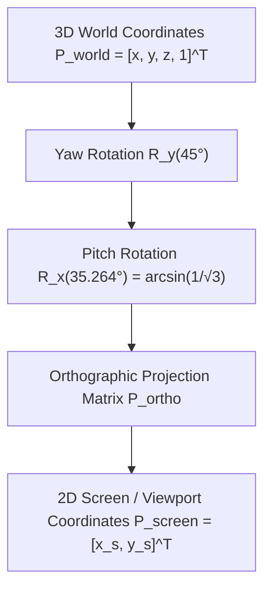

# 3D Isometric Coordinate Transformation Matrix Formulas

This developer and mathematical guide documents the transformation pipelines and projection matrices used to map 3D workspace Cartesian world coordinates into 2D isometric viewport space in WorkSphere’s WebGL engine ([`src/core/webgl/IsometricRenderer.ts`](file:///c:/Users/admin/Desktop/workfere/src/core/webgl/IsometricRenderer.ts)).

---

## 1. Executive Summary & Coordinate System Overview

To visualize multi-desk coworking spaces, hot desks, and meeting pods without perspective foreshortening distortion, WorkSphere utilizes **axonometric isometric projection**. 

True isometric projection equalizes the scale along all three Cartesian axes ($X$, $Y$, and $Z$) by tilting the camera at specific angles:
1. **Yaw Rotation around the Vertical Y-Axis ($\beta = 45^\circ$):** Rotates the scene horizontally to create symmetrical angular offset.
2. **Pitch Rotation around the Lateral X-Axis ($\alpha = 35.264^\circ$ or $\arcsin(1/\sqrt{3})$):** Tilts the camera downwards such that the projection of the coordinate axes forms equal $120^\circ$ angles relative to each other on the 2D plane.
3. **Dimetric Video Game Approximation ($\beta = 45^\circ, \alpha = 30^\circ$):** Often used in 2D tilemaps to maintain crisp 2:1 pixel aspect ratios.



---

## 2. Mathematical Derivation of Isometric Projection

### 2.1 The Rotation Pipeline

Let a 3D point in world space be represented by homogeneous coordinates:
$$\mathbf{p}_{\text{world}} = \begin{bmatrix} x \\ y \\ z \\ 1 \end{bmatrix}$$

#### Step 1: Yaw Rotation around Y-Axis ($\beta = 45^\circ = \pi/4\text{ rad}$)
$$\mathbf{R}_y(\beta) = \begin{bmatrix} 
\cos\beta & 0 & \sin\beta & 0 \\ 
0 & 1 & 0 & 0 \\ 
-\sin\beta & 0 & \cos\beta & 0 \\ 
0 & 0 & 0 & 1 
\end{bmatrix} = \begin{bmatrix} 
\frac{\sqrt{2}}{2} & 0 & \frac{\sqrt{2}}{2} & 0 \\ 
0 & 1 & 0 & 0 \\ 
-\frac{\sqrt{2}}{2} & 0 & \frac{\sqrt{2}}{2} & 0 \\ 
0 & 0 & 0 & 1 
\end{bmatrix}$$

#### Step 2: Pitch Rotation around X-Axis ($\alpha = \arcsin(1/\sqrt{3}) \approx 35.264^\circ$)
At this specific angle:
$$\sin\alpha = \frac{1}{\sqrt{3}}, \quad \cos\alpha = \sqrt{1 - \sin^2\alpha} = \sqrt{\frac{2}{3}} = \frac{\sqrt{6}}{3}$$

$$\mathbf{R}_x(\alpha) = \begin{bmatrix} 
1 & 0 & 0 & 0 \\ 
0 & \cos\alpha & -\sin\alpha & 0 \\ 
0 & \sin\alpha & \cos\alpha & 0 \\ 
0 & 0 & 0 & 1 
\end{bmatrix} = \begin{bmatrix} 
1 & 0 & 0 & 0 \\ 
0 & \sqrt{2/3} & -1/\sqrt{3} & 0 \\ 
0 & 1/\sqrt{3} & \sqrt{2/3} & 0 \\ 
0 & 0 & 0 & 1 
\end{bmatrix}$$

---

### 2.2 Combined Isometric View Matrix $\mathbf{V}_{\text{iso}}$

Multiplying the rotation matrices gives:
$$\mathbf{V}_{\text{iso}} = \mathbf{R}_x(\alpha) \cdot \mathbf{R}_y(\beta) = \begin{bmatrix} 
\frac{\sqrt{2}}{2} & 0 & \frac{\sqrt{2}}{2} & 0 \\ 
-\frac{1}{\sqrt{6}} & \sqrt{\frac{2}{3}} & \frac{1}{\sqrt{6}} & 0 \\ 
-\frac{1}{\sqrt{3}} & -\frac{1}{\sqrt{3}} & \frac{1}{\sqrt{3}} & 0 \\ 
0 & 0 & 0 & 1 
\end{bmatrix}$$

Projecting onto the 2D viewing plane ($X$ and $Y$ screen components):
$$x_{\text{screen}} = \frac{\sqrt{2}}{2} (x + z) = \frac{x + z}{\sqrt{2}}$$
$$y_{\text{screen}} = -\frac{1}{\sqrt{6}} x + \sqrt{\frac{2}{3}} y + \frac{1}{\sqrt{6}} z = \frac{-x + 2y + z}{\sqrt{6}}$$

---

### 2.3 2:1 Dimetric Projection Approximation (Standard Game Angle)

In pixel-based 2.5D graphics, the true isometric angle ($\approx 35.264^\circ$) creates irrational slopes that cause aliasing on raster pixel grids. WorkSphere supports the **2:1 Dimetric projection** ($\alpha = 30^\circ, \beta = 45^\circ$ or $26.565^\circ$):

$$\begin{aligned}
x_{\text{screen}} &= (x - z) \cdot \cos(30^\circ) \\
y_{\text{screen}} &= (x + z) \cdot \sin(30^\circ) - y
\end{aligned}$$

With $\cos(30^\circ) = \frac{\sqrt{3}}{2} \approx 0.866$ and $\sin(30^\circ) = 0.5$:
$$\begin{aligned}
x_{\text{screen}} &= (x - z) \cdot 0.866 \\
y_{\text{screen}} &= (x + z) \cdot 0.5 - y
\end{aligned}$$

---

## 3. Orthographic Projection Matrix $\mathbf{P}_{\text{ortho}}$

In WebGL, the camera projection matrix $\mathbf{P}_{\text{ortho}}$ maps the viewing volume defined by $[l, r] \times [b, t] \times [n, f]$ into Normalized Device Coordinates (NDC) $[-1, 1]^3$:

$$\mathbf{P}_{\text{ortho}} = \begin{bmatrix} 
\frac{2}{r - l} & 0 & 0 & -\frac{r + l}{r - l} \\ 
0 & \frac{2}{t - b} & 0 & -\frac{t + b}{t - b} \\ 
0 & 0 & -\frac{2}{f - n} & -\frac{f + n}{f - n} \\ 
0 & 0 & 0 & 1 
\end{bmatrix}$$

For a symmetrical orthographic frustum of width $W$, height $H$, and zoom factor $s$:
$$r = -l = \frac{W}{2s}, \quad t = -b = \frac{H}{2s}$$

$$\mathbf{P}_{\text{ortho}} = \begin{bmatrix} 
\frac{2s}{W} & 0 & 0 & 0 \\ 
0 & \frac{2s}{H} & 0 & 0 \\ 
0 & 0 & -\frac{2}{f - n} & -\frac{f + n}{f - n} \\ 
0 & 0 & 0 & 1 
\end{bmatrix}$$

---

## 4. TypeScript Implementation Example

The following standalone module demonstrates how to generate the isometric projection matrix and project 3D desk positions into 2D screen coordinates:

```typescript
/**
 * isometricMath.ts
 * Transformation matrix utilities for 3D isometric rendering in WebGL.
 */

export interface Point3D {
  x: number;
  y: number;
  z: number;
}

export interface Point2D {
  x: number;
  y: number;
}

/**
 * Creates a standard 4x4 Orthographic Projection Matrix.
 */
export function createOrthographicMatrix(
  width: number,
  height: number,
  zoom: number = 1.0,
  near: number = -100.0,
  far: number = 100.0
): Float32Array {
  const halfW = width / (2 * zoom);
  const halfH = height / (2 * zoom);

  const out = new Float32Array(16);
  out[0] = 1 / halfW;
  out[5] = 1 / halfH;
  out[10] = -2 / (far - near);
  out[14] = -(far + near) / (far - near);
  out[15] = 1;
  return out;
}

/**
 * Creates a true 4x4 Isometric View Matrix with yaw=45° and pitch=35.264°.
 */
export function createIsometricViewMatrix(): Float32Array {
  const sinAlpha = 1 / Math.sqrt(3);        // sin(35.264°)
  const cosAlpha = Math.sqrt(2 / 3);        // cos(35.264°)
  const sinBeta = Math.SQRT1_2;              // sin(45°) = √2 / 2
  const cosBeta = Math.SQRT1_2;              // cos(45°) = √2 / 2

  const out = new Float32Array(16);

  // Column 0
  out[0] = cosBeta;
  out[1] = -sinAlpha * sinBeta;
  out[2] = -cosAlpha * sinBeta;
  out[3] = 0;

  // Column 1
  out[4] = 0;
  out[5] = cosAlpha;
  out[6] = -sinAlpha;
  out[7] = 0;

  // Column 2
  out[8] = sinBeta;
  out[9] = sinAlpha * cosBeta;
  out[10] = cosAlpha * cosBeta;
  out[11] = 0;

  // Column 3
  out[12] = 0;
  out[13] = 0;
  out[14] = 0;
  out[15] = 1;

  return out;
}

/**
 * Directly transforms a 3D world coordinate into 2D isometric screen space.
 */
export function worldToScreenIsometric(
  world: Point3D,
  originX: number,
  originY: number,
  tileScale: number = 32
): Point2D {
  // Using classic 2:1 dimetric projection ratio
  const screenX = originX + (world.x - world.z) * (tileScale * 0.866);
  const screenY = originY + (world.x + world.z) * (tileScale * 0.5) - (world.y * tileScale);

  return { x: screenX, y: screenY };
}
```

---

## 5. WebGL Vertex Shader Integration

In [`src/core/webgl/IsometricRenderer.ts`](file:///c:/Users/admin/Desktop/workfere/src/core/webgl/IsometricRenderer.ts), uniforms `u_projection` and `u_view` are passed directly to the vertex shader:

```glsl
#version 300 es
layout(location = 0) in vec3 a_position;
layout(location = 1) in vec2 a_uv;
layout(location = 2) in vec4 a_instance_pos_rot; // x, y, z, rotation

uniform mat4 u_projection;
uniform mat4 u_view;

out vec2 v_uv;

void main() {
    v_uv = a_uv;
    vec3 worldPos = a_position + a_instance_pos_rot.xyz;
    gl_Position = u_projection * u_view * vec4(worldPos, 1.0);
}
```

This guarantees consistent parallel grid alignment across all rendered hot desks, chairs, and acoustic partitions.
