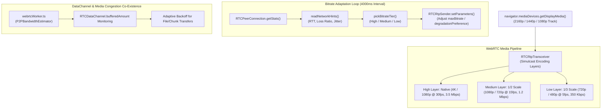

# WebRTC Screen Share Bitrate Adaptation, Simulcast Layers, and Congestion Control

## 1. Executive Summary

In WorkSphere's real-time collaborative workspace, peers stream desktop displays, CAD designs, code editors, and live whiteboard canvases across diverse network topologies. This specification defines the architecture and operational behavior of real-time screen sharing optimization, covering:
- **Adaptive Bitrate Ladder (2160p to 720p):** Dynamically adjusting resolution scale, frame rate, and maximum bitrate thresholds based on candidate-pair transport telemetry.
- **Simulcast Spatial & Temporal Layers:** Multi-stream encoding configurations (`scaleResolutionDownBy`, `maxFramerate`, `maxBitrate`) allowing selective forwarding based on subscriber bandwidth.
- **Keyframe Interval & Intra-Frame Request (PLI/FIR):** Mitigating freeze cycles during high-motion display updates and slide transitions.
- **WebRTC Data Channel Congestion Control:** Cooperative throttling between large file transfers, throughput estimation (`webrtcWorker.ts`, `P2PBandwidthEstimator.ts`), and media transport channels.

Relevant implementations in WorkSphere include:
- [`src/workers/webrtcWorker.ts`](file:///c:/Users/admin/Desktop/workfere/src/workers/webrtcWorker.ts) — WebRTC DataChannel worker and bandwidth measurement.
- [`src/lib/screenShareBitrate.ts`](file:///c:/Users/admin/Desktop/workfere/src/lib/screenShareBitrate.ts) — Active bitrate tier adaptation and network telemetry parser.
- [`src/hooks/useScreenShare.ts`](file:///c:/Users/admin/Desktop/workfere/src/hooks/useScreenShare.ts) — Peer connection lifecycle and screen media track negotiation.

---

## 2. Architecture Overview



---

## 3. Adaptive Bitrate Ladder (2160p to 720p)

Screen sharing exhibits distinct characteristics compared to typical webcam video:
1. **High Text Legibility Requirement:** Preserving crisp fonts and interface vectors takes precedence over fluid frame rates.
2. **Variable Motion Dynamics:** Static coding windows require negligible bandwidth, whereas window dragging or video playback demands sudden bitrate bursts.

### 3.1 Bitrate Ladder Specifications

| Tier / Preset | Target Resolution | Frame Rate | Max Bitrate (`maxBitrate`) | Min Bitrate | Recommended Content Hint |
| :--- | :---: | :---: | :---: | :---: | :---: |
| **Ultra High (4K / 2160p)** | $3840 \times 2160$ | $15\text{--}30\text{ fps}$ | $4,500\text{ kbps}$ | $1,500\text{ kbps}$ | `detail` (text / architectural CAD) |
| **High (1440p / 1080p)** | $2560 \times 1440$ / $1920 \times 1080$ | $30\text{ fps}$ | $2,500\text{ kbps}$ | $800\text{ kbps}$ | `detail` |
| **Medium (1080p / 720p)** | $1920 \times 1080$ / $1280 \times 720$ | $15\text{ fps}$ | $1,000\text{ kbps}$ | $400\text{ kbps}$ | `detail` / `motion` |
| **Low (720p / 480p)** | $1280 \times 720$ / $854 \times 480$ | $5\text{--}10\text{ fps}$ | $400\text{ kbps}$ | $150\text{ kbps}$ | `detail` |

### 3.2 Telemetry Thresholds & Tier Selection

In [`src/lib/screenShareBitrate.ts`](file:///c:/Users/admin/Desktop/workfere/src/lib/screenShareBitrate.ts), transport statistics parsed from `candidate-pair`, `remote-inbound-rtp`, and `outbound-rtp` drive tier transitions:

$$\text{Loss Ratio} = \frac{\text{packetsLost}}{\text{packetsSent}}$$

```typescript
export function pickBitrateTier(input: {
  rttMs?: number;
  packetsLost?: number;
  packetsSent?: number;
  jitterMs?: number;
}): BitrateTier {
  const rtt = input.rttMs ?? 0;
  const sent = input.packetsSent ?? 0;
  const lost = input.packetsLost ?? 0;
  const jitter = input.jitterMs ?? 0;
  const lossRatio = sent > 0 ? lost / sent : 0;

  // Severe congestion or high latency
  if (rtt > 250 || lossRatio > 0.08 || jitter > 50) return LOW;
  
  // Moderate congestion
  if (rtt > 120 || lossRatio > 0.03 || jitter > 20) return MEDIUM;
  
  // Clean connection
  return HIGH;
}
```

### 3.3 Degradation Preference

Screen sharing tracks configure `degradationPreference = "maintain-resolution"` to prevent text blurriness:

```typescript
const parameters = videoSender.getParameters();
parameters.degradationPreference = "maintain-resolution";
await videoSender.setParameters(parameters);
```

Under bandwidth deficits, the browser drops frame rate (e.g., from 30 fps down to 5 fps) before downscaling spatial pixel density.

---

## 4. Simulcast Multi-Layer Encoding

When streaming to multi-party mesh networks or Selective Forwarding Units (SFUs), simulcast allows the sender to transmit multiple encodings concurrently.

### 4.1 Sender Transceiver Configuration

```typescript
const screenTrack = displayStream.getVideoTracks()[0];
const transceiver = peerConnection.addTransceiver(screenTrack, {
  direction: 'sendonly',
  sendEncodings: [
    {
      rid: 'hi',
      maxBitrate: 3_500_000,
      scaleResolutionDownBy: 1.0,
      maxFramerate: 30,
    },
    {
      rid: 'mid',
      maxBitrate: 1_200_000,
      scaleResolutionDownBy: 2.0,
      maxFramerate: 15,
    },
    {
      rid: 'low',
      maxBitrate: 350_000,
      scaleResolutionDownBy: 3.0,
      maxFramerate: 5,
    },
  ],
});
```

### 4.2 Simulcast Layer Breakdown

1. **Layer `hi` (Full Scale / 2160p or 1080p):**
   - Transmitted directly to peers with high-bandwidth connections viewing fullscreen.
2. **Layer `mid` ($0.5\times$ Scale / 1080p or 720p):**
   - Delivered to peers on standard laptop displays or side-by-side split screen views.
3. **Layer `low` ($0.33\times$ Scale / 720p or 480p):**
   - Fallback layer for congested peers or thumbnail previews in attendee grids.

---

## 5. Keyframe Frequency & Intra-Frame Recovery

Because screen content is frequently static, inter-frame temporal differences ($\Delta$) drop to near zero. However, slide transitions, tab changes, or initial peer connections require immediate intra-frames (I-frames / keyframes).

### 5.1 Picture Loss Indication (PLI) & Full Intra Request (FIR)

- **Standard Interval:** By default, WebRTC sends keyframes only on channel negotiation or significant scene changes. For screen sharing, an artificial keyframe interval of **3 to 5 seconds** or on-demand signaling prevents artifact trails.
- **Handling Remote Join:** When a new peer joins an existing session, the receiver issues an RTCP feedback message:
  - `goog-remb` / `transport-cc` for bandwidth feedback.
  - `nack pli` (Picture Loss Indication) to trigger an immediate keyframe refresh.

```javascript
// Programmatically request a keyframe refresh on active RTCRtpScriptTransform / WebCodecs (if enabled)
if ('generateKeyFrame' in videoSender) {
  videoSender.generateKeyFrame();
}
```

---

## 6. WebRTC Data Channel Congestion Control

In WorkSphere, [`webrtcWorker.ts`](file:///c:/Users/admin/Desktop/workfere/src/workers/webrtcWorker.ts) and [`P2PBandwidthEstimator.ts`](file:///c:/Users/admin/Desktop/workfere/src/core/network/P2PBandwidthEstimator.ts) utilize WebRTC DataChannels for P2P speed testing and large workspace asset exchange.

### 6.1 Buffer Threshold Monitoring

Data channels share underlying SCTP/DTLS transport over UDP with RTP media. Uncontrolled DataChannel transmission floods the socket buffer, triggering packet drop and latency spikes in media tracks.

```typescript
const MAX_BUFFERED_AMOUNT = 64 * 1024; // 64 KB threshold

function sendChunkSafely(channel: RTCDataChannel, chunk: ArrayBuffer) {
  if (channel.bufferedAmount > MAX_BUFFERED_AMOUNT) {
    channel.onbufferedamountlow = () => {
      channel.onbufferedamountlow = null;
      channel.send(chunk);
    };
    return;
  }
  channel.send(chunk);
}
```

### 6.2 Worker Bandwidth Estimation Feedback Loop

`webrtcWorker.ts` calculates instantaneous throughput:

$$\text{Throughput (Mbps)} = \frac{\text{Chunks Received} \times \text{Chunk Size (Bits)}}{\Delta t \times 10^6}$$

When bandwidth testing or large asset sync is active:
1. `webrtcWorker.ts` logs transfer velocity and communicates with the main thread.
2. `useScreenShare.ts` adjusts `adaptVideoBitrate` to allocate headroom, preventing screen freezing during burst transfers.
3. If loss exceeds $8\%$, `pickBitrateTier()` immediately lowers screen sharing bitrate to the `LOW` tier ($400\text{ kbps}$) until buffer drains.
