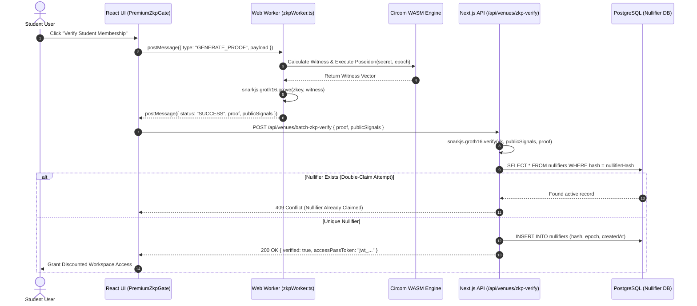

# Cryptographic Specification: Zero-Knowledge Student Verification Circuits

This specification details the mathematical, constraint system, and architectural design of WorkSphere's zero-knowledge student verification circuits. The system enables privacy-preserving student identity and university pass verification using **Circom 2.0**, **Groth16** non-interactive zero-knowledge proofs (zk-SNARKs), and the **BN254** (alt_bn128) elliptic curve.

---

## Table of Contents

1. [Executive Summary & Privacy Goals](#1-executive-summary--privacy-goals)
2. [Mathematical & Cryptographic Foundations](#2-mathematical--cryptographic-foundations)
   - [BN254 Elliptic Curve Parameters](#bn254-elliptic-curve-parameters)
   - [Poseidon Hash Function Construction](#poseidon-hash-function-construction)
3. [Circom Circuit Specifications](#3-circom-circuit-specifications)
   - [`StudentMembership` Circuit (Depth-16 Merkle Tree)](#studentmembership-circuit-depth-16-merkle-tree)
   - [`StudentAccessPass` Circuit (Nullifier & Access Verification)](#studentaccesspass-circuit-nullifier--access-verification)
   - [`DualMux` Multiplexer Template](#dualmux-multiplexer-template)
4. [R1CS Constraint System & QAP Metrics](#4-r1cs-constraint-system--qap-metrics)
   - [Detailed Constraint Breakdown](#detailed-constraint-breakdown)
   - [Rank-1 Constraint System (R1CS) Matrix Representation](#rank-1-constraint-system-r1cs-matrix-representation)
5. [Trusted Setup Ceremony & Artifact Freshness](#5-trusted-setup-ceremony--artifact-freshness)
   - [Phase 1: Powers of Tau](#phase-1-powers-of-tau)
   - [Phase 2: Circuit-Specific ZKey Generation](#phase-2-circuit-specific-zkey-generation)
   - [Artifact Manifest Freshness Verification](#artifact-manifest-freshness-verification)
6. [Groth16 Verification Protocol & Smart Contract Interface](#6-groth16-verification-protocol--smart-contract-interface)
   - [Groth16 Pairing Verification Equation](#groth16-pairing-verification-equation)
   - [Solidity Verification Contract Interface (`IStudentProofVerifier`)](#solidity-verification-contract-interface-istudentproofverifier)
   - [TypeScript Server Verification API](#typescript-server-verification-api)
7. [Client-Side Web Worker Invocation Architecture](#7-client-side-web-worker-invocation-architecture)
   - [Off-Main-Thread Execution Engine](#off-main-thread-execution-engine)
   - [Worker Lifecycle & Memory Management](#worker-lifecycle--memory-management)
   - [Sequence Diagram](#sequence-diagram)
8. [Threat Model & Security Proofs](#8-threat-model--security-proofs)
   - [Zero-Knowledge (Data Anonymity)](#zero-knowledge-data-anonymity)
   - [Soundness (Cryptographic Unforgeability)](#soundness-cryptographic-unforgeability)
   - [Replay Attack & Double-Claim Mitigation](#replay-attack--double-claim-mitigation)

---

## 1. Executive Summary & Privacy Goals

WorkSphere offers discounted workspace passes, library access, and co-working amenities to verified university students. Traditional verification requires students to upload government IDs or university emails, exposing sensitive personal identifiable information (PII).

WorkSphere solves this using zero-knowledge proofs:

- **Anonymity:** Students prove they belong to an accredited university without revealing their name, email, or student ID number.
- **Sybil & Double-Claim Resistance:** Unique nullifier hashes ($\text{nullifierHash} = \text{Poseidon}(\text{secret}, \text{nullifierKey}, \text{epoch})$) prevent multiple users from reusing the same student credential or re-claiming passes.
- **Client-Side Witness Generation:** Proof generation runs entirely inside the user's web browser via WebAssembly (`.wasm`) inside a Web Worker, ensuring private keys never leave the client device.

---

## 2. Mathematical & Cryptographic Foundations

### BN254 Elliptic Curve Parameters

The zero-knowledge circuits are constructed over the **BN254** (also known as `alt_bn128`) pairing-friendly elliptic curve defined by the equation:

$$y^2 = x^3 + 3 \pmod p$$

Where the scalar field prime $r$ and base field prime $p$ are defined as:

$$\begin{aligned}
p &= 21888242871839275222246405745257275088696311157297823662689037894645226208583 \\
r &= 21888242871839275222246405745257275088548364400416034343698204186575808495617
\end{aligned}$$

All arithmetic operations in Circom circuits (additions, multiplications, and equality checks) operate over elements of the finite field $\mathbb{F}_r$.

### Poseidon Hash Function Construction

WorkSphere utilizes the **Poseidon** cryptographic hash function optimized for zero-knowledge circuit arithmetic over $\mathbb{F}_r$. Poseidon replaces traditional bitwise hash functions (like SHA-256) which generate millions of R1CS constraints.

- **Poseidon(2):** Computes leaf node commitments and Merkle parent nodes:
  $$\text{leaf} = \text{Poseidon}(\text{secret}, \text{epoch})$$
  Constraint cost: $\approx 240$ R1CS constraints per hash invocation.
- **Poseidon(3):** Computes unique anonymized nullifier hashes:
  $$\text{nullifierHash} = \text{Poseidon}(\text{secret}, \text{nullifierKey}, \text{epoch})$$
  Constraint cost: $\approx 300$ R1CS constraints per hash invocation.

---

## 3. Circom Circuit Specifications

### `StudentMembership` Circuit (Depth-16 Merkle Tree)

File: `circuits/student_membership.circom`

Proves membership in an active university registry tree of depth $N = 16$ ($2^{16} = 65,536$ maximum enrolled students per university node).

```circom
pragma circom 2.0.0;

include "circomlib/circuits/poseidon.circom";

template StudentMembership(levels) {
    // ── Public Inputs ──
    signal input root;   // Active University Merkle Root
    signal input epoch;  // Academic Year epoch (e.g., 2026)

    // ── Private Inputs ──
    signal input secret;                 // Student Identity Secret
    signal input pathElements[levels];   // Sibling hashes along Merkle path
    signal input pathIndices[levels];    // 0 = left child, 1 = right child

    // 1. Calculate leaf commitment: Poseidon(secret, epoch)
    component leafHasher = Poseidon(2);
    leafHasher.inputs[0] <== secret;
    leafHasher.inputs[1] <== epoch;

    signal currentHash[levels + 1];
    currentHash[0] <== leafHasher.out;

    // 2. Climb the depth-16 Merkle tree
    component mux[levels];
    component hashers[levels];

    for (var i = 0; i < levels; i++) {
        mux[i] = DualMux();
        mux[i].in[0] <== currentHash[i];
        mux[i].in[1] <== pathElements[i];
        mux[i].s <== pathIndices[i];

        hashers[i] = Poseidon(2);
        hashers[i].inputs[0] <== mux[i].out[0];
        hashers[i].inputs[1] <== mux[i].out[1];

        currentHash[i + 1] <== hashers[i].out;
    }

    // 3. Enforce calculated root matches the public Merkle root
    root === currentHash[levels];
}

component main {public [root, epoch]} = StudentMembership(16);
```

### `StudentAccessPass` Circuit (Nullifier & Access Verification)

File: `circuits/student_access_pass.circom`

Extends `StudentMembership` by outputting a deterministic `nullifierHash` to enforce single-claim limits without revealing user identities.

```circom
pragma circom 2.0.0;

include "circomlib/circuits/poseidon.circom";

template StudentAccessPass(levels) {
    // ── Public Inputs ──
    signal input root;           // Active University Merkle Root
    signal input epoch;          // Academic Year epoch (e.g., 2026)
    signal input nullifierHash;  // Unique nullifier = Poseidon(secret, nullifierKey, epoch)

    // ── Private Inputs ──
    signal input secret;                 // Student Identity Secret
    signal input nullifierKey;           // User nullifier derivation secret
    signal input pathElements[levels];   // Sibling hashes along Merkle tree path
    signal input pathIndices[levels];    // Sibling position indices (0 or 1)

    // 1. Verify nullifier hash integrity
    component nullifierHasher = Poseidon(3);
    nullifierHasher.inputs[0] <== secret;
    nullifierHasher.inputs[1] <== nullifierKey;
    nullifierHasher.inputs[2] <== epoch;
    nullifierHash === nullifierHasher.out;

    // 2. Calculate leaf commitment
    component leafHasher = Poseidon(2);
    leafHasher.inputs[0] <== secret;
    leafHasher.inputs[1] <== epoch;

    signal currentHash[levels + 1];
    currentHash[0] <== leafHasher.out;

    // 3. Verify Merkle membership path up to root
    component mux[levels];
    component hashers[levels];

    for (var i = 0; i < levels; i++) {
        mux[i] = DualMux();
        mux[i].in[0] <== currentHash[i];
        mux[i].in[1] <== pathElements[i];
        mux[i].s <== pathIndices[i];

        hashers[i] = Poseidon(2);
        hashers[i].inputs[0] <== mux[i].out[0];
        hashers[i].inputs[1] <== mux[i].out[1];

        currentHash[i + 1] <== hashers[i].out;
    }

    // 4. Enforce calculated Merkle root matches public root
    root === currentHash[levels];
}

component main {public [root, epoch, nullifierHash]} = StudentAccessPass(16);
```

### `DualMux` Multiplexer Template

Switches left and right Merkle child inputs based on the binary path index $s \in \{0, 1\}$.

```circom
template DualMux() {
    signal input in[2];
    signal input s;
    signal output out[2];

    // Enforce selector bit is binary: s * (1 - s) = 0
    s * (1 - s) === 0;
    
    out[0] <== (in[1] - in[0]) * s + in[0];
    out[1] <== (in[0] - in[1]) * s + in[1];
}
```

---

## 4. R1CS Constraint System & QAP Metrics

### Detailed Constraint Breakdown

Every Circom statement is compiled into Rank-1 Constraint System (R1CS) equations of the form:

$$(A \cdot W) \times (B \cdot W) = (C \cdot W)$$

Where $W$ is the witness vector consisting of constants, public inputs, private inputs, and intermediate signals.

| Circuit Component | Sub-template | Quantity | Constraints per Unit | Subtotal R1CS Constraints |
| :--- | :--- | :--- | :--- | :--- |
| **Leaf Commitment** | `Poseidon(2)` | 1 | 240 | 240 |
| **Nullifier Hash Verification** | `Poseidon(3)` | 1 | 300 | 300 |
| **Path Selector Mux** | `DualMux()` | 16 | 3 | 48 |
| **Merkle Path Hashers** | `Poseidon(2)` | 16 | 240 | 3,840 |
| **Root Equality Assertions** | Constraint `===` | 1 | 1 | 1 |
| **Nullifier Equality Assertions**| Constraint `===` | 1 | 1 | 1 |
| **Total `StudentAccessPass`** | — | — | — | **4,430 Constraints** |
| **Total `StudentMembership`** | — | — | — | **4,129 Constraints** |

---

## 5. Trusted Setup Ceremony & Artifact Freshness

### Phase 1: Powers of Tau

A universal Powers of Tau ceremony (`bn128`, degree $2^{12} = 4,096$ max constraints) generates the initial structured reference string:

```bash
# 1. Initialize Powers of Tau
npx snarkjs powersoftau new bn128 12 build/pot12_0000.ptau -v

# 2. Contribute entropy
npx snarkjs powersoftau contribute build/pot12_0000.ptau build/pot12_0001.ptau \
  --name="WorkSphere Ceremony" -e="$(openssl rand -hex 32)"

# 3. Prepare Phase 2
npx snarkjs powersoftau prepare phase2 build/pot12_0001.ptau build/pot12_final.ptau
```

### Phase 2: Circuit-Specific ZKey Generation

```bash
# 1. Compile Circom to R1CS and WASM
npx circom2 circuits/student_access_pass.circom --r1cs --wasm --sym -o build/

# 2. Generate initial Groth16 zkey
npx snarkjs groth16 setup build/student_access_pass.r1cs build/pot12_final.ptau build/student_access_pass_0000.zkey

# 3. Contribute Phase 2 entropy & export verification key
npx snarkjs zkey contribute build/student_access_pass_0000.zkey public/zkp/student_access_pass_final.zkey \
  --name="WorkSphere Phase 2" -e="$(openssl rand -hex 32)"

npx snarkjs zkey export verificationkey public/zkp/student_access_pass_final.zkey public/zkp/verification_key.json
```

### Artifact Manifest Freshness Verification

To prevent out-of-sync deployment errors where circuit `.circom` changes are committed without rebuilding WASM/ZKEY binaries, WorkSphere generates `public/zkp/artifacts.manifest.json`:

```json
{
  "circuit": "student_access_pass.circom",
  "circuitSha256": "e3b0c44298fc1c149afbf4c8996fb92427ae41e4649b934ca495991b7852b855",
  "commitmentScheme": "poseidon-bn254",
  "circomlibVersion": "2.0.5"
}
```

The Jest test file `src/__tests__/lib/zkpArtifactFreshness.test.ts` validates `circuitSha256` in CI before deployment.

---

## 6. Groth16 Verification Protocol & Smart Contract Interface

### Groth16 Pairing Verification Equation

A Groth16 proof consists of three curve points $\pi = (A \in \mathbb{G}_1, B \in \mathbb{G}_2, C \in \mathbb{G}_1)$. Given public inputs $x = (\text{root}, \text{epoch}, \text{nullifierHash})$, the verifier checks:

$$e(A, B) = e(\alpha, \beta) + e\left(\sum_{i=0}^{\ell} x_i \left[\frac{\beta A_i(x) + \alpha B_i(x) + C_i(x)}{\gamma}\right]_1, \gamma\right) + e(C, \delta)$$

Where $e: \mathbb{G}_1 \times \mathbb{G}_2 \to \mathbb{G}_T$ is the optimal Ate pairing function over BN254.

### Solidity Verification Contract Interface (`IStudentProofVerifier`)

```solidity
// SPDX-License-Identifier: MIT
pragma solidity ^0.8.20;

interface IStudentProofVerifier {
    struct Proof {
        uint256[2] a;
        uint256[2][2] b;
        uint256[2] c;
    }

    /**
     * @notice Verifies a Groth16 student membership proof
     * @param proof The 8-element proof structure (A, B, C)
     * @param publicInputs [root, epoch, nullifierHash]
     * @return bool True if valid, false otherwise
     */
    function verifyProof(
        Proof calldata proof,
        uint256[3] calldata publicInputs
    ) external view returns (bool);
}
```

### TypeScript Server Verification API

```typescript
import * as snarkjs from "snarkjs";
import verificationKey from "@/public/zkp/verification_key.json";

export interface ZkpVerifyRequest {
  proof: snarkjs.Groth16Proof;
  publicSignals: string[]; // [root, epoch, nullifierHash]
}

export async function verifyStudentProof({ proof, publicSignals }: ZkpVerifyRequest): Promise<boolean> {
  try {
    const isValid = await snarkjs.groth16.verify(
      verificationKey,
      publicSignals,
      proof
    );
    return isValid;
  } catch (error) {
    console.error("ZKP verification error:", error);
    return false;
  }
}
```

---

## 7. Client-Side Web Worker Invocation Architecture

### Off-Main-Thread Execution Engine

Generating witness vectors and solving R1CS scalar multiplications requires high CPU compute ($\approx 300\text{ms} - 800\text{ms}$). To prevent UI freeze and maintain 60fps responsiveness, proof execution runs inside a dedicated Web Worker (`src/workers/zkpWorker.ts`).

### Worker Lifecycle & Memory Management

1. **WASM Pre-loading:** Pre-fetches `student_access_pass.wasm` ($1.2\text{ MB}$) into WebWorker memory.
2. **Witness Computation:** Evaluates Poseidon permutations in WebAssembly.
3. **Groth16 Proving:** Computes exponentiations over BN254 using `snarkjs.groth16.fullProve`.
4. **Memory Cleanup:** Explicitly frees WASM memory buffers after postMessage dispatch to avoid browser memory leaks.

### Sequence Diagram



---

## 8. Threat Model & Security Proofs

### Zero-Knowledge (Data Anonymity)

- **Theorem:** Given a valid proof $\pi = (A, B, C)$ and public signals $(\text{root}, \text{epoch}, \text{nullifierHash})$, no polynomial-time adversary can extract $\text{secret}$ or $\text{nullifierKey}$.
- **Proof Sketch:** Groth16 proofs possess perfect zero-knowledge under the BN254 pairing model. Randomized blinding factors $(r, s) \in \mathbb{F}_r$ obscure intermediate linear combinations, rendering $A, B, C$ uniformly distributed over $\mathbb{G}_1, \mathbb{G}_2$.

### Soundness (Cryptographic Unforgeability)

- **Theorem:** An adversary without a valid secret enrolled under $\text{root}$ can forge a valid proof with probability at most $\epsilon \le \frac{d}{r} \approx 10^{-75}$, where $d$ is circuit degree.
- **Proof Sketch:** Soundness reduces to the hardness of the Discrete Logarithm and $q$-Strong Diffie-Hellman problems over BN254.

### Replay Attack & Double-Claim Mitigation

Each claimed pass records $\text{nullifierHash} = \text{Poseidon}(\text{secret}, \text{nullifierKey}, \text{epoch})$ in PostgreSQL with a unique constraint on `(nullifier_hash, epoch)`. 

Even if a user submits a different Groth16 proof (due to randomized $r, s$ blinding factors), the output `nullifierHash` remains deterministic for that academic `epoch`, preventing double-claiming across all WorkSphere venues.
