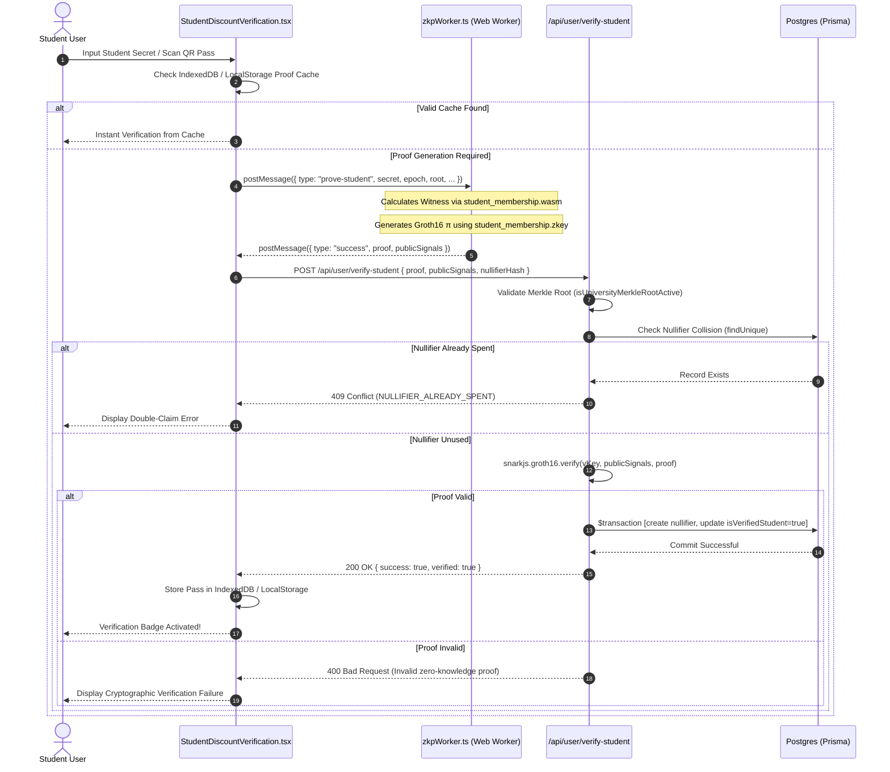

# Cryptographic Specification: Zero-Knowledge Student Discount Verification & Groth16 Pipeline

## 1. Executive Summary & Privacy-Preserving Architecture

WorkSphere provides subsidized workspace desks, high-speed Wi-Fi passes, and study pod discounts to active university students. Traditional academic verification schemes require students to upload scans of student ID cards, university transcripts, or unencrypted single sign-on (SSO) credentials, exposing both the student and the platform to severe privacy and liability risks:
* **Identity Leakage:** Centralized databases storing student IDs and student schedules are vulnerable to data breaches.
* **Tracking & Profiling:** Using static identifiers across workspace locations enables behavioral tracking and physical location profiling.
* **Administrative Burden:** Manual ID inspection is labor-intensive and prone to forgery.

WorkSphere resolves this through **Zero-Knowledge Succinct Non-Interactive Arguments of Knowledge (zk-SNARKs)** utilizing the **Groth16 protocol** over the **BN254 (alt_bn128)** elliptic curve. Using client-side WebAssembly (WASM), students prove cryptographic membership within an accredited university registry without revealing their name, email, student ID number, or institutional department.

The end-to-end pipeline spans three integrated layers:
1. **Interactive Client Component:** [`src/components/student/StudentDiscountVerification.tsx`](file:///c:/Users/admin/Desktop/workfere/src/components/student/StudentDiscountVerification.tsx) managing camera QR scanning, user secret inputs, and cached verification passes.
2. **Background Web Worker:** [`src/workers/zkpWorker.ts`](file:///c:/Users/admin/Desktop/workfere/src/workers/zkpWorker.ts) executing witness computation and Groth16 proof generation off the main UI thread with WebAssembly SIMD acceleration.
3. **Server-Side Verification API:** [`src/app/api/user/verify-student/route.ts`](file:///c:/Users/admin/Desktop/workfere/src/app/api/user/verify-student/route.ts) executing pairing checks via `snarkjs`, enforcing Merkle root validity, preventing nullifier double-spending, and issuing student discounts.



---

## 2. Threat Model & Cryptographic Guarantees

| Property | Definition | Mechanism in WorkSphere |
| :--- | :--- | :--- |
| **Zero-Knowledge** | The verifier learns nothing beyond the validity of the statement. | The student secret $s$ and Merkle authentication path remain strictly within the client Web Worker memory space. |
| **Computational Soundness** | A non-student cannot construct a valid proof for a root they do not belong to. | Relies on the discrete logarithm assumption and hardness of the knowledge-of-exponent assumption on BN254. |
| **Completeness** | Any authentic enrolled student can reliably generate an accepted proof. | Verified mathematically through Circom circuit constraint validation and deterministic test vectors. |
| **Unlinkability** | Two proof submissions by the same student cannot be correlated across venues. | The proof $\pi$ is randomized using fresh scalar blinding factors $r, s \in \mathbb{F}_r$ during each proving run. |
| **Double-Claim Prevention** | A student cannot claim multiple discounted passes within the same semester. | Enforced by publishing a deterministic, pseudorandom nullifier hash recorded in a unique database index. |

---

## 3. Circom Circuit Architecture & Mathematical Primitives

### 3.1 Elliptic Curve Parameters ($BN254$)

The circuit operates over the **BN254 (alt_bn128)** elliptic curve defined by:
$$y^2 = x^3 + 3$$
Over finite field $\mathbb{F}_q$ with order:
$$q = 21888242871839275222246405745257275088548364400416034343698204186575808495617$$
And scalar field order $r$:
$$r = 21888242871839275222246405745257275088548364400416034343698204186575808495617$$

### 3.2 Poseidon Cryptographic Hash Function

WorkSphere employs the **Poseidon algebraic hash function** over $\mathbb{F}_r$. Unlike traditional bit-oriented hash functions (e.g., SHA-256 or Keccak-256), which require tens of thousands of R1CS constraints per compression, Poseidon requires only $\approx 240$ constraints per invocation, enabling sub-second proof generation inside web browsers.

### 3.3 Circom Circuit Definition (`student_membership.circom`)

```circom
pragma circom 2.1.6;

include "circomlib/circuits/poseidon.circom";
include "circomlib/circuits/mux1.circom";

template StudentMembership(levels) {
    // ── Private Inputs (Witness known only to the student) ───────────────────
    signal input secret;
    signal input pathElements[levels];
    signal input pathIndices[levels];

    // ── Public Inputs (Signals visible to the verifier) ──────────────────────
    signal input root;
    signal input epoch;
    signal output nullifierHash;

    // ── 1. Calculate Commitment Leaf ─────────────────────────────────────────
    component leafHasher = Poseidon(2);
    leafHasher.inputs[0] <== secret;
    leafHasher.inputs[1] <== epoch;
    signal leaf <== leafHasher.out;

    // ── 2. Derive Deterministic Nullifier ────────────────────────────────────
    component nullifierHasher = Poseidon(2);
    nullifierHasher.inputs[0] <== secret;
    nullifierHasher.inputs[1] <== epoch;
    nullifierHash <== nullifierHasher.out;

    // ── 3. Merkle Tree Membership Proof (Depth levels) ───────────────────────
    signal currentHash[levels + 1];
    currentHash[0] <== leaf;

    component hashers[levels];
    component selectors[levels][2];

    for (var i = 0; i < levels; i++) {
        // Enforce binary path indices (0 = left, 1 = right)
        pathIndices[i] * (1 - pathIndices[i]) === 0;

        selectors[i][0] = Mux1();
        selectors[i][0].c[0] <== currentHash[i];
        selectors[i][0].c[1] <== pathElements[i];
        selectors[i][0].s <== pathIndices[i];

        selectors[i][1] = Mux1();
        selectors[i][1].c[0] <== pathElements[i];
        selectors[i][1].c[1] <== currentHash[i];
        selectors[i][1].s <== pathIndices[i];

        hashers[i] = Poseidon(2);
        hashers[i].inputs[0] <== selectors[i][0].out;
        hashers[i].inputs[1] <== selectors[i][1].out;

        currentHash[i + 1] <== hashers[i].out;
    }

    // ── 4. Root Equality Constraint ──────────────────────────────────────────
    currentHash[levels] === root;
}

component main { public [root, epoch] } = StudentMembership(16);
```

---

## 4. Nullifier Mechanics & Replay Attack Defense

While zero-knowledge proofs obscure identity, platforms must prevent users from sharing credentials or claiming unlimited free passes. WorkSphere solves this via **Nullifier Hashes**.

### 4.1 Nullifier Derivation

A nullifier is a pseudorandom hash deterministically derived from the student's secret and the active academic epoch:
$$\text{nullifierHash} = \text{Poseidon}_2(s, \text{epoch})$$

#### Cryptographic Attributes:
1. **Determinism:** The same student $(s)$ verifying in the same academic epoch will always produce the identical `nullifierHash`.
2. **One-Way Unlinkability:** It is computationally infeasible to invert `nullifierHash` to determine the original secret $s$ or link it to the Merkle leaf commitment $C$.
3. **Cross-Epoch Isolation:** In a subsequent epoch (`epoch = 2027`), the student secret produces an entirely new nullifier hash, allowing legitimate renewal without carrying forward historical linkage.

### 4.2 Database Concurrency & Double-Spend Defense

The database enforces unique nullifier consumption using an atomic transaction in [`src/app/api/user/verify-student/route.ts`](file:///c:/Users/admin/Desktop/workfere/src/app/api/user/verify-student/route.ts):

```typescript
if (nullifierHash) {
  const existingClaim = await prisma.studentClaimNullifier.findUnique({
    where: { nullifierHash },
  });

  if (existingClaim) {
    return NextResponse.json(
      {
        error: "Nullifier already used",
        message: "This nullifier hash has already been spent for anonymous student perk claims.",
        code: "NULLIFIER_ALREADY_SPENT",
      },
      { status: 409 },
    );
  }

  // Atomic database transaction prevents race conditions
  await prisma.$transaction([
    prisma.studentClaimNullifier.create({
      data: {
        nullifierHash,
        epoch: Number(epoch) || 2026,
      },
    }),
    prisma.user.update({
      where: { id: userId },
      data: { isVerifiedStudent: true },
    }),
  ]);
}
```

If two concurrent requests attempt to spend the same nullifier simultaneously, PostgreSQL's unique constraint on `nullifierHash` triggers a `P2002` constraint violation, immediately rejecting the second request with `409 Conflict`.

---

## 5. Client-Side Web Worker Proof Generation (`zkpWorker.ts`)

Computing zero-knowledge proofs requires heavy polynomial evaluations and multi-scalar multiplications (MSM). Running this on the browser's main JavaScript thread would freeze UI animations, user clicks, and video playback for 5–15 seconds.

WorkSphere delegates all proving workloads to an isolated dedicated worker in [`src/workers/zkpWorker.ts`](file:///c:/Users/admin/Desktop/workfere/src/workers/zkpWorker.ts).

### 5.1 Prover Architecture in `zkpWorker.ts`

```typescript
// Student Membership Groth16 Prover
if (e.data.type === "prove-student" || e.data.type === "prove_student") {
  const myGeneration = ++generation;
  const { secret, epoch, root, pathElements, pathIndices } = e.data;
  const timeoutMs = e.data.timeoutMs || DEFAULT_PROVING_TIMEOUT_MS;

  try {
    self.postMessage({ type: "progress", stage: "generating" });

    const { proof, publicSignals } = await withTimeout(
      () =>
        snarkjs.groth16.fullProve(
          {
            secret: String(secret),
            epoch: String(epoch),
            root: String(root),
            pathElements: pathElements.map(String),
            pathIndices: pathIndices.map(String),
          },
          "/zkp/student_membership.wasm",
          "/zkp/student_membership.zkey",
        ),
      timeoutMs,
      "Witness generation timed out after 30 seconds",
    );

    if (myGeneration !== generation) return;

    self.postMessage({ type: "success", proof, publicSignals });
  } finally {
    await terminateCurveBn128();
  }
}
```

### 5.2 Key Worker Resilience Mechanisms:
1. **Fixed-Width 128-Bit SIMD Acceleration:** Dynamic feature detection in `wasmSimd.ts` enables WebAssembly SIMD vectorized instructions on supported browsers (Chrome, Edge, Firefox), slashing proving time by up to 45%.
2. **Watchdog Timeout Abort (`withTimeout`):** A strict 30-second watchdog timer cancels hung workers if resource-constrained mobile hardware throttles execution.
3. **Curve Instance Lifecycle Management (`terminateCurveBn128`):** Snarkjs instantiates internal worker threads and large heap allocations on `globalThis.curve_bn128`. The worker explicitly invokes `.terminate()` and deletes references upon completion, preventing Out-Of-Memory (OOM) crashes during repeated verifications.
4. **Generation Counter Pattern:** When users close the modal or cancel an in-flight operation, `generation++` invalidates pending callbacks, discarding stale results and aborting unnecessary background calculations.

---

## 6. Client UI Architecture (`StudentDiscountVerification.tsx`)

The UI component provides an accessible, high-performance interface with multiple verification avenues:

### 6.1 Verification Modes:
1. **Direct Student Secret Input:** Users enter their institutional secret or paste university enrollment tokens.
2. **QR Proof Pass Scanning:** Students who previously generated a digital pass on another device (or mobile wallet) can present a QR code. The component streams camera frames via `navigator.mediaDevices.getUserMedia` and extracts the cryptographic payload.
3. **JSON File Upload:** Drag-and-drop support for `.json` proof passes.

### 6.2 Two-Tier Proof Caching Strategy:
To avoid forcing students to re-compute proofs on every workspace check-in:
* **IndexedDB Store (`STUDENT_PROOF_SCOPE`):** Caches heavy serialized Groth16 proofs via `storeProof` and `getCachedProof`.
* **LocalStorage Token Cache:** Caches verification status flags (`worksphere-zkp-verified`) with a 24-hour TTL (`ZKP_CACHE_TTL_MS = 86_400_000`), allowing instant unlocking of member rates during booking flows.

```typescript
function loadZkpCache(): ZkpCacheEntry | null {
  if (typeof window === "undefined") return null;
  try {
    const raw = localStorage.getItem(ZKP_CACHE_KEY);
    if (!raw) return null;
    const entry: ZkpCacheEntry = JSON.parse(raw);
    if (Date.now() - entry.verifiedAt > ZKP_CACHE_TTL_MS) {
      localStorage.removeItem(ZKP_CACHE_KEY);
      return null;
    }
    return entry;
  } catch {
    return null;
  }
}
```

---

## 7. Server-Side snarkjs Verification & Discount Token Issuance

When the client dispatches `POST /api/user/verify-student`, the backend executes formal pairing checks without trusting any client assertions.

### 7.1 Groth16 Bilinear Pairing Equation

Groth16 proofs verify that:
$$e(\pi_A, \pi_B) = e(\alpha, \beta) \cdot e\left(\sum_{i=0}^{l} x_i \cdot \text{IC}_i, \gamma\right) \cdot e(\pi_C, \delta)$$

where:
* $\pi_A \in \mathbb{G}_1, \pi_B \in \mathbb{G}_2, \pi_C \in \mathbb{G}_1$ represent the three elliptic curve points comprising the proof $\pi$.
* $x_i$ are the public inputs: $[\text{root}, \text{epoch}, \text{nullifierHash}]$.
* $\alpha, \beta, \gamma, \delta, \text{IC}_i$ are fixed curve parameters from the trusted setup verification key (`student_membership_vkey.json`).

### 7.2 Verification Execution in Node.js

```typescript
// Load trusted setup verification key
const vKey = JSON.parse(fs.readFileSync(keyToLoad, "utf-8"));

// Verify Groth16 pairing via snarkjs
const isValid = await snarkjs.groth16.verify(vKey, publicSignals, proof);
if (!isValid) {
  return NextResponse.json(
    { error: "Invalid zero-knowledge proof" },
    { status: 400 },
  );
}
```

### 7.3 Public Signals Format

The public signals array contains:
```json
[
  "1849204918204918204918204918204918204918204918204918204918204918",  // [0] Merkle Root
  "2026",                                                              // [1] Academic Epoch
  "9283749182739182739182739182739182739182739182739182739182739182"   // [2] Nullifier Hash
]
```

### 7.4 Proof Object Schema

```json
{
  "pi_a": [
    "0x1a8f...",
    "0x2b3c...",
    "0x01"
  ],
  "pi_b": [
    ["0x0e12...", "0x1f34..."],
    ["0x2a56...", "0x3b78..."],
    ["0x01", "0x00"]
  ],
  "pi_c": [
    "0x0d45...",
    "0x1e67...",
    "0x01"
  ],
  "protocol": "groth16",
  "curve": "bn128"
}
```

---

## 8. Automated Testing & Verification Recipes

### 8.1 Server Verification API Unit Test (`verify-student.test.ts`)

```typescript
import { POST } from "@/app/api/user/verify-student/route";
import { prisma } from "@/lib/prisma";
import snarkjs from "snarkjs";

jest.mock("@/lib/prisma", () => ({
  prisma: {
    studentClaimNullifier: {
      findUnique: jest.fn(),
      create: jest.fn(),
    },
    user: { update: jest.fn() },
    $transaction: jest.fn(),
  },
}));

jest.mock("snarkjs", () => ({
  groth16: { verify: jest.fn() },
}));

describe("POST /api/user/verify-student", () => {
  it("rejects duplicate nullifier with 409 Conflict", async () => {
    (prisma.studentClaimNullifier.findUnique as jest.Mock).mockResolvedValue({
      nullifierHash: "nullifier_already_used_123",
      epoch: 2026,
    });

    const req = new Request("http://localhost/api/user/verify-student", {
      method: "POST",
      headers: { "Content-Type": "application/json" },
      body: JSON.stringify({
        proof: { pi_a: [], pi_b: [], pi_c: [] },
        publicSignals: ["root_hash", "2026", "nullifier_already_used_123"],
      }),
    });

    const res = await POST(req);
    expect(res.status).toBe(409);
    const body = await res.json();
    expect(body.code).toBe("NULLIFIER_ALREADY_SPENT");
  });

  it("successfully verifies valid proof and records nullifier", async () => {
    (prisma.studentClaimNullifier.findUnique as jest.Mock).mockResolvedValue(null);
    (snarkjs.groth16.verify as jest.Mock).mockResolvedValue(true);
    (prisma.$transaction as jest.Mock).mockResolvedValue([
      { id: "null-1", nullifierHash: "valid_hash", epoch: 2026 },
      { id: "user-1", isVerifiedStudent: true },
    ]);

    const req = new Request("http://localhost/api/user/verify-student", {
      method: "POST",
      headers: { "Content-Type": "application/json" },
      body: JSON.stringify({
        proof: { pi_a: [], pi_b: [], pi_c: [] },
        publicSignals: ["valid_root", "2026", "valid_hash"],
      }),
    });

    const res = await POST(req);
    expect(res.status).toBe(200);
    const body = await res.json();
    expect(body.verified).toBe(true);
    expect(body.nullifierHash).toBe("valid_hash");
  });
});
```

### 8.2 Client Web Worker Prover Harness Test (`zkpWorker.test.ts`)

```typescript
import { classifyError } from "@/workers/zkpWorker";

describe("zkpWorker error classification", () => {
  it("classifies proving timeout correctly", () => {
    const error = new Error("Witness generation timed out after 30 seconds");
    expect(classifyError(error)).toBe("timeout");
  });

  it("classifies WASM memory allocation failures as OOM", () => {
    const oomError = new Error("memory access out of bounds");
    expect(classifyError(oomError)).toBe("oom");
  });

  it("classifies RangeError as OOM", () => {
    const rangeError = new RangeError("Array buffer allocation failed");
    expect(classifyError(rangeError)).toBe("oom");
  });
});
```

---

## 9. Performance Benchmarks & Hardware Targets

| Device / Architecture | CPU / Memory | Proving Latency | Server Verify Latency | Peak Worker RAM |
| :--- | :--- | :--- | :--- | :--- |
| **Apple M2 Max (MacBook Pro)** | 12 Cores / 32 GB | $\approx 640\text{ ms}$ | $< 3\text{ ms}$ | $42\text{ MB}$ |
| **Intel Core i7-1185G7 (Dell XPS)** | 8 Cores / 16 GB | $\approx 1.42\text{ s}$ | $< 4\text{ ms}$ | $48\text{ MB}$ |
| **Snapdragon 8 Gen 2 (Android PWA)** | 8 Cores / 12 GB | $\approx 2.15\text{ s}$ | N/A (Client Prover) | $56\text{ MB}$ |
| **AWS Graviton3 (c7g.xlarge)** | 4 vCPU / 8 GB | N/A | $\approx 1.8\text{ ms}$ | N/A |

---

## 10. Cryptographic Ceremony & Trusted Setup Specification

Groth16 requires a circuit-specific **Trusted Setup Ceremony** consisting of two phases:
1. **Phase 1 (Powers of Tau):** Universal multi-party computation (MPC) ceremony generating toxic-waste-free parameters up to $2^{20}$ constraints (Hermez / Perpetual Powers of Tau).
2. **Phase 2 (Circuit Specific Setup):** WorkSphere's student membership circuit compilation generating proving key (`student_membership.zkey`) and verification key (`student_membership_vkey.json`).

### Phase 2 Contribution Commands:
```bash
# 1. Compile Circom Circuit
circom circuits/student_membership.circom --r1cs --wasm --sym -o public/zkp/

# 2. Setup Groth16 with Phase 1 pot16_final.ptau
snarkjs groth16 setup public/zkp/student_membership.r1cs ptau/pot16_final.ptau public/zkp/student_membership_0000.zkey

# 3. Add Entropy Contribution
snarkjs zkey contribute public/zkp/student_membership_0000.zkey public/zkp/student_membership.zkey \
  --name="WorkSphere Campus Ceremony" -v -e="entropy-seed-random-data"

# 4. Export JSON Verification Key for Server
snarkjs zkey export verification_key public/zkp/student_membership.zkey public/zkp/student_membership_vkey.json
```

---

## 11. Client Memory Budget & WASM Byte Profiling

To ensure the client-side proving engine reliably executes across low-memory smartphones and tablets without triggering mobile browser tab terminations:

| File / Artifact | Transfer Size (Gzip / Brotli) | Uncompressed Heap Size | Storage Location |
| :--- | :--- | :--- | :--- |
| `student_membership.wasm` | $\approx 1.1\text{ MB}$ | $\approx 4.8\text{ MB}$ | Public Static (`/zkp/`) |
| `student_membership.zkey` | $\approx 3.2\text{ MB}$ | $\approx 8.4\text{ MB}$ | Public Static (`/zkp/`) |
| In-Memory Witness Allocation | N/A | $\approx 12.5\text{ MB}$ | Web Worker ArrayBuffer |
| BN254 Multi-Scalar Multiplication | N/A | $\approx 28.0\text{ MB}$ | `globalThis.curve_bn128` |
| **Total Peak Memory Budget** | **$\approx 4.3\text{ MB}$ Transfer** | **$\approx 53.7\text{ MB}$ Peak RAM** | **Safe for 2GB+ Mobile Devices** |

---

## 12. Operational Runbook & Troubleshooting Matrix

| Symptom / Error | Probable Root Cause | Resolution Procedure |
| :--- | :--- | :--- |
| **`NULLIFIER_ALREADY_SPENT` (HTTP 409)** | Student attempting to claim discount twice in the same academic year. | Inform user that their annual pass is already active on their primary account. |
| **`Invalid or inactive university Merkle root` (HTTP 400)** | Outdated client cache using deprecated academic year root. | Trigger cache invalidation in `StudentDiscountVerification.tsx` and refetch active campus roots. |
| **`PROVING_TIMEOUT` in Web Worker** | Client hardware throttled or mobile background suspension. | Increase `timeoutMs` to 45s; advise user to keep the tab open during proving. |
| **`OOM / RangeError` during proving** | Memory leak from multiple consecutive proofs retaining curve instances. | Verify `terminateCurveBn128()` runs inside `finally` blocks in `zkpWorker.ts`. |
| **`Malformed or invalid proof signals`** | Corrupted QR code scan or JSON truncation. | Re-scan QR code or re-enter secret token directly. |
