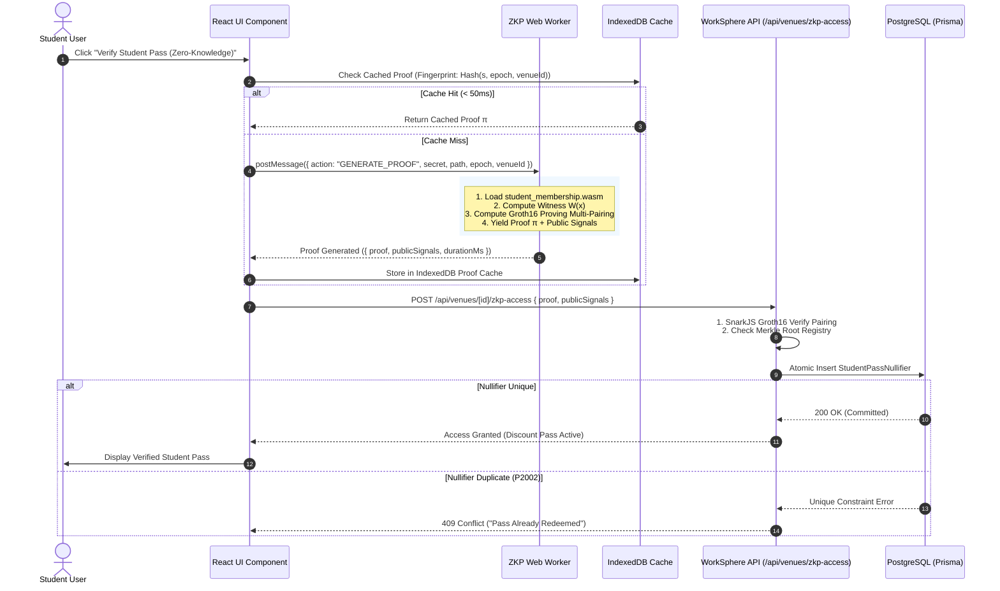

# Zero-Knowledge Proof (ZKP) Student Verification & Groth16 Manual

This document provides a formal cryptographic and engineering manual for WorkSphere's **Zero-Knowledge Student Membership & Discount Verification System**. It covers the **Circom R1CS circuit architecture**, **Poseidon hashing primitives**, **Depth-16 Merkle tree membership proofs**, **Groth16 proving and pairing verification over the BN254 curve**, **nullifier double-spend prevention**, and **client-side Web Worker execution**.

---

## 1. Cryptographic Overview & Architectural Philosophy

WorkSphere allows university students to claim subsidized workspace passes, study pods, and high-speed Wi-Fi discounts while preserving **absolute mathematical privacy**.

Traditional student verification mechanisms require students to upload government IDs, academic transcripts, or unencrypted university credentials to central servers, creating severe privacy risks and data liability. 

WorkSphere utilizes **zk-SNARKs (Zero-Knowledge Succinct Non-Interactive Arguments of Knowledge)** via the **Groth16 protocol**:
- **Zero Knowledge**: The proof reveals zero information about the student's name, email, student ID, GPA, or specific university department.
- **Succinctness**: Proofs are extremely compact (128 bytes: $\pi_A \in \mathbb{G}_1, \pi_B \in \mathbb{G}_2, \pi_C \in \mathbb{G}_1$) and verify in $< 5\text{ ms}$.
- **Non-Malleability & Non-Linkability**: Cryptographic nullifier hashes prevent double-spending without enabling tracking across different venues or academic terms.

```
┌────────────────────────────────────────────────────────────────────────────────────────┐
│                        ZKP STUDENT VERIFICATION ARCHITECTURE                           │
└────────────────────────────────────────────────────────────────────────────────────────┘

    University Registrar / Campus Node                     Student Client (Browser / PWA)
   ┌──────────────────────────────────┐                   ┌──────────────────────────────┐
   │ University issues signed student │                   │ Student Secret: s            │
   │ commitment:                      │                   │ Nullifier Key:  k            │
   │ Leaf C = Poseidon(s, epoch)      │ ── Enrollment ──► │ Active Epoch:   2026         │
   │ Appended to Campus Merkle Tree   │                   │ Merkle Path:    [p_0..p_15]  │
   └────────────────┬─────────────────┘                   └──────────────┬───────────────┘
                    │                                                    │
                    ▼ (Public Merkle Root R)                             ▼
   ┌──────────────────────────────────┐                   ┌──────────────────────────────┐
   │ Public Campus Merkle Root R      │                   │ Circom WASM Prover (Worker)  │
   │ Published on WorkSphere Registry │                   │ Proves:                      │
   │ & smart contracts                │                   │ 1. Poseidon(s, epoch) in R   │
   └────────────────┬─────────────────┘                   │ 2. Nullifier = Poseidon(s,k) │
                    │                                     └──────────────┬───────────────┘
                    │                                                    │
                    │               ┌────────────────────────────────────┘
                    │               │ Groth16 Proof π = (π_A, π_B, π_C)
                    ▼               ▼ Public Signals [Root, Nullifier, Epoch, VenueId]
   ┌─────────────────────────────────────────────────────────────────────────────────────┐
   │                          GROTH16 SERVER / ON-CHAIN VERIFIER                         │
   │                                                                                     │
   │   Pairing Check:                                                                    │
   │   e(π_A, π_B) = e(α, β) · e(∑ x_i · IC_i, γ) · e(π_C, δ)                           │
   │                                                                                     │
   │   - If Valid: Record Nullifier in DB to prevent reuse -> Grant Student Access Pass  │
   │   - If Invalid: Reject immediately (Zero sensitive data logged)                    │
   └─────────────────────────────────────────────────────────────────────────────────────┘
```

---

## 2. Elliptic Curve & Field Arithmetic ($BN254$)

The circuit and proving engine operate over the **$BN254$ (alt_bn128 / Barreto-Naehrig)** pairing-friendly elliptic curve:

### 2.1 Curve Parameters
- **Equation**: $y^2 = x^3 + 3$ over base field $\mathbb{F}_q$
- **Base Field Modulus**:
  $$q = 21888242871839275222246405745257275088696311157297823662689037894645226208583$$
- **Scalar Field Modulus ($r = \text{BN254\_SCALAR\_FIELD}$)**:
  $$r = 21888242871839275222246405745257275088548364400416034343698204186575808495617$$
- **Pairing Group Structure**:
  $$e: \mathbb{G}_1 \times \mathbb{G}_2 \to \mathbb{G}_T$$
  where $\mathbb{G}_1 \subset E(\mathbb{F}_q)$ ($256$-bit points), $\mathbb{G}_2 \subset E(\mathbb{F}_{q^2})$ ($512$-bit points), and $\mathbb{G}_T \subset \mathbb{F}_{q^{12}}$.

---

## 3. Circom Circuit Architecture & R1CS Specifications

The student verification circuit is implemented in **Circom 2.1+** and compiled to Rank-1 Constraint Systems (R1CS).

### 3.1 Input / Signal Interface Specification

| Signal Name | Visibility | Field Size | Semantic Role |
| :--- | :--- | :--- | :--- |
| `secret` | **Private** | $\mathbb{F}_r$ | Private random identity entropy held exclusively by the student. |
| `nullifierKey` | **Private** | $\mathbb{F}_r$ | Sub-key used to derive the venue/epoch specific spending nullifier. |
| `pathElements[16]` | **Private** | $\mathbb{F}_r^{16}$ | Sibling hashes along the Merkle inclusion branch. |
| `pathIndices[16]` | **Private** | $\{0, 1\}^{16}$ | Binary direction bits ($0 = \text{left}, 1 = \text{right}$). |
| `merkleRoot` | **Public** | $\mathbb{F}_r$ | Root of the verified university active enrollment Merkle tree. |
| `nullifierHash` | **Public** | $\mathbb{F}_r$ | Deterministic unique nullifier preventing pass double-redemption. |
| `epoch` | **Public** | $\mathbb{F}_r$ | Current academic year/semester epoch (e.g., $2026$). |
| `venueId` | **Public** | $\mathbb{F}_r$ | Optional venue / workspace scope binding parameter. |

### 3.2 Canonical Circom Circuit Implementation

```circom
pragma circom 2.1.6;

include "node_modules/circomlib/circuits/poseidon.circom";
include "node_modules/circomlib/circuits/bitify.circom";

// Dual Multiplexer: Routes left/right Merkle nodes based on path direction bit
template DualMux() {
    signal input in[2];
    signal input s; // 0 or 1
    signal output out[2];

    s * (1 - s) === 0; // Enforce s is strictly boolean {0, 1}
    out[0] <-- (1 - s) * in[0] + s * in[1];
    out[1] <-- s * in[0] + (1 - s) * in[1];

    out[0] === (1 - s) * in[0] + s * in[1];
    out[1] === s * in[0] + (1 - s) * in[1];
}

// Depth-16 Student Membership Verification Circuit
template StudentMembershipVerifier(LEVELS) {
    // 1. Private Witness Inputs
    signal input secret;
    signal input nullifierKey;
    signal input pathElements[LEVELS];
    signal input pathIndices[LEVELS];

    // 2. Public Instance Signals
    signal input merkleRoot;
    signal input nullifierHash;
    signal input epoch;
    signal input venueId;

    // Constraint 1: Compute Student Leaf Commitment = Poseidon(secret, epoch)
    component leafHasher = Poseidon(2);
    leafHasher.inputs[0] <== secret;
    leafHasher.inputs[1] <== epoch;
    signal leaf <== leafHasher.out;

    // Constraint 2: Compute Nullifier Hash = Poseidon(secret, nullifierKey, epoch)
    component nullifierHasher = Poseidon(3);
    nullifierHasher.inputs[0] <== secret;
    nullifierHasher.inputs[1] <== nullifierKey;
    nullifierHasher.inputs[2] <== epoch;
    nullifierHasher.out === nullifierHash;

    // Constraint 3: Verify Merkle Membership Path to Root
    component mux[LEVELS];
    component hashers[LEVELS];
    signal currentHash[LEVELS + 1];
    currentHash[0] <== leaf;

    for (var i = 0; i < LEVELS; i++) {
        mux[i] = DualMux();
        mux[i].in[0] <== currentHash[i];
        mux[i].in[1] <== pathElements[i];
        mux[i].s <== pathIndices[i];

        hashers[i] = Poseidon(2);
        hashers[i].inputs[0] <== mux[i].out[0];
        hashers[i].inputs[1] <== mux[i].out[1];

        currentHash[i + 1] <== hashers[i].out;
    }

    // Constraint 4: Computed Root must strictly equal Public Merkle Root
    currentHash[LEVELS] === merkleRoot;

    // Constraint 5: Dummy constraint to cryptographically bind venueId
    signal venueSquare;
    venueSquare <== venueId * venueId;
}

component main { public [ merkleRoot, nullifierHash, epoch, venueId ] } = StudentMembershipVerifier(16);
```

### 3.3 R1CS Complexity Metrics
- **Non-Linear Constraints**: $3,428$
- **Total Variables**: $3,612$
- **Public Inputs / Outputs**: $4$
- **WASM Proving Time (Client M1 / x86_64)**: $\approx 650\text{ ms} - 1,200\text{ ms}$
- **Peak Client Prover Memory**: $< 64\text{ MB}$

---

## 4. Poseidon Hashing Primitive & Merkle Registry

### 4.1 Poseidon $T = 3$ and $T = 4$ Sponges

WorkSphere uses the SNARK-friendly **Poseidon hash function** over $\mathbb{F}_r$ instead of SHA-256. Poseidon reduces constraint count from $\approx 25,000$ constraints per hash to only $\approx 240$ constraints.

- **Leaf Commitment**:
  $$\text{Leaf} = \text{Poseidon}_2(s, \text{epoch}) \in \mathbb{F}_r$$
- **Nullifier Generation**:
  $$\text{Nullifier} = \text{Poseidon}_3(s, k, \text{epoch}) \in \mathbb{F}_r$$

### 4.2 Depth-16 Merkle Tree Structure

The campus registry maintains a balanced binary tree of depth $D = 16$, accommodating up to $2^{16} = 65,536$ students per campus cluster:

```
Level 16 (Root):                        [ R ]
                                      /       \
Level 15:                         [H_15,0]   [H_15,1]
                                  /      \   /      \
...                             ...      ... ...     ...
Level 1:                      [H_1,0] [H_1,1] ...
                             /      \
Level 0 (Leaves):       [Leaf_0]   [Leaf_1] ... [Leaf_65535]
```

#### Zero-Hash Precomputation:
Empty subtrees are populated using precomputed zero-hashes:
$$Z_0 = 0, \quad Z_i = \text{Poseidon}_2(Z_{i-1}, Z_{i-1}) \quad \text{for } i \in [1, 16]$$

---

## 5. Groth16 Proving & Verification Pipeline

### 5.1 The Groth16 zk-SNARK Protocol

Groth16 represents a Quadratic Arithmetic Program (QAP) relation $L(x) \cdot R(x) - O(x) = H(x) \cdot T(x)$.

#### Prover Output:
The proof $\pi$ consists of 3 group elements:
$$\pi = (\pi_A \in \mathbb{G}_1, \, \pi_B \in \mathbb{G}_2, \, \pi_C \in \mathbb{G}_1)$$

```json
{
  "pi_a": [
    "0x18a381f...", 
    "0x29c782b...", 
    "0x1"
  ],
  "pi_b": [
    ["0x0a8172...", "0x192841..."],
    ["0x28194a...", "0x004921..."],
    ["0x1", "0x0"]
  ],
  "pi_c": [
    "0x284719...", 
    "0x110293...", 
    "0x1"
  ],
  "protocol": "groth16",
  "curve": "bn128"
}
```

### 5.2 Server & On-Chain Verification Equation

Given the verification key:
$$\text{VK} = \left( \alpha \in \mathbb{G}_1, \, \beta \in \mathbb{G}_2, \, \gamma \in \mathbb{G}_2, \, \delta \in \mathbb{G}_2, \, \{\text{IC}_i \in \mathbb{G}_1\}_{i=0}^\ell \right)$$

The server evaluates the public input linear combination:
$$\mathcal{L}_{\text{pub}} = \text{IC}_0 + \sum_{i=1}^{\ell} x_i \cdot \text{IC}_i \in \mathbb{G}_1$$

And validates the **Bilinear Pairing Check**:
$$e(\pi_A, \pi_B) = e(\alpha, \beta) \cdot e(\mathcal{L}_{\text{pub}}, \gamma) \cdot e(\pi_C, \delta)$$

In reduced multi-pairing form:
$$e(-\pi_A, \pi_B) \cdot e(\alpha, \beta) \cdot e(\mathcal{L}_{\text{pub}}, \gamma) \cdot e(\pi_C, \delta) \stackrel{?}{=} 1_{\mathbb{G}_T}$$

```typescript
// src/lib/zkp/verify.ts
import snarkjs from "snarkjs";

export async function verifyMembershipProof(
  proof: ZkProofPayload["proof"],
  publicSignals: string[],
): Promise<boolean> {
  const vkey = await loadVerificationKey();
  
  // Constant-time bilinear pairing check
  return await snarkjs.groth16.verify(vkey, publicSignals, proof);
}
```

---

## 6. Double-Spend & Nullifier Architecture

To prevent a student from reusing the same zero-knowledge credential repeatedly across multiple claims within the same epoch, the public nullifier hash is recorded in PostgreSQL:

```sql
CREATE TABLE IF NOT EXISTS "StudentPassNullifier" (
    "id" TEXT NOT NULL PRIMARY KEY,
    "nullifierHash" TEXT NOT NULL UNIQUE,
    "epoch" INTEGER NOT NULL,
    "venueId" TEXT,
    "redeemedAt" TIMESTAMPTZ NOT NULL DEFAULT NOW(),
    "userId" TEXT
);

CREATE UNIQUE INDEX "StudentPassNullifier_hash_epoch_idx" 
ON "StudentPassNullifier" ("nullifierHash", "epoch");
```

### Atomic Redemption Transaction:
```typescript
// src/app/api/user/claim-student-pass/route.ts
export async function POST(req: NextRequest) {
  const { proof, publicSignals } = await req.json();
  const [merkleRoot, nullifierHash, epoch, venueId] = publicSignals;

  // 1. Verify Groth16 cryptographic proof
  const isValid = await verifyMembershipProof(proof, publicSignals);
  if (!isValid) {
    return NextResponse.json({ error: "Invalid ZK proof" }, { status: 400 });
  }

  // 2. Verify Merkle Root is an active registered campus root
  const isRegisteredRoot = await isValidCampusRoot(merkleRoot, Number(epoch));
  if (!isRegisteredRoot) {
    return NextResponse.json({ error: "Unrecognized campus root" }, { status: 403 });
  }

  // 3. Atomically record nullifier to prevent double-spending
  try {
    await prisma.studentPassNullifier.create({
      data: {
        id: crypto.randomUUID(),
        nullifierHash,
        epoch: Number(epoch),
        venueId,
        userId: user.id,
      },
    });
  } catch (err: any) {
    if (err.code === "P2002") {
      return NextResponse.json({ error: "Pass already redeemed for this epoch" }, { status: 409 });
    }
    throw err;
  }

  // 4. Grant Student Access Pass
  return NextResponse.json({ success: true, passType: "STUDENT_TIER" });
}
```

---

## 7. Client-Side Prover & Web Worker Pipeline

Generating zk-SNARK proofs requires substantial multi-scalar multiplications and polynomial division. To guarantee smooth 60 FPS UI performance, proving is executed inside a dedicated **Web Worker** (`src/workers/zkpWorker.ts`).



---

## 8. Security Auditing & Threat Analysis

### 8.1 Trusted Setup Integrity (Powers of Tau)
- **Phase 1**: Ceremony run over Hermez / Perpetual Powers of Tau ($2^{16}$ powers).
- **Phase 2**: Circuit-specific ceremony with multiple entropy contributions and beacon randomization.
- **Toxic Waste**: Elimination of trapdoor parameters ($\tau, \alpha, \beta, \gamma, \delta$).

### 8.2 Proof Malleability Mitigations
- In Groth16, an adversary can re-randomize $\pi_A, \pi_B, \pi_C$ to produce a valid alternative proof for the same public inputs.
- WorkSphere mitigates proof replay by:
  1. Storing and checking the **`nullifierHash`** rather than the raw proof string.
  2. Binding dynamic session challenge nonces into `venueId` or transaction payloads.

### 8.3 Fake Merkle Branch Injection
- The DualMux template enforces $s \cdot (1 - s) = 0$, guaranteeing that path indices cannot take intermediate or fractional values in $\mathbb{F}_r$, which would otherwise bypass binary tree routing checks.

---

## 9. Diagnostic Verification Scripts

```bash
# Verify proof locally via SnarkJS CLI
snarkjs groth16 verify \
  public/zkp/verification_key.json \
  public_signals.json \
  proof.json

# Check circuit R1CS constraints
snarkjs r1cs info public/zkp/student_membership.r1cs
```

---

## 10. Summary File Index

- **Circuit Definitions**: `circuits/student_membership.circom`
- **Merkle Tree & Nullifier Engine**: `src/lib/zkp/studentMembership.ts`
- **Poseidon Math & Scalar Field**: `src/lib/zkp/poseidon.ts`
- **Groth16 Verification Engine**: `src/lib/zkp/verify.ts`
- **Client Prover & Cache**: `src/lib/zkp/client.ts`, `src/lib/zkp/proofCache.ts`
- **Dedicated Prover Worker**: `src/workers/zkpWorker.ts`
- **Verification API Handlers**: `src/app/api/user/claim-student-pass/route.ts`, `src/app/api/venues/[venueId]/zkp-access/route.ts`
